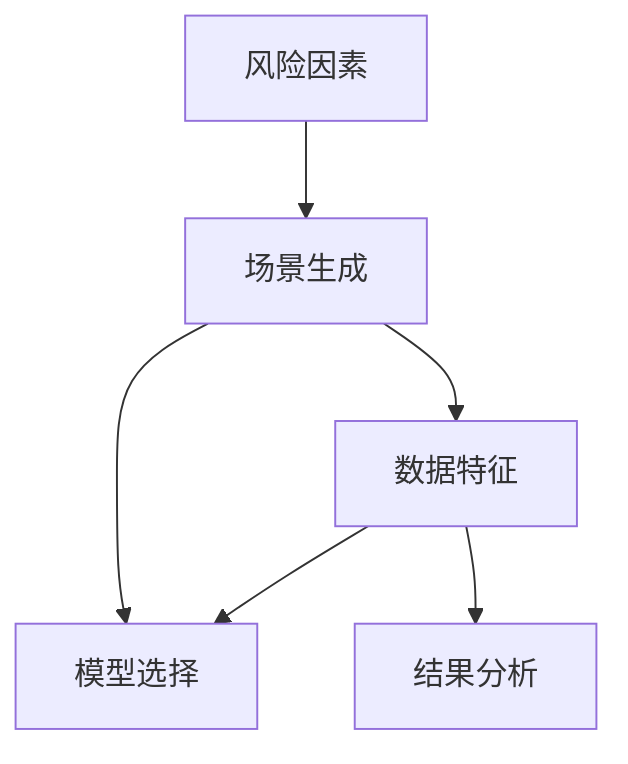
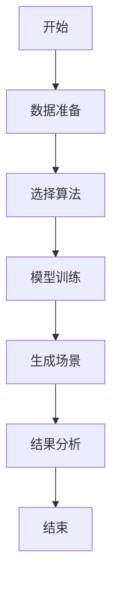

                 


# 《金融监管压力测试场景生成》

## 关键词：金融监管、压力测试、风险评估、算法生成、系统架构

## 摘要：
本文深入探讨金融监管压力测试场景生成的核心概念、算法原理、系统架构及项目实战。通过分析风险因素、数据来源和场景生成逻辑，结合蒙特卡洛模拟和机器学习模型，展示如何构建高效的压力测试系统。本文旨在为金融从业者和技术人员提供理论与实践相结合的指导，帮助他们更好地理解和实施金融监管压力测试。

---

## 正文：

### 第一部分：金融监管压力测试背景与基础

#### 第1章：金融监管压力测试概述

##### 1.1 什么是金融监管压力测试
- **定义与目的**：压力测试用于评估金融机构在极端市场条件下的表现，帮助监管机构识别潜在风险并制定应对措施。
- **在金融监管中的作用**：通过模拟极端情况，压力测试确保金融机构具备足够的资本和流动性应对危机。
- **应用场景**：银行、保险公司、投资机构等，用于风险管理和资本规划。

##### 1.2 压力测试的必要性
- **金融危机的教训**：2008年金融危机暴露了金融机构在极端情况下的脆弱性，压力测试成为监管的重要工具。
- **风险管理中的地位**：压力测试帮助机构识别单点风险和系统性风险，提升整体抗风险能力。
- **边界与外延**：压力测试不仅评估直接风险，还考虑宏观经济和政策变化的间接影响。

##### 1.3 压力测试场景生成的核心要素
- **风险因素分析**：包括市场波动、利率变化、信用违约等。
- **数据来源与特征**：历史数据、模拟数据、外部经济指标。
- **场景生成逻辑**：基于统计模型或规则生成极端情景，确保测试的有效性。

---

### 第二部分：压力测试场景生成的核心概念与联系

#### 第2章：压力测试场景生成的关键概念

##### 2.1 风险因素与场景生成的关系
- **风险因素的分类与特征**：市场风险（波动率、收益率）、信用风险（违约率）、操作风险（错误/欺诈）。
- **驱动因素**：经济指标（GDP、失业率）、市场数据（股价、债券收益率）、政策变化（监管法规）。
- **关联性分析**：例如，经济衰退可能导致市场下跌和信用违约增加，影响银行的资本充足率。

##### 2.2 核心概念的属性特征对比表
| 核心概念 | 属性 | 特征 |
|----------|------|------|
| 风险因素 | 类型 | 市场、信用、操作等 |
| 数据来源 | 类型 | 历史数据、模拟数据、外部数据 |
| 场景生成逻辑 | 方法 | 随机生成、规则生成、混合生成 |

##### 2.3 实体关系



---

### 第三部分：压力测试场景生成的算法原理

#### 第3章：算法原理

##### 3.1 算法选择与流程
- **蒙特卡洛模拟**：通过随机采样生成极端情景，评估金融机构在不同情景下的表现。
- **机器学习模型**：利用历史数据训练模型，预测极端情况下的风险指标。

##### 3.2 算法流程



##### 3.3 数学模型

- **蒙特卡洛模拟**：通过概率分布（如正态分布、t分布）生成随机变量，模拟市场波动。
  
  $$ X \sim N(\mu, \sigma^2) $$
  
  其中，$\mu$ 是均值，$\sigma^2$ 是方差。

- **机器学习模型**：使用回归分析预测信用违约率。

  $$ y = \beta_0 + \beta_1x_1 + ... + \beta_nx_n + \epsilon $$
  
  其中，$y$ 是目标变量，$x_i$ 是特征变量，$\epsilon$ 是误差项。

##### 3.4 实际应用示例

- **市场波动模拟**：假设股票价格服从几何布朗运动，模拟极端下跌情景。
  
  $$ dS = \mu S dt + \sigma S dW $$

- **信用风险评估**：利用历史违约数据，训练逻辑回归模型预测违约概率。

---

### 第四部分：压力测试场景生成的系统架构

#### 第4章：系统设计

##### 4.1 系统模块

- **数据采集模块**：收集历史市场数据、经济指标、监管政策变化。
- **场景生成引擎**：应用蒙特卡洛模拟和机器学习算法生成测试场景。
- **结果分析模块**：评估金融机构在不同情景下的表现，生成报告。

##### 4.2 系统架构图


##### 4.3 接口设计与交互

- **输入接口**：接收用户指定的压力测试参数（如测试类型、时间范围）。
- **输出接口**：返回生成的测试场景和评估结果。

---

### 第五部分：压力测试场景生成的项目实战

#### 第5章：项目实战

##### 5.1 环境配置
- **工具安装**：安装Python、Pandas、NumPy、Scikit-learn、Matplotlib。
- **数据准备**：收集历史市场数据和经济指标。

##### 5.2 核心代码实现

```python
import numpy as np
from sklearn.linear_model import LinearRegression

# 示例：生成市场波动情景
def generate_market_scenario(mu, sigma, days):
    np.random.seed(42)
    returns = np.random.normal(mu, sigma, days)
    prices = np.cumsum(returns)
    return prices

# 示例：训练信用风险模型
def train_credit_model(X, y):
    model = LinearRegression()
    model.fit(X, y)
    return model

# 使用示例
mu = 0.05
sigma = 0.2
days = 252  # 一年的交易日数

market_scenario = generate_market_scenario(mu, sigma, days)
print("生成的市场情景：", market_scenario)
```

##### 5.3 案例分析
- **案例背景**：假设某银行面临利率上升的压力测试。
- **场景生成**：模拟利率上升500个基点，评估银行的资本充足率变化。
- **结果分析**：银行资本充足率下降至7%，需采取增资措施。

---

### 第六部分：总结与展望

#### 第6章：总结与最佳实践

##### 6.1 核心总结
- 本文详细介绍了金融监管压力测试场景生成的关键步骤，从理论到实践，为金融从业者提供了全面的指导。
- 通过算法和系统设计，展示了如何高效生成压力测试场景，帮助金融机构更好地应对风险。

##### 6.2 最佳实践
- **数据质量**：确保数据的完整性和准确性，选择合适的历史数据。
- **模型调优**：根据实际情况调整模型参数，提升测试的准确性。
- **持续优化**：定期更新模型和测试场景，适应市场变化。

##### 6.3 注意事项
- 压力测试场景生成需考虑多种风险因素，避免遗漏关键风险点。
- 在实际应用中，结合专家判断和模型预测，确保测试结果的合理性。

##### 6.4 拓展阅读
- 推荐阅读《压力测试方法论》和《金融风险管理》，深入理解压力测试的应用与优化。

---

## 作者：AI天才研究院/AI Genius Institute & 禅与计算机程序设计艺术 /Zen And The Art of Computer Programming

---

### 总结：
本文系统地探讨了金融监管压力测试场景生成的各个方面，从背景到算法，再到系统设计和项目实战，为读者提供了全面的指导。通过深入的分析和丰富的案例，帮助读者掌握压力测试的核心概念和技术，提升金融机构的风险管理能力。

