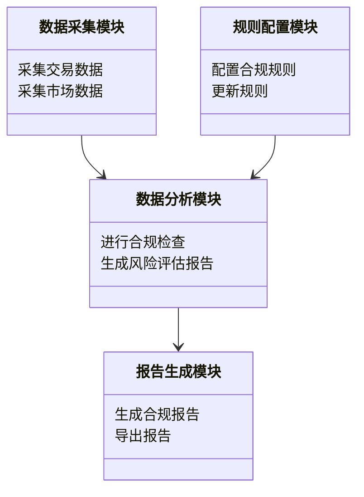

                 


# 金融监管合规自动化工具

## 关键词：金融监管、合规自动化、自然语言处理、机器学习、规则引擎

## 摘要：  
金融监管合规自动化工具是一种利用先进技术手段，如自然语言处理（NLP）、机器学习和规则引擎，来实现金融行业合规性检查和风险控制的自动化系统。随着金融市场的日益复杂化和监管要求的不断加强，传统的人工合规检查方式已经难以满足高效、精准的需求。本文将深入探讨金融监管合规自动化工具的核心概念、技术实现、系统架构以及实际应用案例，帮助读者全面理解这一领域的最新进展和未来发展方向。

---

# 第一部分：金融监管合规自动化工具概述

## 第1章：金融监管与合规概述

### 1.1 金融监管的背景与意义  
金融监管是保障金融市场健康运行的重要手段，其核心目标是确保金融机构的合规性、保护投资者利益、维护金融系统的稳定性和促进公平竞争。  

#### 1.1.1 金融监管的基本概念  
金融监管是指通过对金融机构的业务活动进行监督和管理，确保其遵守相关法律法规和行业标准。  

#### 1.1.2 金融监管的重要性  
- 维护金融市场秩序  
- 保护投资者权益  
- 防范系统性金融风险  

#### 1.1.3 合规在金融监管中的核心地位  
合规是指金融机构在经营活动中必须遵守的法律法规和行业规范。合规性是金融机构生存和发展的基础，也是金融监管的核心内容之一。  

### 1.2 金融监管的现状与挑战  
#### 1.2.1 传统金融监管模式的局限性  
- 人工检查效率低  
- 易受主观因素影响  
- 难以应对海量数据的处理  

#### 1.2.2 数字化时代的新挑战  
- 数据量爆炸式增长  
- 监管规则日益复杂  
- 金融机构业务的全球化和多样化  

#### 1.2.3 合规自动化的需求与趋势  
随着技术的进步，自动化工具逐渐成为金融监管的主流解决方案。合规自动化工具能够快速处理海量数据，实时监控风险，显著提高监管效率。  

### 1.3 金融监管合规自动化工具的定义与特点  
#### 1.3.1 自动化工具的定义  
金融监管合规自动化工具是指利用计算机技术，自动执行合规检查、风险评估和报告生成的软件系统。  

#### 1.3.2 自动化工具的核心特点  
- 高效性：快速处理海量数据  
- 准确性：基于算法和规则，减少人为错误  
- 实时性：实时监控和预警  

#### 1.3.3 自动化工具与传统监管方式的区别  
| 特性       | 自动化工具          | 传统监管方式        |  
|------------|--------------------|---------------------|  
| 效率       | 高                  | 低                  |  
| 准确性      | 高                  | 易受主观影响         |  
| 处理范围    | 海量数据            | 有限数据            |  
| 时间性      | 实时                | 周期性              |  

---

## 第2章：金融监管合规的核心要素  

### 2.1 金融监管的法律框架  
#### 2.1.1 相关法律法规概述  
金融监管的核心依据是各国的金融法律法规，例如《证券法》《反洗钱法》《银行法》等。  

#### 2.1.2 法律法规的复杂性与多样性  
- 不同国家的法律法规差异大  
- 法律法规内容繁杂，更新频繁  

### 2.2 合规要求的分类与分析  
#### 2.2.1 合规要求的分类  
- 交易合规：确保交易行为符合法律法规  
- 报告合规：确保提交的报告真实、准确、及时  
- 内部控制合规：确保内部管理制度符合监管要求  

#### 2.2.2 不同类型合规要求的特点  
| 类型       | 特点                 |  
|------------|----------------------|  
| 交易合规   | 需实时监控           |  
| 报告合规   | 需定期生成和提交       |  
| 内部控制合规 | 需长期制度建设        |  

### 2.3 自动化工具在合规中的作用  
#### 2.3.1 提高效率  
自动化工具可以快速处理大量数据，显著提高合规检查的效率。  

#### 2.3.2 减少人为错误  
通过算法和规则引擎，自动化工具能够避免人为判断的主观性，降低错误率。  

#### 2.3.3 实时监控与预警  
自动化工具可以实时监控交易和数据，及时发现异常情况并发出预警。  

---

## 第3章：金融监管合规自动化工具的技术实现  

### 3.1 自然语言处理（NLP）在合规文本分析中的应用  
#### 3.1.1 自然语言处理的基本原理  
自然语言处理是一种人工智能技术，旨在让计算机能够理解和处理人类语言。  

#### 3.1.2 合规文本分析的流程  
1. **文本预处理**：去除停用词、分词、词干提取  
2. **文本分类**：根据内容将文本分类为合规或不合规  
3. **实体识别**：识别文本中的关键实体（如公司名称、交易金额等）  

#### 3.1.3 基于NLP的合规文本分析案例  
例如，使用NLP技术分析公司年度报告，识别潜在的违规行为。  

### 3.2 机器学习在合规风险评估中的应用  
#### 3.2.1 机器学习的基本原理  
机器学习是一种人工智能技术，通过训练数据模型来预测未知数据。  

#### 3.2.2 合规风险评估的流程  
1. **数据收集**：收集历史交易数据、市场数据等  
2. **特征提取**：提取与风险相关的特征（如交易金额、交易频率等）  
3. **模型训练**：训练分类模型，预测交易是否合规  

#### 3.2.3 基于机器学习的风险评估案例  
例如，使用随机森林算法训练模型，预测交易是否为洗钱行为。  

### 3.3 规则引擎在合规自动化中的应用  
#### 3.3.1 规则引擎的基本原理  
规则引擎是一种用于定义和执行业务规则的工具，可以灵活配置合规规则。  

#### 3.3.2 规则引擎在合规中的应用  
例如，配置规则引擎，自动检查交易是否符合反洗钱法规。  

---

## 第4章：金融监管合规自动化工具的系统架构设计  

### 4.1 系统功能设计  
#### 4.1.1 系统功能模块  
1. **数据采集模块**：采集交易数据、市场数据等  
2. **规则配置模块**：配置合规规则  
3. **数据分析模块**：进行合规检查和风险评估  
4. **报告生成模块**：生成合规报告  

#### 4.1.2 领域模型（Mermaid类图）  


### 4.2 系统架构设计  
#### 4.2.1 系统架构（Mermaid架构图）  
```mermaid
archi
    数据采集模块 --> 数据分析模块
    数据分析模块 --> 规则配置模块
    数据分析模块 --> 报告生成模块
```

### 4.3 系统接口设计  
- 数据采集接口：用于采集交易数据和市场数据  
- 规则引擎接口：用于配置和执行合规规则  
- 报告生成接口：用于生成和导出合规报告  

### 4.4 系统交互流程（Mermaid序列图）  
```mermaid
sequenceDiagram
    用户 --> 数据采集模块: 采集交易数据
    数据采集模块 --> 数据分析模块: 提交数据
    数据分析模块 --> 规则配置模块: 获取规则
    数据分析模块 --> 报告生成模块: 生成报告
    用户 <-- 报告生成模块: 获取报告
```

---

## 第5章：金融监管合规自动化工具的项目实战  

### 5.1 环境安装与配置  
- 安装Python、Jupyter Notebook、TensorFlow、Scikit-learn等工具  

### 5.2 核心代码实现  
#### 5.2.1 数据预处理代码  
```python
import pandas as pd
import numpy as np

# 加载数据
data = pd.read_csv('transaction.csv')

# 数据清洗
data = data.dropna()
data = data[~data['amount'].isnull()]
```

#### 5.2.2 机器学习模型训练代码  
```python
from sklearn.model

