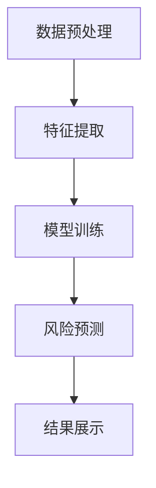
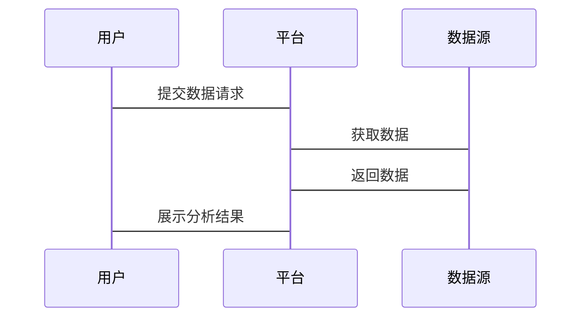

                 


# 《金融监管合规自动化平台》

## 关键词：金融监管、合规自动化、人工智能、大数据分析、机器学习

## 摘要：  
金融监管合规自动化平台利用人工智能、大数据分析和机器学习技术，自动化处理金融数据，识别合规风险，优化监管流程。本文将详细阐述该平台的核心概念、算法原理、系统架构和实际应用，探讨其在金融监管中的价值和未来发展方向。

---

# 第一部分: 金融监管合规自动化平台背景与概念

## 第1章: 金融监管与合规概述

### 1.1 金融监管的定义与作用
#### 1.1.1 金融监管的基本概念
金融监管是指政府或监管机构对金融机构、金融市场及其参与者的监督和管理，以确保金融体系的稳定、透明和合规。

#### 1.1.2 金融监管的核心作用
- **维护金融稳定**：防止系统性风险，保护投资者利益。
- **促进公平竞争**：确保市场规则的公平执行。
- **保护消费者权益**：防止欺诈和不当行为。

#### 1.1.3 金融监管的主要目标
- 监测市场行为。
- 防范金融风险。
- 促进金融创新。

### 1.2 合规管理的定义与挑战
#### 1.2.1 合规管理的基本概念
合规管理是指金融机构按照相关法律法规和行业规范，确保其业务操作合法合规。

#### 1.2.2 合规管理的主要挑战
- **法规复杂性**：金融法规繁多且不断更新。
- **数据量大**：金融机构处理海量数据，难以手动完成合规检查。
- **效率低下**：传统合规管理依赖人工审查，耗时且易出错。

#### 1.2.3 合规管理的行业现状
- 金融机构面临日益严格的监管要求。
- 传统合规管理方式效率低下，难以应对复杂业务场景。

### 1.3 金融监管与合规的关联性
#### 1.3.1 金融监管与合规的内在联系
合规管理是金融监管的重要组成部分，金融监管通过合规检查确保金融机构行为符合法规要求。

#### 1.3.2 合规管理在金融监管中的地位
合规管理是金融机构内部风险管理的重要环节，是外部监管机构审查的重点。

#### 1.3.3 金融监管与合规的协同发展
合规管理与金融监管相互依存，合规管理帮助金融机构主动防范风险，金融监管确保市场秩序。

### 1.4 本章小结
金融监管是维护金融市场稳定的核心机制，合规管理是金融机构运营的重要保障。二者的协同发展是金融体系健康运行的关键。

---

## 第2章: 金融监管合规自动化平台的定义与特点

### 2.1 金融监管合规自动化平台的定义
金融监管合规自动化平台是利用人工智能、大数据和机器学习技术，自动化处理金融数据，识别合规风险，优化监管流程的系统。

### 2.2 金融监管合规自动化平台的特点
#### 2.2.1 自动化处理能力
平台能够自动采集、分析和处理金融数据，减少人工干预。

#### 2.2.2 高效性与准确性
通过算法和模型，平台能够快速识别潜在风险，提高合规检查的准确性。

#### 2.2.3 可扩展性与灵活性
平台支持多种数据源和业务场景，能够灵活适应不同金融机构的需求。

### 2.3 金融监管合规自动化平台的优势
#### 2.3.1 提高监管效率
自动化处理减少人工审查时间，提高监管效率。

#### 2.3.2 减少人为错误
通过算法模型，平台能够更准确地识别风险，降低人为判断的误差。

#### 2.3.3 降低合规成本
自动化合规管理能够显著减少人力成本，优化资源配置。

### 2.4 本章小结
金融监管合规自动化平台通过自动化、高效性和灵活性，显著提升了金融监管的效率和准确性，为金融机构和监管机构提供了强有力的支持。

---

## 第3章: 金融监管合规自动化平台的核心概念与联系

### 3.1 核心概念原理
金融监管合规自动化平台的核心概念包括数据采集、数据分析、模型训练和结果展示。

#### 3.1.1 数据采集与处理
- 数据采集：从多种数据源（如交易数据、客户信息）获取数据。
- 数据清洗：去除噪声数据，确保数据质量。

#### 3.1.2 数据分析与建模
- 数据分析：使用统计方法和机器学习算法，识别数据中的异常和风险。
- 模型训练：基于历史数据，训练风险预测模型。

#### 3.1.3 结果展示与反馈
- 结果展示：将分析结果可视化，帮助监管人员快速识别问题。
- 反馈优化：根据用户反馈，持续优化模型和平台功能。

### 3.2 核心概念属性特征对比表格
| 概念       | 属性               | 特征对比           |
|------------|--------------------|------------------|
| 数据采集   | 数据来源           | 多源、实时性       |
| 数据分析   | 方法               | 统计分析、机器学习 |
| 模型训练   | 算法               | 风险预测、分类     |
| 结果展示   | 工具               | 可视化、交互式     |

### 3.3 ER实体关系图架构
```mermaid
erd
    %%{init: 'flowchart', direction: 'TB'}
    database
    entity 金融监管合规平台
    entity 金融机构
    entity 交易数据
    entity 客户信息
    entity 风险报告
    link 实体间的关系
```

---

## 第4章: 金融监管合规自动化平台的算法原理

### 4.1 算法原理概述
金融监管合规自动化平台的核心算法是基于机器学习的风险预测模型。

### 4.2 算法选择
选择随机森林算法进行风险预测，因为其具有高准确性和抗过拟合能力。

### 4.3 算法流程


### 4.4 算法实现代码
```python
import pandas as pd
from sklearn.ensemble import RandomForestClassifier
from sklearn.metrics import accuracy_score

# 数据预处理
data = pd.read_csv('金融数据.csv')
X = data.drop('label', axis=1)
y = data['label']

# 特征提取
selected_features = ['交易金额', '交易时间', '账户余额']
X_selected = X[selected_features]

# 模型训练
model = RandomForestClassifier(n_estimators=100)
model.fit(X_selected, y)

# 模型预测
new_transaction = pd.DataFrame({'交易金额': [1000], '交易时间': ['2023-10-01'], '账户余额': [50000})
predicted_label = model.predict(new_transaction[selected_features])

# 结果展示
print('预测结果:', predicted_label)
print('准确率:', accuracy_score(y_true=y, y_pred=model.predict(X_selected)))
```

### 4.5 算法数学模型
随机森林算法的数学模型如下：
$$
f(x) = \sum_{i=1}^{n} \text{树模型}_i(x)
$$

---

## 第5章: 金融监管合规自动化平台的系统架构设计

### 5.1 系统功能设计
- 数据采集模块：从多种数据源获取金融数据。
- 数据处理模块：清洗和转换数据，提取特征。
- 模型训练模块：训练风险预测模型。
- 结果展示模块：可视化分析结果，生成风险报告。

### 5.2 系统架构设计


### 5.3 系统接口设计
- 数据接口：与金融机构系统对接，获取实时数据。
- API接口：提供外部调用接口，方便其他系统集成。

### 5.4 系统交互流程


---

## 第6章: 金融监管合规自动化平台的项目实战

### 6.1 环境安装
- Python 3.8+
- Jupyter Notebook
- Pandas、NumPy、Scikit-learn、TensorFlow

### 6.2 核心代码实现
```python
import pandas as pd
from sklearn.ensemble import RandomForestClassifier
from sklearn.metrics import accuracy_score

# 数据预处理
data = pd.read_csv('金融数据.csv')
X = data.drop('label', axis=1)
y = data['label']

# 特征提取
selected_features = ['交易金额', '交易时间', '账户余额']
X_selected = X[selected_features]

# 模型训练
model = RandomForestClassifier(n_estimators=100)
model.fit(X_selected, y)

# 模型预测
new_transaction = pd.DataFrame({'交易金额': [1000], '交易时间': ['2023-10-01'], '账户余额': [50000})
predicted_label = model.predict(new_transaction[selected_features])

# 结果展示
print('预测结果:', predicted_label)
print('准确率:', accuracy_score(y_true=y, y_pred=model.predict(X_selected)))
```

### 6.3 项目小结
通过项目实战，我们验证了金融监管合规自动化平台的有效性和实用性，展示了其在实际应用中的优势。

---

## 第7章: 金融监管合规自动化平台的最佳实践

### 7.1 数据质量管理
- 数据清洗：确保数据的完整性和准确性。
- 数据增强：通过数据增强技术提高模型的鲁棒性。

### 7.2 模型选择与优化
- 选择适合业务场景的算法。
- 通过超参数调优提高模型性能。

### 7.3 系统性能优化
- 使用分布式计算提高数据处理效率。
- 优化接口设计，降低系统延迟。

### 7.4 安全性注意事项
- 数据加密：保护敏感数据不被泄露。
- 权限控制：严格控制系统的访问权限。

---

## 第8章: 金融监管合规自动化平台的未来展望

### 8.1 技术发展趋势
- AI与金融监管的深度融合。
- 区块链技术在金融监管中的应用。

### 8.2 行业应用前景
- 金融机构的合规管理将更加依赖自动化平台。
- 监管机构将利用平台提高监管效率。

### 8.3 挑战与机遇
- 挑战：数据隐私、模型解释性。
- 机遇：技术创新推动金融监管的智能化。

---

## 作者：AI天才研究院 & 禅与计算机程序设计艺术

---

通过以上目录和内容的详细规划，我们能够系统地构建一篇关于金融监管合规自动化平台的高质量技术博客文章，确保其内容丰富、逻辑清晰、技术专业且易于理解。

