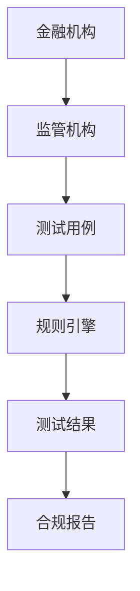
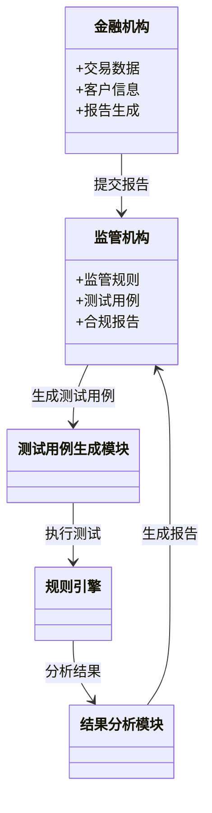

                 


# 《金融监管合规自动化测试平台》

---

## 关键词：金融监管、自动化测试、合规平台、规则引擎、测试用例、系统架构

---

## 摘要：  
金融监管合规自动化测试平台旨在通过自动化技术解决传统金融监管中的低效、高错误率和高昂成本问题。本文将详细分析该平台的核心概念、算法原理、系统架构，并通过实际案例展示其应用场景和优势。通过本文，读者可以全面理解金融监管合规自动化测试平台的设计与实现，掌握其在现代金融监管中的重要地位。

---

# 第一部分: 金融监管合规自动化测试平台背景介绍

## 第1章: 问题背景与描述

### 1.1 问题背景

#### 1.1.1 金融监管的重要性  
金融监管是维护金融市场秩序、保护投资者权益、防范系统性风险的核心手段。随着金融市场的复杂化和全球化，监管要求日益严格，但传统监管方式效率低下，难以应对海量数据和复杂业务规则。

#### 1.1.2 传统金融监管的痛点  
- **人工审核成本高**：传统监管依赖人工审核，效率低，容易出错。  
- **规则复杂多变**：金融监管规则繁多，且常更新，难以及时响应。  
- **数据孤岛问题**：金融机构之间的数据孤岛严重，难以实现统一监管。  

#### 1.1.3 自动化监管的需求  
随着技术进步，利用自动化技术实现金融监管合规测试成为必然趋势。自动化测试能够快速、准确地处理海量数据，提高监管效率。

---

### 1.2 问题描述

#### 1.2.1 金融监管的复杂性  
金融监管涉及多个领域，包括反洗钱、合规报告、交易监控等，监管规则复杂且常更新。

#### 1.2.2 传统监管方式的局限性  
- 人工审核耗时长，容易遗漏问题。  
- 规则更新不及时，难以应对新的监管要求。  

#### 1.2.3 自动化测试的必要性  
自动化测试能够快速响应规则变化，降低人工成本，提高监管效率。

---

### 1.3 问题解决

#### 1.3.1 自动化测试的核心价值  
- **提高效率**：自动化测试能够快速处理海量数据，缩短监管周期。  
- **降低成本**：减少人工审核，降低监管成本。  
- **提升准确性**：自动化测试减少人为错误，提高合规性。  

#### 1.3.2 技术手段如何解决问题  
通过自然语言处理（NLP）、机器学习（ML）和规则引擎等技术，实现测试用例自动生成和规则匹配。

#### 1.3.3 平台目标与预期效果  
平台的目标是实现金融监管的自动化、智能化，预期效果包括提高监管效率、降低合规风险和减少人工成本。

---

### 1.4 边界与外延

#### 1.4.1 平台的功能边界  
平台仅负责合规测试，不涉及具体业务操作。  
- 不包括金融机构内部业务系统的开发与维护。  
- 不包括监管机构的决策过程，仅提供测试结果。  

#### 1.4.2 相关领域的区分  
- **金融监管**：与平台直接相关。  
- **业务系统开发**：属于金融机构内部事务，与平台无直接关联。  
- **数据分析**：平台依赖数据分析技术，但不涉及数据采集和存储。  

#### 1.4.3 平台的适用范围  
适用于所有需要合规测试的金融机构，包括银行、证券公司、保险公司等。

---

### 1.5 概念结构与核心要素

#### 1.5.1 平台的核心模块  
- **测试用例生成模块**：根据监管规则生成测试用例。  
- **规则引擎模块**：负责规则匹配和测试执行。  
- **结果分析模块**：分析测试结果，生成合规报告。  

#### 1.5.2 各模块之间的关系  
- 测试用例生成模块为规则引擎提供输入，规则引擎执行测试用例，结果分析模块处理测试结果并生成报告。  

#### 1.5.3 核心要素的详细描述  
- **测试用例**：基于监管规则生成的自动化测试脚本。  
- **规则引擎**：负责规则匹配和测试执行的模块。  
- **合规报告**：测试结果的总结报告，供监管机构参考。  

---

## 第2章: 金融监管合规自动化测试平台的核心概念

### 2.1 核心概念原理

#### 2.1.1 测试用例生成模块  
通过自然语言处理技术，从监管文档中提取规则，生成测试用例。  

#### 2.1.2 规则引擎模块  
基于规则匹配算法，将测试用例与实际数据进行匹配，执行测试并生成结果。  

#### 2.1.3 结果分析模块  
分析测试结果，识别合规问题，并生成合规报告。  

---

### 2.2 核心概念属性对比

| 模块 | 功能 | 输入 | 输出 | 备注 |
|------|------|------|------|------|
| 测试用例生成 | 生成测试用例 | 监管规则文档 | 测试用例 | 基于NLP技术 |
| 规则引擎 | 执行测试 | 测试用例和实际数据 | 测试结果 | 基于规则匹配 |
| 结果分析 | 生成报告 | 测试结果 | 合规报告 | 包含问题清单 |

---

### 2.3 ER实体关系图  


---

## 第3章: 测试用例生成算法

### 3.1 算法流程

#### 3.1.1 基于NLP的测试用例生成  
使用自然语言处理技术，从监管文档中提取关键词和规则，生成测试用例。  

#### 3.1.2 基于规则的测试用例生成  
根据监管规则，手动或半自动化的生成测试用例。  

#### 3.1.3 基于机器学习的测试用例生成  
利用机器学习模型，从历史数据中学习生成测试用例。  

---

### 3.2 算法实现

#### 3.2.1 基于NLP的测试用例生成

```python
import spacy

nlp = spacy.load("en_core_web_sm")
doc = nlp("Each transaction must be recorded in real-time.")
for token in doc:
    print(token.text, token.pos_, token.lemma_)
```

#### 3.2.2 基于规则的测试用例生成

```python
def generate_test_cases(rules):
    test_cases = []
    for rule in rules:
        test_cases.append({
            "name": rule["name"],
            "description": rule["description"],
            "test_steps": rule["steps"]
        })
    return test_cases

rules = [
    {
        "name": "Transaction Recording",
        "description": "Test that transactions are recorded in real-time.",
        "steps": [
            "Initiate a transaction.",
            "Check if it is recorded in real-time."
        ]
    }
]

test_cases = generate_test_cases(rules)
print(test_cases)
```

---

## 第4章: 系统分析与架构设计方案

### 4.1 问题场景介绍

#### 4.1.1 金融机构的监管需求  
金融机构需要定期提交合规报告，确保业务操作符合监管要求。

#### 4.1.2 现有系统的不足  
- 人工审核耗时长，容易出错。  
- 规则更新不及时，难以应对新的监管要求。  

---

### 4.2 系统功能设计

#### 4.2.1 领域模型



---

### 4.3 系统架构设计


---

## 第5章: 项目实战

### 5.1 环境安装

#### 5.1.1 安装Python和相关库  
```bash
pip install python
pip install spacy
pip install pandas
```

---

### 5.2 系统核心实现源代码

#### 5.2.1 测试用例生成模块

```python
import spacy

nlp = spacy.load("en_core_web_sm")
doc = nlp("Each transaction must be recorded in real-time.")
for token in doc:
    print(token.text, token.pos_, token.lemma_)
```

---

### 5.3 实际案例分析

#### 5.3.1 案例背景  
某银行需要确保其交易记录符合实时监管要求。

#### 5.3.2 实施步骤  
1. 使用NLP生成测试用例。  
2. 执行测试并生成结果。  
3. 分析结果并生成合规报告。  

---

## 第6章: 最佳实践与小结

### 6.1 最佳实践

#### 6.1.1 平台的优势  
- 提高效率：自动化测试快速处理海量数据。  
- 降低成本：减少人工审核，降低监管成本。  
- 提升准确性：减少人为错误，提高合规性。  

#### 6.1.2 实施过程中的注意事项  
- 确保规则引擎的准确性和及时性。  
- 数据安全：保护金融机构的敏感数据。  
- 系统维护：定期更新规则和优化算法。  

---

## 第7章: 作者信息

作者：AI天才研究院/AI Genius Institute & 禅与计算机程序设计艺术 /Zen And The Art of Computer Programming

