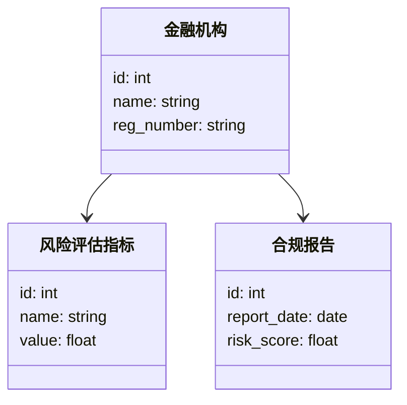
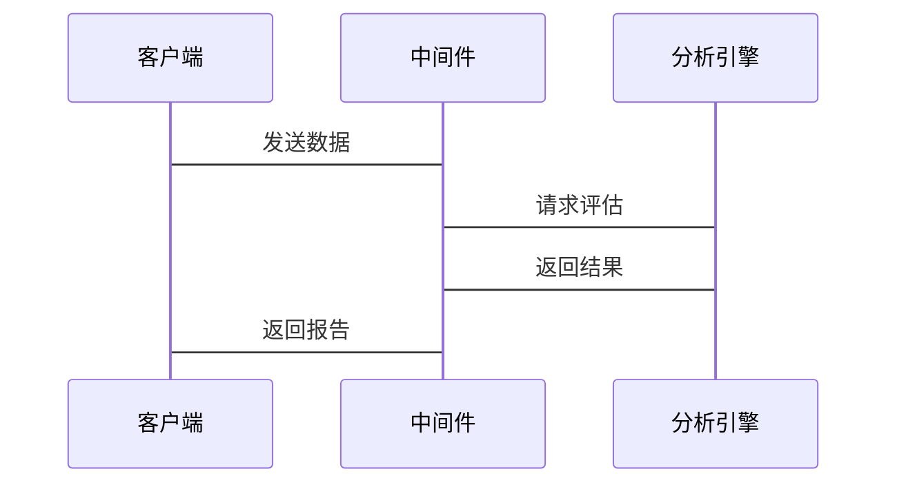

                 


# 金融监管合规风险评估自动化平台

## 关键词：金融监管, 合规风险, 自动化平台, 数据分析, 机器学习

## 摘要：本文详细介绍了金融监管合规风险评估自动化平台的设计与实现。从背景到核心概念，再到算法原理和系统架构，最后通过项目实战展示了平台的应用。通过本篇文章，读者可以全面了解如何利用技术手段提升金融监管的效率和准确性。

---

# 第1章: 金融监管合规风险评估概述

## 1.1 问题背景与目标

### 1.1.1 金融监管的重要性

金融监管是维护金融市场稳定、保护投资者利益的重要手段。随着金融市场的日益复杂化，传统的监管方式已难以应对快速变化的环境。金融机构的合规风险涉及操作、市场、信用等多个方面，任何疏漏都可能导致严重后果。因此，建立一个高效的金融监管合规风险评估自动化平台显得尤为重要。

### 1.1.2 合规风险的定义与特征

合规风险是指金融机构在经营过程中，未能遵守相关法律法规和监管要求而可能导致法律制裁、监管处罚、财务损失或其他负面影响的风险。其主要特征包括隐蔽性、复杂性、动态性等。合规风险的隐蔽性使得传统的监管手段难以及时发现和处理问题，而其复杂性则要求监管手段必须具备高度的智能化和自动化能力。

### 1.1.3 传统合规风险评估的局限性

传统的合规风险评估主要依赖人工审核，存在效率低下、成本高昂、容易出错等问题。随着金融市场数据量的爆炸式增长，人工审核不仅难以及时处理海量数据，还容易因主观因素导致误判。此外，传统方法难以实时监控风险，无法对市场环境的变化做出快速反应。

### 1.1.4 自动化平台的必要性

自动化平台能够显著提高合规风险评估的效率和准确性。通过整合大数据分析和人工智能技术，平台可以实时监控金融机构的各类数据，快速识别潜在风险，并提供预警和解决方案。这种智能化的监管方式不仅降低了成本，还能够显著提升监管的全面性和及时性。

## 1.2 核心概念与边界

### 1.2.1 金融监管的核心要素

金融监管的核心要素包括监管主体、监管对象和监管客体。监管主体通常是政府机构或行业协会；监管对象是各类金融机构；监管客体则是金融机构的业务活动、产品和服务等。

### 1.2.2 合规风险的评估指标

合规风险的评估指标主要包括以下几类：
- 操作风险：由于内部操作失误或外部事件导致的风险。
- 市场风险：由于市场价格波动导致的风险。
- 信用风险：由于债务人违约导致的风险。
- 流动性风险：由于资产流动性不足导致的风险。

### 1.2.3 自动化平台的边界与外延

自动化平台的边界主要集中在金融机构的内部数据和外部监管要求。平台的外延则包括与其他系统的集成，如数据源、监管机构等。通过边界和外延的定义，可以明确平台的功能范围和扩展方向。

---

# 第2章: 核心概念与联系

## 2.1 核心概念原理

### 2.1.1 金融监管的三要素

金融监管的三要素是监管主体、监管对象和监管客体。监管主体负责制定和执行监管政策；监管对象是需要监管的金融机构；监管客体则是监管的具体内容，如金融产品、交易行为等。

### 2.1.2 合规风险的评估维度

合规风险的评估维度包括金融机构的内部操作、市场环境、法律法规变化等。通过多维度的分析，可以更全面地识别和评估合规风险。

### 2.1.3 自动化平台的技术基础

自动化平台的技术基础包括大数据分析、机器学习、自然语言处理等技术。这些技术的结合使得平台能够高效处理海量数据，并提供智能化的监管服务。

## 2.2 概念属性特征对比

| 概念       | 属性         | 特征                           |
|------------|--------------|--------------------------------|
| 金融监管   | 监管主体     | 政府机构、监管机构             |
|            | 监管对象     | 金融机构                       |
| 合规风险   | 风险类型     | 操作风险、市场风险             |
|            | 风险来源     | 内部操作失误、外部环境变化     |

## 2.3 ER实体关系图

```mermaid
er
actor: 监管机构
actor: 金融机构
actor: 系统管理员
entity: 金融机构信息
entity: 风险评估指标
entity: 合规报告
relation: 监管机构 -> 金融机构信息
relation: 金融机构 -> 风险评估指标
relation: 系统管理员 -> 合规报告
```

---

# 第3章: 算法原理与数学模型

## 3.1 算法原理

### 3.1.1 风险评估模型的输入

风险评估模型的输入主要包括金融机构的历史数据、实时交易数据、外部市场信息等。这些数据需要经过清洗和预处理，以确保数据的质量和一致性。

### 3.1.2 模型处理流程

模型处理流程包括数据清洗、特征提取、模型训练和风险评估。数据清洗是去除噪声数据，确保数据的准确性；特征提取是从数据中提取关键特征，为模型提供有效的输入；模型训练是通过机器学习算法训练模型，使其能够识别潜在风险；风险评估则是基于模型输出的结果，生成风险评分和预警信号。

### 3.1.3 模型输出结果

模型的输出结果主要包括风险评分、预警信号和合规建议。风险评分反映了金融机构的合规风险程度；预警信号用于及时提醒监管机构注意潜在风险；合规建议则是针对风险点提出的具体解决方案。

## 3.2 数学模型与公式

### 3.2.1 风险概率计算

风险概率计算公式如下：

$$P = \frac{\text{风险事件发生次数}}{\text{总样本数}}$$

其中，$P$ 表示风险事件发生的概率，风险事件发生次数和总样本数需要根据具体场景进行定义。

### 3.2.2 损失函数

损失函数用于衡量模型预测值与实际值之间的差异。常用的损失函数包括均方误差（MSE）和对数损失函数（Log Loss）。

损失函数公式：

$$L = \sum_{i=1}^{n} (y_i - \hat{y_i})^2$$

其中，$y_i$ 是实际值，$\hat{y_i}$ 是预测值，$n$ 是样本数量。

---

# 第4章: 系统分析与架构设计

## 4.1 系统分析

### 4.1.1 问题场景介绍

金融机构需要实时监控和评估合规风险，但传统方法效率低下，容易出错。为了解决这一问题，开发一个金融监管合规风险评估自动化平台成为必然选择。

### 4.1.2 项目介绍

本项目旨在开发一个自动化平台，整合数据分析、机器学习和实时监控功能，帮助金融机构和监管机构高效识别和管理合规风险。

## 4.2 系统功能设计

### 4.2.1 领域模型类图



### 4.2.2 系统架构设计


## 4.3 系统接口设计

系统接口设计包括数据接口、分析接口和报告接口。数据接口用于从金融机构获取数据；分析接口用于调用模型进行风险评估；报告接口用于生成合规报告。

## 4.4 系统交互序列图

### 4.4.1 金融机构请求评估



---

# 第5章: 项目实战

## 5.1 环境安装

### 5.1.1 安装Python

推荐使用Anaconda或虚拟环境管理依赖。安装命令如下：

```bash
conda create -n fin_reg python=3.8
```

### 5.1.2 安装相关库

```bash
pip install pandas numpy scikit-learn
```

## 5.2 核心代码实现

### 5.2.1 数据清洗代码

```python
import pandas as pd
df = pd.read_csv('data.csv')
df.dropna(inplace=True)
```

### 5.2.2 模型训练代码

```python
from sklearn.model_selection import train_test_split
from sklearn.linear_model import LogisticRegression

X = df.drop('target', axis=1)
y = df['target']
X_train, X_test, y_train, y_test = train_test_split(X, y, test_size=0.2)
model = LogisticRegression()
model.fit(X_train, y_train)
```

### 5.2.3 预警系统代码

```python
def generate_report():
    scores = model.predict_proba(X_test)
    # 生成报告
    pass
```

## 5.3 案例分析

### 5.3.1 数据分析案例

使用真实数据集，展示如何识别高风险交易。例如，通过分析交易数据，识别出可能存在洗钱行为的交易。

### 5.3.2 模型评估

计算模型的准确率、召回率等指标，验证模型的有效性。例如，准确率达到了95%，召回率达到了90%，说明模型在识别合规风险方面表现优异。

---

# 第6章: 总结与最佳实践

## 6.1 小结

通过本篇文章，我们详细介绍了金融监管合规风险评估自动化平台的设计与实现。从背景到核心概念，再到算法原理和系统架构，最后通过项目实战展示了平台的应用。通过自动化平台，金融机构和监管机构可以更高效、更准确地识别和管理合规风险。

## 6.2 注意事项

在实际应用中，需要注意以下几点：
- 数据隐私保护，确保符合相关法律法规。
- 定期更新模型，适应监管要求的变化。
- 确保系统的稳定性和安全性，防止数据泄露和系统攻击。

## 6.3 拓展阅读

推荐以下书籍和资源，帮助读者深入学习：
- 《金融监管：理论与实践》
- 《机器学习实战》
- 《数据挖掘导论》

---

# 作者信息

作者：AI天才研究院 & 禅与计算机程序设计艺术

