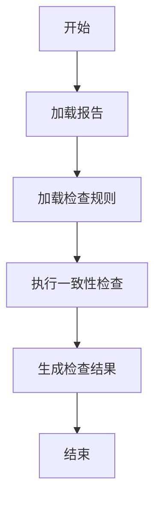
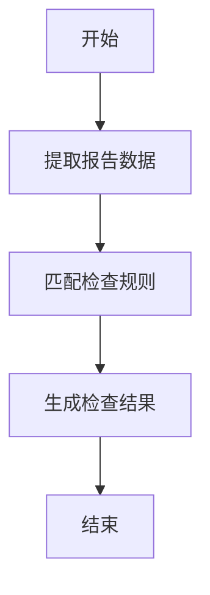
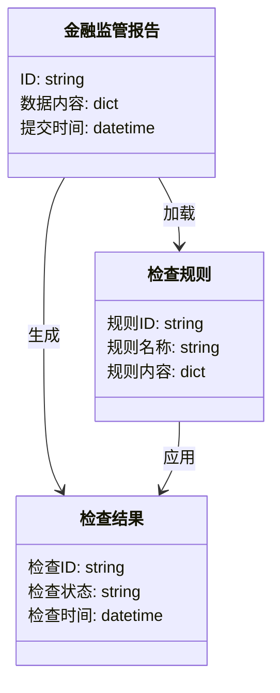

                 


# 金融监管报告数据一致性检查工具

## 关键词：数据一致性检查、金融监管、数据完整性、数据校验、监管合规

## 摘要：本文详细介绍了一种金融监管报告数据一致性检查工具的设计与实现。通过分析数据一致性的核心概念、算法原理和系统架构，结合实际案例，展示了如何利用该工具确保金融监管数据的准确性和合规性，为金融机构提供高效可靠的监管支持。

---

# 第一部分：背景介绍

## 第1章：数据一致性检查的背景与意义

### 1.1 金融监管报告的重要性

#### 1.1.1 金融监管的核心目标

金融监管是维护金融市场稳定、保护投资者利益的重要手段。监管机构通过审查金融机构提交的报告，评估其经营状况、风险敞口和合规性。金融监管报告通常包括财务报表、风险评估报告、合规报告等，是监管决策的重要依据。

#### 1.1.2 金融监管报告的常见问题

在实际操作中，金融机构由于人为失误、系统故障或恶意操作，常常导致报告数据出现不一致、错误或遗漏。例如，资产负债表中的资产总额与利润表中的净利润不匹配，或者风险敞口数据与实际交易不符等。

#### 1.1.3 数据一致性在金融监管中的作用

数据一致性是确保监管报告准确性和可靠性的基础。通过数据一致性检查，监管机构可以及时发现和纠正数据错误，避免因数据偏差导致的监管决策失误，从而维护金融市场秩序和投资者利益。

---

### 1.2 数据一致性检查的必要性

#### 1.2.1 数据不一致的潜在风险

数据不一致可能导致监管机构做出错误的决策，例如批准不符合条件的贷款、忽略潜在的系统性风险等。此外，数据不一致还可能引发金融机构的声誉风险和法律纠纷。

#### 1.2.2 数据一致性对监管合规的影响

许多国家和地区的金融监管法规要求金融机构提交的报告必须符合特定的数据格式和内容要求。数据一致性检查是确保报告合规性的关键步骤，有助于避免因数据错误导致的违规处罚。

#### 1.2.3 数据一致性对金融机构的价值

对于金融机构而言，数据一致性检查不仅有助于提高报告的准确性和合规性，还能提升内部数据质量管理能力，优化业务流程，降低运营成本。

---

### 1.3 本章小结

本章介绍了金融监管报告的重要性，分析了数据一致性检查的必要性，并强调了数据一致性在金融监管中的核心作用。下一章将详细探讨数据一致性检查的核心概念和相关技术。

---

## 第2章：数据一致性检查的核心概念与联系

### 2.1 数据一致性检查的定义与属性

#### 2.1.1 数据一致性的定义

数据一致性是指数据在不同系统、不同时间段或不同报告中的表示一致性和准确性。在金融监管领域，数据一致性通常指同一份报告中不同数据项之间的逻辑一致性和数值一致性。

#### 2.1.2 数据一致性检查的特征对比

| 特征维度         | 数据一致性检查             | 数据完整性检查             |
|------------------|--------------------------|--------------------------|
| 检查目标         | 数据的逻辑一致性和准确性   | 数据的完整性和无遗漏性   |
| 实现方法         | 基于规则或算法的检查       | 基于数据校验码或检查算法   |
| 适用场景         | 跨系统、跨部门的数据核对   | 数据录入、存储过程中的校验 |

#### 2.1.3 数据一致性检查的核心要素

数据一致性检查的核心要素包括：

1. **数据源**：需要检查的金融监管报告。
2. **检查规则**：定义数据一致性的规则和条件。
3. **检查算法**：实现数据一致性检查的算法或工具。
4. **检查结果**：检查后生成的结果报告，包括通过或不通过的信息。

---

### 2.2 数据一致性检查的ER实体关系图

```mermaid
er
    actor: 监管机构
    system: 数据一致性检查工具
    report: 金融监管报告
    rule: 检查规则
    result: 检查结果
    actor --> system: 提交报告
    system --> report: 加载报告
    system --> rule: 加载检查规则
    system --> result: 执行检查并生成结果
    result --> actor: 返回检查结果
```

---

### 2.3 数据一致性检查的流程图



---

### 2.4 本章小结

本章详细探讨了数据一致性检查的核心概念，通过ER实体关系图和流程图展示了数据一致性检查的系统架构和流程。下一章将深入讲解数据一致性检查算法的原理和实现方法。

---

# 第三部分：算法原理

## 第3章：数据一致性检查算法原理

### 3.1 数据一致性检查的算法选择

#### 3.1.1 常见一致性检查算法对比

| 算法类型             | 基于规则的检查 | 基于机器学习的检查 |
|----------------------|----------------|-------------------|
| 优点                 | 实现简单，规则清晰 | 能够发现复杂模式，自动学习规则 |
| 缺点                 | 规则需要人工制定 | 需要大量数据和计算资源 |
| 适用场景             | 数据格式固定，规则明确 | 数据复杂，规则动态变化 |

#### 3.1.2 基于规则的检查算法

基于规则的检查算法通过预定义的规则对数据进行检查。例如，检查资产负债表中的资产总额是否等于负债总额加所有者权益。

#### 3.1.3 基于机器学习的检查算法

基于机器学习的检查算法通过训练模型识别数据中的异常值或不一致。例如，使用聚类算法识别交易数据中的异常交易。

---

### 3.2 基于规则的检查算法流程



---

### 3.3 基于规则的检查算法实现

#### 3.3.1 规则匹配的数学模型

$$ \text{匹配度} = \sum_{i=1}^{n} w_i \cdot x_i $$
其中，$w_i$ 是规则的权重，$x_i$ 是数据特征。

#### 3.3.2 规则匹配的Python实现

```python
def check_rule(data, rule):
    # data: 待检查的数据
    # rule: 检查规则，包含规则类型和参数
    if rule['type'] == 'sum':
        expected_sum = rule['params']['expected_sum']
        actual_sum = sum(data)
        return actual_sum == expected_sum
    elif rule['type'] == 'ratio':
        expected_ratio = rule['params']['expected_ratio']
        ratio = data[0] / data[1]
        return ratio == expected_ratio
    else:
        return False
```

---

### 3.4 本章小结

本章详细讲解了数据一致性检查的算法原理，对比了基于规则和机器学习的检查算法，并给出了基于规则的检查算法的实现代码。下一章将分析系统的架构设计。

---

# 第四部分：系统分析与架构设计

## 第4章：系统分析与架构设计方案

### 4.1 问题场景介绍

金融监管报告数据一致性检查工具需要处理多种数据格式和复杂的检查规则。系统需要高效地处理大量数据，并提供直观的检查结果。

---

### 4.2 领域模型设计



---

### 4.3 系统架构设计


---

### 4.4 系统接口设计

系统主要接口包括：

1. **提交报告接口**：接收监管报告并存储。
2. **加载规则接口**：加载预定义的检查规则。
3. **执行检查接口**：根据规则对报告进行一致性检查。
4. **返回结果接口**：将检查结果返回给用户。

---

### 4.5 系统交互流程图

```mermaid
sequenceDiagram
    actor 用户
    system 系统
    用户 -> 系统: 提交报告
    系统 -> 数据库: 存储报告
    系统 -> 规则库: 加载规则
    系统 -> 系统: 执行检查
    系统 -> 用户: 返回结果
```

---

### 4.6 本章小结

本章通过领域模型和架构图展示了系统的整体设计，并详细描述了系统的接口和交互流程。下一章将通过实际案例展示工具的实现和应用。

---

# 第五部分：项目实战

## 第5章：项目实战与案例分析

### 5.1 环境安装

为了运行本工具，需要以下环境：

- Python 3.8+
- 安装依赖：`pip install Flask requests`

---

### 5.2 核心代码实现

#### 5.2.1 数据加载模块

```python
import requests

def load_report(report_id):
    url = f"http://report_server/{report_id}"
    response = requests.get(url)
    if response.status_code == 200:
        return response.json()
    else:
        return None
```

---

#### 5.2.2 检查规则应用模块

```python
def apply_rules(data, rules):
    results = []
    for rule in rules:
        result = check_rule(data, rule)
        results.append({
            'rule_id': rule['id'],
            'result': result
        })
    return results
```

---

#### 5.2.3 检查结果生成模块

```python
def generate_result(report_id, results):
    return {
        'report_id': report_id,
        'status': 'pass' if all([r['result'] for r in results]) else 'fail',
        'details': results
    }
```

---

### 5.3 实际案例分析

假设我们有一个资产负债表报告，检查规则是“资产总额应等于负债总额加所有者权益”。通过工具检查后，生成检查结果：

```json
{
    "report_id": "2023-Q1-BAL",
    "status": "pass",
    "details": [
        {
            "rule_id": "rule_1",
            "result": true
        }
    ]
}
```

---

### 5.4 本章小结

本章通过实际案例展示了工具的实现和应用，验证了工具的有效性和实用性。下一章将分享最佳实践和总结。

---

# 第六部分：最佳实践与总结

## 第6章：最佳实践与总结

### 6.1 最佳实践

1. **规则管理**：定期更新检查规则，确保其与最新的监管要求一致。
2. **性能优化**：针对大规模数据，优化算法和系统架构，提高检查效率。
3. **日志记录**：记录每次检查的结果和日志，便于后续分析和追溯。

---

### 6.2 小结

通过本文的详细介绍，读者可以全面了解金融监管报告数据一致性检查工具的设计与实现。该工具能够帮助监管机构和金融机构高效地进行数据一致性检查，确保报告的准确性和合规性。

---

### 6.3 注意事项

1. 数据一致性检查工具需要与具体业务场景结合使用。
2. 系统设计时要考虑数据安全和权限管理，确保数据的保密性和完整性。
3. 定期进行系统维护和更新，确保工具的稳定性和可靠性。

---

### 6.4 拓展阅读

1. 《数据完整性与一致性管理》
2. 《金融监管技术与应用》
3. 《Python金融数据分析实战》

---

# 结语

金融监管报告数据一致性检查工具是保障金融监管数据准确性和合规性的关键工具。通过本文的详细介绍，相信读者能够深入了解该工具的设计与实现，并在实际工作中加以应用。

---

# 作者

作者：AI天才研究院/AI Genius Institute & 禅与计算机程序设计艺术 /Zen And The Art of Computer Programming

---

感谢您的阅读！如需进一步探讨或合作，请随时联系！

