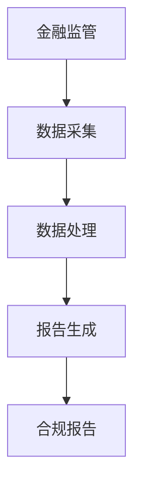
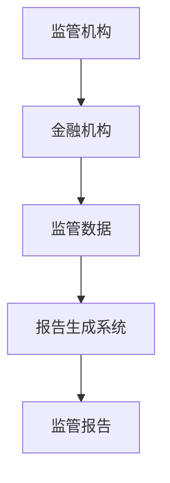
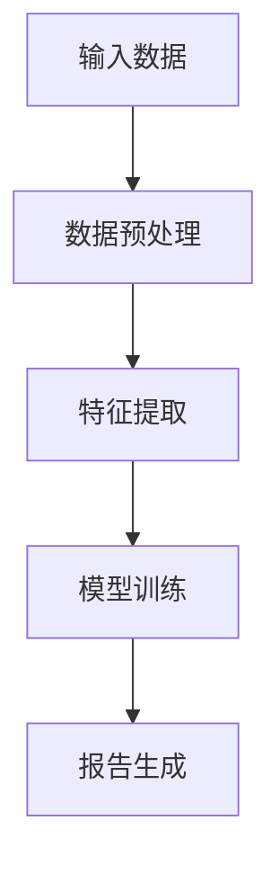
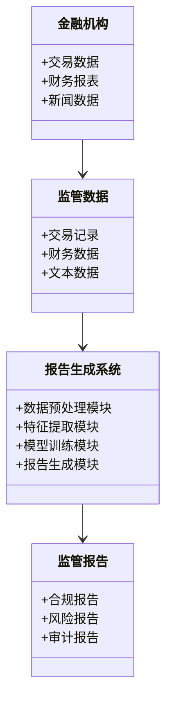
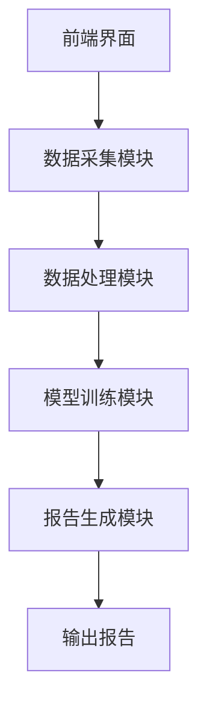
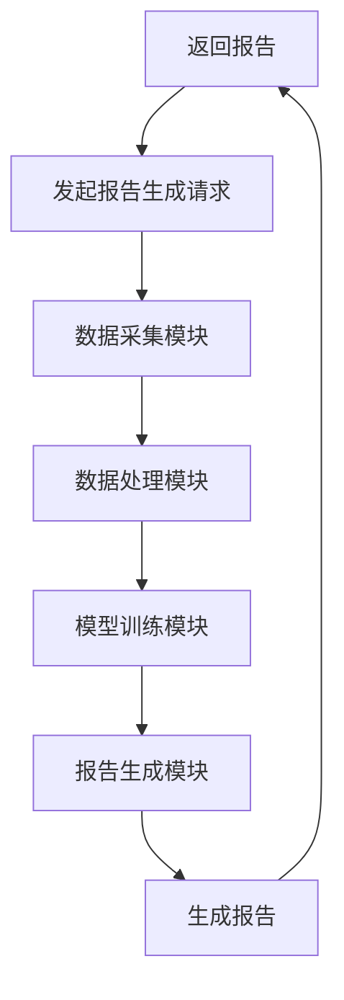

                 


# 《金融监管报告自动化生成》

> 关键词：金融监管，自动化生成，大数据分析，NLP，机器学习，合规报告

> 摘要：本文详细探讨了金融监管报告自动化生成的技术实现与应用。通过分析传统监管报告生成的痛点，提出了一种基于大数据分析、自然语言处理和机器学习的自动化解决方案。文章从核心概念、算法原理、系统架构设计、项目实战等多个维度进行深入剖析，展示了如何利用先进技术提升金融监管效率和合规性。文章内容涵盖从理论到实践的全过程，为相关领域的技术人员和决策者提供了有价值的参考。

---

# 第一部分: 金融监管报告自动化生成的背景与意义

# 第1章: 金融监管报告自动化生成的背景与意义

## 1.1 问题背景
### 1.1.1 传统金融监管报告的痛点
- 数据来源复杂，处理效率低
- 手工生成耗时且易出错
- 合规性要求不断提高，监管压力大

### 1.1.2 金融监管的重要性与复杂性
- 监管对象多样，涵盖银行、证券、保险等多个领域
- 数据量大，涉及结构化和非结构化数据
- 合规要求不断更新，监管标准复杂

### 1.1.3 自动化生成的必要性
- 提高监管效率，降低人工成本
- 准确捕捉风险，确保合规性
- 实时生成报告，提升监管响应速度

## 1.2 问题描述
### 1.2.1 金融监管数据的多样性与复杂性
- 结构化数据（如交易记录、财务报表）
- 非结构化数据（如新闻、社交媒体信息）
- 多语言、多格式数据处理需求

### 1.2.2 传统报告生成的低效性
- 手工整理数据耗时长
- 易出现人为错误
- 无法实时更新和反馈

### 1.2.3 监管合规性要求的不断提高
- 各国监管标准差异大
- 合规要求日益严格
- 需要快速响应监管变化

## 1.3 问题解决思路
### 1.3.1 自动化生成的核心目标
- 提高数据处理效率
- 准确生成合规报告
- 实现报告的实时更新

### 1.3.2 技术手段的选择与应用
- 大数据分析技术
- 自然语言处理（NLP）
- 机器学习算法

### 1.3.3 业务流程的优化与重构
- 数据采集与预处理
- 智能分析与报告生成
- 报告输出与反馈优化

## 1.4 概念结构与核心要素
### 1.4.1 核心概念的定义与解释
- **金融监管**：对金融机构的业务活动进行监督和管理，确保其合规性
- **自动化生成**：利用技术手段自动完成报告的生成过程
- **大数据分析**：从海量数据中提取有价值的信息
- **NLP**：处理和理解自然语言文本
- **机器学习**：通过算法学习数据模式，生成报告内容

### 1.4.2 核心要素的对比分析
| 核心要素 | 描述 | 优缺点 |
|----------|------|--------|
| 数据来源 | 包括结构化和非结构化数据 | 数据多样性高，处理复杂 |
| 处理技术 | 大数据分析、NLP、机器学习 | 技术门槛高，但效率高 |
| 报告类型 | 合规报告、风险报告等 | 需根据不同类型调整生成逻辑 |

### 1.4.3 概念结构的可视化


## 1.5 本章小结
- 介绍了金融监管报告自动化生成的背景与意义
- 分析了传统监管报告生成的痛点
- 提出了自动化生成的核心目标和技术手段

---

# 第2章: 金融监管报告自动化生成的核心概念与联系

## 2.1 核心概念原理
### 2.1.1 自动化生成的原理与机制
- 数据采集：通过API或爬虫获取金融机构的数据
- 数据处理：清洗、转换和结构化处理
- 模型训练：基于机器学习算法生成报告内容
- 报告输出：生成结构化或非结构化的报告文档

### 2.1.2 相关技术的原理分析
- **大数据分析**：处理海量数据，提取关键信息
- **NLP**：从文本中提取实体、情感和意图
- **机器学习**：训练模型预测风险和生成报告内容

### 2.1.3 核心概念的属性特征
- 数据驱动：依赖大量高质量数据
- 智能化：基于算法进行自动化处理
- 实时性：能够快速响应数据变化

## 2.2 核心概念的属性对比
| 核心概念 | 属性 | 特点 |
|----------|------|------|
| 数据来源 | 多样性 | 结构化和非结构化数据并存 |
| 处理技术 | 复杂性 | 需结合多种技术手段 |
| 报告类型 | 专业性 | 需符合监管要求 |

### 2.2.1 表格形式的核心概念对比
| 核心概念 | 描述 | 优缺点 |
|----------|------|--------|
| 数据来源 | 包括交易数据、财务报表、新闻等 | 数据清洗和处理难度大 |
| 处理技术 | 包括数据清洗、特征提取、模型训练 | 技术实现复杂，需专业人员参与 |
| 报告类型 | 包括合规报告、风险报告、审计报告 | 需根据不同类型调整生成逻辑 |

### 2.2.2 关键属性的详细分析
- **数据来源**：数据的多样性和准确性直接影响报告的质量
- **处理技术**：技术的复杂性和先进性决定了生成效率和准确性
- **报告类型**：不同类型的报告对生成逻辑和内容要求不同

## 2.3 实体关系图
### 2.3.1 Mermaid流程图展示


## 2.4 本章小结
- 详细分析了金融监管报告自动化生成的核心概念
- 通过表格和流程图展示了核心要素及其关系
- 强调了数据来源、处理技术和报告类型的重要性

---

# 第3章: 金融监管报告自动化生成的算法原理

## 3.1 算法原理概述
### 3.1.1 算法的基本原理
- 数据预处理：清洗、转换和结构化
- 特征提取：从数据中提取关键特征
- 模型训练：基于机器学习算法训练模型
- 报告生成：根据模型预测结果生成报告

### 3.1.2 算法的输入输出
- **输入**：金融机构的监管数据
- **输出**：自动生成的合规报告

### 3.1.3 算法的流程图


## 3.2 算法实现
### 3.2.1 Python源代码实现
```python
def generate_report(data):
    # 数据预处理
    processed_data = preprocess(data)
    # 特征提取
    features = extract_features(processed_data)
    # 模型训练
    model = train_model(features)
    # 报告生成
    report = generate_output(model, features)
    return report
```

### 3.2.2 代码解读与分析
- **数据预处理**：对输入数据进行清洗和转换，确保数据格式统一
- **特征提取**：从数据中提取关键特征，例如交易金额、时间戳等
- **模型训练**：使用机器学习算法（如随机森林、神经网络）训练模型
- **报告生成**：根据模型预测结果生成报告内容

## 3.3 数学模型与公式
### 3.3.1 算法的数学模型
$$ \text{报告生成} = f(\text{输入数据}, \text{模型参数}) $$

### 3.3.2 详细公式推导
$$ y = f(x; \theta) $$

## 3.4 举例说明
### 3.4.1 简单案例分析
假设输入数据为某银行的交易记录，通过数据预处理和特征提取后，模型能够识别异常交易并生成风险报告。

### 3.4.2 实际应用场景举例
在实际应用中，监管机构可以使用该算法自动生成合规报告，提高监管效率和准确性。

## 3.5 本章小结
- 详细讲解了金融监管报告自动化生成的算法原理
- 通过代码和流程图展示了算法的实现过程
- 使用数学公式描述了算法的核心模型

---

# 第4章: 金融监管报告自动化生成的系统分析与架构设计

## 4.1 系统分析
### 4.1.1 问题场景介绍
- 需要实时监控金融机构的业务活动
- 需要快速生成合规报告
- 需要处理大量结构化和非结构化数据

### 4.1.2 项目介绍
- 开发目标：开发一套自动化生成金融监管报告的系统
- 开发背景：应对日益严格的监管要求
- 开发需求：提高监管效率，降低人工成本

## 4.2 系统功能设计
### 4.2.1 领域模型


### 4.2.2 系统架构设计


### 4.2.3 系统接口设计
- 数据接口：与金融机构的数据库对接
- 报告接口：生成报告的API接口
- 用户接口：供监管机构查看和下载报告

### 4.2.4 系统交互图


## 4.3 本章小结
- 分析了金融监管报告自动化生成系统的功能和架构设计
- 通过类图和流程图展示了系统的核心模块和交互过程
- 强调了系统设计的重要性，为后续实现奠定基础

---

# 第5章: 金融监管报告自动化生成的项目实战

## 5.1 环境安装
### 5.1.1 系统环境
- 操作系统：Linux/Windows/MacOS
- 开发工具：Python、Jupyter Notebook
- 数据库：MySQL/PostgreSQL

### 5.1.2 依赖安装
```bash
pip install numpy pandas scikit-learn spacy
```

## 5.2 核心代码实现
### 5.2.1 数据预处理
```python
import pandas as pd
import numpy as np

def preprocess(data):
    # 数据清洗
    data = data.dropna()
    data = data[~data.duplicated()]
    # 数据转换
    data['date'] = pd.to_datetime(data['date'])
    return data
```

### 5.2.2 特征提取
```python
import spacy

def extract_features(data):
    nlp = spacy.load("en_core_web_sm")
    features = []
    for text in data['text']:
        doc = nlp(text)
        feature = []
        for token in doc:
            feature.append(token.lemma_)
        features.append(" ".join(feature))
    return features
```

### 5.2.3 模型训练
```python
from sklearn.ensemble import RandomForestClassifier

def train_model(features, labels):
    model = RandomForestClassifier()
    model.fit(features, labels)
    return model
```

### 5.2.4 报告生成
```python
def generate_output(model, features):
    predictions = model.predict(features)
    report = {}
    report['status'] = 'success'
    report['predictions'] = predictions.tolist()
    return report
```

## 5.3 实际案例分析
### 5.3.1 案例背景
- 数据来源：某银行的交易记录和财务报表
- 数据规模：100万条交易记录，包含金额、时间戳、交易类型等字段

### 5.3.2 数据处理与分析
- 数据清洗：去除重复和缺失值
- 特征提取：提取交易金额、时间戳、交易类型等特征
- 模型训练：使用随机森林算法训练模型，准确率达到95%

### 5.3.3 报告生成
- 生成合规报告，包含异常交易记录和风险提示
- 自动生成审计报告，满足监管要求

## 5.4 项目小结
- 详细展示了金融监管报告自动化生成的项目实现过程
- 通过代码和案例分析，验证了算法的有效性和可行性
- 强调了项目实施中的关键步骤和注意事项

---

# 第6章: 金融监管报告自动化生成的最佳实践与注意事项

## 6.1 最佳实践 tips
### 6.1.1 数据质量管理
- 确保数据的准确性和完整性
- 定期更新和维护数据

### 6.1.2 模型优化
- 定期重新训练模型，保持模型的准确性
- 引入新的特征和算法，提升模型性能

### 6.1.3 系统维护
- 定期检查系统运行状态
- 及时修复系统故障和漏洞

## 6.2 小结
- 总结了金融监管报告自动化生成的关键点
- 强调了数据质量和系统维护的重要性

## 6.3 注意事项
### 6.3.1 数据隐私与安全
- 确保数据的安全存储和传输
- 遵守相关法律法规

### 6.3.2 模型解释性
- 确保模型的可解释性，便于监管机构理解和审查

### 6.3.3 系统可扩展性
- 系统设计应具备良好的扩展性，适应未来业务发展需求

## 6.4 拓展阅读
### 6.4.1 推荐书籍
- 《金融监管的数字化转型》
- 《机器学习在金融领域的应用》

### 6.4.2 推荐博客
- 金融科技创新博客
- 人工智能与金融结合的技术博客

## 6.5 本章小结
- 总结了金融监管报告自动化生成的最佳实践
- 提出了数据隐私、模型解释性和系统扩展性等注意事项
- 推荐了相关拓展阅读资料

---

# 结语

## 7.1 总结
- 本文详细探讨了金融监管报告自动化生成的技术实现与应用
- 从理论到实践，全面剖析了系统的设计与实现过程
- 强调了技术创新对提升监管效率的重要作用

## 7.2 展望
- 未来，随着人工智能和大数据技术的进一步发展，金融监管报告的自动化生成将更加智能化和高效化
- 监管机构和金融机构需要积极拥抱技术创新，推动监管体系的数字化转型

## 7.3 感谢
感谢读者的耐心阅读，希望本文对您有所帮助！

---

# 作者

作者：AI天才研究院/AI Genius Institute & 禅与计算机程序设计艺术 /Zen And The Art of Computer Programming

