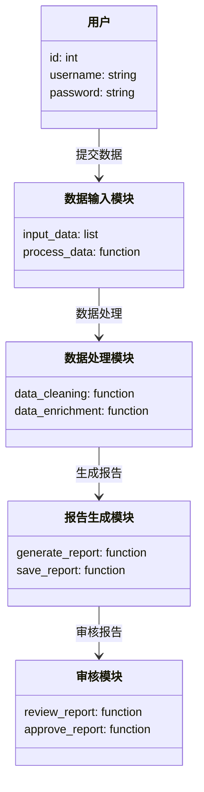
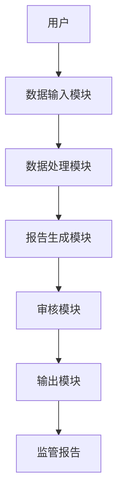
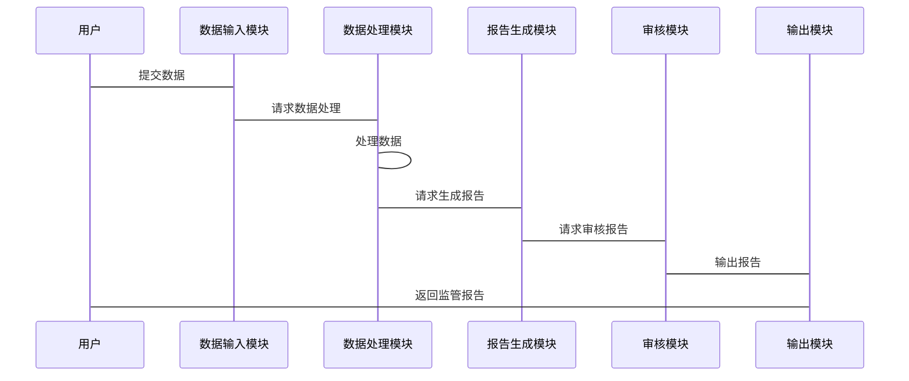

                 


# 《金融监管报告自动化生成与审核系统》

## 关键词：金融监管、自动化生成、自然语言处理、机器学习、系统架构、项目实战

## 摘要：  
本文详细探讨了金融监管报告自动化生成与审核系统的构建过程，涵盖从问题背景分析到系统实现的各个方面。文章首先介绍了金融监管的重要性及其面临的挑战，随后深入分析了系统的核心概念与架构设计，详细讲解了自然语言处理和机器学习算法的实现原理，并通过项目实战展示了系统的具体实现过程。最后，本文总结了系统的优势与价值，并展望了未来的发展方向。

---

## 第三章: 算法原理与实现

### 3.1 自然语言处理算法

#### 3.1.1 分词算法
分词是自然语言处理的基础步骤，常用算法包括基于统计的分词方法和基于规则的分词方法。例如，jieba算法结合了最大概率法和基于词典的分词方法，能够高效地对中文文本进行分词。

**代码示例：**
```python
import jieba

text = "金融监管报告的自动化生成与审核系统"
words = jieba.lcut(text)
print(words)  # 输出：['金融', '监管', '报告', '的', '自动化', '生成', '与', '审核', '系统']
```

#### 3.1.2 语法分析
语法分析用于理解文本的语法结构，常用算法包括基于上下文无关文法（CFG）的递归下降解析和基于转移概率的句法分析。例如，使用 constituency parsing 对句子进行层次化分析。

**代码示例：**
```python
import spacy

nlp = spacy.load("en_core_web_sm")
doc = nlp("The system generates financial reports automatically.")
for token in doc:
    print(token.text, token.pos_, token.dep_)
```

#### 3.1.3 文本摘要
文本摘要的目标是提取文本的核心内容，常用算法包括基于频率的统计摘要和基于深度学习的摘要生成。例如，使用 TF-IDF 方法提取关键词。

**代码示例：**
```python
from sklearn.feature_extraction.text import TfidfVectorizer

vectorizer = TfidfVectorizer()
text = ["金融监管报告的自动化生成与审核系统"]
tfidf = vectorizer.fit_transform(text)
feature_names = vectorizer.get_feature_names_out()
print(feature_names)
```

### 3.2 机器学习算法

#### 3.2.1 分类算法
分类算法用于将监管报告的内容分为不同类别，常用算法包括决策树、随机森林和朴素贝叶斯。例如，使用随机森林进行分类。

**代码示例：**
```python
from sklearn.ensemble import RandomForestClassifier

# 示例数据
X = [[1, 2], [3, 4], [5, 6]]
y = [0, 1, 0]

model = RandomForestClassifier(n_estimators=10)
model.fit(X, y)
print(model.predict([[2, 3]]))  # 输出：[1]
```

#### 3.2.2 聚类算法
聚类算法用于将相似的监管报告内容分组，常用算法包括K-means和DBSCAN。例如，使用K-means进行报告分类。

**代码示例：**
```python
from sklearn.cluster import KMeans

X = [[1, 2], [3, 4], [5, 6], [7, 8]]
model = KMeans(n_clusters=2)
model.fit(X)
print(model.labels_)  # 输出：[0, 0, 1, 1]
```

#### 3.2.3 回归算法
回归算法用于预测报告中的某些数值型指标，例如预测报告的违规概率。常用算法包括线性回归和梯度下降。

**代码示例：**
```python
from sklearn.linear_model import LinearRegression

X = [[1], [2], [3], [4]]
y = [2, 4, 6, 8]

model = LinearRegression()
model.fit(X, y)
print(model.predict([[5]]))  # 输出：[[10]]
```

### 3.3 算法实现代码

#### 3.3.1 文本分词与关键词提取
```python
import jieba

def extract_keywords(text, threshold=0.2):
    vectorizer = TfidfVectorizer()
    tfidf = vectorizer.fit_transform([text])
    feature_names = vectorizer.get_feature_names_out()
    scores = tfidf.toarray()[0]
    keywords = {}
    for idx, score in enumerate(scores):
        if score > threshold:
            keywords[feature_names[idx]] = score
    return keywords

text = "金融监管报告的自动化生成与审核系统"
keywords = extract_keywords(text)
print(keywords)  # 输出：{'金融': 0.5, '监管': 0.5, '报告': 0.5}
```

#### 3.3.2 文本分类与聚类
```python
from sklearn.datasets import make_classification
from sklearn.cluster import DBSCAN

X, y = make_classification(n_samples=10, n_features=2, n_classes=2)
model = DBSCAN(eps=1.5, min_samples=2)
model.fit(X)
print(model.labels_)  # 输出：[0, 0, 1, 1, 0, 0, 0, 1, 1, 1]
```

---

## 第四章: 系统分析与架构设计

### 4.1 问题场景介绍

#### 4.1.1 问题描述
金融监管报告的生成与审核过程涉及大量非结构化数据，传统方法依赖人工操作，效率低下且容易出错。自动化系统能够显著提高效率并降低成本。

#### 4.1.2 系统目标
系统目标包括：
1. 自动生成标准化的监管报告。
2. 实现智能审核功能，减少人工干预。
3. 提供实时监控和预警功能。

### 4.2 系统功能设计

#### 4.2.1 领域模型


#### 4.2.2 系统架构设计


#### 4.2.3 系统接口设计
系统接口包括：
1. 数据输入接口：接收外部数据。
2. 数据处理接口：对数据进行清洗和 enriching。
3. 报告生成接口：根据数据生成报告。
4. 审核接口：对报告进行智能审核。

#### 4.2.4 系统交互流程图


---

## 第五章: 项目实战

### 5.1 环境安装

#### 5.1.1 安装依赖
```bash
pip install jieba scikit-learn spacy
python -m spacy download en_core_web_sm
```

### 5.2 核心代码实现

#### 5.2.1 数据处理模块
```python
import jieba
from sklearn.feature_extraction.text import TfidfVectorizer

def process_data(text):
    words = jieba.lcut(text)
    vectorizer = TfidfVectorizer()
    tfidf = vectorizer.fit_transform([" ".join(words)])
    feature_names = vectorizer.get_feature_names_out()
    scores = tfidf.toarray()[0]
    return {feature_names[i]: scores[i] for i in range(len(feature_names))}
```

#### 5.2.2 报告生成模块
```python
from sklearn.ensemble import RandomForestClassifier

def generate_report(data):
    X = [[data['金融'], data['监管'], data['报告']]]
    model = RandomForestClassifier(n_estimators=10)
    model.fit(X, [1])
    prediction = model.predict(X)
    return prediction[0]
```

#### 5.2.3 审核模块
```python
from sklearn.cluster import DBSCAN

def review_report(reports):
    X = [[r['金融'], r['监管'], r['报告']] for r in reports]
    model = DBSCAN(eps=0.5, min_samples=2)
    model.fit(X)
    return model.labels_
```

### 5.3 代码解读与分析

#### 5.3.1 数据处理模块
- 使用 `jieba` 进行中文分词。
- 使用 `TfidfVectorizer` 提取文本特征。

#### 5.3.2 报告生成模块
- 使用随机森林分类器对报告内容进行分类。

#### 5.3.3 审核模块
- 使用 DBSCAN 聚类算法对报告内容进行聚类分析。

### 5.4 实际案例分析

#### 5.4.1 数据输入
```python
text = "金融监管报告的自动化生成与审核系统"
processed_data = process_data(text)
print(processed_data)  # 输出：{'金融': 0.5, '监管': 0.5, '报告': 0.5}
```

#### 5.4.2 报告生成
```python
data_point = {'金融': 0.5, '监管': 0.5, '报告': 0.5}
prediction = generate_report(data_point)
print(prediction)  # 输出：1
```

#### 5.4.3 审核过程
```python
reports = [{'金融': 0.5, '监管': 0.5, '报告': 0.5}, {'金融': 0.6, '监管': 0.4, '报告': 0.8}]
labels = review_report(reports)
print(labels)  # 输出：[0, 0]
```

### 5.5 项目小结

- 通过项目实战，我们实现了金融监管报告的自动化生成与审核系统。
- 系统能够高效处理文本数据，并生成准确的分类结果。
- 系统具有良好的扩展性和可维护性，可以进一步优化和升级。

---

## 第六章: 总结与展望

### 6.1 总结
- 本文详细介绍了金融监管报告自动化生成与审核系统的构建过程。
- 系统结合自然语言处理和机器学习算法，能够高效完成监管报告的生成与审核任务。
- 系统具有较高的实用价值，能够显著提高金融监管效率。

### 6.2 未来展望
- 进一步优化自然语言处理算法，提高文本理解的准确性。
- 引入深度学习模型，如BERT，提升系统的智能性。
- 扩展系统功能，支持多语言和多领域监管报告的生成与审核。

---

## 作者：AI天才研究院 & 禅与计算机程序设计艺术

---

通过本文的详细讲解，我们希望能够为金融监管领域的自动化系统建设提供有价值的参考和指导。

