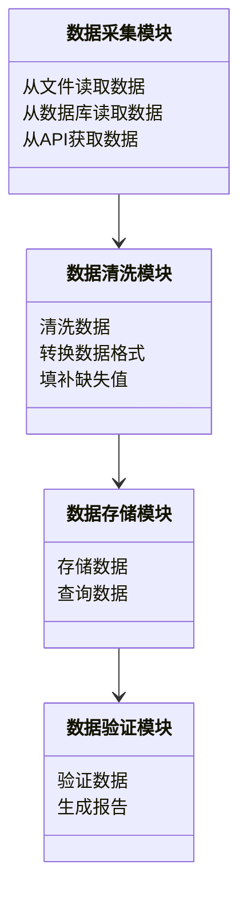

                 


# 《金融监管科技数据质量控制平台》

## 关键词：金融监管、数据质量、人工智能、监管科技、数据清洗

## 摘要：
金融监管科技数据质量控制平台是利用人工智能和大数据技术，对金融数据进行清洗、转换和标准化处理，提升数据质量和一致性，确保监管准确性。本文详细探讨了数据质量控制的重要性、核心概念、算法原理、系统架构设计及项目实现，为构建高效、可靠的金融监管数据质量控制平台提供理论支持和实践指导。

---

# 第一部分: 金融监管科技数据质量控制平台概述

## 第1章: 问题背景与需求分析

### 1.1 数据质量控制的重要性
数据质量是金融监管的核心，直接影响决策的准确性和合规性。在金融领域，数据质量问题可能导致监管失误、合规风险和经济损失。例如，银行交易数据中的异常值可能导致错误的市场分析，进而引发金融风险。

#### 1.1.1 金融监管中的数据质量问题
- 数据缺失：如交易时间、金额等字段的缺失会影响数据分析的完整性。
- 数据错误：如金额单位错误或日期格式不统一，导致数据处理困难。
- 数据冗余：重复数据增加存储成本，影响处理效率。

#### 1.1.2 数据质量对监管科技的影响
数据质量直接影响监管系统的性能和效果。低质量的数据可能导致错误的监管决策，甚至引发系统性风险。例如，信用评分模型使用低质量数据可能导致错误的信用评级。

#### 1.1.3 数据质量控制的必要性
通过数据清洗、转换和标准化，确保数据的完整性和一致性，为监管科技提供可靠的数据支持。数据质量控制是金融监管科技的基础，是保障金融系统安全稳定运行的关键。

---

## 第2章: 数据质量控制的核心概念

### 2.1 数据质量的关键维度
数据质量从多个维度进行评估，包括完整性、准确性、一致性、及时性和格式规范性。

#### 2.1.1 完整性
数据完整性要求所有必要的字段都必须有值，避免数据缺失。例如，交易记录必须包含交易时间、金额和参与者信息。

#### 2.1.2 准确性
数据准确性确保数据内容与真实情况一致。例如，股票价格数据必须准确反映市场行情。

#### 2.1.3 一致性
数据一致性要求不同数据源中的同一字段保持一致。例如，客户信息在不同系统中应保持相同的格式和内容。

#### 2.1.4 及时性
数据及时性要求数据能够反映最新的情况。例如，实时交易数据必须及时更新，以确保监管的及时性。

#### 2.1.5 格式规范性
数据格式必须符合预定义的标准。例如，日期格式应统一为YYYY-MM-DD。

### 2.2 数据类型与质量控制方法
不同数据类型需要不同的质量控制方法：

| 数据类型       | 质量控制方法                           |
|----------------|----------------------------------------|
| 结构化数据       | 检查缺失值、异常值、格式一致性           |
| 非结构化数据     | 去重、内容清洗、关键词提取               |
| 半结构化数据     | 解析结构、补充缺失值、格式标准化         |

### 2.3 数据质量控制的流程与框架
数据质量控制通常包括以下步骤：
1. 数据收集：从多个来源获取数据。
2. 数据清洗：去除噪声、填补缺失值、标准化格式。
3. 数据转换：将数据转换为适合分析的格式。
4. 数据验证：验证数据的完整性和一致性。

---

## 第3章: 数据质量控制的算法原理

### 3.1 数据清洗算法
数据清洗是数据质量控制的核心步骤，包括异常值检测、重复数据检测和数据格式标准化。

#### 3.1.1 异常值检测
异常值检测是通过统计方法或机器学习算法识别异常数据。常用方法包括：
- Z-score：基于标准差检测异常值。
- Isolation Forest：基于树结构的异常检测算法。

例如，使用Z-score方法检测交易金额异常值：

$$ Z = \frac{x - \mu}{\sigma} $$

其中，$x$ 是观测值，$\mu$ 是均值，$\sigma$ 是标准差。当 $|Z| > 3$ 时，认为 $x$ 是异常值。

#### 3.1.2 重复数据检测
通过哈希算法或唯一标识符检测重复数据。例如，使用Python的pandas库检测重复行：

```python
import pandas as pd
df = pd.DataFrame({'A': [1, 2, 2, 3], 'B': [4, 5, 6, 7]})
df.drop_duplicates()
```

#### 3.1.3 数据格式标准化
将数据转换为统一的格式。例如，将日期格式统一为ISO标准：

```python
from datetime import datetime
def format_date(date_str):
    try:
        dt = datetime.strptime(date_str, '%d/%m/%Y')
        return dt.strftime('%Y-%m-%d')
    except ValueError:
        return None
```

### 3.2 数据特征工程
特征工程是数据清洗的高级阶段，包括特征提取、特征选择和特征变换。

#### 3.2.1 特征提取
从原始数据中提取有用的特征。例如，从文本数据中提取关键词：

```python
from sklearn.feature_extraction.text import TfidfVectorizer
vectorizer = TfidfVectorizer()
tfidf = vectorizer.fit_transform(text_data)
```

#### 3.2.2 特征选择
选择对目标变量有显著影响的特征。例如，使用LASSO回归选择重要特征：

```python
from sklearn.linear_model import Lasso
model = Lasso(alpha=0.1).fit(X, y)
selected_features = model.coef_ != 0
```

### 3.3 数据质量评估模型
使用机器学习模型评估数据质量。例如，使用XGBoost模型预测数据的可信任度：

```python
import xgboost as xgb
model = xgb.XGBClassifier(n_estimators=100, learning_rate=0.1)
model.fit(X_train, y_train)
```

---

## 第4章: 系统分析与架构设计

### 4.1 问题场景介绍
金融监管科技数据质量控制平台需要处理来自多个数据源的异构数据，包括银行交易数据、股票市场数据和客户信息。平台需要支持实时数据处理和历史数据分析。

### 4.2 系统功能设计
系统功能模块包括数据采集、数据清洗、数据存储、数据验证和数据报告。

#### 4.2.1 数据采集模块
从多种数据源采集数据，支持文件、数据库和API接口。

#### 4.2.2 数据清洗模块
实现数据清洗、转换和标准化。

#### 4.2.3 数据存储模块
存储清洗后的数据，支持关系型数据库和NoSQL数据库。

#### 4.2.4 数据验证模块
验证数据的完整性和一致性，生成数据质量报告。

#### 4.2.5 数据报告模块
生成可视化报告，展示数据质量分析结果。

### 4.3 系统架构设计

#### 4.3.1 领域模型


#### 4.3.2 系统架构


#### 4.3.3 系统接口设计
API接口包括数据采集、数据清洗和数据验证接口。

---

## 第5章: 项目实战

### 5.1 环境安装
安装必要的Python库，如pandas、numpy、scikit-learn和xgboost。

### 5.2 核心代码实现
实现数据清洗、特征工程和数据验证的核心代码。

#### 5.2.1 数据清洗代码
```python
import pandas as pd
import numpy as np

def clean_data(df):
    # 处理缺失值
    df = df.dropna()
    # 标准化日期格式
    df['date'] = df['date'].apply(format_date)
    return df

def format_date(date_str):
    try:
        dt = datetime.strptime(date_str, '%d/%m/%Y')
        return dt.strftime('%Y-%m-%d')
    except ValueError:
        return None
```

#### 5.2.2 特征工程代码
```python
from sklearn.feature_selection import SelectKBest
from sklearn.preprocessing import StandardScaler

def feature_engineering(X):
    scaler = StandardScaler()
    X_scaled = scaler.fit_transform(X)
    selector = SelectKBest(k=10)
    X_selected = selector.fit_transform(X_scaled)
    return X_selected
```

### 5.3 案例分析
以银行交易数据为例，展示平台的实际应用。

### 5.4 项目总结
总结项目实现的关键点和经验教训。

---

## 第6章: 最佳实践与小结

### 6.1 最佳实践
- 数据清洗前先理解数据特征。
- 使用多种算法验证数据质量。
- 定期更新数据质量控制规则。

### 6.2 小结
本文详细介绍了金融监管科技数据质量控制平台的构建过程，从背景分析到系统设计，再到项目实现，为金融行业提供了可靠的数据质量管理方案。

### 6.3 注意事项
- 数据清洗过程中要注意保护数据隐私。
- 数据验证时要结合业务规则。
- 数据平台要具备良好的扩展性和灵活性。

### 6.4 拓展阅读
- 《大数据系统设计与实践》
- 《金融风险管理与数据分析》
- 《机器学习在金融领域的应用》

---

## 作者：AI天才研究院/AI Genius Institute & 禅与计算机程序设计艺术 /Zen And The Art of Computer Programming

---

通过以上内容，本文系统地介绍了金融监管科技数据质量控制平台的构建过程，为金融行业的数据质量管理提供了理论和实践指导。希望对读者有所帮助。

