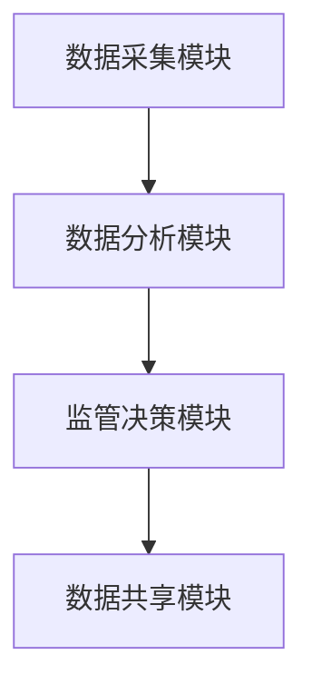
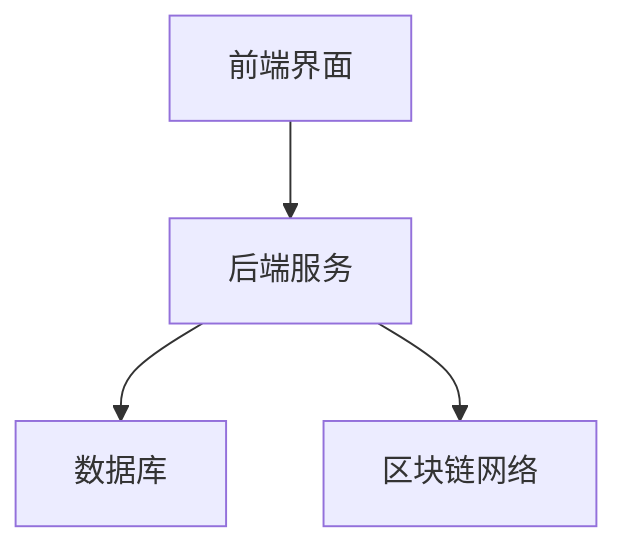

                 


# 《金融监管科技解决方案设计》

---

## 关键词：金融监管科技、区块链、人工智能、大数据、RegTech、FinTech

---

## 摘要：本文系统地探讨了金融监管科技（RegTech）的核心概念、技术原理、解决方案设计以及实际应用场景。通过分析传统金融监管的痛点，提出基于区块链、人工智能和大数据的监管科技解决方案，并详细阐述了系统的架构设计和实现方案。本文旨在为金融机构和监管机构提供一种高效、智能化的监管工具，助力金融市场的合规与稳定发展。

---

## 第一部分: 金融监管科技解决方案设计背景与概述

---

### 第1章: 金融监管科技的背景与问题背景

#### 1.1 金融监管科技的背景

传统金融监管模式面临效率低下、数据孤岛、合规成本高昂等问题。随着金融科技（FinTech）的快速发展，金融机构的业务模式和产品创新日益复杂，监管机构的监管难度和成本也在不断增加。监管科技（RegTech）作为一种新兴的技术解决方案，通过利用区块链、人工智能和大数据等技术，为金融机构和监管机构提供了一种高效、智能的监管工具。

---

#### 1.2 金融监管科技的核心概念与问题描述

监管科技的核心概念包括：

- **数据采集与处理**：通过区块链、大数据等技术实现金融机构数据的高效采集和共享。
- **智能分析与决策**：利用人工智能技术对数据进行深度分析，识别风险并提供决策支持。
- **监管合规与报告**：通过自动化技术确保金融机构的合规性，并自动生成监管报告。
- **安全与隐私保护**：在数据共享和分析过程中，确保数据的安全性和隐私性。

金融监管中的主要问题包括：

1. **传统监管模式的效率低下**：人工审核流程繁琐，耗时长，且容易出错。
2. **数据孤岛与信息不对称**：金融机构之间的数据难以共享，导致监管机构无法获取全面信息。
3. **监管合规成本高昂**：金融机构需要投入大量资源来满足监管要求。
4. **风险识别与预警的挑战**：传统监管手段难以及时发现和预警潜在风险。

---

### 第2章: 监管科技的解决方案与边界

#### 2.1 监管科技的解决方案

监管科技的解决方案包括：

- **技术驱动的监管创新**：通过区块链技术实现监管数据的透明化和共享，利用人工智能技术进行智能风险识别。
- **数据共享与隐私保护的平衡**：通过区块链的加密技术实现数据的共享，同时保护隐私。
- **智能化监管工具的应用**：利用人工智能和大数据技术，构建智能化的监管系统，提升监管效率。

#### 2.2 监管科技的边界与外延

监管科技的应用范围主要集中在以下几个方面：

- **合规性监管**：确保金融机构的业务操作符合监管要求。
- **风险监管**：识别和预警金融市场中的潜在风险。
- **数据监管**：实现金融机构数据的透明化和共享。

监管科技的适用场景包括：

- **金融机构的合规管理**：帮助金融机构满足监管要求，降低合规成本。
- **监管机构的智能化监管**：提升监管效率，降低监管成本。
- **金融市场的风险防控**：通过实时数据分析，识别和预警金融风险。

---

### 第3章: 监管科技的核心要素与概念结构

#### 3.1 监管科技的核心要素

监管科技的核心要素包括：

- **数据采集与处理**：通过区块链技术实现数据的高效采集和共享。
- **智能分析与决策**：利用人工智能技术对数据进行深度分析，识别风险并提供决策支持。
- **监管合规与报告**：通过自动化技术确保金融机构的合规性，并自动生成监管报告。
- **安全与隐私保护**：在数据共享和分析过程中，确保数据的安全性和隐私性。

#### 3.2 监管科技的概念结构与核心要素组成

监管科技的概念结构可以表示为一个系统，包括以下几个模块：

- **数据采集模块**：负责采集金融机构的业务数据。
- **数据分析模块**：对采集到的数据进行分析，识别潜在风险。
- **监管决策模块**：根据分析结果，提供监管决策支持。
- **数据共享模块**：实现数据的安全共享，确保隐私保护。

---

## 第二部分: 监管科技的核心概念与技术原理

---

### 第4章: 监管科技的核心概念与技术原理

#### 4.1 监管科技的核心概念

监管科技的核心概念包括：

- **系统性与模块化**：监管科技系统由多个模块组成，每个模块负责特定的功能。
- **智能化与自动化**：通过人工智能和大数据技术实现监管的智能化和自动化。
- **合规性与透明性**：确保监管过程的合规性和透明性。

#### 4.2 监管科技的技术原理

监管科技的技术原理包括：

- **区块链技术在监管中的应用**：通过区块链技术实现数据的透明化和共享。
- **人工智能在风险识别中的应用**：利用人工智能技术对数据进行深度分析，识别潜在风险。
- **大数据在监管分析中的应用**：通过大数据技术实现海量数据的高效处理和分析。

---

### 第5章: 监管科技的核心概念与技术联系

#### 5.1 监管科技的核心概念属性特征对比

监管科技的核心概念属性特征对比可以表示为一个表格：

| 特征         | 区块链技术 | 人工智能技术 | 大数据技术 |
|--------------|------------|--------------|------------|
| 核心功能     | 数据共享与透明化 | 智能分析与预测 | 海量数据处理 |
| 技术特点     | 去中心化、不可篡改 | 自动化、智能化 | 高效性、海量处理 |
| 应用场景     | 数据共享、监管透明化 | 风险识别、预测 | 数据分析、监管报告 |

---

#### 5.2 监管科技的ER实体关系图

监管科技的ER实体关系图如下：

```mermaid
erd
  监管机构
    +- id: int
    +- 名称: string
    +-

 金融机构
    +- id: int
    +- 名称: string
    +-

 业务数据
    +- id: int
    +- 数据类型: string
    +-

 监管报告
    +- id: int
    +- 报告内容: string
    +-

 监管决策
    +- id: int
    +- 决策内容: string
```

---

## 第三部分: 监管科技解决方案的系统分析与架构设计

---

### 第6章: 监管科技解决方案的系统分析

#### 6.1 问题场景介绍

监管科技解决方案的系统分析需要考虑以下几个问题场景：

- **金融机构的合规需求**：金融机构需要满足监管要求，降低合规成本。
- **监管机构的监管需求**：监管机构需要实现智能化监管，提升监管效率。
- **数据共享与隐私保护的矛盾**：如何在数据共享的同时保护隐私。

---

#### 6.2 项目介绍

监管科技解决方案的项目介绍包括：

- **项目目标**：实现金融机构数据的透明化和共享，提升监管效率。
- **项目范围**：涵盖合规性监管、风险监管和数据监管。
- **项目关键成功因素**：数据安全性、系统可扩展性、监管效率提升。

---

### 第7章: 监管科技解决方案的系统架构设计

#### 7.1 系统功能设计

监管科技解决方案的系统功能设计包括以下几个模块：

- **数据采集模块**：负责采集金融机构的业务数据。
- **数据分析模块**：对采集到的数据进行分析，识别潜在风险。
- **监管决策模块**：根据分析结果，提供监管决策支持。
- **数据共享模块**：实现数据的安全共享，确保隐私保护。

系统功能模块之间的关系可以通过以下Mermaid图表示：



---

#### 7.2 系统架构设计

监管科技解决方案的系统架构设计包括以下几个部分：

- **前端界面**：提供用户友好的操作界面。
- **后端服务**：负责数据处理和业务逻辑。
- **数据库**：存储金融机构的业务数据和监管数据。
- **区块链网络**：实现数据的安全共享和透明化。

系统架构图如下：



---

### 第8章: 监管科技解决方案的系统实现

#### 8.1 系统环境配置

监管科技解决方案的系统环境配置包括：

- **操作系统**：Linux
- **编程语言**：Python
- **数据库**：MySQL
- **区块链框架**：Hyperledger Fabric

---

#### 8.2 系统核心实现源代码

以下是监管科技解决方案的核心实现源代码：

```python
class RegTechSystem:
    def __init__(self):
        self.database = Database()
        self.blockchain = Blockchain()
        self.ai_analyzer = AIAnalyzer()

    def collect_data(self, institution):
        self.database.store(institution)
        self.blockchain.add_transaction(institution)

    def analyze_risk(self, institution_id):
        data = self.database.retrieve(institution_id)
        risk_score = self.ai_analyzer.predict(data)
        return risk_score

    def generate_report(self, institution_id):
        data = self.database.retrieve(institution_id)
        report = self.ai_analyzer.generate_report(data)
        return report
```

---

## 第四部分: 监管科技解决方案的最佳实践与未来展望

---

### 第9章: 监管科技解决方案的最佳实践

#### 9.1 最佳实践 tips

- **数据安全性**：在数据共享过程中，确保数据的安全性和隐私性。
- **系统可扩展性**：设计系统时，考虑未来的扩展需求。
- **监管机构的参与**：监管机构应积极参与监管科技的建设，推动技术的应用。

---

### 第10章: 监管科技解决方案的未来展望

#### 10.1 未来趋势

监管科技的未来发展趋势包括：

- **技术的深度融合**：区块链、人工智能和大数据技术的深度融合，进一步提升监管效率。
- **智能化监管**：通过人工智能技术实现智能化监管，降低监管成本。
- **全球化监管**：监管科技的应用将推动全球化的监管合作。

---

## 结语

监管科技作为金融科技的重要组成部分，正在逐步改变传统金融监管的模式。通过区块链、人工智能和大数据等技术的应用，监管科技为金融机构和监管机构提供了高效、智能的监管工具。未来，监管科技将继续发展，推动金融市场的合规与稳定发展。

---

## 作者：AI天才研究院/AI Genius Institute & 禅与计算机程序设计艺术 /Zen And The Art of Computer Programming

