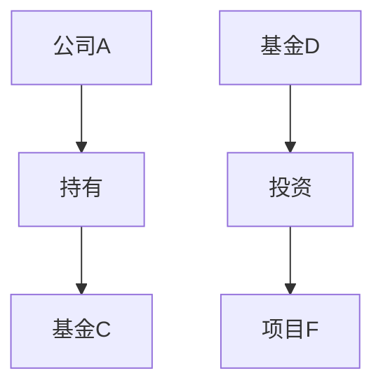
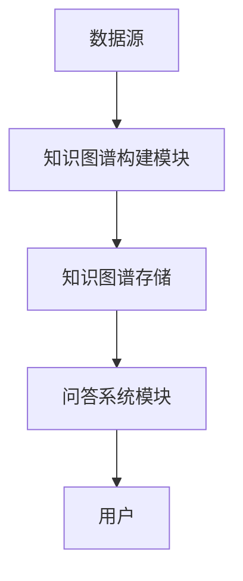

                 

# 《金融知识图谱在智能问答中的应用》

> 关键词：金融知识图谱，智能问答，自然语言处理，知识图谱构建，问答系统

> 摘要：本文深入探讨了金融知识图谱在智能问答中的应用，结合实际案例分析了金融知识图谱的构建方法，详细讲解了基于知识图谱的智能问答系统的实现原理，重点分析了金融知识图谱在智能问答中的优势与挑战，并展望了未来的发展方向。

---

# 第一部分: 金融知识图谱与智能问答的背景与基础

## 第1章: 金融知识图谱的背景与概念

### 1.1 金融知识图谱的背景

#### 1.1.1 金融领域的复杂性与知识需求
金融领域涉及股票、基金、债券、银行、保险等多种业务，且这些业务之间存在复杂的关联。金融信息的复杂性要求我们能够快速理解和处理这些信息。然而，传统的基于规则的系统难以应对金融领域的复杂性。

#### 1.1.2 知识图谱技术的兴起
知识图谱是一种以图结构形式表示知识的技术，它能够将分散的知识点连接起来，形成一个完整的知识网络。知识图谱技术的兴起为金融领域的信息处理提供了新的可能性。

#### 1.1.3 金融知识图谱的解决方法
金融知识图谱通过构建金融领域的知识网络，能够帮助我们更好地理解和处理金融信息。它通过将金融实体（如公司、股票、基金）及其关系（如持有、投资、收益）以图结构的形式表示，为智能问答系统提供了强大的知识支持。

---

### 1.2 智能问答的背景

#### 1.2.1 智能问答的发展历程
智能问答系统从早期的基于规则的系统发展到现在的基于深度学习的系统，经历了多个阶段。早期的系统依赖于人工编写规则，而现代系统则利用自然语言处理（NLP）技术，通过大规模数据训练来生成回答。

#### 1.2.2 当前智能问答的技术挑战
当前智能问答系统面临的主要挑战包括：如何准确理解用户的问题，如何有效地从知识库中检索相关信息，以及如何生成自然流畅的回答。这些问题在金融领域尤为突出，因为金融信息复杂且专业性强。

#### 1.2.3 金融领域智能问答的特殊性
金融领域的智能问答需要处理大量的专业术语和复杂的关系，因此对系统的知识储备和推理能力提出了更高的要求。

---

### 1.3 金融知识图谱与智能问答的结合

#### 1.3.1 金融知识图谱的核心概念
金融知识图谱通过构建金融领域的知识网络，将金融实体及其关系以图结构的形式表示。这使得智能问答系统能够快速理解和回答用户的问题。

#### 1.3.2 金融知识图谱在问答中的优势
金融知识图谱能够提供丰富的上下文信息，帮助智能问答系统更好地理解用户的问题，并提供更准确的答案。此外，金融知识图谱的结构化特点使其能够支持复杂的推理任务。

---

## 第2章: 金融知识图谱与智能问答的核心概念

### 2.1 金融知识图谱的核心概念

#### 2.1.1 实体与关系
实体是金融知识图谱的基本组成单位，包括公司、股票、基金等。关系则描述了实体之间的关联，例如“某公司持有某基金”。

#### 2.1.2 实体的属性特征
实体的属性特征包括名称、类型、价值等。例如，一只股票的属性可能包括股票代码、发行公司、行业等。

#### 2.1.3 实体与关系的组合方式
实体与关系的组合方式可以通过图结构表示。例如，公司A持有基金B，可以用一条边连接公司A和基金B。

---

### 2.2 智能问答的核心原理

#### 2.2.1 基于知识图谱的问答机制
基于知识图谱的问答机制通过在知识图谱中进行语义搜索，找到与用户问题最相关的答案。

#### 2.2.2 基于语义理解的问答技术
基于语义理解的问答技术利用自然语言处理技术，通过理解用户问题的语义来生成回答。

#### 2.2.3 问答系统的评估指标
问答系统的评估指标包括准确率、召回率、F值等。

---

### 2.3 金融知识图谱在智能问答中的应用

#### 2.3.1 金融知识图谱与问答的结合方式
金融知识图谱可以作为问答系统的知识库，帮助系统快速找到相关答案。

#### 2.3.2 金融知识图谱在问答中的优势
金融知识图谱能够提供丰富的上下文信息，帮助系统理解复杂的金融问题。

#### 2.3.3 金融知识图谱的可扩展性与灵活性
金融知识图谱可以根据实际需求进行扩展和调整，适用于不同的金融场景。

---

## 第3章: 金融知识图谱的核心概念与联系

### 3.1 知识图谱的实体与关系

#### 3.1.1 实体的定义与分类
实体是知识图谱中的基本组成单位，可以分为公司、股票、基金等类别。

#### 3.1.2 关系的定义与分类
关系描述了实体之间的关联，可以分为持有、投资、收益等类别。

#### 3.1.3 实体与关系的组合方式
实体与关系的组合方式可以通过图结构表示，例如公司A持有基金B。

---

### 3.2 金融知识图谱的属性特征对比

#### 3.2.1 实体的属性特征
实体的属性特征包括名称、类型、价值等。

#### 3.2.2 关系的属性特征
关系的属性特征包括关系类型、权重等。

#### 3.2.3 实体与关系的对比分析
实体与关系在属性特征上有明显的区别，但它们共同构成了知识图谱的基本结构。

---

### 3.3 ER实体关系图架构

---

## 第4章: 金融知识图谱的构建算法

### 4.1 知识图谱构建的流程

#### 4.1.1 数据采集与预处理
数据采集包括从互联网上爬取金融数据，预处理包括清洗和标准化。

#### 4.1.2 实体识别与抽取
实体识别通过自然语言处理技术从文本中提取金融实体。

#### 4.1.3 关系抽取与构建
关系抽取通过模式匹配或机器学习方法从文本中提取实体之间的关系。

---

### 4.2 实体识别的算法原理

#### 4.2.1 实体识别的流程
实体识别的流程包括分词、词性标注、命名实体识别等步骤。

#### 4.2.2 实体识别的数学模型
实体识别可以使用条件随机场（CRF）模型，其数学模型如下：
$$ P(y|x) = \frac{\exp(\sum_{i=1}^n \lambda f(x_i, y_i))}{Z} $$
其中，$\lambda$ 是模型参数，$f$ 是特征函数，$Z$ 是归一化因子。

---

### 4.3 关系抽取的算法原理

#### 4.3.1 关系抽取的流程
关系抽取的流程包括实体识别、关系模式匹配、关系抽取等步骤。

#### 4.3.2 关系抽取的数学模型
关系抽取可以使用卷积神经网络（CNN）模型，其数学模型如下：
$$ P(y|x) = \frac{\exp(\sum_{i=1}^n \theta f(x_i))}{Z} $$
其中，$\theta$ 是模型参数，$f$ 是特征函数，$Z$ 是归一化因子。

---

## 第5章: 金融知识图谱的系统架构设计

### 5.1 系统功能设计

#### 5.1.1 知识图谱构建模块
知识图谱构建模块负责从数据源中提取实体和关系，构建知识图谱。

#### 5.1.2 问答系统模块
问答系统模块负责接收用户输入，通过知识图谱进行语义搜索，生成回答。

---

### 5.2 系统架构设计

#### 5.2.1 系统架构图

---

## 第6章: 项目实战与总结

### 6.1 项目实战

#### 6.1.1 环境安装
需要安装的知识图谱构建工具包括Neo4j、Python的NLP库（如spaCy）等。

#### 6.1.2 系统核心实现
核心实现包括知识图谱构建、问答系统实现等部分。

---

### 6.2 总结与展望

#### 6.2.1 总结
本文深入探讨了金融知识图谱在智能问答中的应用，结合实际案例分析了金融知识图谱的构建方法，详细讲解了基于知识图谱的智能问答系统的实现原理。

#### 6.2.2 展望
未来，金融知识图谱在智能问答中的应用将更加广泛，随着技术的进步，金融知识图谱的构建和问答系统的实现将更加高效和智能。

---

# 作者：AI天才研究院/AI Genius Institute & 禅与计算机程序设计艺术 /Zen And The Art of Computer Programming

---

**全文完。**

