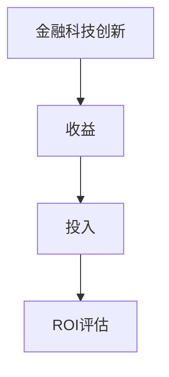
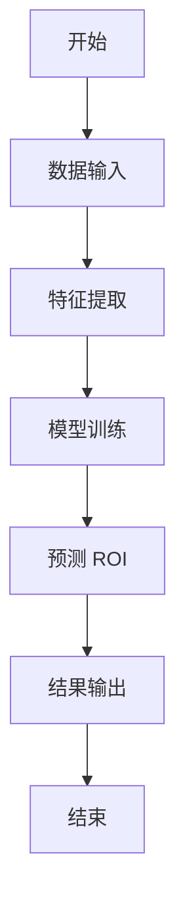
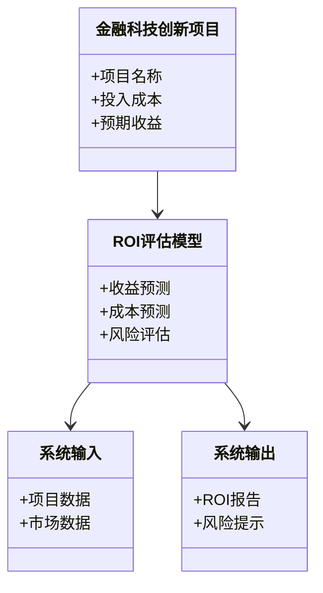
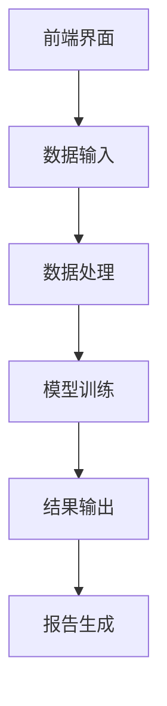
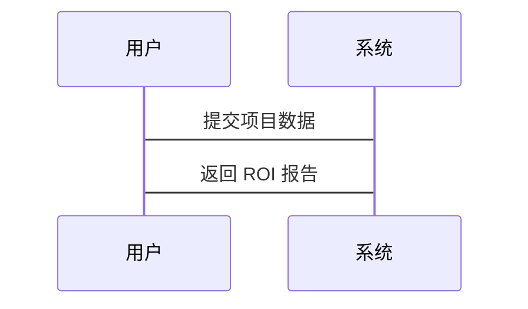

                 


# 《金融科技创新ROI评估框架》

> 关键词：金融科技创新, ROI评估, 投资回报率, 金融创新, 科技创新

> 摘要：金融科技创新正在改变传统的金融服务模式，而如何评估这些创新的 ROI（投资回报率）成为了企业和投资者关注的焦点。本文构建了一个系统化的 ROI 评估框架，从数据收集、算法原理、系统设计到项目实战，全面解析金融科技创新的 ROI 评估方法，并通过实际案例分析，为读者提供清晰的评估思路和工具。

---

# 第1章: 金融科技创新与ROI评估背景

## 1.1 金融科技创新的定义与特点
### 1.1.1 金融科技创新的定义
金融科技创新是指利用新兴技术（如人工智能、区块链、大数据等）对传统金融服务模式进行优化和创新。它不仅包括技术本身的创新，还包括服务流程、业务模式和用户体验的创新。

### 1.1.2 金融科技创新的核心特点
- **技术驱动**：依赖新兴技术实现金融服务的升级。
- **用户中心**：以用户需求为导向，提升用户体验。
- **高效性**：通过技术手段提高金融服务的效率。
- **风险可控**：在创新中注重风险管理，确保金融稳定。

### 1.1.3 金融科技创新与传统金融的区别
| 特性       | 传统金融         | 金融科技创新       |
|------------|------------------|---------------------|
| 技术基础   | 线下、人工操作    | 数字化、自动化       |
| 服务效率   | 较低             | 高                  |
| 用户体验   | 单一             | 多元化、个性化       |
| 风险管理   | 依赖人工审核     | 依赖技术手段和模型   |

---

## 1.2 ROI评估的基本概念
### 1.2.1 ROI的定义与计算公式
ROI（Return on Investment）即投资回报率，是衡量投资项目收益能力的重要指标。其计算公式为：
$$ ROI = \frac{\text{净收益}}{\text{投入成本}} \times 100\% $$

### 1.2.2 ROI评估的重要性
- **投资决策**：帮助企业判断项目的盈利能力。
- **资源配置**：优化资金分配，提高资源利用效率。
- **风险控制**：通过 ROI 评估，提前识别高风险项目。

### 1.2.3 ROI在金融科技创新中的特殊性
金融科技创新的 ROI 评估需要考虑技术门槛高、市场不确定性大、政策监管严格等因素，因此其 ROI 计算需要结合技术成本、市场风险和政策风险。

---

## 1.3 金融科技创新与ROI评估的关联
### 1.3.1 金融科技创新对ROI的影响
- **收益增加**：通过技术创新降低运营成本，提高服务效率。
- **风险降低**：利用技术手段优化风险管理，降低违约风险。
- **客户粘性增强**：通过个性化服务提升客户忠诚度。

### 1.3.2 ROI评估在金融科技创新中的作用
- **项目筛选**：通过 ROI 评估筛选出有潜力的创新项目。
- **投资决策**：为投资者提供科学的决策依据。
- **绩效考核**：用于衡量创新项目的实际效益。

### 1.3.3 金融科技创新ROI评估的边界与外延
- **边界**：仅限于评估技术创新带来的直接经济收益。
- **外延**：延伸至技术创新对社会价值、用户体验等间接影响的评估。

---

## 1.4 本章小结
本章从金融科技创新的定义、特点出发，详细介绍了 ROI 评估的基本概念及其在金融科技创新中的特殊性，最后探讨了两者之间的关联。通过这些分析，为后续 ROI 评估框架的构建奠定了基础。

---

# 第2章: 金融科技创新ROI评估的核心概念与联系

## 2.1 核心概念原理
### 2.1.1 金融科技创新的收益来源
金融科技创新带来的收益主要来源于以下方面：
1. **成本降低**：通过自动化技术减少人工成本。
2. **效率提升**：提高金融服务的响应速度。
3. **业务扩展**：通过技术创新开拓新市场。

### 2.1.2 ROI评估的关键指标
- **净收益**：总收入减去总成本。
- **投资成本**：技术创新所需的初始投入。
- **时间周期**：ROI 计算的时间跨度。

### 2.1.3 金融科技创新与 ROI 评估的动态关系
随着时间的推移，金融科技创新带来的 ROI 可能会呈现动态变化。例如，初期 ROI 可能较低，但随着技术成熟和市场认可，ROI 可能逐步上升。

---

## 2.2 核心概念属性特征对比
| 特性       | 金融科技创新         | ROI评估             |
|------------|----------------------|---------------------|
| 核心目标   | 提高金融服务效率     | 评估项目收益能力   |
| 主要驱动   | 技术创新             | 财务表现             |
| 风险因素   | 技术风险、市场风险   | 财务风险、市场风险   |

---

## 2.3 实体关系图（ER图）


---

## 2.4 本章小结
本章通过对比分析金融科技创新和 ROI 评估的核心概念，构建了两者之间的实体关系图，为后续 ROI 评估框架的构建提供了理论支持。

---

# 第3章: 金融科技创新ROI评估的算法原理

## 3.1 数据收集与处理
### 3.1.1 数据来源
- **内部数据**：企业内部的财务数据、项目成本等。
- **外部数据**：市场数据、政策数据等。

### 3.1.2 数据清洗与预处理
- **数据清洗**：去除无效数据、填补缺失值。
- **数据标准化**：统一数据格式，确保数据一致性。

### 3.1.3 数据特征提取
- **收益特征**：净收益、收入增长率。
- **成本特征**：研发投入、运营成本。
- **风险特征**：违约率、市场波动率。

---

## 3.2 算法原理


---

## 3.3 数学模型与公式
### 3.3.1 ROI计算公式
$$ ROI = \frac{\text{收益} - \text{投入}}{\text{投入}} \times 100\% $$

### 3.3.2 金融科技创新的收益模型
$$ \text{收益} = f(\text{创新度}, \text{市场接受度}, \text{成本}) $$

### 3.3.3 风险调整后的 ROI 公式
$$ \text{调整后 ROI} = ROI_{\text{原始}} - \text{风险调整因子} $$

---

## 3.4 举例说明
### 3.4.1 简单案例
假设某金融科技创新的投入为 $100$ 万元，收益为 $150$ 万元，则 ROI 为：
$$ ROI = \frac{150 - 100}{100} \times 100\% = 50\% $$

### 3.4.2 复杂案例
考虑市场风险调整后的 ROI：
$$ ROI_{\text{调整后}} = ROI_{\text{原始}} - \text{风险调整因子} $$

---

## 3.5 本章小结
本章详细介绍了金融科技创新 ROI 评估的算法原理，包括数据处理、模型训练和结果预测等步骤，并通过具体公式和案例进行了说明。

---

## 4. 系统分析与架构设计方案
### 4.1 问题场景介绍
在金融科技创新中，企业需要评估多个项目的 ROI，包括数据收集、模型训练和结果输出等环节。

### 4.2 项目介绍
本项目旨在构建一个金融科技创新 ROI 评估系统，帮助企业和投资者快速评估创新项目的收益能力。

### 4.3 系统功能设计


### 4.4 系统架构设计


### 4.5 系统接口设计
- **输入接口**：接收项目数据和市场数据。
- **输出接口**：输出 ROI 报告和风险提示。

### 4.6 系统交互


---

## 4.7 本章小结
本章通过系统分析与架构设计，展示了如何构建一个完整的金融科技创新 ROI 评估系统，包括功能设计、架构设计和交互设计。

---

## 5. 项目实战

### 5.1 环境安装
- **工具安装**：安装 Python、机器学习库（如 scikit-learn）、数据可视化工具（如 matplotlib）。
- **依赖管理**：使用虚拟环境管理项目依赖。

### 5.2 核心实现源代码
```python
# 金融科技创新ROI评估系统代码示例
class ROI_Evaluator:
    def __init__(self):
        self.model = None

    def train_model(self, data):
        # 数据预处理
        X = data.drop('label', axis=1)
        y = data['label']
        # 模型训练
        from sklearn.linear_model import LinearRegression
        self.model = LinearRegression().fit(X, y)

    def evaluate(self, project_data):
        # 预测 ROI
        prediction = self.model.predict(project_data)
        return prediction

# 使用示例
if __name__ == "__main__":
    evaluator = ROI_Evaluator()
    data = pd.DataFrame({
        '投入': [100, 200, 300],
        '收益': [150, 300, 450],
        'label': [0.5, 1.0, 1.5]
    })
    evaluator.train_model(data)
    project_data = pd.DataFrame({
        '投入': [150],
        '收益': [225]
    })
    print(evaluator.evaluate(project_data))
```

### 5.3 代码解读与分析
- **类定义**：`ROI_Evaluator` 类封装了 ROI 评估的核心功能。
- **模型训练**：使用线性回归模型训练 ROI 评估模型。
- **模型评估**：通过输入项目数据，预测 ROI 值。

### 5.4 案例分析
假设某金融科技创新项目投入为 150 万元，收益为 225 万元，预测 ROI 为：
$$ ROI = \frac{225 - 150}{150} \times 100\% = 50\% $$

### 5.5 项目小结
通过代码实现和案例分析，展示了如何将 ROI 评估框架应用于实际项目中。

---

## 6. 最佳实践 tips
- **数据质量**：确保数据的准确性和完整性。
- **模型选择**：根据具体场景选择合适的模型。
- **风险控制**：在 ROI 评估中充分考虑市场和政策风险。

---

## 7. 小结
本文构建了一个系统化的金融科技创新 ROI 评估框架，从理论到实践，全面解析了 ROI 评估的核心要素和实现方法。通过实际案例分析，验证了框架的有效性和实用性。

---

## 8. 注意事项
- ROI 评估需结合具体项目特点，避免一刀切。
- 技术创新与 ROI 评估需同步进行，确保创新的可持续性。

---

## 9. 拓展阅读
- 《金融创新与风险管理》
- 《人工智能在金融领域的应用》
- 《投资回报率评估方法》

---

# 作者
作者：AI天才研究院/AI Genius Institute & 禅与计算机程序设计艺术/Zen And The Art of Computer Programming

