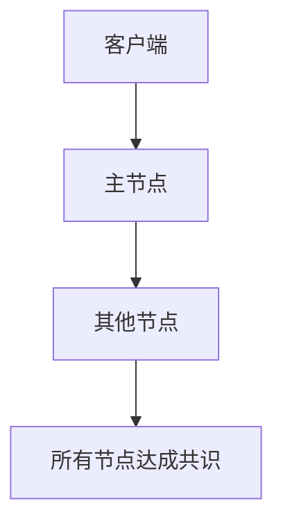
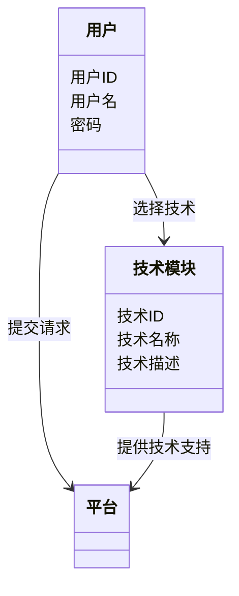
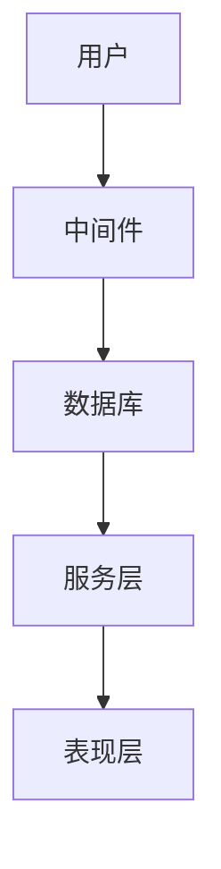
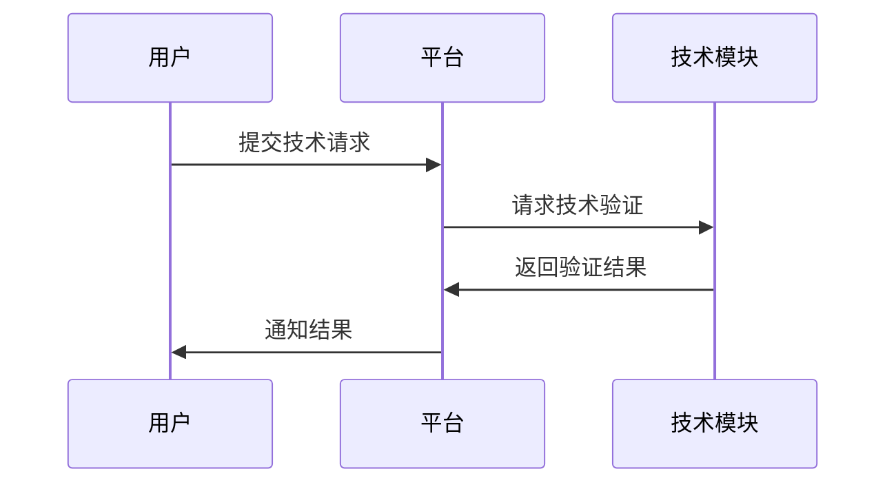

                 


# 《金融科技创新孵化平台》目录大纲

---

## 第1章: 金融科技创新的背景与趋势

### 1.1 金融科技的定义与现状

#### 1.1.1 金融科技的核心概念

金融科技（FinTech）是指利用技术手段对传统金融业务进行创新，以提高效率、降低成本、增强客户体验。其核心概念包括数字化、智能化、平台化和普惠化。

#### 1.1.2 金融科技的发展历程

1. **早期阶段（2008年之前）**：互联网金融的兴起，如第三方支付（支付宝、PayPal）。
2. **快速发展阶段（2008-2015年）**：大数据、云计算等技术的应用，推动了金融业务的线上化。
3. **成熟阶段（2015年至今）**：区块链、人工智能、物联网等新兴技术的融合，推动金融业务的智能化和自动化。

#### 1.1.3 当前金融科技的主要应用领域

- **支付与清算**：移动支付、跨境支付。
- **借贷与融资**：P2P借贷、区块链借贷。
- **投资与理财**：智能投顾、量化交易。
- **保险科技**：保险理赔自动化、保险产品创新。

### 1.2 金融科技创新的驱动力

#### 1.2.1 技术进步对金融创新的影响

- **大数据**：精准营销、风险控制。
- **人工智能**：智能投顾、自动化交易。
- **区块链**：去中心化信任、智能合约。
- **云计算**：弹性计算、数据存储。

#### 1.2.2 金融行业对技术创新的需求

- **降低成本**：自动化流程减少人工干预。
- **提高效率**：快速交易处理、实时数据分析。
- **增强客户体验**：个性化服务、便捷的操作界面。

#### 1.2.3 金融科技创新的全球趋势

- **监管沙盒**：英国、新加坡等国家的金融监管沙盒促进了金融科技创新。
- **数字化转型**：全球金融机构加速数字化转型。
- **绿色金融**：可持续金融、ESG投资。

### 1.3 金融科技创新孵化平台的重要性

#### 1.3.1 孵化平台在金融科技发展中的角色

- **创新试验场**：为新兴技术提供测试环境。
- **资源整合者**：连接技术开发者、金融机构和投资方。
- **人才培养基地**：培养金融科技人才。

#### 1.3.2 平台的核心功能与价值

- **技术验证**：快速验证新兴技术的可行性。
- **资源整合**：连接多方资源，促进合作。
- **人才培养**：提供培训和实践机会。

#### 1.3.3 孵化平台的成功案例分析

- **支付宝的孵化**：从内部孵化到全球支付平台。
- **区块链技术的应用**：从理论研究到实际应用的孵化。

### 1.4 本章小结

本章从金融科技的定义、发展历程、主要应用领域以及驱动力入手，详细介绍了金融科技创新的背景和趋势，并强调了孵化平台在其中的重要作用。

---

## 第2章: 金融科技创新孵化平台的核心概念

### 2.1 金融科技创新孵化平台的定义

#### 2.1.1 平台的基本定义

金融科技创新孵化平台是一个为金融创新提供技术支持、资源整合和试验环境的平台，旨在加速金融技术的创新和应用。

#### 2.1.2 平台的主要功能模块

- **技术验证模块**：提供技术测试和验证环境。
- **资源整合模块**：连接技术开发者、金融机构和投资方。
- **数据分析模块**：提供数据分析工具和数据集。
- **人才培养模块**：提供培训和人才培养服务。

#### 2.1.3 平台的目标用户群体

- **金融机构**：银行、保险、证券公司。
- **技术开发者**：金融科技初创公司、技术团队。
- **投资机构**：风险投资、天使投资。

### 2.2 平台的核心功能与技术架构

#### 2.2.1 核心功能模块分析

- **技术验证模块**：提供区块链、人工智能等技术的测试环境。
- **资源整合模块**：通过API接口连接多方资源。
- **数据分析模块**：提供实时数据分析和可视化工具。
- **人才培养模块**：提供在线课程和认证体系。

#### 2.2.2 技术架构的设计原则

- **模块化设计**：功能模块独立，便于扩展和维护。
- **高可用性**：确保平台的稳定性和可靠性。
- **安全性**：保护用户数据和交易安全。

#### 2.2.3 平台的可扩展性与灵活性

- **模块化设计**：功能模块可以灵活组合。
- **技术支持**：提供多种技术解决方案。

### 2.3 平台与传统金融系统的对比

#### 2.3.1 传统金融系统的局限性

- **效率低下**：人工操作多，流程繁琐。
- **成本高昂**：运营成本和交易成本高。
- **创新缓慢**：传统金融机构创新动力不足。

#### 2.3.2 金融科技创新平台的优势

- **高效性**：自动化处理，降低运营成本。
- **灵活性**：快速响应市场需求，推动创新。
- **安全性**：通过技术手段提高交易安全。

#### 2.3.3 两者的协同与融合

- **协同发展**：传统金融机构与创新平台合作，共同推动金融创新。
- **优势互补**：平台提供技术支持，金融机构提供业务场景。

### 2.4 本章小结

本章详细介绍了金融科技创新孵化平台的核心概念，包括其定义、功能模块、技术架构以及与传统金融系统的对比，强调了平台在金融创新中的重要性。

---

## 第3章: 区块链技术在金融科技创新中的应用

### 3.1 区块链技术的基本原理

#### 3.1.1 区块链的定义与特点

- **定义**：区块链是一种去中心化的分布式账本技术，通过密码学保证数据安全。
- **特点**：去中心化、不可篡改、透明性、匿名性。

#### 3.1.2 区块链的核心技术组件

- **分布式账本**：记录所有交易信息。
- **共识机制**：确保所有节点达成一致。
- **智能合约**：自动执行预设的合同条款。
- **节点网络**：通过P2P网络实现去中心化。

#### 3.1.3 区块链的共识机制

- **工作量证明（PoW）**：比特币采用的共识机制，通过计算哈希值来验证交易。
- **权益证明（PoS）**：以太坊采用的共识机制，通过持有代币的权益来决定记账权。
- **实用拜占庭容错（PBFT）**：适用于私有链的共识机制，通过投票方式达成一致。

### 3.2 区块链在金融领域的应用

#### 3.2.1 区块链在支付与清算中的应用

- **跨境支付**：通过区块链技术实现快速、低成本的跨境支付。
- **清算与结算**：减少中间环节，提高清算效率。

#### 3.2.2 区块链在供应链金融中的应用

- **应收账款融资**：通过区块链记录应收账款信息，提供融资支持。
- **供应链透明化**：通过区块链技术实现供应链的透明化和可追溯性。

#### 3.2.3 区块链在智能合约中的应用

- **自动化合同执行**：通过智能合约自动执行合同条款。
- **风险管理**：通过智能合约实现风险控制。

### 3.3 区块链技术对金融科技创新的推动

#### 3.3.1 区块链技术如何提升金融效率

- **减少中间环节**：通过去中心化减少中间机构，提高效率。
- **自动化处理**：通过智能合约实现自动化的合同执行和交易处理。

#### 3.3.2 区块链技术如何降低金融风险

- **数据不可篡改**：通过区块链技术确保数据的安全性和不可篡改性。
- **透明化**：通过区块链技术实现金融交易的透明化，降低信任风险。

#### 3.3.3 区块链技术如何促进金融创新

- **新的商业模式**：通过区块链技术创造新的商业模式和业务模式。
- **金融产品创新**：通过区块链技术实现金融产品的创新，如智能债券、智能保险等。

### 3.4 本章小结

本章详细介绍了区块链技术的基本原理及其在金融领域的具体应用，强调了区块链技术对金融科技创新的重要推动作用。

---

## 第4章: 金融科技创新孵化平台的算法原理

### 4.1 共识算法在平台中的应用

#### 4.1.1 共识算法的定义与分类

- **定义**：共识算法是一种分布式系统中达成共识的算法，确保所有节点达成一致。
- **分类**：常见的共识算法包括PoW、PoS、PBFT等。

#### 4.1.2 拜占庭容错共识算法的原理

- **工作原理**：
  1. **提案阶段**：主节点提出一个提案。
  2. **验证阶段**：其他节点验证提案的正确性。
  3. **投票阶段**：节点通过投票决定是否接受提案。
  4. **共识达成**：当超过一定比例的节点同意提案时，共识达成。

- **数学模型**：
  $$ f = \frac{2}{3}n \text{（其中n是节点总数）}$$
  通过$$ f < k \leq n - f $$确保系统中诚实节点数量超过恶意节点数量。

#### 4.1.3 共识算法在金融平台中的应用

- **支付系统**：通过PBFT共识算法实现支付的实时到账。
- **智能合约**：通过PoS共识算法实现智能合约的自动执行。

### 4.2 共识算法的实现细节

#### 4.2.1 PBFT共识算法的流程图



#### 4.2.2 共识算法的数学公式

$$ \text{共识达成条件} = 2n > f $$

其中，$$ n $$ 是节点数，$$ f $$ 是故障节点数。

### 4.3 本章小结

本章详细介绍了共识算法在金融科技创新孵化平台中的应用，重点讲解了PBFT共识算法的原理和实现细节。

---

## 第5章: 金融科技创新孵化平台的系统架构设计

### 5.1 系统功能设计

#### 5.1.1 领域模型设计



#### 5.1.2 功能模块划分

- **用户模块**：用户注册、登录、信息管理。
- **技术模块**：技术展示、技术选择、技术验证。
- **平台模块**：平台管理、资源分配、数据分析。

### 5.2 系统架构设计

#### 5.2.1 分层架构设计



#### 5.2.2 微服务架构设计

- **服务分解**：将系统功能分解为独立的服务模块。
- **服务通信**：通过API接口实现服务之间的通信。
- **服务治理**：通过服务发现、负载均衡等技术实现服务的高效管理。

### 5.3 系统接口设计

#### 5.3.1 API接口设计

- **RESTful API**：提供标准的HTTP接口。
- **WebSocket**：实现实时通信。

#### 5.3.2 接口安全设计

- **OAuth2**：实现身份认证。
- **JWT**：实现令牌验证。

### 5.4 系统交互设计

#### 5.4.1 用户与平台的交互流程



### 5.5 本章小结

本章详细介绍了金融科技创新孵化平台的系统架构设计，包括功能模块划分、分层架构设计、微服务架构设计以及系统接口和交互设计。

---

## 第6章: 项目实战——基于区块链的支付系统开发

### 6.1 环境搭建

#### 6.1.1 安装开发环境

- **操作系统**：Linux或MacOS。
- **开发工具**：VS Code或IntelliJ IDEA。
- **区块链框架**：以太坊或Hyperledger Fabric。

#### 6.1.2 安装依赖项

- **Java JDK**：1.8及以上版本。
- **Maven**：用于管理项目依赖。
- **区块链框架依赖**：根据选择的框架安装相应的依赖。

### 6.2 核心代码实现

#### 6.2.1 区块链节点的创建

```java
public class BlockchainNode {
    private String nodeName;
    private String ipAddress;
    // 其他属性
    // 构造函数、setter和getter方法
}
```

#### 6.2.2 智能合约的编写

```solidity
// SPDX-License-Identifier: MIT
pragma solidity ^0.8.0;

contract PaymentContract {
    mapping(address => uint256) public balances;
    
    function deposit() payable public {
        balances[msg.sender] += msg.value;
    }
    
    function withdraw(uint256 amount) public {
        require(balances[msg.sender] >= amount, "Insufficient balance");
        balances[msg.sender] -= amount;
        payable(msg.sender).transfer(amount);
    }
}
```

#### 6.2.3 智能合约的部署

```javascript
const contractABI = [...]; // 替换为实际ABI
const contractAddress = '0x...'; // 替换为实际地址

const contract = new ethers.Contract(contractAddress, contractABI, provider);
```

### 6.3 代码应用解读与分析

#### 6.3.1 区块链节点的交互流程

- **节点注册**：节点通过注册流程加入区块链网络。
- **交易广播**：节点广播交易信息到其他节点。
- **共识达成**：通过共识算法达成交易共识。
- **区块确认**：交易被确认为有效后，写入区块链。

#### 6.3.2 智能合约的执行流程

- **合约部署**：将智能合约部署到区块链网络。
- **合约调用**：通过API调用智能合约的方法。
- **状态更新**：合约状态根据调用结果进行更新。

### 6.4 实际案例分析

#### 6.4.1 案例背景

某支付平台希望通过区块链技术实现快速、低成本的跨境支付。

#### 6.4.2 案例实施

- **需求分析**：确定支付系统的核心功能和性能需求。
- **技术选型**：选择合适的区块链框架和共识算法。
- **系统设计**：设计系统的功能模块和架构。
- **开发实现**：编写核心代码并进行测试。
- **部署上线**：部署系统并进行用户测试。

#### 6.4.3 案例分析

- **性能优化**：通过优化共识算法和网络传输提高系统性能。
- **安全性提升**：通过加密技术和访问控制提高系统安全性。
- **用户体验改进**：通过界面优化和流程简化提升用户体验。

### 6.5 本章小结

本章通过实际案例详细讲解了基于区块链的支付系统开发，包括环境搭建、核心代码实现、系统设计和实际案例分析。

---

## 第7章: 金融科技创新孵化平台的未来发展趋势

### 7.1 新兴技术的融合

#### 7.1.1 人工智能的进一步应用

- **智能投顾**：通过AI技术提供个性化的投资建议。
- **风险管理**：通过AI技术进行风险预测和管理。

#### 7.1.2 区块链技术的升级

- **Layer 2解决方案**：通过侧链、状态通道等技术提升区块链性能。
- **可扩展性增强**：通过技术创新提高区块链的可扩展性。

#### 7.1.3 大数据技术的深化应用

- **数据挖掘**：通过大数据技术挖掘金融数据中的价值。
- **数据安全**：通过大数据技术保护金融数据的安全。

### 7.2 金融科技创新的监管与合规

#### 7.2.1 监管框架的完善

- **监管沙盒**：为金融创新提供试验环境。
- **合规要求**：确保金融创新符合相关法律法规。

#### 7.2.2 数据隐私保护

- **数据加密**：通过加密技术保护用户数据。
- **隐私计算**：通过隐私计算技术实现数据的隐私保护。

### 7.3 可持续金融与绿色金融

#### 7.3.1 可持续金融的发展

- **绿色投资**：通过金融科技手段促进绿色投资。
- **ESG评估**：通过金融科技手段实现ESG评估。

#### 7.3.2 绿色金融的技术支持

- **碳足迹追踪**：通过区块链技术实现碳足迹的追踪。
- **绿色金融产品创新**：通过金融科技手段推动绿色金融产品的创新。

### 7.4 本章小结

本章从新兴技术融合、监管与合规、可持续金融等方面探讨了金融科技创新孵化平台的未来发展趋势，强调了技术与业务的深度融合。

---

## 第8章: 结语与展望

### 8.1 本文总结

金融科技创新孵化平台作为金融科技发展的重要基础设施，通过整合技术、资源和人才，推动金融创新的快速发展。

### 8.2 未来展望

- **技术创新**：新兴技术的融合将进一步推动金融创新。
- **生态建设**：孵化平台的生态建设将更加完善。
- **全球化发展**：金融科技创新将更加全球化，推动全球金融体系的变革。

---

## 作者：AI天才研究院/AI Genius Institute & 禅与计算机程序设计艺术 /Zen And The Art of Computer Programming

