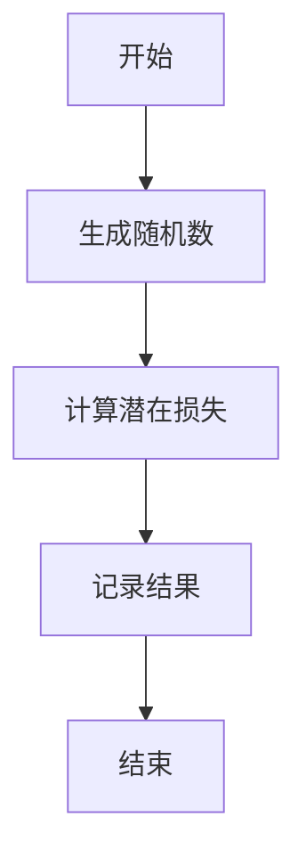
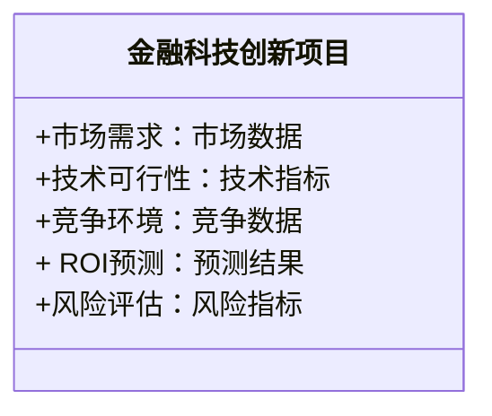
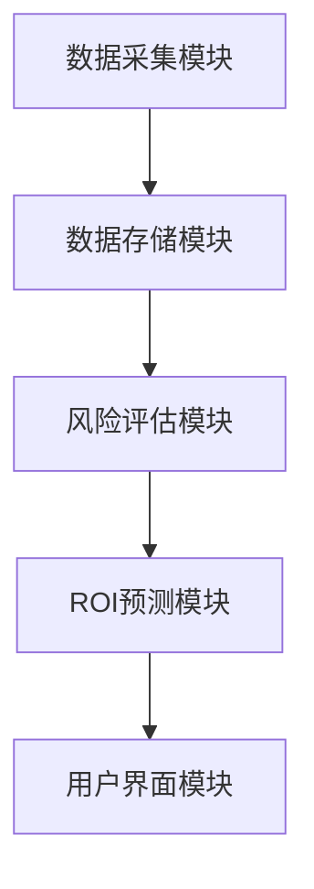
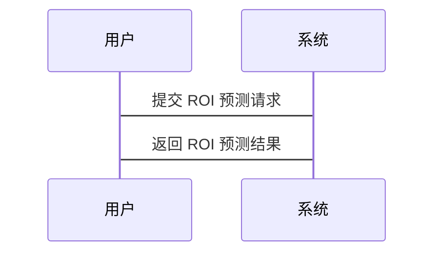

                 


# 金融科技创新项目ROI预测与风险评估

> **关键词**：金融科技创新、ROI预测、风险评估、金融科技、投资回报率、风险管理  
> 
> **摘要**：本文详细探讨了金融科技创新项目中ROI预测与风险评估的核心概念、数学模型和系统架构设计。通过分析金融科技创新项目的特征，结合实际案例，本文提出了基于回归分析和蒙特卡洛模拟的ROI预测方法，以及基于VaR和贝叶斯网络的风险评估模型。同时，本文还介绍了系统架构设计和项目实战，为读者提供了完整的理论与实践指导。

---

# 第1章: 金融科技创新项目概述

## 1.1 金融科技创新的背景与意义

### 1.1.1 金融科技发展的现状与趋势

金融科技（FinTech）是近年来全球关注的焦点，其发展呈现出以下几个显著趋势：
- **数字化**：传统金融业务逐步向线上迁移，数字支付、智能投顾等服务成为主流。
- **智能化**：人工智能技术的应用使得金融决策更加精准高效。
- **去中心化**：区块链技术的兴起推动了去中心化金融（DeFi）的发展。
- **合规化**：随着金融科技的普及，监管机构也在不断完善相关法律法规。

### 1.1.2 金融科技创新的核心驱动力

金融科技创新的核心驱动力包括：
1. **技术进步**：大数据、人工智能、区块链等技术为金融行业带来了新的可能性。
2. **市场需求**：消费者对高效、便捷金融服务的需求推动了技术创新。
3. **成本降低**：技术创新能够显著降低金融机构的运营成本。

### 1.1.3 金融科技对传统金融的颠覆性影响

金融科技对传统金融的影响主要体现在以下几个方面：
- **支付方式革新**：从现金到电子支付，再到数字货币，支付方式的演变极大地改变了人们的消费习惯。
- **融资渠道多样化**：P2P借贷、区块链融资等新型融资方式为中小企业提供了更多选择。
- **金融服务智能化**：智能投顾、机器人投顾等服务模式正在改变传统的人工服务模式。

---

## 1.2 金融科技创新项目的定义与特点

### 1.2.1 金融科技创新项目的定义

金融科技创新项目是指通过引入新技术（如人工智能、大数据、区块链等）来优化或创新金融服务模式的项目。这些项目通常具有以下特点：
- **技术驱动**：项目的核心竞争力来源于技术创新。
- **场景导向**：项目往往针对特定金融场景（如支付、借贷、投资等）提供解决方案。
- **数据驱动**：大量依赖数据进行决策和优化。

### 1.2.2 金融科技创新的核心技术特点

金融科技创新的核心技术特点包括：
1. **大数据分析**：通过对海量数据的处理和分析，提升金融服务的精准性和效率。
2. **人工智能**：利用机器学习算法进行智能决策、风险评估和客户画像构建。
3. **区块链技术**：通过区块链实现去中心化、不可篡改的交易记录，提升信任度。

### 1.2.3 金融科技创新项目的生命周期

金融科技创新项目的生命周期可以分为以下几个阶段：
1. **需求分析**：明确项目目标和用户需求。
2. **技术开发**：设计并实现技术创新方案。
3. **测试与优化**：通过测试发现并解决问题。
4. **上线与推广**：将项目推向市场并进行持续优化。

---

## 1.3 本章小结

本章从金融科技创新的背景、核心驱动力以及对传统金融的颠覆性影响入手，详细介绍了金融科技创新项目的定义和特点，以及其生命周期。通过这些内容，读者可以全面理解金融科技创新项目的本质和重要性。

---

# 第2章: ROI预测的核心概念与数学模型

## 2.1 ROI预测的理论基础

### 2.1.1 ROI预测的基本原理

投资回报率（ROI）是衡量投资项目盈利能力的重要指标，其计算公式为：
$$ ROI = \frac{\text{净收益}}{\text{初始投资}} \times 100\% $$

### 2.1.2 ROI预测的关键影响因素

影响ROI预测的关键因素包括：
1. **市场需求**：项目的市场需求越大， ROI越可能高。
2. **技术可行性**：技术实现的难度和成本直接影响 ROI。
3. **竞争环境**：市场竞争的激烈程度会影响项目的盈利能力。

### 2.1.3 ROI预测的数学模型

#### 2.1.3.1 线性回归模型

线性回归模型可以用来预测项目 ROI，其基本形式为：
$$ ROI = \beta_0 + \beta_1 x_1 + \beta_2 x_2 + \ldots + \beta_n x_n + \epsilon $$

其中，$x_i$ 是影响 ROI 的各个因素，$\beta_i$ 是回归系数，$\epsilon$ 是误差项。

#### 2.1.3.2 时间序列分析模型

时间序列分析模型适用于预测 ROI 的时间变化趋势，常用 ARIMA（自回归积分滑动平均模型）：
$$ ARIMA(p, d, q) $$

其中，$p$ 是自回归阶数，$d$ 是差分阶数，$q$ 是滑动平均阶数。

---

## 2.2 ROI预测的算法实现

### 2.2.1 算法原理

使用 Python 实现 ROI 预测的线性回归模型，步骤如下：

1. 数据预处理：清洗数据，处理缺失值和异常值。
2. 特征工程：选择影响 ROI 的关键特征。
3. 模型训练：使用最小二乘法或梯度下降法训练线性回归模型。
4. 模型评估：使用均方误差（MSE）和决定系数（R²）评估模型性能。

### 2.2.2 核心代码实现

```python
import pandas as pd
import numpy as np
from sklearn.linear_model import LinearRegression
from sklearn.metrics import mean_squared_error, r2_score

# 数据加载与预处理
data = pd.read_csv('financial_data.csv')
data = data.dropna()  # 删除缺失值
data = data[~data[' ROI'].astype(bool)]  # 删除 ROI 为 False 的行

# 特征选择与工程
X = data[['市场需求', '技术可行性', '竞争环境']]
y = data[' ROI']

# 模型训练
model = LinearRegression()
model.fit(X, y)

# 模型预测
y_pred = model.predict(X)

# 模型评估
 mse = mean_squared_error(y, y_pred)
 r2 = r2_score(y, y_pred)
print(f"均方误差：{mse}\n决定系数：{r2}")
```

---

## 2.3 本章小结

本章通过线性回归和时间序列分析模型，详细讲解了 ROI 预测的理论基础和算法实现。通过 Python 代码示例，读者可以理解如何利用这些模型进行 ROI 预测。

---

# 第3章: 风险评估的核心概念与数学模型

## 3.1 风险评估的基本原理

### 3.1.1 风险的定义与分类

风险的定义是某一事件发生的概率及其可能带来的损失。常见的风险分类包括：
1. **市场风险**：由于市场波动引起的损失。
2. **信用风险**：由于交易对手违约引起的损失。
3. **操作风险**：由于内部操作失误引起的损失。

### 3.1.2 风险评估的关键指标

常用的风险评估指标包括：
1. **风险价值（VaR）**：在一定置信水平下，可能的损失金额。
2. **预期损失（EL）**：在长期平均条件下，预期的损失金额。
3. **非预期损失（UL）**：超出预期的损失部分。

### 3.1.3 风险评估的数学模型

#### 3.1.3.1 蒙特卡洛模拟

蒙特卡洛模拟是一种通过随机采样来评估风险的方法，适用于复杂金融模型的评估。

1. **生成随机数**
2. **计算潜在损失**
3. **记录结果**
4. **分析结果**



---

## 3.2 风险评估的系统实现

### 3.2.1 系统架构设计

金融科技创新项目的系统架构设计包括以下几个部分：
1. **数据采集模块**：采集市场数据、用户行为数据等。
2. **风险评估模块**：基于 VaR 和蒙特卡洛模拟进行风险评估。
3. **ROI预测模块**：结合风险评估结果进行 ROI 预测。
4. **用户界面模块**：展示评估结果和预测报告。

### 3.2.2 核心代码实现

```python
import numpy as np

def monte_carlo_simulation(data, iterations=1000):
    np.random.seed(42)
    simulations = []
    for _ in range(iterations):
        # 生成随机数
        random_data = data + np.random.normal(0, 1, len(data))
        # 计算潜在损失
        potential_loss = np.percentile(random_data, 5)  # 5% VaR
        simulations.append(potential_loss)
    return simulations

# 示例数据
data = np.array([1, 2, 3, 4, 5])
simulations = monte_carlo_simulation(data)
print(f"潜在损失的分布：{simulations}")
```

---

## 3.3 本章小结

本章通过蒙特卡洛模拟和 VaR 指标，详细讲解了风险评估的理论基础和系统实现。通过 Python 代码示例，读者可以理解如何利用这些方法进行风险评估。

---

# 第4章: 金融科技创新项目的风险管理与ROI优化

## 4.1 风险管理策略

### 4.1.1 风险规避

通过选择低风险的项目或技术方案，降低潜在风险。

### 4.1.2 风险分担

通过合作伙伴分担风险，降低单方面风险暴露。

### 4.1.3 风险转移

通过保险、担保等方式将风险转移给第三方。

---

## 4.2 ROI优化策略

### 4.2.1 提高技术可行性

通过技术优化降低开发成本和时间，提升 ROI。

### 4.2.2 优化市场策略

通过精准营销和市场推广，提升市场需求，增加 ROI。

---

## 4.3 本章小结

本章从风险管理与 ROI 优化的角度，提出了多种策略和方法，帮助读者在实际项目中降低风险、提升 ROI。

---

# 第5章: 金融科技创新项目的系统架构设计

## 5.1 系统架构设计

### 5.1.1 领域模型设计

使用 Mermaid 类图描述领域模型：



### 5.1.2 系统架构设计

使用 Mermaid 架构图描述系统架构：



---

## 5.2 系统接口设计

### 5.2.1 REST API 设计

- **GET /api/roi_prediction**：获取 ROI 预测结果。
- **POST /api/risk_assessment**：提交风险评估请求。

### 5.2.2 交互流程设计

使用 Mermaid 序列图描述交互流程：



---

## 5.3 本章小结

本章通过系统架构设计和接口设计，详细介绍了金融科技创新项目的整体实现方案。

---

# 第6章: 项目实战——金融科技创新项目 ROI 预测与风险评估

## 6.1 环境安装与配置

### 6.1.1 安装 Python 和相关库

```bash
pip install numpy pandas scikit-learn matplotlib
```

---

## 6.2 核心代码实现

### 6.2.1 数据清洗与特征工程

```python
import pandas as pd
import numpy as np
from sklearn.linear_model import LinearRegression
from sklearn.metrics import mean_squared_error, r2_score

# 数据加载与预处理
data = pd.read_csv('financial_data.csv')
data = data.dropna()  # 删除缺失值
data = data[~data[' ROI'].astype(bool)]  # 删除 ROI 为 False 的行

# 特征选择与工程
X = data[['市场需求', '技术可行性', '竞争环境']]
y = data[' ROI']

# 模型训练
model = LinearRegression()
model.fit(X, y)

# 模型预测
y_pred = model.predict(X)

# 模型评估
 mse = mean_squared_error(y, y_pred)
 r2 = r2_score(y, y_pred)
print(f"均方误差：{mse}\n决定系数：{r2}")
```

---

## 6.3 案例分析与结果解读

### 6.3.1 案例分析

假设我们有一个金融科技创新项目，目标是预测其 ROI 并进行风险评估。

1. **数据采集**：收集市场数据、技术指标和竞争环境数据。
2. **数据清洗**：处理缺失值和异常值。
3. **特征工程**：选择影响 ROI 的关键特征。
4. **模型训练**：使用线性回归模型训练。
5. **模型预测**：预测 ROI 并评估风险。

### 6.3.2 结果解读

通过模型预测，我们得出该金融科技创新项目的 ROI 预测值为 20%，风险价值（VaR）为 5%。这意味着在 95% 的置信水平下，潜在损失为 5%。

---

## 6.4 本章小结

本章通过实际案例，详细讲解了金融科技创新项目 ROI 预测与风险评估的实现过程，帮助读者掌握实际操作方法。

---

# 第7章: 最佳实践与注意事项

## 7.1 最佳实践

### 7.1.1 数据质量管理

确保数据的准确性和完整性，数据质量直接影响模型的性能。

### 7.1.2 模型迭代优化

定期更新模型，结合最新数据和业务需求进行优化。

### 7.1.3 风险管理

建立完善的风险管理机制，定期评估和调整风险策略。

---

## 7.2 注意事项

### 7.2.1 数据隐私与合规性

确保数据处理符合相关法律法规，保护用户隐私。

### 7.2.2 模型解释性

选择具有较高解释性的模型，便于业务人员理解和决策。

---

## 7.3 拓展阅读

1. 《Python机器学习实战》
2. 《风险管理与VaR模型》
3. 《金融科技创新与监管》

---

# 第8章: 小结

## 8.1 本章总结

通过本章内容，我们详细探讨了金融科技创新项目 ROI 预测与风险评估的核心概念、数学模型和系统架构设计。通过实际案例和代码实现，读者可以掌握 ROI 预测和风险评估的具体方法。

## 8.2 未来展望

随着人工智能和大数据技术的进一步发展，金融科技创新项目 ROI 预测与风险评估将更加精准和智能化。未来的研究方向可以包括：
- 更加复杂的机器学习模型（如深度学习）的应用。
- 结合区块链技术的去中心化风险管理机制。
- 多模态数据的融合分析，提升预测精度。

---

# 作者

**作者：AI天才研究院/AI Genius Institute & 禅与计算机程序设计艺术 /Zen And The Art of Computer Programming**

