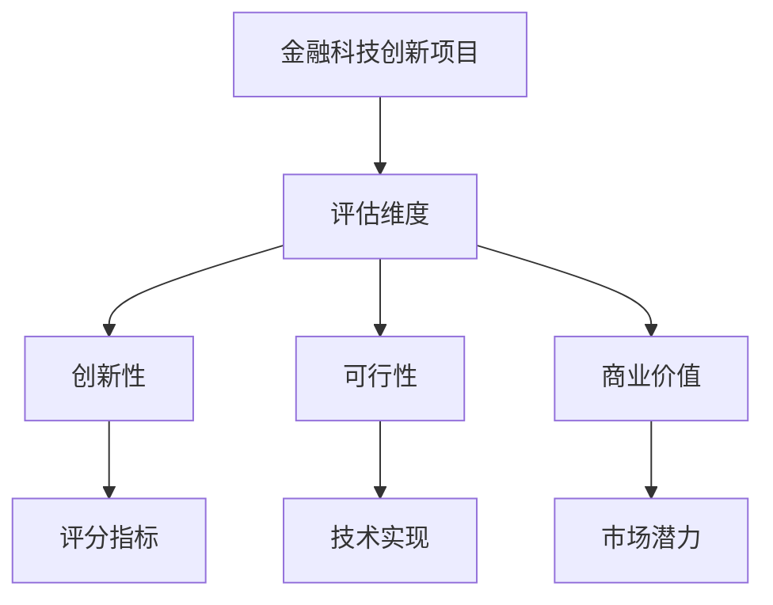
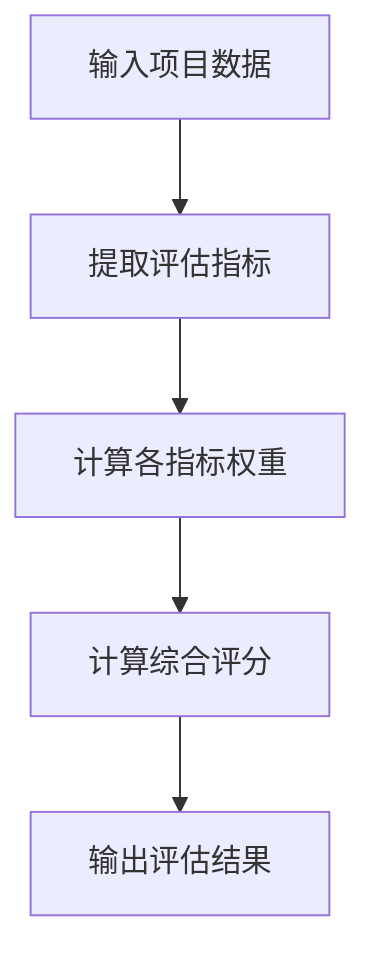
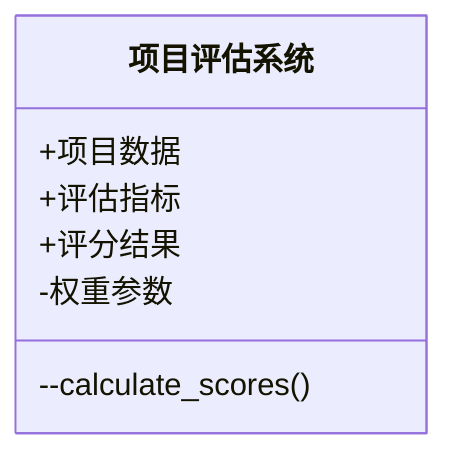
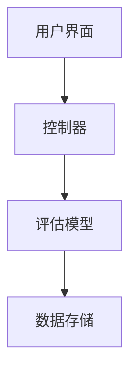
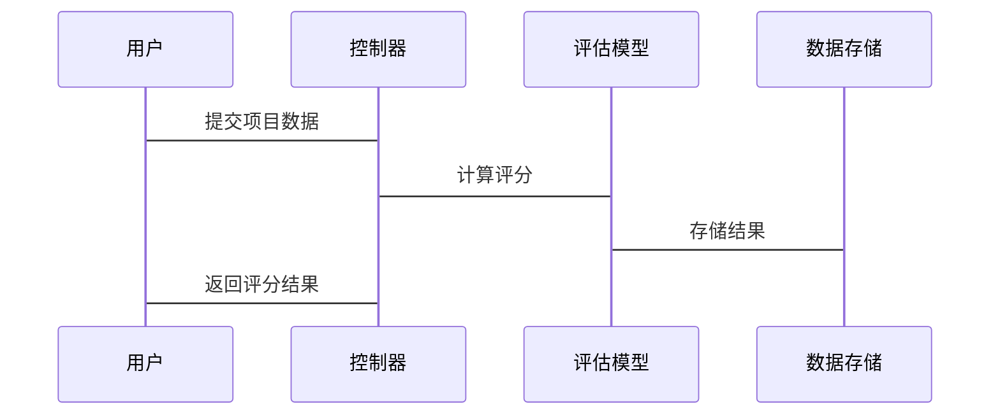

                 


# 金融科技创新项目评估框架：方法论与实践

> 关键词：金融科技创新、项目评估、评估框架、评分模型、可行性分析、商业价值、权重分配

> 摘要：本文提出了一种系统的金融科技创新项目评估框架，通过多维度分析和科学的评分模型，为项目决策提供有力支持。文章详细阐述了评估框架的构建逻辑、算法原理、系统设计和实际应用，帮助读者全面理解和应用这一框架。

---

## 第一部分：背景介绍

### 第1章：问题背景与核心概念

#### 1.1 问题背景

- **金融科技发展的现状**：全球金融科技（FinTech）正在以指数级速度发展，技术创新和数字化转型成为行业焦点。
- **金融科技创新的核心问题**：如何在众多项目中筛选出具有战略价值的创新方案？
- **项目评估的重要性**：评估框架是连接技术创新与商业成功的关键桥梁。

#### 1.2 核心概念

- **金融科技创新的定义**：利用新兴技术（如AI、区块链）改造传统金融服务流程。
- **项目评估框架的内涵**：通过多维度分析，量化评估项目的技术可行性和商业潜力。
- **框架的边界与外延**：明确评估范围，如技术可行性、市场潜力、团队能力等。

#### 1.3 核心要素组成

- **评估维度**：创新性、可行性、商业价值。
- **各维度的权重分配**：权重基于项目目标和行业特点动态调整。
- **综合评分模型**：将各维度得分加权汇总，生成最终评分。

---

## 第二部分：核心概念与联系

### 第2章：核心概念与联系

#### 2.1 评估框架的原理

- **评分模型的构建逻辑**：从多个维度提取特征，构建评分指标。
- **多维度评估的实现方法**：采用层次分析法（AHP）进行权重计算。
- **权重分配的数学基础**：基于特征重要性，采用线性加权模型。

#### 2.2 核心概念对比表

| 概念         | 创新性 | 可行性 | 商业价值 |
|--------------|--------|--------|----------|
| 属性         | 技术新 | 实现难 | 投资回报 |
| 特征         | 高/中/低 | 易/中/难 | 高/中/低 |

#### 2.3 实体关系图



---

## 第三部分：评估框架的算法原理

### 第3章：算法原理与数学模型

#### 3.1 评分模型的构建

- **模型输入**：项目数据，包括技术指标、市场数据等。
- **权重计算**：基于AHP方法，计算各维度权重。
- **综合评分**：将各维度得分加权求和，生成最终评分。

#### 3.2 数学模型

$$评分 = w_1 \times 指标1 + w_2 \times 指标2 + ... + w_n \times 指标n$$

#### 3.3 算法流程



#### 3.4 代码实现

```python
def calculate_score(project_data):
    weights = [0.4, 0.3, 0.2, 0.1]
    scores = []
    for project in project_data:
        total = 0
        for i in range(len(project['metrics'])):
            total += weights[i] * project['metrics'][i]
        scores.append(total)
    return scores
```

---

## 第四部分：系统分析与架构设计

### 第4章：系统分析与架构设计方案

#### 4.1 问题场景介绍

- **项目介绍**：构建一个金融科技创新项目的评估系统，帮助机构快速筛选优质项目。

#### 4.2 系统功能设计

- **领域模型类图**：



#### 4.3 系统架构设计



#### 4.4 系统接口设计

- **API接口**：提供RESTful API，供外部系统调用评估结果。

#### 4.5 系统交互序列图



---

## 第五部分：项目实战

### 第5章：项目实战

#### 5.1 环境安装

- **安装Python和相关库**：如NumPy、Pandas、Scikit-learn。

#### 5.2 系统核心实现源代码

```python
class ProjectAssessment:
    def __init__(self, weights=[0.4, 0.3, 0.2, 0.1]):
        self.weights = weights

    def calculate_scores(self, projects):
        scores = []
        for project in projects:
            score = sum(w * m for w, m in zip(self.weights, project['metrics']))
            scores.append(score)
        return scores
```

#### 5.3 代码应用解读与分析

- **代码功能**：计算各项目的综合评分，帮助筛选优质项目。
- **实现细节**：权重可根据具体需求调整。

#### 5.4 实际案例分析

- **案例分析**：评估三个区块链支付项目，计算其综合评分，选择最优方案。

#### 5.5 项目小结

- **成功经验**：评估框架在实际应用中的有效性。
- **改进方向**：动态调整权重，引入更多评估维度。

---

## 第六部分：最佳实践

### 第6章：最佳实践

#### 6.1 小结

- **核心内容总结**：评估框架的构建与应用方法。
- **关键点回顾**：权重分配、模型选择、数据质量。

#### 6.2 注意事项

- **权重调整**：根据行业变化及时更新权重。
- **数据来源**：确保数据的准确性和完整性。
- **模型局限**：评分模型仅供参考，需结合专家意见。

#### 6.3 拓展阅读

- 推荐书籍：《金融科技：创新与监管》。
- 推荐工具：Python机器学习库（Scikit-learn）。

---

## 作者：AI天才研究院/AI Genius Institute & 禅与计算机程序设计艺术 /Zen And The Art of Computer Programming

---

以上是一个详细的大纲，涵盖了金融科技创新项目评估框架的各个方面，从背景介绍到实际应用，内容丰富且逻辑清晰。希望这个大纲对您有所帮助！

