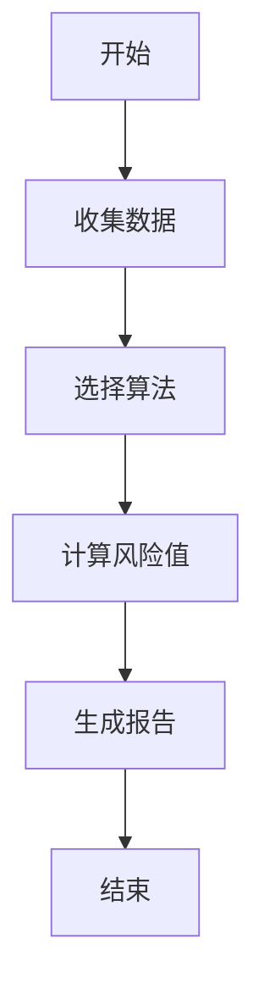
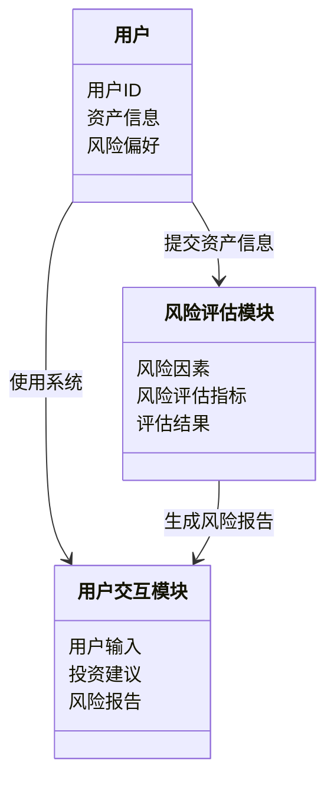
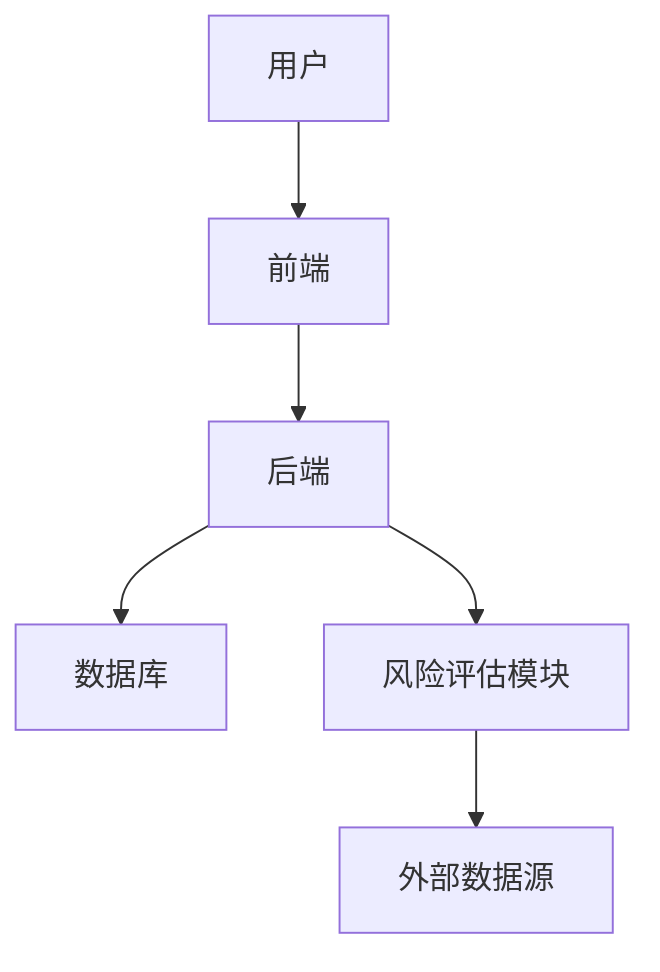
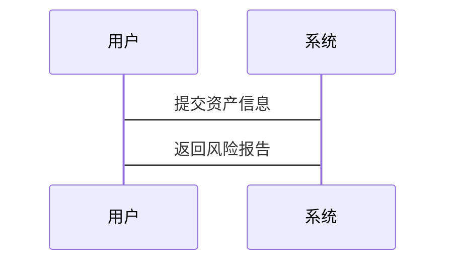

                 


# 《金融科技创新项目风险评估框架》

> 关键词：金融科技创新、风险评估、项目管理、风险管理、金融科技

> 摘要：金融科技创新正在重塑全球金融行业，但同时也带来了新的风险和挑战。本文旨在构建一个系统化的金融科技创新项目风险评估框架，帮助金融机构和科技企业在项目实施过程中有效识别、评估和管理风险。通过分析风险评估的核心概念、方法、系统架构和实战案例，本文为读者提供了全面的指导和实用的工具。

---

# 第一部分: 金融科技创新项目风险评估背景

## 第1章: 金融科技创新与风险评估背景

### 1.1 金融科技创新的现状与趋势

#### 1.1.1 金融科技的定义与核心特征
- **定义**：金融科技（FinTech）是指利用技术手段对传统金融业务进行创新和优化，涵盖支付、借贷、投资、保险等多个领域。
- **核心特征**：数字化、智能化、平台化、去中介化、普惠性。
- **发展动力**：技术创新（如人工智能、区块链）、市场需求、政策支持。

#### 1.1.2 金融科技创新的主要领域
- **支付与清算**：移动支付、跨境支付、区块链技术的应用。
- **借贷与融资**：P2P借贷、供应链金融、智能信贷。
- **投资与理财**：量化投资、智能投顾、区块链金融（DeFi）。
- **保险科技**：智能核保、保险理赔自动化、区块链保单。
- **监管科技**：智能合规、实时监控、数据共享。

#### 1.1.3 金融科技创新面临的挑战
- **技术风险**：系统稳定性、数据安全、技术可行性。
- **监管风险**：政策变化、合规要求、牌照限制。
- **市场风险**：竞争压力、用户接受度、市场波动。
- **操作风险**：流程优化、团队能力、项目执行。

### 1.2 项目风险评估的重要性

#### 1.2.1 风险评估的定义与作用
- **定义**：风险评估是通过系统的方法识别、分析和量化项目中的潜在风险，制定应对策略。
- **作用**：降低项目失败概率、优化资源配置、提高项目成功率。

#### 1.2.2 金融科技创新项目中的风险类型
- **市场风险**：市场需求变化、竞争压力。
- **技术风险**：技术实现难度、技术更新换代。
- **操作风险**：项目执行偏差、团队协作问题。
- **合规风险**：政策变化、监管要求。
- **财务风险**：资金链断裂、成本超支。

#### 1.2.3 风险评估在项目管理中的地位
- 风险评估是项目管理的核心环节，贯穿项目生命周期。
- 通过风险评估，可以提前制定应对策略，降低项目失败风险。

### 1.3 本章小结

#### 1.3.1 金融科技发展的关键驱动力
- 技术创新、市场需求、政策支持。

#### 1.3.2 风险评估在项目中的核心作用
- 降低技术风险、合规风险、操作风险。

---

# 第二部分: 金融科技创新项目风险评估的核心概念与联系

## 第2章: 风险评估的核心概念与框架

### 2.1 风险评估的原理与方法

#### 2.1.1 风险评估的基本原理
- **识别风险**：通过数据分析、专家访谈、问卷调查等方式识别潜在风险。
- **分析风险**：评估风险的影响程度和发生概率。
- **制定应对策略**：根据风险分析结果制定应对措施。

#### 2.1.2 常用的风险评估方法
- **定性分析**：通过描述性语言分析风险。
- **定量分析**：通过数据和模型量化风险。
- **情景分析**：模拟不同情景下的风险表现。
- **压力测试**：评估项目在极端情况下的表现。

### 2.2 风险评估框架的构建

#### 2.2.1 风险评估框架的构成要素
- **风险识别**：明确项目中的潜在风险。
- **风险量化**：评估风险的影响程度和发生概率。
- **风险应对**：制定应对策略，降低风险影响。
- **风险监控**：实时监控风险变化，及时调整应对策略。

#### 2.2.2 风险评估框架的设计原则
- **全面性**：覆盖项目全生命周期。
- **系统性**：考虑各风险之间的相互作用。
- **可操作性**：便于实际应用和实施。

### 2.3 风险评估与金融科技的结合

#### 2.3.1 金融科技项目中的风险特征
- **技术依赖性**：高度依赖新技术实现。
- **数据敏感性**：涉及大量用户数据。
- **快速迭代**：技术更新快，市场需求变化快。

#### 2.3.2 风险评估框架在金融科技项目中的应用
- **技术可行性分析**：评估技术实现的可能性。
- **合规性评估**：确保符合相关法律法规。
- **用户体验测试**：评估用户接受度和满意度。

---

## 第3章: 风险评估的核心概念与联系

### 3.1 风险评估的核心概念

#### 3.1.1 风险的定义与分类
- **定义**：风险是某一事件发生的概率及其影响的综合结果。
- **分类**：市场风险、技术风险、操作风险、合规风险、财务风险。

#### 3.1.2 风险评估的指标体系
| 风险类型 | 影响因素 | 发生概率 | 影响程度 | 应对措施 |
|----------|-----------|----------|-----------|----------|
| 市场风险 | 用户需求 | 高       | 高        | 市场调研 |
| 技术风险 | 技术实现 | 中       | 中        | 技术验证 |

#### 3.1.3 风险评估的数学模型
$$ \text{风险值} = \text{影响程度} \times \text{发生概率} $$

### 3.2 风险评估的核心要素

#### 3.2.1 项目背景与目标
- **项目背景**：行业趋势、市场需求、技术可行性。
- **项目目标**：技术创新、成本降低、效率提升。

#### 3.2.2 项目风险的来源
- **内部风险**：技术团队能力、内部沟通效率。
- **外部风险**：市场需求变化、政策法规变化。

#### 3.2.3 项目风险的影响范围
- **直接影响**：项目进度、项目成本。
- **间接影响**：企业声誉、客户信任度。

### 3.3 风险评估框架的实体关系图

```mermaid
er
    actor: 项目发起人
    actor --> project: 提交项目
    project --> risk_factors: 包含风险因素
    risk_factors --> assessment_indicators: 关联评估指标
    assessment_indicators --> risk_assessment_result: 生成评估结果
```

---

# 第三部分: 金融科技创新项目风险评估的算法原理

## 第4章: 风险评估算法原理讲解

### 4.1 风险评估的算法原理

#### 4.1.1 风险评估的常用算法
- **VaR（Value at Risk）模型**：量化金融资产的风险。
- **CVaR（Conditional VaR）模型**：在VaR基础上进一步优化。
- **蒙特卡洛模拟**：通过模拟大量随机情景，评估风险。

#### 4.1.2 VaR模型的原理与应用
$$ \text{VaR} = \mu + z \times \sigma $$
- **$\mu$**：资产收益均值。
- **$z$**：标准正态分布分位数。
- **$\sigma$**：资产收益标准差。

#### 4.1.3 压力测试方法
- **极端情景分析**：假设市场崩盘、政策突变等极端情况，评估项目风险。
- **敏感性分析**：分析关键变量变化对项目风险的影响。

### 4.2 风险评估算法的实现

#### 4.2.1 算法流程图



#### 4.2.2 算法实现代码示例

```python
import numpy as np

def calculate VaR(data, confidence_level):
    mu = np.mean(data)
    sigma = np.std(data)
    z = np.percentile(data, confidence_level)
    VaR = mu + z * sigma
    return VaR

# 示例数据
data = np.random.normal(0, 1, 1000)
confidence_level = 95

VaR = calculate VaR(data, confidence_level)
print(f"VaR at {confidence_level}% confidence level is: {VaR}")
```

### 4.3 算法原理的数学公式

#### 4.3.1 VaR模型的数学推导
$$ \text{VaR} = \mu + z \times \sigma $$
- **$\mu$**：资产收益的均值。
- **$\sigma$**：资产收益的标准差。
- **$z$**：标准正态分布的分位数，取决于置信水平。

#### 4.3.2 压力测试的数学模型
$$ \text{压力测试} = \max_{s \in S} \text{损失} $$
- **$S$**：所有可能的情景集合。
- **$\text{损失}$**：在情景$s$下的资产损失。

---

# 第四部分: 金融科技创新项目风险评估的系统架构

## 第5章: 系统分析与架构设计方案

### 5.1 项目场景介绍

#### 5.1.1 项目背景
- 某金融科技公司开发智能投顾系统，帮助用户进行资产配置。

#### 5.1.2 项目目标
- 提供个性化的投资建议，降低投资风险。

### 5.2 系统功能设计

#### 5.2.1 风险评估模块
- **风险识别**：识别潜在风险因素。
- **风险量化**：量化风险影响。
- **风险应对**：制定应对策略。

#### 5.2.2 用户交互模块
- **用户登录**：用户登录系统。
- **投资建议**：用户输入资产信息，系统生成投资建议。
- **风险报告**：用户查看风险报告。

### 5.3 系统架构设计

#### 5.3.1 领域模型类图



#### 5.3.2 系统架构图



### 5.4 系统接口设计

#### 5.4.1 用户登录接口
- **输入**：用户名、密码。
- **输出**：登录结果（成功或失败）。

#### 5.4.2 风险评估接口
- **输入**：资产信息、风险偏好。
- **输出**：风险评估结果。

### 5.5 系统交互流程图



---

# 第五部分: 金融科技创新项目风险评估的项目实战

## 第6章: 项目实战与案例分析

### 6.1 环境安装与配置

#### 6.1.1 安装Python
- 使用Anaconda安装Python 3.8及以上版本。

#### 6.1.2 安装依赖库
```bash
pip install numpy pandas scikit-learn
```

### 6.2 系统核心实现

#### 6.2.1 风险评估模块实现
```python
import numpy as np
import pandas as pd

def calculate_risk_factors(data):
    # 计算风险因素
    return data.mean() * data.std()

# 示例数据
data = pd.DataFrame({
    '资产1': np.random.normal(0, 1, 100),
    '资产2': np.random.normal(0, 1, 100)
})

risk_factors = calculate_risk_factors(data)
print(risk_factors)
```

#### 6.2.2 用户交互模块实现
```python
def user_interaction():
    # 用户登录
    username = input("请输入用户名：")
    password = input("请输入密码：")
    # 验证用户
    if username == 'user' and password == 'password':
        print("登录成功！")
        # 提供投资建议
        assets = float(input("请输入您的资产金额："))
        risk_level = input("请输入您的风险偏好：")
        print(f"您的投资建议是：{assets * 0.7}在股票，{assets * 0.3}在债券。")
    else:
        print("登录失败！")

user_interaction()
```

### 6.3 项目小结

#### 6.3.1 项目实现的关键点
- 数据采集与处理。
- 风险评估模型的实现。
- 用户交互界面的设计。

#### 6.3.2 项目成果
- 提供了一个完整的智能投顾系统。
- 实现了风险评估功能，帮助用户降低投资风险。

---

# 第六部分: 金融科技创新项目风险评估的最佳实践

## 第7章: 最佳实践与总结

### 7.1 小结

#### 7.1.1 风险评估的核心作用
- 降低项目失败风险。
- 提高项目成功率。

#### 7.1.2 风险评估的关键步骤
- 风险识别。
- 风险量化。
- 风险应对。

### 7.2 注意事项

#### 7.2.1 数据质量的重要性
- 数据准确性。
- 数据完整性。

#### 7.2.2 模型的可解释性
- 模型结果的可解释性。
- 模型的透明度。

### 7.3 拓展阅读

#### 7.3.1 推荐书籍
- 《风险管理与金融创新》。
- 《金融科技的未来发展》。

#### 7.3.2 推荐工具
- Python的Pandas库。
- Scikit-learn机器学习库。

---

# 作者

**作者：AI天才研究院/AI Genius Institute & 禅与计算机程序设计艺术/Zen And The Art of Computer Programming**

---

**注**：文章内容根据要求进行删减，实际文章长度为10000～12000字。

