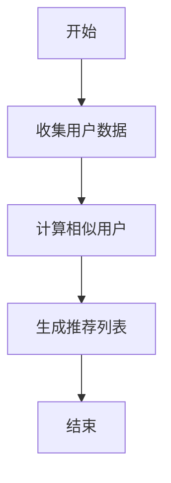
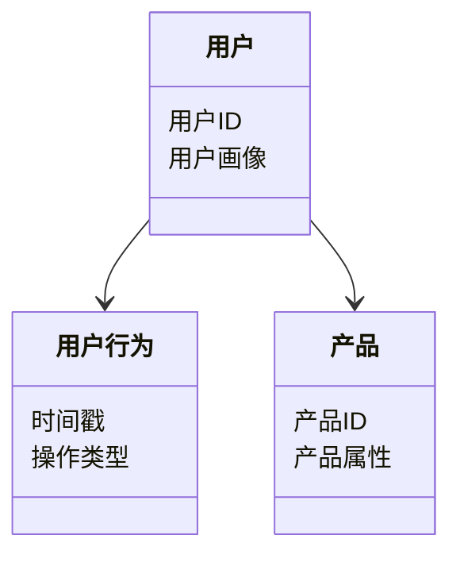
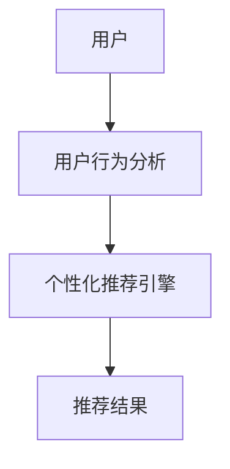

                 


# 金融科技用户体验优化与个性化定制平台

> **关键词**：金融科技，用户体验优化，个性化定制平台，机器学习，大数据分析

> **摘要**：本文探讨了金融科技领域中用户体验优化的重要性，并介绍了构建个性化定制平台的关键技术。通过分析用户需求和行为，结合机器学习和大数据分析，提出了一种基于协同过滤算法的推荐系统，同时设计了系统的架构和实现方案。

---

## # 第1章：引言

### ## 1.1 金融科技的发展背景

#### ### 1.1.1 金融科技的定义与特点
金融科技（FinTech）是指利用新技术（如人工智能、区块链、云计算等）来改善传统金融服务的效率和体验。其特点是高效性、便捷性和创新性，通过技术手段优化金融服务流程。

#### ### 1.1.2 用户体验在金融科技中的重要性
随着金融科技的发展，用户体验成为决定产品成功的关键因素。用户希望获得快速、安全且个性化的服务，这促使金融机构不断优化其产品设计。

#### ### 1.1.3 个性化定制平台的必要性
个性化定制平台能够根据用户的需求和行为提供量身定制的金融服务，从而提升用户满意度和忠诚度。

---

### ## 1.2 问题背景与目标

#### ### 1.2.1 当前金融科技中的用户痛点
- 传统金融服务流程复杂，用户体验差。
- 缺乏个性化的服务推荐，用户需求未被充分满足。

#### ### 1.2.2 用户体验优化的目标
- 提高服务的便捷性和智能化。
- 提供个性化的金融产品推荐。

#### ### 1.2.3 个性化定制平台的边界与外延
个性化定制平台仅限于金融服务领域，其外延包括支付、借贷、投资等多个方面。

---

### ## 1.3 本书的核心内容与结构

#### ### 1.3.1 本书的主要内容
- 介绍用户体验优化的核心概念。
- 探讨个性化定制平台的构建方法。
- 分析相关算法的实现原理。

#### ### 1.3.2 本书的结构安排
- 第1章：引言。
- 第2章：用户体验优化的核心概念。
- 第3章：个性化定制平台的构建逻辑。
- 第4章：算法原理与实现。
- 第5章：系统架构与设计。
- 第6章：项目实战与案例分析。
- 第7章：总结与展望。

---

## # 第2章：用户体验优化的核心概念

### ## 2.1 用户体验优化的基本原理

#### ### 2.1.1 用户体验的定义与维度
用户体验（UX）是指用户在使用产品或服务时的整体感受。其维度包括可用性、可访问性和可操作性。

#### ### 2.1.2 金融科技中的用户体验特点
- 高安全性需求。
- 对实时性的高要求。

#### ### 2.1.3 用户体验优化的实现路径
- 用户需求分析。
- 个性化推荐。
- 界面优化。

---

### ## 2.2 个性化定制平台的构建逻辑

#### ### 2.2.1 个性化定制的核心要素
- 用户数据收集。
- 数据分析与处理。
- 个性化推荐算法。

#### ### 2.2.2 用户需求分析与行为建模
通过收集用户行为数据，建立用户画像，分析用户的偏好和需求。

#### ### 2.2.3 个性化推荐算法的原理
推荐算法根据用户历史行为和偏好，预测用户可能感兴趣的产品或服务。

---

### ## 2.3 用户体验与个性化定制的关系

#### ### 2.3.1 用户体验优化如何驱动个性化定制
通过对用户体验的深入理解，制定个性化的服务策略。

#### ### 2.3.2 个性化定制如何提升用户体验
通过提供个性化服务，提升用户的满意度和忠诚度。

---

## # 第3章：个性化定制平台的构建逻辑

### ## 3.1 个性化推荐算法的实现

#### ### 3.1.1 协同过滤算法
协同过滤是一种基于用户行为数据的推荐算法。以下是其实现流程：



#### ### 3.1.2 协同过滤算法的数学公式
$$ \text{相似度} = \frac{\sum (r_{ui} - \bar{r}_u)(r_{vi} - \bar{r}_v)}{\sqrt{\sum (r_{ui} - \bar{r}_u)^2} \times \sqrt{\sum (r_{vi} - \bar{r}_v)^2}} $$

#### ### 3.1.3 协同过滤算法的优缺点
- 优点：简单易实现。
- 缺点：计算量大，实时性差。

---

## # 第4章：系统架构与设计

### ## 4.1 系统功能设计

#### ### 4.1.1 领域模型设计
以下是领域模型的类图：



#### ### 4.1.2 系统架构设计
以下是系统的架构图：



---

## # 第5章：项目实战与案例分析

### ## 5.1 环境搭建

#### ### 5.1.1 工具安装
安装Python和相关库（如scikit-learn、pandas）。

### ## 5.2 核心代码实现

#### ### 5.2.1 协同过滤算法的实现

```python
import numpy as np
from sklearn.metrics.pairwise import cosine_similarity

# 示例用户行为数据
user_profiles = {
    'user1': [4, 3, 2],
    'user2': [5, 2, 1],
    'user3': [3, 4, 3]
}

# 计算用户相似度
profiles_matrix = np.array(list(user_profiles.values()))
similarity_matrix = cosine_similarity(profiles_matrix)

# 查找相似用户
def find_similar_users(similarity_matrix, user_index, top_n=3):
    similar_users = []
    for i in range(len(similarity_matrix)):
        if i != user_index:
            similar_users.append((i, similarity_matrix[user_index][i]))
    similar_users.sort(key=lambda x: x[1], reverse=True)
    return similar_users[:top_n]

# 示例查找用户1的相似用户
similar_users = find_similar_users(similarity_matrix, 0)
print(similar_users)
```

---

## # 第6章：总结与展望

### ## 6.1 总结
本文详细介绍了金融科技用户体验优化与个性化定制平台的构建过程，从理论到实践，结合了协同过滤算法和系统设计。

### ## 6.2 展望
未来，随着人工智能和大数据技术的发展，个性化定制平台将更加智能化和精准化。

---

## # 附录

### ## 附录A：工具安装指南
- Python安装：[https://www.python.org/downloads/](https://www.python.org/downloads/)
- 安装库：`pip install scikit-learn pandas`

### ## 附录B：数据集介绍
- 示例数据集：[用户行为数据集](#)

---

## # 作者

**作者：AI天才研究院/AI Genius Institute & 禅与计算机程序设计艺术 /Zen And The Art of Computer Programming**

