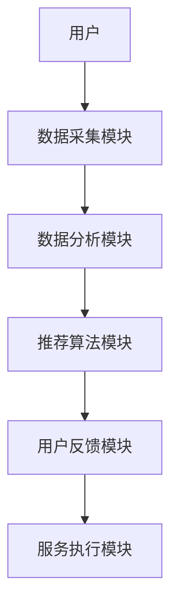
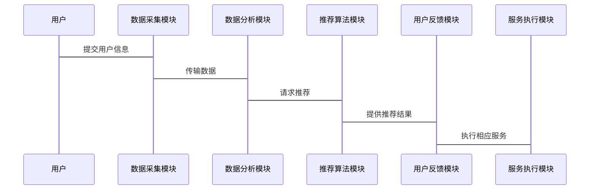

                 


# 金融科技用户体验优化平台

## 关键词：金融科技, 用户体验优化, 推荐算法, 系统架构, 人工智能

## 摘要：  
金融科技领域的用户体验优化是当前行业发展的关键方向。本文将从金融科技的背景出发，深入分析用户体验优化平台的核心概念、算法原理、系统架构设计以及项目实战。通过详细讲解推荐算法、协同过滤、系统功能模块设计等技术要点，结合实际案例，帮助读者全面理解并掌握金融科技用户体验优化平台的构建方法。

---

## 第一部分: 金融科技用户体验优化平台概述

### 第1章: 金融科技与用户体验优化平台的背景

#### 1.1 金融科技的发展现状  
金融科技（Financial Technology，简称FinTech）是指利用现代信息技术对传统金融业务进行创新和优化。随着互联网、人工智能、大数据等技术的快速发展，金融科技在全球范围内得到了广泛应用。从支付结算、借贷融资到投资管理、保险服务，金融科技正在改变传统的金融服务模式。

在金融科技的发展过程中，用户体验（User Experience，简称UX）逐渐成为决定平台成功与否的关键因素。用户期望获得高效、便捷、安全的金融服务，同时希望平台能够提供个性化的服务和精准的推荐。然而，传统金融平台的用户体验往往存在流程复杂、信息不透明、服务单一等问题，难以满足现代用户的需求。因此，构建一个高效的用户体验优化平台成为金融科技领域的重要课题。

#### 1.2 用户体验优化平台的核心概念  
用户体验优化平台的目标是通过技术手段，提升用户在使用金融服务过程中的满意度和便捷性。其核心概念包括：

1. **用户体验的定义**：用户体验是指用户在与产品或服务交互过程中所感受到的主观体验，包括功能的可用性、界面的美观性、操作的流畅性等。
2. **金融科技的组成部分**：金融科技涵盖支付、借贷、投资、保险等多个领域，每个领域都需要结合用户体验进行优化。
3. **用户体验优化平台的功能**：该平台通过数据采集、分析、建模和反馈，帮助金融机构优化产品设计、提升服务质量和用户满意度。

#### 1.3 金融科技中的用户体验问题  
在金融科技领域，用户体验问题主要体现在以下几个方面：
- **信息不透明**：用户难以理解复杂的金融产品和服务。
- **操作繁琐**：用户在完成金融交易时需要填写大量信息，流程冗长。
- **个性化不足**：金融服务缺乏针对用户需求的个性化推荐，难以满足用户的多样化需求。
- **安全性问题**：用户担心个人信息和交易数据的安全性。

#### 1.4 用户体验优化平台的价值  
用户体验优化平台通过以下几个方面为金融机构创造价值：
- **提升用户满意度**：通过优化用户体验，增加用户对平台的粘性和忠诚度。
- **提高运营效率**：自动化处理用户需求，减少人工干预，降低运营成本。
- **增强竞争力**：通过个性化推荐和服务，帮助金融机构在市场竞争中脱颖而出。

#### 1.5 本章小结  
本章从金融科技的发展现状出发，分析了用户体验优化平台的核心概念及其在金融科技中的重要性。通过阐述用户体验优化平台的功能和价值，为后续章节的深入分析奠定了基础。

---

## 第二部分: 金融科技用户体验优化的核心概念与联系

### 第2章: 核心概念与系统架构

#### 2.1 用户体验优化的核心概念  
用户体验优化的核心在于通过数据分析和算法推荐，为用户提供个性化、精准化的服务。以下是几个关键概念：

1. **用户画像**：通过收集用户的行为数据、偏好数据等，构建用户的立体画像，用于个性化推荐和服务。
2. **行为分析**：通过对用户操作行为的分析，识别用户的使用习惯和需求，从而优化产品设计。
3. **反馈机制**：通过用户反馈收集意见和建议，不断改进平台功能和服务。

#### 2.2 金融科技用户体验优化平台的系统架构  
用户体验优化平台的系统架构设计是实现功能的核心。以下是系统架构的主要组成部分：

1. **数据采集模块**：负责采集用户行为数据、交易数据等。
2. **数据分析模块**：对采集到的数据进行清洗、建模和分析，提取用户特征。
3. **推荐算法模块**：基于数据分析结果，生成个性化推荐。
4. **用户反馈模块**：收集用户的反馈信息，用于优化推荐算法和平台功能。
5. **服务执行模块**：根据推荐结果，执行相应的金融服务。

#### 2.3 用户体验优化平台的系统架构图  
以下是用户体验优化平台的系统架构图：



#### 2.4 用户体验优化平台的功能模块  
用户体验优化平台的功能模块包括：

1. **用户画像模块**：构建用户的三维画像，包括基本信息、行为特征、偏好特征等。
2. **行为分析模块**：分析用户的操作行为，识别用户的使用习惯和需求。
3. **推荐算法模块**：基于用户画像和行为分析结果，生成个性化推荐。
4. **反馈机制模块**：收集用户的反馈信息，用于优化推荐算法和平台功能。

#### 2.5 本章小结  
本章详细介绍了用户体验优化平台的核心概念和系统架构，分析了平台的主要功能模块及其相互关系。通过系统架构图，读者可以清晰地理解用户体验优化平台的实现逻辑。

---

## 第三部分: 用户体验优化的算法原理与实现

### 第3章: 用户体验优化算法的核心原理  

#### 3.1 推荐算法的核心原理  
推荐算法是用户体验优化的重要工具。以下是几种常见的推荐算法及其原理：

1. **协同过滤算法**：基于用户之间的相似性，推荐与相似用户喜欢的物品。
2. **基于内容的推荐算法**：基于物品的属性特征，推荐与用户兴趣相符的物品。
3. **混合推荐算法**：结合协同过滤和基于内容的推荐算法，提高推荐的准确性和多样性。

#### 3.2 协同过滤算法的实现步骤  
协同过滤算法的实现步骤如下：

1. **数据预处理**：收集用户的行为数据，进行数据清洗和特征提取。
2. **计算相似度**：计算用户之间的相似度，常用余弦相似度或皮尔逊相似度。
3. **生成推荐**：基于相似用户的偏好，生成推荐结果。

#### 3.3 协同过滤算法的数学模型  
协同过滤算法的数学模型如下：

$$ \text{相似度} = \frac{\sum (x_i - \bar{x})(y_i - \bar{y})}{\sqrt{\sum (x_i - \bar{x})^2} \cdot \sqrt{\sum (y_i - \bar{y})^2}} $$

其中，$\bar{x}$和$\bar{y}$分别表示用户$x$和用户$y$的平均评分。

#### 3.4 协同过滤算法的代码实现  
以下是协同过滤算法的Python代码实现：

```python
import numpy as np

def cosine_similarity(x, y):
    # 计算向量x和y的余弦相似度
    numerator = np.sum(x * y)
    denominator = np.sqrt(np.sum(x**2)) * np.sqrt(np.sum(y**2))
    return numerator / denominator

# 示例数据
user1 = [3, 2, 1]
user2 = [1, 2, 3]

similarity = cosine_similarity(user1, user2)
print("相似度为：", similarity)
```

#### 3.5 协同过滤算法的应用场景  
协同过滤算法适用于用户数量较多、数据稀疏性较高的场景，例如电影推荐、音乐推荐等。

#### 3.6 本章小结  
本章详细讲解了协同过滤算法的核心原理、实现步骤和数学模型，并通过代码示例展示了算法的应用。读者可以基于此实现个性化推荐功能。

---

## 第四章: 金融科技用户体验优化平台的系统设计与实现

### 4.1 系统功能设计  
用户体验优化平台的功能模块包括：

1. **用户画像模块**：构建用户的三维画像。
2. **行为分析模块**：分析用户的操作行为。
3. **推荐算法模块**：生成个性化推荐。
4. **用户反馈模块**：收集用户反馈信息。
5. **服务执行模块**：执行相应的金融服务。

### 4.2 系统架构设计  
用户体验优化平台的系统架构设计如下：


### 4.3 系统接口设计  
以下是用户体验优化平台的主要接口：

1. **用户信息接口**：用于获取用户的基本信息。
2. **行为数据接口**：用于获取用户的行为数据。
3. **推荐接口**：用于生成个性化推荐。
4. **反馈接口**：用于收集用户反馈信息。

### 4.4 系统交互设计  
用户体验优化平台的系统交互设计如下：



### 4.5 本章小结  
本章详细介绍了用户体验优化平台的系统功能设计、架构设计和交互设计，为后续的项目实现奠定了基础。

---

## 第五章: 项目实战——金融科技用户体验优化平台的实现

### 5.1 项目背景与目标  
本项目旨在通过构建一个金融科技用户体验优化平台，提升用户在使用金融服务过程中的体验和满意度。

### 5.2 项目环境与工具  
项目主要使用以下工具：

1. **开发环境**：Python 3.8及以上版本。
2. **开发框架**：Flask或Django。
3. **数据库**：MySQL或MongoDB。
4. **工具库**：NumPy、Pandas、Scikit-learn等。

### 5.3 项目核心代码实现  
以下是项目的核心代码实现：

```python
from flask import Flask, request, jsonify
from sklearn.metrics.pairwise import cosine_similarity

app = Flask(__name__)

# 示例用户数据
users = {
    'user1': [3, 2, 1],
    'user2': [1, 2, 3],
    'user3': [2, 3, 4]
}

@app.route('/recommend', methods=['POST'])
def recommend():
    user_id = request.json['user_id']
    user_vector = users[user_id]
    similarities = []
    for u in users:
        if u != user_id:
            other_vector = users[u]
            similarity = cosine_similarity([user_vector], [other_vector])[0][0]
            similarities.append((u, similarity))
    # 按相似度排序
    similarities.sort(key=lambda x: -x[1])
    # 返回前3个推荐
    recommendations = [u for u, _ in similarities[:3]]
    return jsonify({'recommendations': recommendations})

if __name__ == '__main__':
    app.run(debug=True)
```

### 5.4 项目测试与优化  
在项目实现过程中，需要进行以下测试：

1. **功能测试**：测试推荐算法的准确性。
2. **性能测试**：测试平台的响应时间和处理能力。
3. **安全测试**：测试平台的安全性，防止数据泄露和攻击。

### 5.5 项目小结  
本章通过一个具体的项目实战，详细讲解了金融科技用户体验优化平台的实现过程，包括环境搭建、代码实现和测试优化。读者可以基于此实现一个简单的用户体验优化平台。

---

## 第六章: 最佳实践与注意事项

### 6.1 最佳实践  
1. **数据隐私保护**：在处理用户数据时，必须遵守相关法律法规，保护用户隐私。
2. **模型优化**：定期更新推荐算法，提高推荐的准确性和多样性。
3. **用户体验测试**：通过A/B测试等方式，验证优化的效果。

### 6.2 注意事项  
1. **数据质量**：确保数据的准确性和完整性。
2. **算法选择**：根据具体场景选择合适的推荐算法。
3. **系统维护**：定期维护和优化系统，确保平台的稳定性和安全性。

### 6.3 小结  
本章总结了用户体验优化平台的最佳实践和注意事项，帮助读者在实际项目中避免常见问题，提高平台的用户体验和稳定性。

---

## 第七章: 总结与展望

### 7.1 本章总结  
本文详细介绍了金融科技用户体验优化平台的核心概念、算法原理、系统架构设计和项目实现。通过协同过滤算法和系统设计的讲解，读者可以掌握用户体验优化的基本方法和技术实现。

### 7.2 未来展望  
随着人工智能和大数据技术的不断发展，用户体验优化平台将更加智能化和个性化。未来的研究方向包括：

1. **多模态推荐算法**：结合文本、图像等多种数据源进行推荐。
2. **实时推荐系统**：实现实时响应的推荐服务。
3. **联邦学习**：在保护用户隐私的前提下，实现跨平台的数据协作。

### 7.3 本章小结  
本章总结了全文的主要内容，并展望了用户体验优化平台的未来发展方向。

---

## 参考文献  
（此处可以根据实际需要添加相关文献和参考资料）

---

## 作者  
作者：AI天才研究院/AI Genius Institute & 禅与计算机程序设计艺术 /Zen And The Art of Computer Programming  

---

感谢您的阅读！希望本文对您理解金融科技用户体验优化平台有所帮助！

