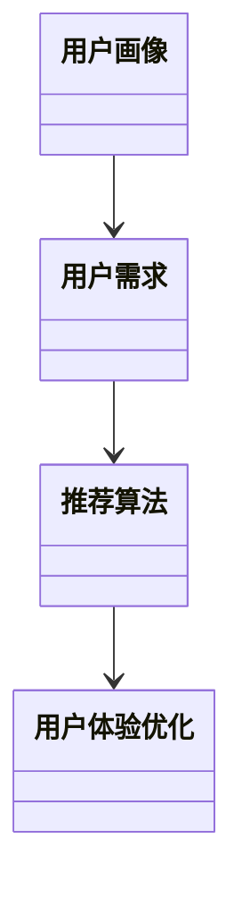
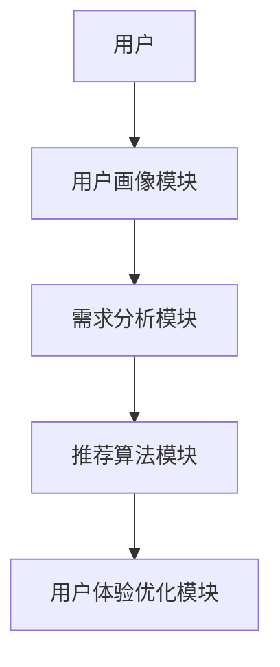

                 

# 金融科技用户体验优化系统

> 关键词：金融科技，用户体验优化，用户画像，推荐算法，系统架构，项目实战

> 摘要：本文系统地探讨了金融科技领域中用户体验优化的关键方法和技术实现。从用户需求分析到系统架构设计，结合实际案例，详细阐述了如何通过技术手段提升金融产品的用户体验。文章内容涵盖背景介绍、核心概念、算法原理、系统架构、项目实战等多个方面，为金融科技领域的从业者提供了理论与实践相结合的深度解析。

---

# 第一部分: 金融科技用户体验优化系统概述

## 第1章: 金融科技与用户体验优化概述

### 1.1 金融科技的发展背景
#### 1.1.1 金融科技的定义与特点
金融科技（FinTech）是指通过技术手段创新传统金融业务模式、提升效率并创造新的价值。其特点包括数字化、智能化、场景化和普惠性。随着互联网、大数据、人工智能等技术的快速发展，金融科技正在深刻改变金融行业的运作方式。

#### 1.1.2 用户体验在金融科技中的重要性
在金融科技领域，用户体验是决定产品成功与否的关键因素。用户通过金融产品与金融机构交互，良好的用户体验能够提升用户满意度、增加用户粘性和忠诚度，进而推动业务增长。

#### 1.1.3 金融科技与用户体验的结合
金融科技的核心目标是为用户提供更便捷、更高效、更安全的金融服务。用户体验优化是实现这一目标的重要手段，通过技术手段解决用户痛点，提升用户满意度。

---

## 第2章: 用户需求分析与画像构建

### 2.1 用户画像的构建方法
#### 2.1.1 用户画像的定义
用户画像是基于用户行为数据和特征数据构建的用户抽象模型，能够帮助企业更好地理解用户需求和行为。

#### 2.1.2 数据采集与分析方法
用户画像的构建依赖于多源数据的采集和分析，包括用户的基本信息、行为数据、交易数据等。通过数据挖掘和机器学习技术，可以提取用户的特征标签。

#### 2.1.3 用户画像的构建流程
用户画像的构建流程通常包括数据采集、数据清洗、特征提取、标签化处理和验证优化等步骤。

### 2.2 用户需求分析
#### 2.2.1 需求收集与分类
通过问卷调查、访谈、用户反馈等方式收集用户需求，并将其分类整理为功能需求和体验需求。

#### 2.2.2 需求优先级排序
根据需求的重要性和实现难度对需求进行优先级排序，确保资源的合理分配和项目的顺利推进。

#### 2.2.3 需求与用户体验的关联
用户需求是用户体验优化的核心依据，通过需求分析可以明确用户体验优化的方向和目标。

### 2.3 用户画像与需求分析的案例
#### 2.3.1 某银行APP用户画像案例
通过分析某银行APP的用户数据，构建了用户画像，包括用户年龄、职业、使用习惯等特征。

#### 2.3.2 某支付平台用户需求分析案例
通过对某支付平台用户反馈的分析，提取了用户的主要需求，并进行了优先级排序。

---

## 第3章: 以用户为中心的设计原则

### 3.1 以用户为中心的设计理念
#### 3.1.1 用户中心设计的核心思想
以用户为中心的设计理念强调从用户的角度出发，以用户需求和用户体验为核心，设计出符合用户习惯和需求的产品。

#### 3.1.2 用户体验的核心要素
用户体验的核心要素包括可用性、易用性、可理解性和一致性等。这些要素是衡量用户体验优劣的重要标准。

#### 3.1.3 用户需求与设计目标的结合
在设计过程中，需要将用户需求与设计目标结合起来，确保设计既满足用户需求，又符合业务目标。

### 3.2 金融科技中的可用性设计
#### 3.2.1 金融科技产品的可用性特点
金融科技产品的可用性设计需要考虑功能的复杂性、操作的便捷性和界面的直观性。

#### 3.2.2 金融科技中的交互设计原则
交互设计需要遵循一致性、反馈性和可学习性原则，确保用户能够轻松完成操作。

#### 3.2.3 金融科技中的视觉设计原则
视觉设计需要注重信息的清晰呈现、颜色的合理搭配和界面的美观性，以提升用户的视觉体验。

### 3.3 用户体验优化的创新设计
#### 3.3.1 金融科技中的创新设计方法
通过引入新技术和新理念，创新设计能够为用户提供更智能化、个性化的金融服务。

#### 3.3.2 用户体验优化的创新案例
案例分析了某金融科技公司通过引入人工智能技术，实现智能推荐和个性化服务的成功经验。

#### 3.3.3 创新设计与用户体验的关系
创新设计能够有效提升用户体验，但需要在创新与实用性之间找到平衡点。

---

## 第4章: 用户体验优化的算法原理

### 4.1 用户体验优化的核心算法
#### 4.1.1 基于协同过滤的推荐算法
协同过滤是一种常用推荐算法，通过分析用户的相似性，推荐用户感兴趣的内容。

#### 4.1.2 基于聚类分析的用户分群算法
聚类分析可以通过用户特征的相似性，将用户分为不同的群组，为每个群组提供个性化的服务。

#### 4.1.3 基于深度学习的用户行为预测算法
深度学习可以通过对用户行为数据的建模，预测用户的未来行为，从而实现精准的用户体验优化。

### 4.2 算法原理的数学模型
#### 4.2.1 协同过滤算法的数学模型
$$相似度计算公式：sim(i,j) = \frac{\sum_{k} (r_{ik} - \bar{r_i})(r_{jk} - \bar{r_j})}{\sqrt{\sum_{k}(r_{ik} - \bar{r_i})^2} \cdot \sqrt{\sum_{k}(r_{jk} - \bar{r_j})^2}}$$
其中，$r_{ik}$表示用户i对项目k的评分，$\bar{r_i}$表示用户i的平均评分。

---

## 第5章: 金融科技用户体验优化的系统架构设计

### 5.1 系统功能设计
#### 5.1.1 领域模型设计
领域模型是系统功能设计的核心，通过绘制Mermaid类图，可以清晰地展示系统的各个功能模块及其关系。

### 5.2 系统架构设计
#### 5.2.1 系统架构图
通过绘制Mermaid架构图，可以展示系统的整体架构和各模块之间的关系。

---

## 第6章: 项目实战与应用案例

### 6.1 项目背景与目标
#### 6.1.1 项目背景
介绍项目的背景和目标，明确用户体验优化的核心问题。

### 6.2 项目核心实现
#### 6.2.1 环境安装
列出项目所需的环境和工具，如Python、Jupyter Notebook等。

#### 6.2.2 系统核心实现
通过Python代码实现用户画像构建和推荐算法的核心功能。

#### 6.2.3 代码应用解读与分析
对实现的代码进行详细解读，分析其功能和实现原理。

### 6.3 实际案例分析
#### 6.3.1 案例背景
介绍案例的背景和目标。

#### 6.3.2 案例分析与解决
通过分析案例中的问题，提出解决方案并实施优化。

#### 6.3.3 案例总结
总结案例的实施效果和经验教训。

---

## 第7章: 总结与展望

### 7.1 总结
总结本文的主要内容和研究成果，强调用户体验优化在金融科技中的重要性。

### 7.2 展望
展望未来金融科技用户体验优化的发展方向和潜在机会。

---

# 作者：AI天才研究院/AI Genius Institute & 禅与计算机程序设计艺术 /Zen And The Art of Computer Programming

---

通过本文的系统分析与深入探讨，我们希望能够为金融科技领域的从业者提供有价值的参考和启发，推动金融科技用户体验优化的实践与创新。

