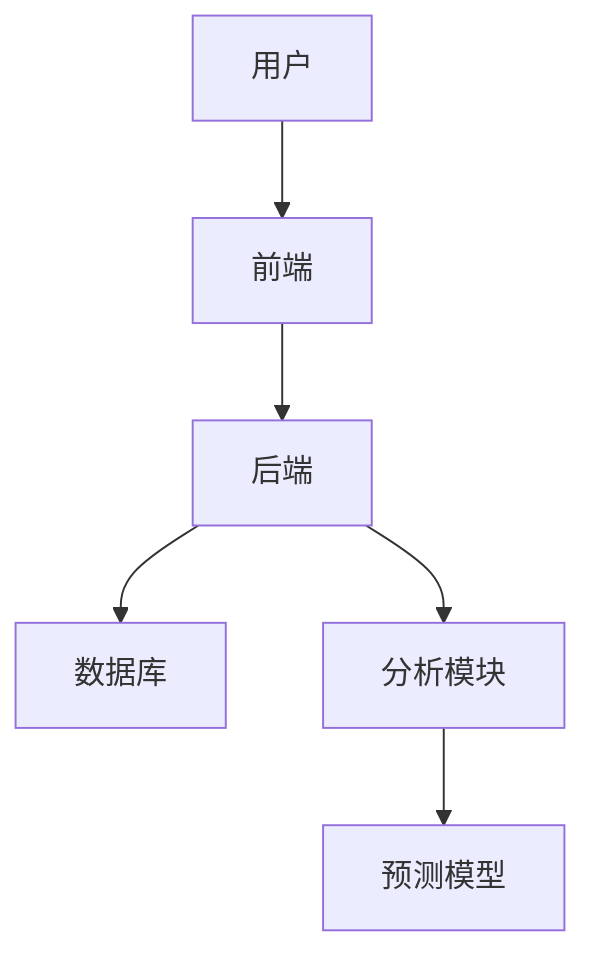

                 

# 金融科技用户行为分析与预测

> 关键词：金融科技，用户行为分析，预测模型，数据挖掘，机器学习，深度学习

> 摘要：本文深入探讨了金融科技领域中的用户行为分析与预测问题。通过分析用户行为数据，结合数据挖掘和机器学习等技术，构建用户行为分析与预测模型，为金融机构提供科学决策支持。文章从背景、方法、系统设计、项目实战到案例分析，全面解析了金融科技用户行为分析与预测的核心内容。

---

## 第一部分: 金融科技用户行为分析与预测的背景与基础

### 第1章: 金融科技概述

#### 1.1 金融科技的定义与特点
- **金融科技的定义**  
  金融科技（FinTech）是指利用现代信息技术手段对传统金融行业进行创新和变革，以提高金融服务效率、降低成本、扩大服务范围为目标的新兴领域。
- **金融科技的核心特点**  
  - 数据驱动：依赖大数据技术进行决策。
  - 技术驱动：依赖人工智能、区块链、云计算等技术。
  - 用户中心：以用户体验为核心，提供个性化服务。
- **金融科技与传统金融的区别**  
  传统金融以人工服务为主，金融科技则通过技术手段实现自动化、智能化服务。

#### 1.2 用户行为分析的定义与重要性
- **用户行为分析的定义**  
  用户行为分析是通过对用户在产品或服务中的行为数据进行收集、处理和分析，挖掘用户的偏好、习惯和行为模式的过程。
- **用户行为分析在金融科技中的重要性**  
  - 提高用户满意度：通过分析用户行为，优化产品设计和服务流程。
  - 风险控制：识别异常行为，防范金融风险。
  - 个性化服务：根据用户行为数据，提供定制化金融服务。

#### 1.3 数据采集与预处理
- **数据采集方法**  
  - 线上数据：通过网站、移动应用等渠道采集用户操作数据。
  - 线下数据：通过问卷调查、访谈等方式采集用户反馈。
- **数据预处理技术**  
  - 数据清洗：去除重复、错误或无效数据。
  - 数据转换：将数据转化为适合分析的格式。
  - 数据增强：通过数据扩展技术增加数据量。

### 第2章: 金融科技用户行为分析的核心概念

#### 2.1 用户行为分析的基本原理
- **用户行为分析的理论基础**  
  用户行为分析基于心理学、社会学和统计学理论，结合数据挖掘技术，分析用户的决策过程和行为模式。
- **用户行为分析的关键要素**  
  - 行为数据：用户的操作记录、点击流数据等。
  - 用户特征：用户的年龄、性别、收入水平等。
  - 环境因素：市场环境、政策法规等。

#### 2.2 用户行为分析与金融科技的结合
- **金融科技中的用户行为场景**  
  - 股票交易：用户对股票的买卖行为分析。
  - 网贷平台：用户借款和还款行为分析。
  - 支付平台：用户的支付行为分析。

---

## 第二部分: 数据分析与建模

### 第3章: 数据分析基础

#### 3.1 数据预处理
- **数据清洗**  
  - 去除重复数据。
  - 处理缺失值。
- **数据转换**  
  - 将分类变量转换为哑变量。
  - 对数值型数据进行标准化或归一化处理。

#### 3.2 特征工程
- **特征选择**  
  - 使用相关性分析、主成分分析等方法选择重要特征。
- **特征提取**  
  - 通过文本挖掘、图像识别等技术提取隐含特征。

### 第4章: 常见的建模方法

#### 4.1 机器学习模型
- **线性回归**  
  - 用于预测连续型变量，如用户的消费金额。
  - 公式：$$ y = \beta_0 + \beta_1 x_1 + \beta_2 x_2 + ... + \beta_n x_n $$

- **逻辑回归**  
  - 用于分类问题，如用户的违约预测。
  - 公式：$$ P(y=1|x) = \frac{e^{\beta_0 + \beta_1 x_1 + ... + \beta_n x_n}}{1 + e^{\beta_0 + \beta_1 x_1 + ... + \beta_n x_n}} $$

#### 4.2 深度学习模型
- **神经网络**  
  - 用于复杂非线性关系的建模。
  - 层次包括输入层、隐藏层和输出层。
- **长短期记忆网络（LSTM）**  
  - 用于时间序列数据的建模，如用户的交易时间序列分析。

### 第5章: 模型评估与优化

#### 5.1 评估指标
- **准确率（Accuracy）**  
  - 正确预测的比例。
- **精确率（Precision）**  
  - 预测为正类的样本中实际为正类的比例。
- **召回率（Recall）**  
  - 实际为正类的样本中被正确预测的比例。

#### 5.2 超参数优化
- **网格搜索（Grid Search）**  
  - 系统地遍历参数空间，找到最优参数组合。
- **随机搜索（Random Search）**  
  - 在参数空间中随机采样，找到最优参数组合。

---

## 第三部分: 系统设计与实现

### 第6章: 系统架构设计

#### 6.1 系统功能设计
- **用户行为数据采集模块**  
  - 收集用户的操作日志、点击流数据等。
- **数据存储模块**  
  - 使用数据库存储用户行为数据。
- **数据分析模块**  
  - 对用户行为数据进行清洗、特征提取和建模。

#### 6.2 系统架构图

### 第7章: 接口设计与实现

#### 7.1 接口设计
- **数据接口**  
  - API接口用于前后端数据交互。
- **模型接口**  
  - API接口用于调用预测模型。

#### 7.2 数据可视化
- **数据可视化工具**  
  - 使用Tableau、Power BI等工具展示用户行为分析结果。

---

## 第四部分: 项目实战

### 第8章: 项目环境搭建

#### 8.1 环境搭建
- **安装Python**  
  - 使用Anaconda安装Python环境。
- **安装依赖库**  
  - 安装pandas、numpy、scikit-learn等库。

### 第9章: 数据处理与特征工程

#### 9.1 数据获取与清洗
- **数据获取**  
  - 使用爬虫获取用户行为数据。
- **数据清洗**  
  - 去除重复数据、处理缺失值。

#### 9.2 特征工程
- **特征选择**  
  - 使用相关性分析选择重要特征。

### 第10章: 模型训练与优化

#### 10.1 模型训练
- **训练逻辑回归模型**  
  - 使用scikit-learn库训练模型。

#### 10.2 模型优化
- **网格搜索优化模型参数**  
  - 使用网格搜索找到最优参数。

---

## 第五部分: 案例分析

### 第11章: 股票交易行为分析

#### 11.1 案例背景
- **股票交易行为分析的场景**  
  - 分析用户对股票的买卖行为，预测市场趋势。

#### 11.2 数据分析与建模
- **数据预处理**  
  - 处理股票交易数据。
- **特征工程**  
  - 提取股票价格、交易量等特征。
- **模型训练**  
  - 使用LSTM模型预测股票价格。

### 第12章: 网贷平台用户行为分析

#### 12.1 案例背景
- **网贷平台用户行为分析的场景**  
  - 分析用户的借款和还款行为，评估信用风险。

#### 12.2 数据分析与建模
- **数据预处理**  
  - 处理网贷平台用户数据。
- **特征工程**  
  - 提取用户收入、信用评分等特征。
- **模型训练**  
  - 使用逻辑回归模型预测用户违约概率。

---

## 第六部分: 总结与展望

### 第13章: 总结

#### 13.1 核心内容总结
- **用户行为分析的重要性**  
  - 用户行为分析是金融科技的核心能力之一。
- **数据分析与建模的关键性**  
  - 数据分析和建模是用户行为分析的核心技术。

### 第14章: 未来展望

#### 14.1 金融科技的发展趋势
- **人工智能的进一步应用**  
  - 更多的金融机构将采用AI技术进行用户行为分析。
- **数据隐私保护**  
  - 数据隐私保护将成为金融科技的重要研究方向。

---

## 作者：AI天才研究院/AI Genius Institute & 禅与计算机程序设计艺术 /Zen And The Art of Computer Programming

