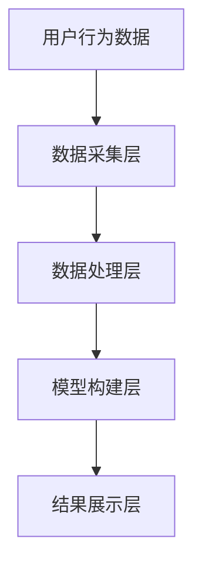

                 


# 金融科技用户行为分析平台

> 关键词：用户行为分析，金融科技，数据分析，机器学习，用户画像

> 摘要：本文将详细介绍金融科技用户行为分析平台的构建与应用，通过数据分析和机器学习技术，深入分析用户行为特征，构建用户画像，识别用户行为模式，预测用户行为趋势，为金融机构提供精准的决策支持。

---

## 第一部分：金融科技用户行为分析平台背景与概述

### 第1章：金融科技用户行为分析平台的背景与意义

#### 1.1 金融科技的发展与现状

- 1.1.1 金融科技的定义与范畴  
  - 金融科技（Fintech）是指利用技术手段优化或替代传统金融服务模式的新兴领域。  
  - 包括支付、借贷、投资、保险等多个领域。  

- 1.1.2 金融科技的演进历程  
  - 传统金融服务模式以线下为主，效率低、成本高。  
  - 互联网技术推动金融业务线上化，移动支付、在线借贷等快速普及。  
  - 当前阶段，人工智能、大数据等技术深度融入金融业务，智能化金融服务成为主流。  

- 1.1.3 当前金融科技的核心趋势  
  - 数据驱动决策：通过数据分析优化金融产品设计与服务流程。  
  - 人工智能赋能：利用机器学习技术提升金融服务的智能化水平。  
  - 用户体验优化：通过精准用户画像和行为分析，提供个性化金融服务。  

---

#### 1.2 用户行为分析在金融科技中的重要性

- 1.2.1 用户行为分析的基本概念  
  - 用户行为分析是通过对用户在系统中的操作记录进行分析，挖掘用户行为特征和行为模式的过程。  
  - 在金融科技领域，用户行为分析主要用于理解用户需求、优化用户体验、防范金融风险等。  

- 1.2.2 金融科技中用户行为分析的必要性  
  - **精准营销**：通过分析用户行为数据，识别目标客户，制定个性化营销策略。  
  - **风险控制**：通过分析用户行为特征，识别异常行为，防范金融诈骗和信用风险。  
  - **产品优化**：通过用户行为数据分析，发现产品设计中的不足，提升产品竞争力。  

- 1.2.3 用户行为分析对金融机构的价值  
  - 提高客户满意度和忠诚度。  
  - 降低运营成本，提高服务效率。  
  - 增强风险防控能力，保障金融安全。  

---

#### 1.3 本章小结

本章从金融科技的发展背景入手，分析了金融科技的定义、发展趋势及其核心特点，重点阐述了用户行为分析在金融科技中的重要性及其对金融机构的价值，为后续章节的展开奠定了基础。

---

## 第二部分：金融科技用户行为分析平台的核心概念与原理

### 第2章：用户行为分析的核心概念与联系

#### 2.1 用户行为分析的核心概念

- 2.1.1 用户画像的定义与特点  
  - 用户画像是基于用户行为数据构建的用户特征描述，能够反映用户的兴趣、需求和行为习惯。  
  - 特点：数据驱动、动态更新、精准画像。  

- 2.1.2 用户行为数据的分类与特征  
  - 行为数据分类：  
    - 操作行为数据：如点击、浏览、搜索等。  
    - 交易行为数据：如下单、支付、退款等。  
    - 用户属性数据：如年龄、性别、地理位置等。  
  - 行为数据特征：  
    - 频率：用户在特定行为上的频率高低。  
    - 时间性：用户行为的时间分布特征。  
    - 关联性：不同行为之间的关联程度。  

- 2.1.3 用户行为分析的流程与方法  
  - 数据采集：通过日志采集、API接口等方式获取用户行为数据。  
  - 数据清洗：对数据进行去重、补全、格式转换等预处理。  
  - 数据建模：利用机器学习算法对用户行为进行分类、聚类、关联规则挖掘等分析。  
  - 数据可视化：通过图表展示用户行为特征和分析结果。  

---

#### 2.2 核心概念的原理与联系

- 2.2.1 用户画像的构建原理  
  - 用户画像的构建通常包括以下步骤：  
    1. 数据采集：获取用户的基本信息、行为数据、交易数据等。  
    2. 数据处理：清洗数据，处理缺失值和异常值。  
    3. 特征提取：从数据中提取关键特征，如用户的兴趣偏好、消费习惯等。  
    4. 模型训练：利用聚类、分类等算法构建用户画像。  

- 2.2.2 用户行为数据的关联性分析  
  - 关联性分析用于发现用户行为之间的关联关系，例如：  
    - 用户购买某种金融产品后，可能还会购买相关服务。  
    - 用户在特定时间段内频繁访问某类金融产品页面，可能是潜在客户。  

- 2.2.3 用户行为分析的系统架构  
  - 系统架构包括数据采集层、数据处理层、模型构建层和结果展示层，各层之间通过数据流进行交互。  

---

#### 2.3 ER实体关系图与用户行为分析的关联

- 2.3.1 ER实体关系图的定义与作用  
  - ER图是数据库设计中常用的工具，用于描述数据之间的关系。  
  - 在用户行为分析中，ER图用于构建用户、行为、产品等实体之间的关系模型。  

- 2.3.2 用户行为分析中的ER关系建模  
  - 用户表：包含用户ID、基本信息、用户属性等。  
  - 行为表：记录用户在系统中的操作记录，如点击、浏览、搜索等。  
  - 关联表：描述用户行为与产品之间的关联关系。  

- 2.3.3 ER图在用户行为分析中的应用  
  - 通过ER图可以清晰地理解用户行为数据的结构和关系，为后续的数据分析提供基础。  

---

### 第3章：金融科技用户行为分析的核心算法与模型

#### 3.1 用户行为分析的主要算法

- 3.1.1 聚类分析算法  
  - 聚类分析用于将用户分成不同的群体，例如：  
    - K-means算法：基于距离的聚类算法，常用于用户分群。  
    - DBSCAN算法：基于密度的聚类算法，适合处理噪声数据。  

- 3.1.2 分类算法  
  - 分类算法用于预测用户的行为类别，例如：  
    - 决策树算法：适合处理分类问题，能够提供清晰的决策规则。  
    - 随机森林算法：基于决策树的集成算法，具有较高的准确率。  

- 3.1.3 关联规则挖掘  
  - 关联规则挖掘用于发现用户行为之间的关联关系，例如：  
    - Apriori算法：经典的关联规则挖掘算法，适用于频繁项集的挖掘。  
    - FP-Growth算法：基于树结构的高效关联规则挖掘算法。  

---

#### 3.2 算法原理与流程图

- 3.2.1 聚类分析的流程图  
  ```
  算法流程：数据预处理 → 特征提取 → 数据标准化 → 聚类 → 结果分析
  ```

- 3.2.2 分类算法的流程图  
  ```
  算法流程：数据预处理 → 特征提取 → 数据标准化 → 模型训练 → 模型评估 → 结果分析
  ```

- 3.2.3 关联规则挖掘的流程图  
  ```
  算法流程：数据预处理 → 特征提取 → 数据标准化 → 关联规则挖掘 → 结果分析
  ```

---

#### 3.3 算法实现与代码示例

- 3.3.1 聚类分析的Python代码实现  
  ```python
  from sklearn.cluster import KMeans
  from sklearn.preprocessing import StandardScaler
  import pandas as pd

  # 数据预处理
  data = pd.read_csv('user_behavior.csv')
  features = data[['feature1', 'feature2']]
  scaler = StandardScaler()
  features_scaled = scaler.fit_transform(features)

  # 聚类模型训练
  kmeans = KMeans(n_clusters=3, random_state=42)
  clusters = kmeans.fit_predict(features_scaled)

  # 可视化结果
  import matplotlib.pyplot as plt
  plt.scatter(features_scaled[:,0], features_scaled[:,1], c=clusters, cmap='viridis')
  plt.xlabel('Feature1')
  plt.ylabel('Feature2')
  plt.title('K-means Clustering')
  plt.show()
  ```

- 3.3.2 分类算法的Python代码实现  
  ```python
  from sklearn.tree import DecisionTreeClassifier
  from sklearn.metrics import accuracy_score

  # 数据预处理
  data = pd.read_csv('user_behavior.csv')
  X = data[['feature1', 'feature2']]
  y = data['label']

  # 模型训练
  clf = DecisionTreeClassifier(random_state=42)
  clf.fit(X, y)

  # 模型预测
  y_pred = clf.predict(X)

  # 模型评估
  accuracy = accuracy_score(y, y_pred)
  print(f'Accuracy: {accuracy:.2f}')
  ```

- 3.3.3 关联规则挖掘的Python代码实现  
  ```python
  from mlxtend.frequent_patterns import apriori

  # 数据预处理
  data = pd.read_csv('user_behavior.csv')
  data['product'] = data['product'].astype('str')

  # 关联规则挖掘
  frequent_items = apriori(data, min_support=0.2, use_colnames=True)

  print(frequent_items)
  ```

---

## 第三部分：金融科技用户行为分析平台的系统分析与架构设计

### 第4章：系统分析与功能设计

#### 4.1 问题场景介绍

- 问题背景：某金融机构希望通过分析用户行为数据，构建用户画像，优化客户服务流程，提升客户满意度。  
- 问题描述：现有系统无法有效分析用户行为数据，缺乏用户画像构建和行为预测功能。  
- 问题解决：通过构建用户行为分析平台，实现用户画像构建、行为模式识别和行为趋势预测。  

---

#### 4.2 领域模型设计

- 4.2.1 用户画像的领域模型  
  ```mermaid
  classDiagram
    class 用户画像 {
      用户ID
      基本信息
      行为特征
      用户标签
    }
    class 用户行为数据 {
      用户ID
      时间戳
      行为类型
      行为特征
    }
    用户画像 --> 用户行为数据
  ```

- 4.2.2 用户行为数据的领域模型  
  ```mermaid
  classDiagram
    class 用户行为数据 {
      用户ID
      时间戳
      行为类型
      行为特征
    }
    class 行为分析结果 {
      用户分群
      行为模式
      预测结果
    }
    用户行为数据 --> 行为分析结果
  ```

---

## 第5章：系统架构设计

#### 5.1 系统架构图



---

## 第六章：接口设计与交互流程

#### 6.1 系统接口设计

- 用户行为数据采集接口：通过API接口采集用户行为数据。  
- 行为分析结果查询接口：用户可以通过API查询行为分析结果。  
- 用户画像更新接口：支持实时更新用户画像。  

---

## 第七章：项目实战

#### 7.1 环境安装与配置

- 安装Python环境：推荐使用Anaconda或虚拟环境。  
- 安装依赖库：`scikit-learn`, `mlxtend`, `pandas`, `numpy`, `matplotlib`。  

---

#### 7.2 核心代码实现

- 数据预处理代码：  
  ```python
  import pandas as pd
  import numpy as np

  # 读取数据
  data = pd.read_csv('user_behavior.csv')

  # 处理缺失值
  data = data.dropna()

  # 数据标准化
  from sklearn.preprocessing import StandardScaler
  scaler = StandardScaler()
  features_scaled = scaler.fit_transform(data[['feature1', 'feature2']])
  ```

- 用户分群代码：  
  ```python
  from sklearn.cluster import KMeans

  # 聚类模型训练
  kmeans = KMeans(n_clusters=3, random_state=42)
  clusters = kmeans.fit_predict(features_scaled)

  # 可视化结果
  import matplotlib.pyplot as plt
  plt.scatter(features_scaled[:,0], features_scaled[:,1], c=clusters, cmap='viridis')
  plt.show()
  ```

---

## 第八章：案例分析与结果解读

#### 8.1 案例分析

- 案例背景：某银行希望通过分析用户行为数据，识别高价值客户，制定精准营销策略。  
- 数据分析：通过对用户行为数据的分析，发现高价值客户通常具有高频登录、高交易金额、多样化的产品使用习惯等特点。  
- 结果解读：通过用户分群，识别出三个客户群体：低价值客户、中价值客户和高价值客户，并制定相应的营销策略。  

---

## 第九章：总结与展望

#### 9.1 总结

本文详细介绍了金融科技用户行为分析平台的构建与应用，通过数据分析和机器学习技术，深入分析用户行为特征，构建用户画像，识别用户行为模式，预测用户行为趋势，为金融机构提供精准的决策支持。

---

#### 9.2 展望

未来，随着人工智能技术的不断进步，用户行为分析在金融科技领域的应用将更加广泛和深入。可以通过引入更复杂的机器学习模型，如深度学习和强化学习，进一步提升用户行为分析的准确性和实时性。

---

## 第十章：注意事项与拓展阅读

#### 10.1 注意事项

- 数据隐私与安全：用户行为分析涉及大量用户数据，需严格遵守数据隐私保护法规。  
- 模型可解释性：复杂的机器学习模型可能缺乏可解释性，需注重模型的可解释性设计。  
- 系统实时性：用户行为分析需要实时处理数据，需优化系统的响应速度。  

---

#### 10.2 拓展阅读

- 《Python机器学习实战》  
- 《数据挖掘导论》  
- 《金融科技的创新与发展》  

---

## 作者

作者：AI天才研究院/AI Genius Institute & 禅与计算机程序设计艺术/Zen And The Art of Computer Programming

