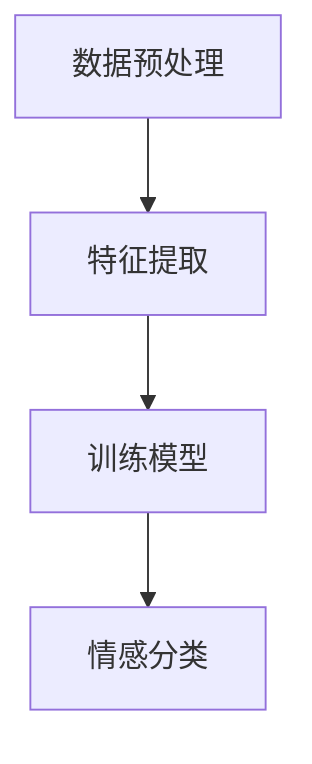
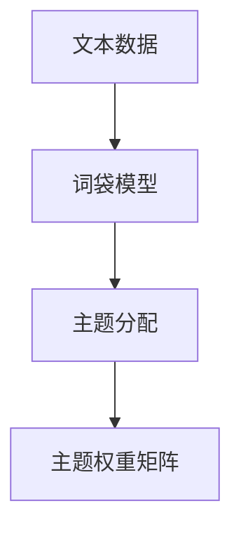
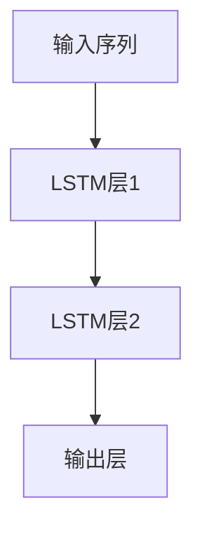
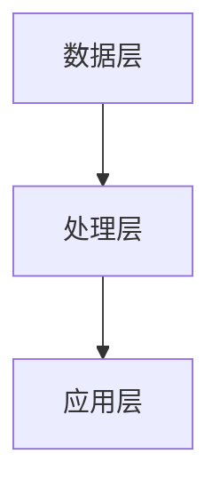

                 


# 《金融舆情分析在投资决策中的应用》

## 关键词：金融舆情分析, 投资决策, 情感分析, 主题建模, 机器学习, 大数据

## 摘要：  
金融舆情分析是一种利用自然语言处理和大数据技术，从金融市场中的海量文本数据中提取情感、主题和预测信息的方法。本文深入探讨了金融舆情分析的核心概念、算法原理、系统架构以及实际应用，展示了如何通过分析新闻、社交媒体、机构报告等信息源，帮助投资者做出更明智的决策。文章还结合实际案例，详细讲解了如何构建一个完整的舆情分析系统，并提供了从数据采集到模型训练的完整实现流程。

---

# 第1章: 金融舆情分析概述

## 1.1 金融舆情分析的定义与背景

### 1.1.1 什么是金融舆情分析  
金融舆情分析是指通过对金融市场中的文本数据（如新闻、社交媒体、论坛、机构报告等）进行采集、处理和分析，提取其中的情感倾向、主题信息和潜在风险，从而为投资决策提供支持的过程。它是自然语言处理（NLP）和大数据分析在金融领域的具体应用。

**背景与意义**  
随着金融市场信息的爆炸式增长，投资者需要从海量数据中快速获取有价值的信息。传统的方法依赖于专业的金融分析师，但这种方法效率低、成本高且难以覆盖全部信息源。金融舆情分析通过自动化技术，能够高效地处理和分析海量文本数据，帮助投资者快速捕捉市场情绪和趋势。

### 1.1.2 问题背景与描述  
金融市场中的信息源复杂多样，包括新闻、社交媒体、公司财报、分析师报告等。这些信息中蕴含着大量的情感和意图，直接或间接影响着市场走势。例如，一篇负面的新闻可能会引发股价下跌，而社交媒体上的乐观情绪可能预示着市场的上涨。然而，如何高效地从这些信息中提取有用的内容，并将其转化为可操作的决策依据，是一个亟待解决的问题。

### 1.1.3 金融舆情分析的核心目标  
- **信息提取**：从文本数据中提取情感、主题和关键词。  
- **风险预警**：通过分析负面情绪，提前发现潜在风险。  
- **投资决策支持**：基于舆情数据，辅助投资者做出更明智的决策。  

---

## 1.2 金融舆情分析的核心概念

### 1.2.1 信息源的分类与特点  
金融舆情分析的信息源主要包括以下几类：  
1. **新闻媒体**：包括财经新闻、行业报道等，通常具有较高的权威性和时效性。  
2. **社交媒体**：如Twitter、Reddit等平台上的用户评论和讨论，信息量大但质量参差不齐。  
3. **机构报告**：如券商研报、行业分析报告，通常内容专业但获取难度较大。  
4. **公司财报**：通过分析财报文本，挖掘公司经营状况和未来预期。  

### 1.2.2 数据预处理与特征提取  
在进行舆情分析之前，需要对文本数据进行预处理，主要包括：  
1. **数据清洗**：去除无关信息（如停用词、标点符号）和重复内容。  
2. **分词与词干提取**：将文本分解为词语或词干。  
3. **特征提取**：提取文本中的关键词、主题词和情感倾向。  

### 1.2.3 舆情分析的分类与应用场景  
舆情分析可以分为以下几类：  
1. **情感分析**：判断文本的情感倾向（如正面、负面、中性）。  
2. **主题建模**：识别文本中的主要主题和关键词。  
3. **舆情预测**：基于历史数据，预测未来的市场走势。  

**应用场景**：  
- 投资组合管理：根据市场情绪调整投资策略。  
- 风险管理：识别潜在风险，提前采取应对措施。  
- 市场研究：分析行业趋势，挖掘投资机会。  

---

## 1.3 金融舆情分析的流程与方法

### 1.3.1 数据采集与清洗  
数据采集是舆情分析的第一步，通常需要从多个来源获取文本数据。以下是一个简单的数据采集流程：  
1. **数据源选择**：确定采集的平台和关键词。  
2. **爬虫开发**：使用爬虫技术从目标平台获取数据。  
3. **数据清洗**：去除无效数据，如重复内容、非中文/英文文本等。  

### 1.3.2 情感分析与主题挖掘  
情感分析是舆情分析的核心任务之一。常用的情感分析方法包括：  
- **基于规则的方法**：通过预设的关键词和规则判断情感倾向。  
- **基于机器学习的方法**：使用训练好的模型进行分类。  
- **基于深度学习的方法**：如LSTM和BERT模型，能够更好地捕捉上下文信息。  

主题建模则是通过分析文本数据，提取主要主题和关键词。常用的方法包括：  
- **TF-IDF**：基于词频-逆文档频率，提取关键词。  
- **LDA（Latent Dirichlet Allocation）**：主题模型，能够发现隐藏的主题结构。  

### 1.3.3 舆情预测与风险评估  
舆情预测通常是基于时间序列分析的方法，如ARIMA（自回归积分滑动平均模型）。通过分析历史舆情数据，预测未来的市场走势。  

风险评估则是通过综合分析舆情数据和市场数据，识别潜在风险点。例如，当某公司的负面舆情突然增加时，可能预示着其股价即将下跌。

---

## 1.4 本章小结  
本章详细介绍了金融舆情分析的定义、背景、核心概念和流程方法。通过分析信息源、数据预处理和情感分析等技术，我们可以从海量文本数据中提取有价值的信息，为投资决策提供支持。

---

# 第2章: 舆情分析的算法原理

## 2.1 情感分析算法

### 2.1.1 基于机器学习的情感分析  
**流程图：**  


**数学模型：**  
情感分类通常使用支持向量机（SVM）或随机森林（Random Forest）模型。  
$$ \text{SVM目标函数：} \quad \text{minimize} \quad \frac{1}{2} \|\mathbf{w}\|^2 + C \sum_{i=1}^n \xi_i $$
其中，$\mathbf{w}$ 是权重向量，$C$ 是惩罚系数，$\xi_i$ 是 slack 变量。  

### 2.1.2 基于深度学习的情感分析  
深度学习模型（如BERT）能够更好地捕捉文本的语义信息。  
$$ \text{BERT输入：} \quad \text{[CLS] } + \text{句子} + \text{[SEP]} $$
$$ \text{输出：} \quad \text{情感类别概率分布} $$

---

## 2.2 主题建模与文本挖掘

### 2.2.1 主题模型（如LDA）  
**LDA流程图：**  


### 2.2.2 文本挖掘的关键技术  
文本挖掘技术包括：  
1. **关键词提取**：使用TF-IDF或lsa方法。  
2. **实体识别**：识别文本中的公司名称、人名等。  

---

## 2.3 舆情预测与时间序列分析

### 2.3.1 时间序列分析的基本概念  
时间序列分析用于分析数据的时序特性，常用模型包括ARIMA、LSTM等。  

### 2.3.2 舆情预测模型  
**LSTM流程图：**  


### 2.3.3 数学公式  
$$ \text{ARIMA模型：} \quad y_t = \phi_1 y_{t-1} + \phi_2 y_{t-2} + \epsilon_t $$  

---

## 2.4 本章小结  
本章详细讲解了情感分析、主题建模和舆情预测的算法原理，为后续的系统设计和实现奠定了理论基础。

---

# 第3章: 金融舆情分析系统的架构设计

## 3.1 系统需求分析

### 3.1.1 系统目标  
构建一个能够实时采集、处理和分析金融舆情数据的系统，为投资决策提供支持。  

### 3.1.2 功能需求  
1. 数据采集模块：支持多平台数据采集。  
2. 数据处理模块：包括分词、情感分析和主题建模。  
3. 可视化模块：以图表形式展示分析结果。  

---

## 3.2 系统架构设计

### 3.2.1 分层架构  
系统架构分为数据层、处理层和应用层。  


### 3.2.2 模块化设计  
- 数据采集模块：负责从社交媒体、新闻网站等平台获取数据。  
- 数据处理模块：包括分词、情感分析和主题建模。  
- 数据存储模块：将处理后的数据存储到数据库中。  
- 可视化模块：以图表形式展示分析结果。  

---

## 3.3 数据流与信息处理流程

### 3.3.1 数据采集与预处理  
1. 使用爬虫技术采集数据。  
2. 对数据进行清洗和分词。  

### 3.3.2 数据存储与管理  
将处理后的数据存储到数据库中，如MySQL或MongoDB。  

---

## 3.4 本章小结  
本章详细设计了金融舆情分析系统的架构，包括功能模块、数据流和系统交互流程。

---

# 第4章: 项目实战

## 4.1 环境安装与配置

### 4.1.1 安装必要的库  
```bash
pip install requests
pip install beautifulsoup4
pip install nltk
pip install gensim
pip install pylda
```

---

## 4.2 系统核心实现

### 4.2.1 数据采集代码  
```python
import requests
from bs4 import BeautifulSoup

def fetch_data(url):
    response = requests.get(url)
    soup = BeautifulSoup(response.text, 'html.parser')
    articles = soup.find_all('article')
    return [article.text for article in articles]
```

### 4.2.2 情感分析代码  
```python
from nltk.sentiment import SentimentIntensityAnalyzer

sia = SentimentIntensityAnalyzer()
text = "The company's revenue increased significantly."
scores = sia.polarity_scores(text)
print(scores)
```

### 4.2.3 主题建模代码  
```python
from gensim import corpora, models

texts = [...]  # 文本数据
dictionary = corpora.Dictionary(texts)
corpus = [dictionary.doc2bow(text) for text in texts]
lda = models.LdaModel(corpus, num_topics=5, id2word=dictionary)
topics = lda.print_topics(5)
print(topics)
```

---

## 4.3 项目小结  
本章通过实际案例，详细讲解了金融舆情分析系统的实现过程，包括数据采集、情感分析和主题建模。

---

# 第5章: 总结与最佳实践

## 5.1 总结  
本文详细探讨了金融舆情分析的核心概念、算法原理和系统架构，并结合实际案例展示了如何构建一个完整的舆情分析系统。通过分析新闻、社交媒体和机构报告等信息源，投资者可以更好地理解市场情绪，做出更明智的投资决策。

## 5.2 最佳实践  
1. **数据质量**：确保数据来源可靠，避免噪声干扰。  
2. **模型可解释性**：选择合适的模型，并确保结果能够被解释。  
3. **实时性**：舆情分析需要实时性，以便及时捕捉市场变化。  

## 5.3 注意事项  
- 舆情分析结果仅供参考，需结合其他信息综合判断。  
- 数据隐私和安全问题需严格遵守相关法律法规。  

## 5.4 拓展阅读  
- 《自然语言处理实战：基于Python的语料库分析》  
- 《金融数据分析：从入门到精通》  

---

# 作者：AI天才研究院 & 禅与计算机程序设计艺术

---

**本文通过系统性地分析金融舆情分析的核心技术与应用，为投资者提供了从理论到实践的全面指导，帮助他们在复杂多变的金融市场中做出更明智的决策。**

