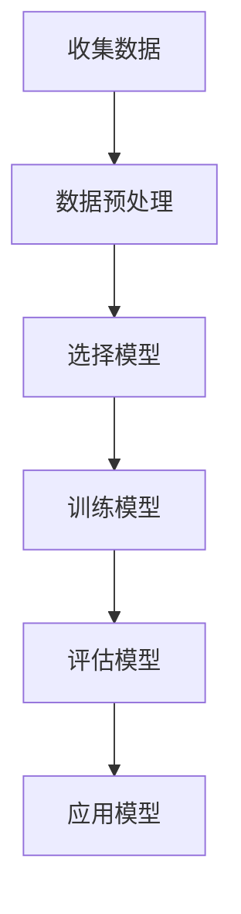
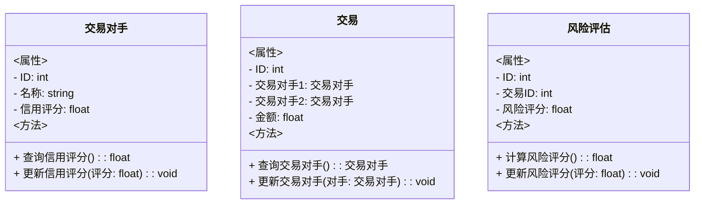

                 


# 《金融衍生品交易对手风险评估》

## 关键词：金融衍生品，交易对手风险，信用风险，结算风险，风险评估

## 摘要：  
本文系统地介绍金融衍生品交易中的交易对手风险，分析其核心概念、评估方法和系统设计。通过信用评分模型和VaR模型的详细讲解，结合实际案例，探讨如何有效评估交易对手风险，并设计相应的风险控制系统。文章最后总结了最佳实践和注意事项，为金融从业者提供实用的指导。

---

## 目录

1. **金融衍生品交易对手风险概述**  
   1.1 金融衍生品的基本概念  
   1.2 交易对手风险的背景与挑战  
   1.3 交易对手风险评估的目标与意义  

2. **交易对手风险的核心概念与联系**  
   2.1 交易对手信用风险与结算风险  
   2.2 核心要素对比与ER图  

3. **交易对手风险评估的算法原理**  
   3.1 信用评分模型的原理与实现  
   3.2 VaR模型的原理与应用  
   3.3 算法实现与代码解读  

4. **交易对手风险评估的系统分析与架构设计**  
   4.1 问题场景描述  
   4.2 系统功能设计与领域模型类图  
   4.3 系统架构图与接口设计  

5. **交易对手风险评估的项目实战**  
   5.1 环境安装与数据准备  
   5.2 核心代码实现与解读  
   5.3 实际案例分析  

6. **总结与最佳实践**  
   6.1 文章总结  
   6.2 最佳实践 tips  
   6.3 注意事项与拓展阅读  

---

## 正文

### 1. 金融衍生品交易对手风险概述

#### 1.1 金融衍生品的基本概念

金融衍生品是基于基础金融资产（如股票、债券、货币等）的衍生工具，其价值取决于基础资产的价格变动。常见的金融衍生品包括期货、期权、互换和远期合约等。

交易对手风险是指在金融交易中，交易对手未能履行其合同义务，导致损失的风险。这种风险在衍生品交易中尤为突出，因为交易通常涉及较大的金额和复杂的法律结构。

#### 1.2 交易对手风险的背景与挑战

2008年的金融危机暴露了交易对手风险的严重性。当时，许多金融机构因交易对手违约而面临巨大的财务损失。随着金融市场的全球化和复杂化，交易对手风险变得更加复杂，主要体现在以下方面：

- **复杂性**：衍生品交易涉及多个层级的法律和金融结构，增加了风险的复杂性。
- **杠杆效应**：高杠杆交易可能导致交易对手在短时间内承受巨大的损失。
- **信息不对称**：交易对手可能掌握不同的信息，影响风险评估的准确性。

#### 1.3 交易对手风险评估的目标与意义

评估交易对手风险的主要目标是识别、量化和管理这种风险，以减少潜在的财务损失。通过有效的风险评估，金融机构可以制定合理的风险控制策略，确保交易的顺利进行。

---

### 2. 交易对手风险的核心概念与联系

#### 2.1 交易对手信用风险与结算风险

**交易对手信用风险**：是指交易对手在履行合同义务时，因信用状况恶化而违约的风险。  
**结算风险**：是指在交易结算过程中，一方支付了资金或证券，而另一方未能支付的风险。

| **对比项** | **交易对手信用风险** | **结算风险** |
|------------|-----------------------|---------------|
| **定义**   | 交易对手违约风险     | 结算过程中的风险 |
| **时间**   | 交易前至结算前       | 结算过程中     |
| **影响**   | 交易的执行能力       | 资金或证券的安全 |

**ER图**  
```mermaid
er
actor 交易对手;
actor 交易对手1;
actor 交易对手2;
entity 交易;
entity 风险;
```

---

### 3. 交易对手风险评估的算法原理

#### 3.1 信用评分模型的原理与实现

信用评分模型用于评估交易对手的信用状况，常见的模型包括逻辑回归和决策树。

**模型流程图**  


**Python代码实现**  
```python
import pandas as pd
from sklearn.linear_model import LogisticRegression

# 数据预处理
data = pd.read_csv('data.csv')
X = data.drop('default', axis=1)
y = data['default']

# 训练模型
model = LogisticRegression()
model.fit(X, y)

# 预测
new_data = pd.read_csv('new_data.csv')
predictions = model.predict(new_data.drop('default', axis=1))
```

#### 3.2 VaR模型的原理与应用

VaR（Value at Risk）用于衡量在给定置信水平下的潜在损失。

**公式**  
$$ VaR_{\alpha} = \text{损失的分位数} $$

**实现步骤**  
1. 收集历史数据。
2. 计算收益分布。
3. 确定置信水平。
4. 计算VaR值。

**代码示例**  
```python
import numpy as np

# 假设收益分布为正态分布
mu = 0.05
sigma = 0.1
np.random.seed(42)
returns = np.random.normal(mu, sigma, 1000)

# 计算VaR（95%置信水平）
alpha = 0.05
sorted_returns = np.sort(returns)
VaR = sorted_returns[int(alpha * len(sorted_returns))]
```

---

### 4. 交易对手风险评估的系统分析与架构设计

#### 4.1 问题场景描述

在金融衍生品交易中，交易对手风险可能影响交易的执行和结算。系统需要实时监控交易对手的信用状况，及时发出预警。

#### 4.2 系统功能设计与领域模型类图

**领域模型类图**  


---

### 5. 交易对手风险评估的项目实战

#### 5.1 环境安装与数据准备

需要安装Python、Pandas、Scikit-learn和Mermaid工具。数据包括交易对手的信用评分和历史交易数据。

#### 5.2 核心代码实现与解读

```python
# 数据预处理
data = pd.read_csv('data.csv')
data.dropna(inplace=True)

# 训练模型
model = LogisticRegression()
model.fit(X_train, y_train)

# 应用模型
new_data = pd.read_csv('new_data.csv')
new_data.dropna(inplace=True)
predictions = model.predict(new_data[X_columns])

# 计算VaR
returns = np.random.normal(mu, sigma, 1000)
VaR = np.quantile(returns, alpha)
```

---

### 6. 总结与最佳实践

#### 6.1 文章总结

本文详细介绍了金融衍生品交易对手风险的评估方法，包括信用评分模型和VaR模型，并探讨了系统的架构设计和实现。

#### 6.2 最佳实践 tips

- 定期更新信用评分和风险模型。
- 结合VaR模型和情景分析进行综合评估。
- 使用实时数据监控交易对手风险。

#### 6.3 注意事项与拓展阅读

- 风险评估模型需要定期校准和更新。
- 结合监管要求和市场变化调整风险评估策略。

---

## 作者：AI天才研究院 & 禅与计算机程序设计艺术

