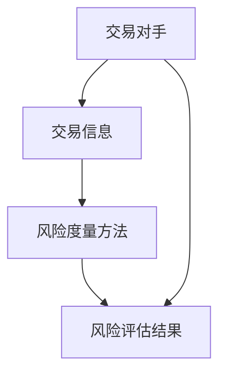

                 

# 《金融衍生品交易对手风险评估模型》

---

## 关键词：金融衍生品、交易对手风险、信用风险、VaR、CVaR、蒙特卡洛模拟

---

## 摘要

金融衍生品交易中的交易对手风险评估是现代金融市场风险管理的核心问题之一。本文系统地介绍了金融衍生品的基本概念、交易对手风险的定义及其评估的重要性，详细阐述了交易对手风险评估模型的构建原理、算法流程、数学模型和系统架构设计。通过实际案例分析和项目实战，本文展示了如何利用VaR、CVaR等风险度量方法以及蒙特卡洛模拟等数值方法，构建高效的交易对手风险评估模型。文章最后还总结了最佳实践建议，并展望了未来的发展方向。

---

# 第一部分: 金融衍生品交易对手风险评估背景与基础

## 第1章: 金融衍生品与交易对手风险概述

### 1.1 金融衍生品的基本概念

#### 1.1.1 金融衍生品的定义与分类

金融衍生品是一种以基础金融资产（如股票、债券、外汇等）或指数为基础，通过衍生出的金融合同进行交易的金融工具。其核心特征在于其价值来源于对基础资产价格的变动。根据合约类型，金融衍生品主要分为以下几类：

1. 远期合约（Forwards）：约定在未来某一特定时间以预定价格买卖某种资产的协议。
2. 期货合约（Futures）：标准化的远期合约，通常在交易所进行交易。
3. 期权合约（Options）：赋予买方在未来某一时间以特定价格买入或卖出资产的权利，但不负有必须交易的义务。
4. 互换合约（Swaps）：约定在未来某一时间段内，双方以约定的方式交换现金流的协议。

#### 1.1.2 金融衍生品的市场特点

1. **杠杆效应**：衍生品通常具有杠杆效应，即少量的初始资金可以控制较大的头寸。
2. **高风险性**：由于其复杂性和杠杆效应，衍生品交易的风险较高。
3. **流动性**：许多衍生品可以在二级市场进行交易，具有较高的流动性。
4. **多样性**：衍生品种类繁多，满足不同的市场参与者的需求。

#### 1.1.3 金融衍生品的主要类型

除了上述的基本类型，金融衍生品还包括：

1. **信用衍生品**：如信用违约互换（CDS），用于转移信用风险。
2. **外汇衍生品**：如远期外汇合约和外汇期权，用于管理汇率风险。
3. **利率衍生品**：如利率互换和债券期权，用于管理利率风险。

---

### 1.2 交易对手风险的基本概念

#### 1.2.1 交易对手风险的定义

交易对手风险（Counterparty Risk）是指交易对手方未能履行其合约义务而给交易者带来损失的可能性。在金融衍生品交易中，交易对手风险尤其重要，因为许多衍生品交易是场外（OTC）交易，缺乏交易所的担保机制。

#### 1.2.2 交易对手风险的来源

1. **信用风险**：交易对手因财务状况恶化或违约而无法履行合约义务。
2. **市场风险**：市场波动导致衍生品的价值发生变化，进而影响交易对手的财务状况。
3. **操作风险**：交易过程中的操作失误或欺诈行为可能导致交易对手风险。
4. **法律风险**：法律纠纷或政策变化可能影响合约的履行。

#### 1.2.3 交易对手风险的度量方法

交易对手风险的度量通常涉及以下步骤：

1. **信用评估**：通过信用评分模型（如C信用评分模型）评估交易对手的信用状况。
2. **VaR（Value at Risk）**：计算在一定置信水平下，交易对手违约可能带来的最大损失。
3. **CVaR（Conditional Value at Risk）**：在VaR的基础上，考虑在最坏情况下的平均损失。

---

### 1.3 交易对手风险评估的重要性

#### 1.3.1 风险评估在金融衍生品交易中的作用

1. **风险控制**：通过评估交易对手的信用风险，金融机构可以制定有效的风险管理策略。
2. **定价决策**：交易对手风险的评估结果可以作为定价的基础，确保交易的公平性。
3. **资本分配**：根据交易对手的风险状况，合理分配资本，确保金融机构的稳健运营。

#### 1.3.2 交易对手风险对金融机构的影响

1. **财务损失**：交易对手违约可能导致直接的财务损失。
2. **声誉风险**：交易对手风险的失控可能影响金融机构的声誉。
3. **流动性风险**：大规模的违约可能引发流动性危机。

#### 1.3.3 风险评估的边界与外延

交易对手风险评估的边界通常包括：

1. **评估范围**：仅限于交易对手的信用风险，不包括市场风险。
2. **时间范围**：评估的是未来一定时期内的风险。
3. **评估对象**：特定交易对手或组合。

交易对手风险评估的外延则包括：

1. **组合风险**：将交易对手风险与其他风险（如市场风险、操作风险）结合起来进行评估。
2. **系统性风险**：评估交易对手风险对整个金融系统的潜在影响。

---

## 第2章: 交易对手风险评估的核心要素

### 2.1 核心概念与联系

#### 2.1.1 交易对手风险评估模型的核心要素

交易对手风险评估模型的核心要素包括：

1. **交易对手信息**：包括交易对手的信用状况、财务状况、历史交易记录等。
2. **交易信息**：包括交易的类型、金额、期限、市场条件等。
3. **风险度量方法**：如VaR、CVaR等。

#### 2.1.2 核心要素之间的关系

交易对手风险评估模型的核心要素之间的关系可以通过以下表格进行对比：

| 核心要素 | 描述 |
|----------|------|
| 交易对手信息 | 包括交易对手的信用评分、财务状况等 |
| 交易信息 | 包括交易类型、金额、期限等 |
| 风险度量方法 | 如VaR、CVaR等 |

#### 2.1.3 核心要素的属性特征对比表

以下表格对比了交易对手风险评估模型核心要素的属性特征：

| 属性 | 交易对手信息 | 交易信息 | 风险度量方法 |
|------|--------------|----------|--------------|
| 类型 | 信用相关 | 合同相关 | 数值相关 |
| 数据来源 | 信用评级机构、历史数据 | 交易合同、市场数据 | 风险模型、历史数据 |
| 数据特征 | 定性与定量结合 | 定性与定量结合 | 定量为主 |

---

#### 2.1.4 Mermaid 实体关系图

以下是交易对手风险评估模型的实体关系图：

---

## 第三部分: 交易对手风险评估模型的算法原理

## 第3章: 交易对手风险评估模型的数学基础

### 3.1 交易对手风险评估的数学模型

#### 3.1.1 风险评估的基本公式

交易对手风险评估的基本公式可以表示为：

$$
\text{风险值} = f(\text{交易对手信息}, \text{交易信息}, \text{市场条件})
$$

其中，$f$ 是风险评估函数，$\text{交易对手信息}$ 和 $\text{交易信息}$ 是输入变量，$\text{市场条件}$ 是外部变量。

#### 3.1.2 风险度量的数学模型

风险度量的数学模型通常包括以下几种：

1. **VaR（Value at Risk）**：
   $$
   \text{VaR}(\alpha) = \text{最小损失值，使得在}\alpha\text{的置信水平下，损失不超过该值}
   $$

2. **CVaR（Conditional Value at Risk）**：
   $$
   \text{CVaR}(\alpha) = \text{在}\alpha\text{的置信水平下，损失的平均值}
   $$

3. **信用风险度量模型**：如信用评分模型（C信用评分模型）。

---

## 总结

以上是《金融衍生品交易对手风险评估模型》的部分内容，后续章节将详细介绍模型的算法原理、系统架构设计、项目实战等内容。如需继续阅读，请参考完整文章。

---

**作者：AI天才研究院/AI Genius Institute & 禅与计算机程序设计艺术 /Zen And The Art of Computer Programming**

