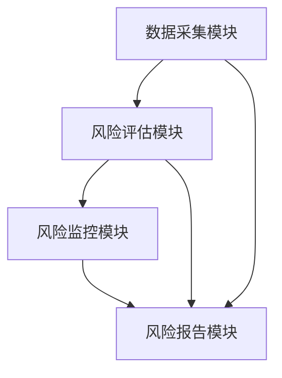

                 


# 金融衍生品交易对手风险量化与管理

## 关键词：金融衍生品，交易对手风险，VaR，CVaR，蒙特卡洛模拟，风险管理

## 摘要：本文深入探讨了金融衍生品交易对手风险的量化与管理方法，从基础概念到高级算法，结合实际案例，详细讲解了如何通过VaR、CVaR等模型和蒙特卡洛模拟技术进行风险评估和管理。同时，本文还介绍了交易对手风险管理系统的设计与实现，为金融机构提供了可操作的解决方案。

---

# 第一部分：交易对手风险的基本概念

## 第1章：交易对手风险的定义与背景

### 1.1 金融衍生品的基本概念

金融衍生品是指其价值依赖于其他基础资产（如股票、债券、商品等）的金融工具。常见的衍生品包括期权、期货、掉期和远期合约等。这些工具具有杠杆效应，能够在较低的资本投入下放大收益或风险。

### 1.2 交易对手风险的定义

交易对手风险是指在金融交易中，交易对手方未能履行其合同义务而导致的风险。在衍生品交易中，由于交易金额通常较大且期限较长，交易对手风险显得尤为重要。

### 1.3 交易对手风险的重要性

衍生品交易的复杂性和杠杆效应使得交易对手风险成为金融机构面临的主要风险之一。一旦交易对手违约，可能导致巨大的经济损失，甚至引发系统性金融风险。

### 1.4 交易对手风险的分类

交易对手风险可以分为以下几类：
- **信用风险**：交易对手因财务状况恶化而无法履行合同义务的风险。
- **市场风险**：由于市场价格波动导致衍生品价值下降的风险。
- **操作风险**：由于内部操作失误或外部事件导致的风险。

### 1.5 监管框架

全球范围内，监管机构对交易对手风险的管理提出了严格要求。例如，巴塞尔协议要求金融机构保持足够的资本缓冲以应对潜在的交易对手违约风险。

---

## 第2章：交易对手风险的量化方法

### 2.1 信用风险模型

信用风险模型用于评估交易对手违约的可能性。常用的模型包括：
- **信用评分模型**：通过对企业信用状况的评估，确定其违约概率。
- **违约概率模型**：基于历史数据和统计方法，计算交易对手的违约概率。

### 2.2 VaR（Value at Risk）模型

VaR模型用于度量在给定置信水平下，金融资产可能遭受的最大损失。例如，95%置信水平下的VaR表示在95%的概率下，资产的最大损失不会超过VaR值。

$$ VaR = \text{quantile}(\text{loss distribution}, 1 - \alpha) $$

其中，$\alpha$ 是置信水平，通常取95%或99%。

### 2.3 CVaR（Conditional Value at Risk）模型

CVaR模型是对VaR模型的补充，用于度量在VaR超过的情况下，平均损失的大小。CVaR模型比VaR模型更保守，适合用于风险厌恶型的投资者。

$$ CVaR = \mathbb{E}[L | L > VaR] $$

其中，$L$ 是损失分布。

### 2.4 蒙特卡洛模拟

蒙特卡洛模拟是一种通过随机数生成和统计分析来模拟复杂系统的数值方法。在交易对手风险管理中，蒙特卡洛模拟可以用于模拟市场价格波动、交易对手违约概率等。

---

## 第3章：蒙特卡洛模拟在交易对手风险管理中的应用

### 3.1 蒙特卡洛模拟的基本原理

蒙特卡洛模拟的基本步骤如下：
1. 确定风险因子（如市场价格、波动率）。
2. 生成随机数，模拟风险因子的变化。
3. 计算衍生品的理论价值和实际价值。
4. 计算损失分布。
5. 分析结果，得出VaR、CVaR等风险指标。

### 3.2 蒙特卡洛模拟的实现

以下是一个简单的蒙特卡洛模拟的Python代码示例：

```python
import numpy as np

# 随机数生成
np.random.seed(42)
n = 100000
random_numbers = np.random.normal(0, 1, n)

# 计算损失分布
loss = np.maximum(0, random_numbers - 1.96)  # 假设损失分布为正态分布，置信水平为95%

# 计算VaR和CVaR
loss_sorted = np.sort(loss)
VaR = loss_sorted[int(0.05 * n)]
CVaR = np.mean(loss_sorted[loss_sorted >= VaR])

print(f"VaR: {VaR:.2f}, CVaR: {CVaR:.2f}")
```

### 3.3 结果分析

通过蒙特卡洛模拟，可以得到交易对手风险的VaR和CVaR值，从而为金融机构提供风险敞口的量化指标。

---

## 第4章：交易对手风险管理系统

### 4.1 系统目标

交易对手风险管理系统的目标是：
- 实时监控交易对手的风险敞口。
- 定期评估交易对手的信用风险。
- 提供风险报告和预警。

### 4.2 系统架构设计

以下是交易对手风险管理系统的架构图：



### 4.3 系统实现

交易对手风险管理系统的主要功能包括：
- 数据采集：收集交易对手的信用数据、市场数据等。
- 风险评估：计算交易对手的VaR、CVaR等风险指标。
- 风险监控：实时监控交易对手的风险敞口。
- 风险报告：生成风险报告和预警信息。

---

## 第5章：项目实战

### 5.1 案例分析

假设某银行交易对手是一家中型企业，我们可以通过蒙特卡洛模拟来评估其交易对手风险。

### 5.2 环境搭建

- Python环境：安装NumPy、Pandas、Matplotlib等库。
- 数据源：获取交易对手的历史交易数据和市场数据。

### 5.3 核心代码实现

```python
import numpy as np
import matplotlib.pyplot as plt

# 数据准备
n = 100000
random_numbers = np.random.normal(0, 1, n)
loss = np.maximum(0, random_numbers - 1.96)

# 计算VaR和CVaR
loss_sorted = np.sort(loss)
VaR = loss_sorted[int(0.05 * n)]
CVaR = np.mean(loss_sorted[loss_sorted >= VaR])

# 绘制损失分布图
plt.hist(loss, bins=50, edgecolor='black')
plt.xlabel('Loss')
plt.ylabel('Frequency')
plt.title('Loss Distribution')
plt.show()

print(f"VaR: {VaR:.2f}, CVaR: {CVaR:.2f}")
```

### 5.4 结果分析

通过模拟结果，我们可以看到交易对手的风险敞口，并根据VaR和CVaR值制定相应的风险管理策略。

---

## 第6章：最佳实践与注意事项

### 6.1 最佳实践

- 定期更新风险模型。
- 结合VaR和CVaR模型进行风险评估。
- 建立完善的交易对手信用评级体系。

### 6.2 注意事项

- 风险模型的选择应基于实际数据和业务需求。
- 风险管理系统的维护和优化需要持续投入。

---

## 第7章：总结与展望

### 7.1 总结

本文详细探讨了金融衍生品交易对手风险的量化与管理方法，从理论到实践，结合案例分析和系统设计，为金融机构提供了可操作的解决方案。

### 7.2 展望

未来，随着人工智能和大数据技术的发展，交易对手风险管理将更加智能化和自动化。金融机构需要不断优化风险管理模型，以应对日益复杂的金融市场环境。

---

## 作者

作者：AI天才研究院/AI Genius Institute & 禅与计算机程序设计艺术 /Zen And The Art of Computer Programming

---

通过以上结构化的内容，我们可以系统地理解和管理金融衍生品交易对手风险，为金融机构提供有效的风险管理策略。

