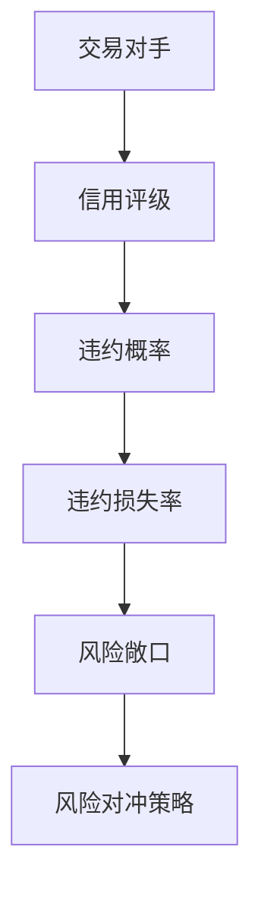
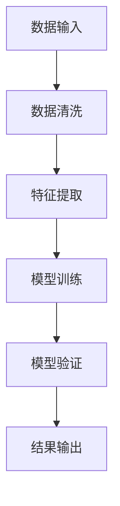
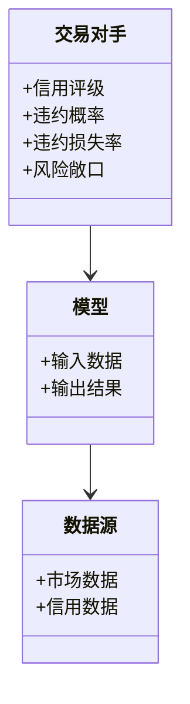
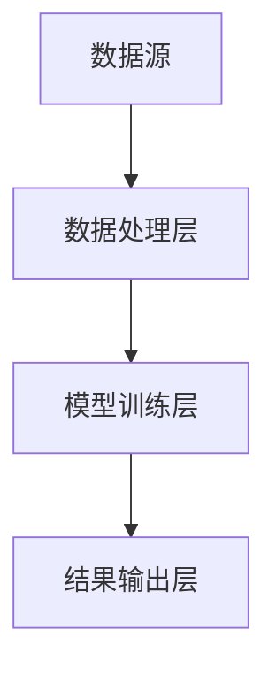
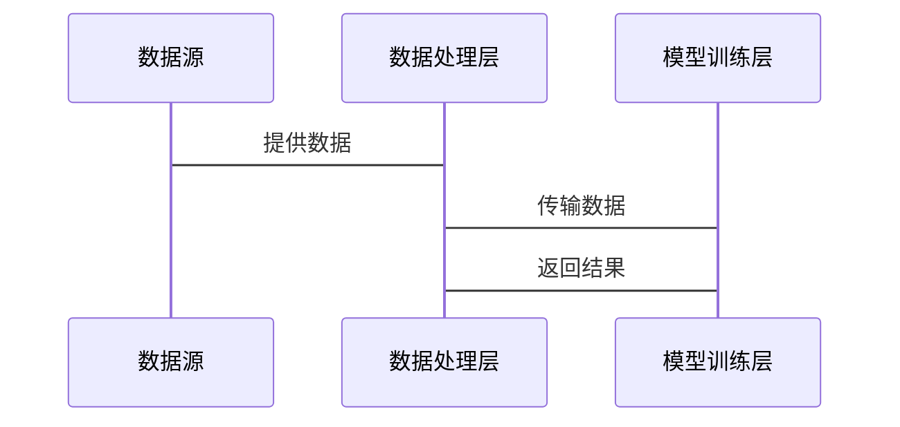

                 


# 《金融衍生品交易对手风险量化模型》

---

## 关键词：
- 金融衍生品
- 交易对手风险
- 量化模型
- 信用风险
- 数学建模

---

## 摘要：
本文详细探讨了金融衍生品交易对手风险量化模型的构建与应用。首先，文章介绍了交易对手风险的基本概念及其在金融市场中的重要性。接着，从数学建模的角度，分析了量化模型的核心原理、算法流程以及其实现方式。通过具体的案例分析，展示了如何利用量化模型对交易对手信用风险进行度量与管理。最后，本文总结了模型的优势与局限性，并提出了优化建议。

---

# 第1章: 交易对手风险的背景与概念

## 1.1 金融衍生品的基本概念
### 1.1.1 金融衍生品的定义与分类
金融衍生品是一种以基础金融资产（如股票、债券、商品等）为标的的金融合约。根据其合约性质，衍生品可以分为远期合约、期货、期权和互换等类型。衍生品的价值来源于其标的资产的价格波动，具有高杠杆性和高风险性。

### 1.1.2 金融衍生品的主要类型
- **远期合约**：约定在未来某一特定时间以预定价格买卖资产的协议。
- **期货**：在交易所上市交易的标准化远期合约。
- **期权**：赋予买方在未来特定时间内以预定价格买入或卖出资产的权利。
- **互换**：约定在未来一定期限内互相交换现金流的协议。

### 1.1.3 金融衍生品的市场现状
衍生品市场是全球最大的金融市场之一，市场规模远超传统金融市场。衍生品的广泛应用使得金融市场更加复杂，同时也带来了更高的风险。

## 1.2 交易对手风险的定义与特征
### 1.2.1 交易对手风险的定义
交易对手风险是指在金融交易中，交易对手方无法履行合约义务而给交易者带来的损失风险。这种风险不仅存在于衍生品交易中，也存在于其他类型的金融交易中。

### 1.2.2 交易对手风险的核心要素
- **信用风险**：交易对手违约的可能性。
- **市场风险**：市场波动对交易对手信用的影响。
- **操作风险**：交易过程中的操作失误导致的风险。
- **法律风险**：法律制度不完善或执行不力带来的风险。

### 1.2.3 交易对手风险的分类与影响
- **直接风险**：交易对手直接违约带来的损失。
- **间接风险**：由于市场波动导致交易对手信用状况恶化而带来的风险。
- **系统性风险**：交易对手风险可能引发连锁反应，影响整个金融系统的稳定性。

## 1.3 交易对手风险量化模型的必要性
### 1.3.1 交易对手风险对金融市场的冲击
衍生品交易的高杠杆性使得交易对手风险可能迅速放大，导致系统性金融危机。2008年金融危机就是一个典型案例，交易对手风险的失控直接导致了全球性的金融风暴。

### 1.3.2 量化模型在风险管理中的作用
- **风险度量**：量化模型可以准确测量交易对手的信用风险。
- **风险预警**：通过模型预测潜在的交易对手违约风险。
- **风险对冲**：利用模型制定有效的对冲策略，降低风险敞口。

### 1.3.3 量化模型的适用范围与边界
量化模型适用于所有涉及交易对手的金融交易，包括场内交易和场外交易。然而，模型的有效性依赖于数据的完整性和准确性，以及模型假设的合理性。

## 1.4 本章小结
本章介绍了金融衍生品的基本概念、交易对手风险的定义与特征，以及量化模型的必要性。通过分析交易对手风险的多种类型和影响，读者可以理解为什么需要构建量化模型来管理交易对手风险。

---

# 第2章: 交易对手风险量化模型的核心概念

## 2.1 交易对手信用风险的构成
### 2.1.1 信用风险的定义与属性
信用风险是指交易对手违约的可能性。其属性包括违约概率、违约损失率和资产的相关性等。

### 2.1.2 交易对手信用风险的核心要素
- **违约概率（PD）**：交易对手违约的可能性。
- **违约损失率（LGD）**：违约发生时的平均损失比例。
- **资产相关性**：交易对手资产与市场资产的相关性。

### 2.1.3 信用风险与市场风险的对比
| 对比维度 | 信用风险 | 市场风险 |
|----------|----------|----------|
| 风险来源 | 对手违约 | 市场波动 |
| 影响范围 | 特定交易 | 整体市场 |
| 度量方法 | PD、LGD | VaR、CVaR |

## 2.2 量化模型的关键组成部分
### 2.2.1 模型的输入变量
- **交易对手的信用评级**：反映交易对手的信用状况。
- **标的资产的价格波动**：影响交易对手的信用风险。
- **合约期限与条款**：影响违约的可能性和损失程度。

### 2.2.2 模型的输出结果
- **信用风险值（Credit Risk Value）**：量化交易对手的信用风险。
- **风险敞口**：交易对手违约可能带来的损失敞口。
- **风险对冲建议**：基于模型结果制定的对冲策略。

### 2.2.3 模型的假设与限制
- **假设**：交易对手的信用评级稳定，市场波动可预测。
- **限制**：模型假设可能与实际情况不符，导致结果偏差。

## 2.3 交易对手信用风险的度量指标
### 2.3.1 信用风险的主要度量指标
- **VaR（Value at Risk）**：在一定置信水平下，可能的最大损失。
- **CVaR（Conditional Value at Risk）**：VaR的条件期望，反映尾部风险。
- **PD（Probability of Default）**：交易对手的违约概率。

### 2.3.2 不同度量指标的优缺点对比
| 度量指标 | 优点 | 缺点 |
|----------|------|------|
| VaR      | 计算简单 | 无法反映尾部风险 |
| CVaR     | 能反映尾部风险 | 计算复杂 |
| PD       | 反映违约概率 | 依赖于历史数据 |

### 2.3.3 度量指标的计算公式与应用场景
#### VaR公式：
$$ \text{VaR} = \mu + z \times \sigma $$
其中，$\mu$ 是平均回报率，$z$ 是标准正态分布的分位数，$\sigma$ 是标准差。

#### CVaR公式：
$$ \text{CVaR} = \frac{1}{1-\alpha} \sum_{i=1}^{\alpha n} r_i $$
其中，$\alpha$ 是置信水平，$r_i$ 是排序后的收益。

## 2.4 核心概念的ER实体关系图


## 2.5 本章小结
本章详细阐述了交易对手信用风险的核心概念，包括信用风险的构成、量化模型的关键部分以及主要的度量指标。通过对比分析，读者可以更好地理解不同风险度量方法的优缺点。

---

# 第3章: 交易对手风险量化模型的算法原理

## 3.1 交易对手信用风险的数学模型
### 3.1.1 概率分布模型
概率分布模型用于描述交易对手违约的可能性。常用的分布包括正态分布、t分布和帕累托分布等。

#### 正态分布公式：
$$ f(x) = \frac{1}{\sqrt{2\pi}\sigma} e^{-\frac{(x-\mu)^2}{2\sigma^2}} $$
其中，$\mu$ 是均值，$\sigma$ 是标准差。

### 3.1.2 统计回归模型
统计回归模型用于分析交易对手信用风险的影响因素。常用的方法包括线性回归和逻辑回归。

#### 逻辑回归公式：
$$ P(Y=1|x) = \frac{e^{\beta x}}{1 + e^{\beta x}} $$
其中，$\beta$ 是回归系数。

### 3.1.3 时间序列分析模型
时间序列分析模型用于预测交易对手信用风险的变化趋势。常用的方法包括ARIMA和GARCH。

#### ARIMA模型公式：
$$ \phi(B)(1 - B)^d X_t = \theta(B) \epsilon_t $$
其中，$\phi(B)$ 是自回归多项式，$\theta(B)$ 是移动平均多项式，$d$ 是差分阶数。

## 3.2 量化模型的算法流程
### 3.2.1 数据预处理
- 数据清洗：处理缺失值和异常值。
- 特征提取：提取交易对手的信用评级、市场数据等特征。

### 3.2.2 模型训练
- 确定模型类型：选择合适的概率分布模型或统计回归模型。
- 训练模型参数：通过优化算法确定模型参数。

### 3.2.3 模型验证与优化
- 模型验证：使用验证集评估模型的性能。
- 模型优化：调整模型参数，提高预测精度。

## 3.3 算法的mermaid流程图


## 3.4 算法的Python实现
```python
import numpy as np
import pandas as pd
from sklearn.linear_model import LogisticRegression

# 示例数据
data = pd.DataFrame({
    'feature1': np.random.randn(100),
    'feature2': np.random.randn(100),
    'label': np.random.randint(0, 2, 100)
})

# 数据预处理
X = data[['feature1', 'feature2']]
y = data['label']

# 模型训练
model = LogisticRegression()
model.fit(X, y)

# 模型预测
predicted = model.predict(X)
print(predicted)
```

## 3.5 本章小结
本章详细讲解了交易对手信用风险的数学模型和算法流程，通过具体的Python代码示例，展示了如何实现模型的训练和预测。

---

# 第4章: 交易对手风险量化模型的数学模型

## 4.1 数学模型的核心公式
### 4.1.1 信用风险的度量公式
$$ \text{Credit Risk} = \text{PD} \times \text{EAD} \times \text{LGD} $$
其中，$\text{EAD}$ 是风险敞口，$\text{LGD}$ 是违约损失率。

### 4.1.2 风险对冲公式
$$ \text{Hedge Ratio} = \frac{\text{Risk Exposure}}{\text{Hedge Instrument Value}} $$

## 4.2 数学模型的优化与应用
### 4.2.1 模型优化
- 参数优化：通过遗传算法或梯度下降优化模型参数。
- 模型组合：将多个模型组合使用，提高预测精度。

### 4.2.2 模型应用
- 风险管理：根据模型结果制定风险对冲策略。
- 投资决策：利用模型预测交易对手信用风险，优化投资组合。

## 4.3 本章小结
本章通过数学公式详细阐述了交易对手信用风险的度量方法和风险对冲策略，展示了如何利用数学模型优化风险管理。

---

# 第5章: 交易对手风险量化模型的系统分析与架构设计

## 5.1 系统分析
### 5.1.1 问题场景介绍
交易对手风险量化模型需要处理复杂的金融数据，包括实时市场数据和交易对手的信用数据。

### 5.1.2 项目介绍
本项目旨在构建一个交易对手风险量化模型，用于评估和管理交易对手信用风险。

## 5.2 系统功能设计
### 5.2.1 领域模型mermaid类图


### 5.2.2 系统架构设计mermaid架构图


### 5.2.3 系统接口设计
- 数据接口：与数据源对接，获取实时数据。
- 模型接口：提供API，供其他系统调用模型结果。

### 5.2.4 系统交互mermaid序列图


## 5.3 本章小结
本章通过系统分析与架构设计，展示了如何构建交易对手风险量化模型的系统框架，为后续的实现提供了基础。

---

# 第6章: 交易对手风险量化模型的项目实战

## 6.1 环境安装
- 安装Python环境：推荐使用Anaconda。
- 安装依赖库：如numpy、pandas、scikit-learn等。

## 6.2 系统核心实现源代码
```python
import numpy as np
import pandas as pd
from sklearn.linear_model import LinearRegression

# 数据加载
data = pd.read_csv('data.csv')

# 数据预处理
X = data[['feature1', 'feature2']]
y = data['label']

# 模型训练
model = LinearRegression()
model.fit(X, y)

# 模型预测
predicted = model.predict(X)
print(predicted)
```

## 6.3 代码应用解读与分析
- 数据加载：读取CSV文件中的数据。
- 数据预处理：提取特征变量和目标变量。
- 模型训练：使用线性回归模型训练数据。
- 模型预测：利用训练好的模型进行预测。

## 6.4 实际案例分析
假设我们有一个交易对手的数据，包括其信用评级和市场数据，我们可以利用模型预测其违约概率。

## 6.5 项目小结
通过项目实战，读者可以掌握交易对手风险量化模型的实现步骤和应用方法。

---

# 第7章: 交易对手风险量化模型的最佳实践

## 7.1 最佳实践 tips
- 数据质量是模型性能的关键，确保数据的完整性和准确性。
- 模型的选择应根据实际需求，合理选择模型类型。
- 定期更新模型参数，保持模型的有效性。

## 7.2 小结
交易对手风险量化模型是金融风险管理的重要工具，通过合理的模型设计和应用，可以有效降低交易对手风险。

## 7.3 注意事项
- 模型假设可能与实际情况不符，需定期验证和调整。
- 数据隐私和安全问题需高度重视。

## 7.4 拓展阅读
- 《信用风险模型：理论与应用》
- 《金融衍生品定价与风险管理》

---

# 作者：AI天才研究院/AI Genius Institute & 禅与计算机程序设计艺术 /Zen And The Art of Computer Programming

---

本文通过详细阐述金融衍生品交易对手风险量化模型的构建与应用，帮助读者理解如何利用量化模型管理交易对手信用风险。希望本文能为金融风险管理领域的研究和实践提供有价值的参考。
---

