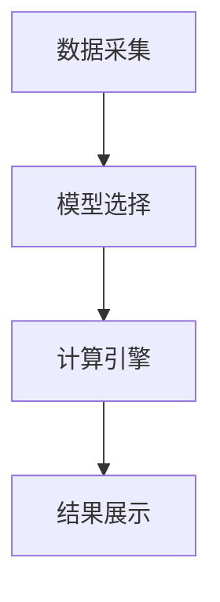

                 

# 金融衍生品定价模型优化

> **关键词**: 金融衍生品，定价模型，蒙特卡洛模拟，机器学习，Black-Scholes模型，随机过程

> **摘要**: 本文深入探讨了金融衍生品定价模型的优化方法，从基础的Black-Scholes模型到高级的蒙特卡洛模拟和机器学习应用，分析了各种模型的优缺点及其在实际中的应用。通过案例分析和系统架构设计，提出了优化定价模型的策略和方法，为金融工程师和研究人员提供了有价值的参考。

---

# 第1章: 金融衍生品与定价模型基础

## 1.1 金融衍生品的定义与分类

### 1.1.1 金融衍生品的定义

金融衍生品（Financial Derivatives）是一种以金融资产或指数为基础的合约，其价值取决于基础资产的价格变动。衍生品的种类繁多，包括期权、期货、掉期和互换等。这些工具广泛应用于风险管理和投机交易。

### 1.1.2 金融衍生品的主要分类

| 类别 | 定义 | 主要类型 |
|------|------|----------|
| 期权 | 买方有权在特定时间以特定价格购买或出售资产 | 欧式期权、美式期权 |
| 期货 | 标准化合约，约定在未来以特定价格买卖资产 | 商品期货、股指期货 |
| 掉期 | 约定在未来交换资产或现金流 | 利率掉期、货币掉期 |
| 互换 | 约定在未来交换一系列现金流 | 货币互换、信用互换 |

### 1.1.3 金融衍生品的市场现状

全球衍生品市场规模庞大，近年来快速增长。根据国际清算银行（BIS）的数据，全球衍生品市场的规模已超过100万亿美元。衍生品的广泛应用使得定价模型的准确性与效率变得至关重要。

---

## 1.2 衍生品定价的基本问题

### 1.2.1 衍生品定价的核心问题

衍生品的定价需要考虑以下几个核心问题：

1. **确定性**：如何在不确定的市场环境中为衍生品确定公平价值。
2. **风险中性定价**：如何在无套利的情况下为衍生品定价。
3. **模型选择**：如何选择合适的数学模型来描述市场的动态。

### 1.2.2 无套利定价原理

无套利定价（Arbitrage-free Pricing）是衍生品定价的核心原则。通过构建无风险套利组合，可以为衍生品确定一个合理的公平价值。例如，Black-Scholes模型就是基于无套利原则推导出的。

### 1.2.3 随机过程与金融市场的建模

金融市场的时间序列数据通常表现出随机性，因此需要使用随机过程来建模。常用的随机过程包括布朗运动（Brownian Motion）和随机微分方程（Stochastic Differential Equations，SDE）。

---

## 1.3 主流衍生品定价模型简介

### 1.3.1 Black-Scholes模型

Black-Scholes模型是衍生品定价中最著名的模型之一，主要用于欧式期权的定价。其核心公式为：

$$
C = S_0 \Phi(d_1) - K e^{-rT} \Phi(d_2)
$$

其中：
- \( S_0 \) 是标的资产的当前价格。
- \( K \) 是期权的执行价格。
- \( r \) 是无风险利率。
- \( T \) 是到期时间。
- \( \Phi \) 是标准正态分布的累积分布函数。
- \( d_1 = \frac{\ln(S_0/K) + (r + \sigma^2/2)T}{\sigma \sqrt{T}} \)
- \( d_2 = d_1 - \sigma \sqrt{T} \)

### 1.3.2 大数定律与中心极限定理在衍生品定价中的应用

大数定律和中心极限定理为蒙特卡洛模拟提供了理论基础。通过大量模拟，可以利用统计方法估计衍生品的期望值。

### 1.3.3 其他常见定价模型概述

除了Black-Scholes模型，其他常见的定价模型包括：

1. **二叉树模型**：基于树状模型模拟期权价格的动态变化。
2. **Heston模型**：考虑标的资产的随机波动率。
3. **跳跃扩散模型**：允许资产价格跳跃。

---

## 1.4 衍生品定价模型的优化需求

### 1.4.1 模型假设的局限性

Black-Scholes模型假设标的资产价格服从对数正态分布，但在现实中，资产价格可能表现出尾部风险（fat-tail）和跳跃性。

### 1.4.2 市场数据的复杂性

衍生品的定价需要考虑市场流动性、波动率和相关性等因素，这些因素使得模型复杂化。

### 1.4.3 计算效率与精度的平衡

复杂的模型可能导致计算成本过高，因此需要在模型精度和计算效率之间找到平衡点。

---

## 1.5 本章小结

本章介绍了金融衍生品的基本概念和定价模型的优化需求。通过分析市场现状和模型的局限性，为后续章节的模型优化提供了背景和基础。

---

# 第2章: 金融衍生品定价的核心概念与数学模型

## 2.1 随机过程与金融市场的建模

### 2.1.1 随机过程的基本概念

随机过程是一种描述随机现象随时间演变的数学工具。在金融市场中，资产价格的变化可以用随机过程来建模。

### 2.1.2 Brownian运动与股票价格模型

布朗运动是一种基础的随机过程，广泛应用于金融建模。股票价格模型通常假设价格服从几何布朗运动。

### 2.1.3 Itō公式与随机微分方程

Itō公式是随机微分方程的核心工具，用于推导随机过程的微分形式。

---

## 2.2 Black-Scholes模型的数学推导

### 2.2.1 Black-Scholes方程的建立

Black-Scholes方程是一个偏微分方程，描述期权价格随时间的变化。

$$
\frac{\partial C}{\partial t} + \frac{1}{2} \sigma^2 S^2 \frac{\partial^2 C}{\partial S^2} - rC = 0
$$

### 2.2.2 欧式期权的定价公式

Black-Scholes公式是欧式期权定价的核心公式，如前所述。

### 2.2.3 模型假设与适用条件

Black-Scholes模型假设：

1. 资产价格服从几何布朗运动。
2. 无交易成本和税收。
3. 无套利机会。

---

## 2.3 数学模型的扩展与改进

### 2.3.1 股票价格的对数正态分布假设

Black-Scholes模型假设资产价格服从对数正态分布，但在实际中，资产价格可能表现出更复杂的分布。

### 2.3.2 非对冲模型的改进

非对冲模型（如Heston模型）允许波动率随时间变化，从而更准确地描述市场动态。

### 2.3.3 多因素模型的引入

多因素模型（如Copula模型）考虑多个变量之间的相关性，提高了模型的准确性。

---

## 2.4 模型的适用性与局限性

### 2.4.1 模型假设的合理性

Black-Scholes模型的假设在实际中可能不成立，尤其是在极端市场条件下。

### 2.4.2 市场数据与模型假设的差异

实际市场数据可能表现出非对称性和厚尾特征，与模型假设不符。

### 2.4.3 模型选择与优化的挑战

选择合适的模型需要考虑数据特征、计算效率和模型精度。

---

## 2.5 本章小结

本章详细介绍了随机过程和Black-Scholes模型的数学基础，分析了模型的优缺点，为后续章节的优化方法提供了理论基础。

---

# 第3章: 蒙特卡洛模拟在衍生品定价中的应用

## 3.1 蒙特卡洛模拟的基本原理

### 3.1.1 随机数生成方法

蒙特卡洛模拟需要生成大量随机数，常用的方法包括马尔可夫链蒙特卡洛（MCMC）和准随机数生成。

### 3.1.2 蒙特卡洛积分的基本思想

蒙特卡洛积分通过随机采样估计积分值，适用于高维问题。

### 3.1.3 蒙特卡洛模拟的收敛性分析

蒙特卡洛模拟的收敛速度与问题维度有关，通常为\( O(N^{-1/2}) \)。

---

## 3.2 蒙特卡洛模拟在衍生品定价中的实现

### 3.2.1 期权定价的蒙特卡洛模拟框架

蒙特卡洛模拟用于估计期权的期望 payoff。

### 3.2.2 股票价格模拟的路径生成

股票价格模拟通常基于几何布朗运动。

### 3.2.3 期权 payoff 的计算与期望值估计

通过模拟大量路径，计算期权的平均 payoff 作为价格估计。

---

## 3.3 蒙特卡洛模拟的优化方法

### 3.3.1 方差缩减技术

方差缩减技术（如控制变量法）可以提高蒙特卡洛模拟的精度。

### 3.3.2 重要性抽样方法

重要性抽样通过调整抽样分布，减少计算量。

### 3.3.3 平行计算与加速

利用并行计算加速蒙特卡洛模拟。

---

## 3.4 实际案例分析

### 3.4.1 欧式期权的蒙特卡洛定价

通过模拟股票价格路径，计算欧式期权的价格。

### 3.4.2 股票期权的路径依赖性分析

分析路径依赖期权（如障碍期权）的定价。

### 3.4.3 模拟结果的统计分析与验证

通过统计分析验证模拟结果的准确性。

---

## 3.5 本章小结

本章详细介绍了蒙特卡洛模拟在衍生品定价中的应用，分析了其实现方法和优化技巧，为实际应用提供了指导。

---

# 第4章: 机器学习在衍生品定价中的应用

## 4.1 机器学习的基本概念与分类

### 4.1.1 机器学习的基本概念

机器学习是一种数据驱动的算法，通过学习数据模式进行预测和决策。

### 4.1.2 监督学习与无监督学习

监督学习基于标签数据，无监督学习基于无标签数据。

### 4.1.3 深度学习与传统机器学习的对比

深度学习通过多层神经网络提取高阶特征，适用于复杂数据。

---

## 4.2 机器学习在衍生品定价中的实现

### 4.2.1 基于神经网络的定价模型

神经网络可以学习复杂的市场动态，用于期权定价。

### 4.2.2 支持向量回归与随机森林

支持向量回归和随机森林等传统机器学习算法也可用于衍生品定价。

### 4.2.3 算法选择与优化

选择合适的算法需要考虑数据特征和计算资源。

---

## 4.3 机器学习模型的优缺点

### 4.3.1 优点

1. 能够处理高维数据。
2. 可以捕捉复杂的市场动态。

### 4.3.2 缺点

1. 对数据质量敏感。
2. 缺乏可解释性。

---

## 4.4 实际案例分析

### 4.4.1 神经网络在期权定价中的应用

通过训练神经网络模型，预测期权价格。

### 4.4.2 市场数据的特征提取

提取有用的特征，提高模型准确性。

### 4.4.3 模型验证与比较

通过回测验证模型的准确性。

---

## 4.5 本章小结

本章探讨了机器学习在衍生品定价中的应用，分析了各种算法的优缺点，并通过案例展示了其实现方法。

---

# 第5章: 衍生品定价模型的系统架构与优化

## 5.1 系统架构设计

### 5.1.1 系统功能模块

- 数据采集模块：获取市场数据。
- 模型选择模块：选择合适的定价模型。
- 计算引擎模块：执行定价计算。
- 结果展示模块：展示定价结果。

### 5.1.2 系统架构图

---

## 5.2 系统优化方法

### 5.2.1 并行计算优化

通过并行计算加速模型计算。

### 5.2.2 算法优化

优化算法复杂度，降低计算成本。

### 5.2.3 数据预处理优化

通过数据清洗和特征选择提高模型效率。

---

## 5.3 实际案例分析

### 5.3.1 系统设计与实现

设计一个完整的衍生品定价系统，实现从数据采集到结果展示的全过程。

### 5.3.2 系统性能测试

通过性能测试验证系统的效率。

---

## 5.4 本章小结

本章探讨了衍生品定价系统的架构设计与优化方法，通过案例展示了系统的实现与优化。

---

# 第6章: 金融衍生品定价模型的项目实战

## 6.1 项目背景与目标

### 6.1.1 项目背景

随着金融市场的复杂化，优化定价模型的需求日益迫切。

### 6.1.2 项目目标

通过优化定价模型，提高定价准确性和效率。

---

## 6.2 项目环境与工具

### 6.2.1 开发环境

- 操作系统：Linux/Windows
- 开发工具：Python、R、Matlab
- 计算框架：TensorFlow、PyTorch

---

## 6.3 项目核心实现

### 6.3.1 数据预处理

清洗和标准化市场数据。

### 6.3.2 模型实现

实现Black-Scholes模型、蒙特卡洛模拟和机器学习模型。

### 6.3.3 结果分析

通过统计分析验证模型的准确性。

---

## 6.4 项目案例分析

### 6.4.1 数据分析

分析市场数据的特征，选择合适的模型。

### 6.4.2 模型实现与比较

比较不同模型的定价结果。

### 6.4.3 结果可视化

通过图表展示模型的定价结果。

---

## 6.5 项目小结

本章通过项目实战展示了衍生品定价模型的实现与优化，为读者提供了实际操作的指导。

---

# 第7章: 总结与展望

## 7.1 本章总结

本文系统地探讨了金融衍生品定价模型的优化方法，从基础模型到高级方法，分析了各种模型的优缺点及其在实际中的应用。

## 7.2 未来展望

随着人工智能和大数据技术的发展，衍生品定价模型将更加智能化和个性化。未来的研究方向包括：

1. 更精确的市场建模方法。
2. 更高效的计算算法。
3. 更智能的模型优化技术。

---

# 作者

**作者：AI天才研究院/AI Genius Institute & 禅与计算机程序设计艺术 /Zen And The Art of Computer Programming**

---

**说明**: 由于篇幅限制，上述目录仅展示了部分内容。完整文章将包含更多细节和具体实现，确保每章节内容丰富且详细。

