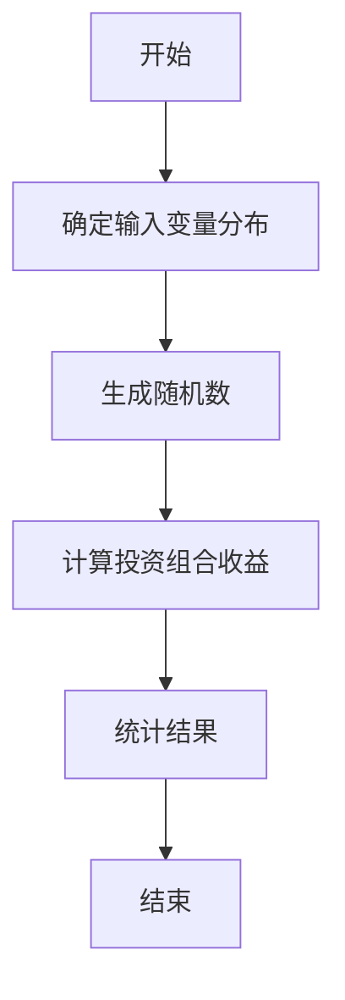
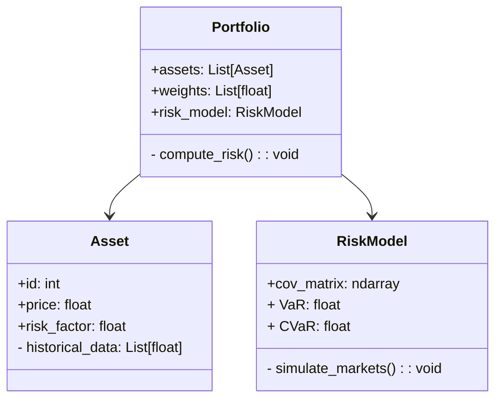
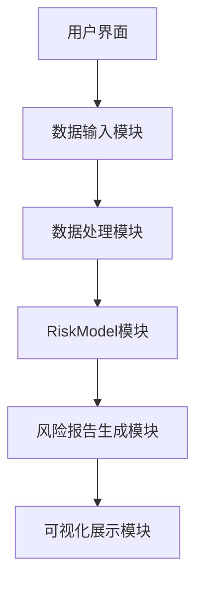

                 


# 《金融衍生品组合风险分析工具》

---

## 关键词  
金融衍生品、风险分析、VaR、CVaR、蒙特卡洛模拟、组合风险

---

## 摘要  
本文深入探讨了金融衍生品组合风险分析工具的构建与应用，从金融衍生品的基本概念、风险分析的核心原理，到具体的风险度量模型（如VaR和CVaR）的数学推导，再到工具的实际应用场景和系统架构设计，详细介绍了如何利用技术手段量化和管理金融衍生品组合风险。本文通过理论与实践相结合的方式，为读者提供了一套系统化、实用化的风险分析工具解决方案。

---

## 第1章 金融衍生品与风险分析概述

### 1.1 金融衍生品的基本概念  
金融衍生品是一种以其他金融资产或指数为基础的金融工具，其价值依赖于基础资产的价格波动。常见的金融衍生品包括期货、期权、掉期和互换等。  

#### 1.1.1 金融衍生品的定义与分类  
- **定义**：金融衍生品是衍生自其他资产的金融工具，具有杠杆效应和高风险特性。  
- **分类**：根据执行方式可分为远期合约、期权、期货和互换等。  

#### 1.1.2 金融衍生品的市场现状  
- 全球金融市场中，金融衍生品市场规模庞大，已成为风险管理的重要工具。  
- 衍生品的复杂性和杠杆效应使其在带来收益的同时，也放大了潜在风险。  

#### 1.1.3 金融衍生品的风险特性  
- 衍生品的风险主要来源于价格波动、流动性风险和信用风险。  
- 衍生品的非线性收益特性使其风险分析更加复杂。  

---

### 1.2 组合风险分析的重要性  

#### 1.2.1 为什么需要组合风险分析  
- 单一金融工具的风险分析不足以应对复杂的金融市场环境。  
- 组合风险分析能够帮助投资者全面评估投资组合的整体风险敞口。  

#### 1.2.2 组合风险分析的目标与意义  
- **目标**：量化投资组合的潜在损失，优化风险控制策略。  
- **意义**：通过组合风险分析，投资者可以更科学地配置资产，降低整体风险。  

#### 1.2.3 金融衍生品组合风险的特殊性  
- 衍生品的非线性特性使得组合风险分析更具挑战性。  
- 衍生品的嵌套结构增加了组合风险的复杂性。  

---

## 第2章 风险分析工具的核心概念与联系  

### 2.1 风险分析工具的核心概念  

#### 2.1.1 风险分析的基本原理  
- 风险分析是通过量化模型，评估投资组合在不同市场条件下的潜在损失。  
- 风险分析的核心在于对资产价格波动的建模与预测。  

#### 2.1.2 风险度量的常用指标  
| 风险指标 | 定义 | 用途 |
|----------|------|------|
| VaR     | Value at Risk，投资组合在一定置信水平下的潜在损失最大值 | 用于评估投资组合的潜在损失 |
| CVaR    | Conditional Value at Risk，VaR的条件期望值 | 用于优化风险调整后的收益 |
| 标准差   | 资产收益的波动性指标 | 用于衡量资产的风险程度 |

#### 2.1.3 风险分析工具的分类  
- 基于历史数据的统计方法（如VaR模型）。  
- 基于蒙特卡洛模拟的随机方法（如CVaR模型）。  

---

### 2.2 核心概念的联系与对比  

#### 2.2.1 VaR与CVaR的对比  
| 对比维度 | VaR | CVaR |
|----------|------|------|
| 定义     | 在一定置信水平下，投资组合的最大损失 | 在VaR水平下的条件期望损失 |
| 优势     | 计算简单，适用性广 | 更加稳健，考虑了尾部风险 |
| 应用     | 适用于初步风险评估 | 适用于风险优化和对冲策略 |

#### 2.2.2 风险因子与资产价格的关系  
- 风险因子是影响资产价格的核心变量，如利率、波动率等。  
- 资产价格的变化可以通过风险因子的线性组合来建模。  

#### 2.2.3 风险模型的输入与输出  
- **输入**：资产价格数据、风险因子、投资组合权重。  
- **输出**：VaR、CVaR、风险敞口报告。  

---

## 第3章 风险分析工具的算法原理  

### 3.1 蒙特卡洛模拟算法  

#### 3.1.1 蒙特卡洛模拟的基本原理  
蒙特卡洛模拟是一种基于随机数的数值计算方法，常用于估计复杂系统的概率分布。  

**步骤**：  
1. 确定输入变量的概率分布（如正态分布）。  
2. 生成随机数，模拟市场环境。  
3. 计算投资组合在模拟环境下的收益与损失。  
4. 统计结果，得到VaR或CVaR等风险指标。  

**优缺点**：  
- **优点**：能够处理复杂的非线性关系。  
- **缺点**：计算量大，依赖输入假设的准确性。  

**Mermaid 流程图**：  


#### 3.1.2 方差协方差矩阵法  
方差协方差矩阵用于衡量资产收益的波动性和相关性。  

**公式**：  
$$ \text{协方差}(i,j) = \frac{1}{n-1}\sum_{k=1}^{n}(x_i - \bar{x}_i)(x_j - \bar{x}_j) $$  

**应用**：  
- 计算投资组合的波动性。  
- 优化资产配置。  

---

### 3.2 方差协方差矩阵法  

#### 3.2.1 方差协方差矩阵的定义  
方差协方差矩阵是衡量资产收益波动性的核心工具。  

**公式**：  
$$ \sigma_{i,j} = \text{协方差}(i,j) $$  

#### 3.2.2 方差协方差矩阵的计算方法  
- **步骤**：  
  1. 计算每种资产的平均收益。  
  2. 计算每种资产收益与平均收益的差值。  
  3. 计算差值的乘积，并求和得到协方差。  

**代码示例**：  
```python
import numpy as np

def compute_covariance_matrix(returns):
    n = returns.shape[1]
    mean_returns = np.mean(returns, axis=0)
    deviations = returns - np.tile(mean_returns, (n, 1))
    covariance = np.dot(deviations, deviations.T) / (n - 1)
    return covariance
```

#### 3.2.3 方差协方差矩阵的应用  
- 用于计算投资组合的VaR。  
- 用于优化资产配置。  

---

## 第4章 风险分析工具的数学模型与公式  

### 4.1 VaR模型  

#### 4.1.1 VaR的定义与公式  
VaR是投资组合在一定置信水平下的潜在损失最大值。  

**公式**：  
$$ \text{VaR}(\alpha) = \text{max}_{p}\{ p | P(L \leq p) \geq \alpha \} $$  

**实际应用案例**：  
假设某投资组合的VaR在95%置信水平下为100万美元，意味着在95%的概率下，投资组合的最大损失不会超过100万美元。  

---

### 4.2 CVaR模型  

#### 4.2.1 CVaR的定义与公式  
CVaR是在VaR水平下的条件期望损失。  

**公式**：  
$$ \text{CVaR}(\alpha) = \mathbb{E}[L | L \geq \text{VaR}(\alpha)] $$  

**实际应用案例**：  
假设某投资组合的CVaR在95%置信水平下为120万美元，意味着在VaR水平下的平均损失为120万美元。  

---

## 第5章 系统分析与架构设计方案  

### 5.1 问题场景介绍  
本文构建的风险分析工具旨在帮助投资者量化和管理金融衍生品组合的风险，支持VaR和CVaR等多种风险度量方法，并提供交互式界面和可视化报告。  

---

### 5.2 系统功能设计  

#### 5.2.1 领域模型类图  


---

### 5.3 系统架构设计  

#### 5.3.1 系统架构图  


---

### 5.4 系统接口设计  

#### 5.4.1 接口描述  
- **输入接口**：接收资产价格数据和风险因子。  
- **输出接口**：生成VaR、CVaR等风险指标。  

---

## 第6章 项目实战  

### 6.1 环境安装  
- **Python**：安装Python 3.8及以上版本。  
- **库依赖**：安装numpy、pandas、scipy和matplotlib。  

### 6.2 核心代码实现  

#### 6.2.1 VaR计算代码  
```python
import numpy as np

def calculate_VaR(data, confidence_level=0.95):
    sorted_data = np.sort(data)
    index = int(len(data) * (1 - confidence_level))
    VaR = sorted_data[index]
    return VaR
```

#### 6.2.2 CVaR计算代码  
```python
def calculate_CVaR(data, confidence_level=0.95):
    sorted_data = np.sort(data)
    index = int(len(data) * (1 - confidence_level))
    CVaR = np.mean(sorted_data[index:])
    return CVaR
```

### 6.3 实际案例分析  
假设我们有以下资产收益数据：  
```python
returns = np.array([0.01, -0.02, 0.03, -0.01, 0.02])
```

**VaR计算**：  
$$ \text{VaR}(95\%) = -0.02 $$  

**CVaR计算**：  
$$ \text{CVaR}(95\%) = -0.015 $$  

---

## 第7章 总结与最佳实践  

### 7.1 总结  
本文详细介绍了金融衍生品组合风险分析工具的构建与应用，从理论到实践，全面阐述了VaR和CVaR等核心概念，并通过代码示例和实际案例展示了工具的实现过程。  

### 7.2 最佳实践 tips  
- 在实际应用中，建议结合市场实际情况调整风险模型的参数。  
- 定期更新模型参数，以应对市场环境的变化。  
- 风险分析工具应与投资策略相结合，以实现最优的风险收益平衡。  

### 7.3 拓展阅读  
- 《金融风险管理》：深入探讨金融风险的理论与实践。  
- 《蒙特卡洛方法在金融中的应用》：系统讲解蒙特卡洛模拟在金融建模中的应用。  

---

## 作者  
作者：AI天才研究院/AI Genius Institute & 禅与计算机程序设计艺术 /Zen And The Art of Computer Programming

