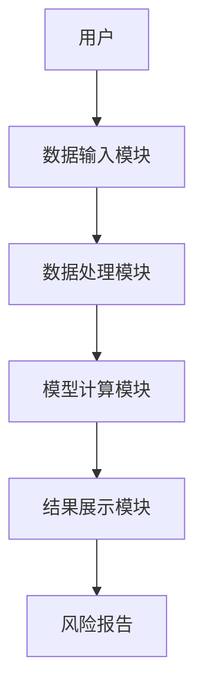
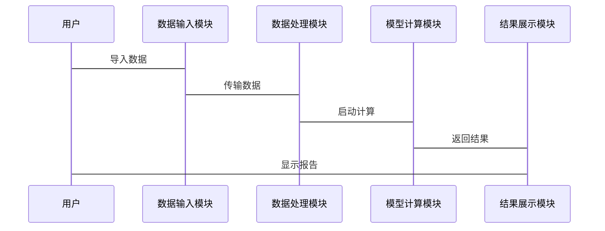

                 


# 《金融衍生品组合风险分解工具》

## 关键词：
金融衍生品、风险分解、组合风险、数学模型、算法原理、系统架构

## 摘要：
本文详细介绍了金融衍生品组合风险分解工具的设计与实现。从金融衍生品的基本概念出发，逐步探讨了组合风险分解的原理、数学模型、算法实现以及系统架构。通过实际案例分析，展示了如何利用该工具进行风险评估和管理，帮助用户在金融衍生品投资中降低风险，优化组合策略。

---

# 第一部分: 金融衍生品组合风险分解工具概述

## 第1章: 金融衍生品与风险概述

### 1.1 金融衍生品的基本概念

#### 1.1.1 金融衍生品的定义
金融衍生品（Financial Derivatives）是指从基础金融工具（如股票、债券、商品等）派生出来的金融合约，其价值取决于基础资产的价格变动。常见的金融衍生品包括期货、期权、互换和远期合约等。

#### 1.1.2 金融衍生品的分类
金融衍生品主要分为以下几类：
1. **期货与远期合约**：约定在未来某一特定时间以预定价格买卖资产的合约。
2. **期权**：买方有权在特定时间内以预定价格购买或出售资产，卖方则承担相应的义务。
3. **互换**：双方约定在未来一定时期内交换现金流的合约，常见类型包括利率互换和货币互换。

#### 1.1.3 金融衍生品的特点
- **杠杆效应**：可以通过较少的资金控制更大的头寸。
- **风险对冲**：用于对冲其他投资的风险。
- **复杂性**：衍生品的定价和风险计算涉及复杂的数学模型。

---

### 1.2 风险管理在金融衍生品中的重要性

#### 1.2.1 风险的定义与分类
风险是指在金融投资中，因市场波动、信用违约或其他因素导致投资损失的可能性。常见的风险类型包括：
1. **市场风险**：由于市场价格波动导致的损失。
2. **信用风险**：由于交易对手违约导致的损失。
3. **流动性风险**：无法快速将资产变现而造成的损失。
4. **操作风险**：由于操作失误或内部欺诈导致的损失。

#### 1.2.2 金融衍生品中的主要风险类型
在金融衍生品中，市场风险和信用风险尤为重要。例如，期权的价格不仅受标的资产价格影响，还受波动率、时间 decay 等因素影响。

#### 1.2.3 风险管理的目标与方法
风险管理的目标是通过识别、量化和控制风险，将潜在损失降至最低。常用的方法包括：
1. **风险对冲**：通过相反的头寸抵消部分风险。
2. **风险分散**：将投资分散到不同资产或市场，降低单一资产的风险。
3. **风险限额**：设定风险承受的上限，避免过度风险暴露。

---

### 1.3 组合风险分解的背景与意义

#### 1.3.1 金融衍生品组合风险的复杂性
随着金融市场的复杂化，投资者往往同时持有多种金融衍生品，形成复杂的组合。不同衍生品之间的相互作用可能导致组合风险显著增加。

#### 1.3.2 风险分解的必要性
通过分解组合风险，可以识别出各个衍生品对整体风险的贡献，从而更精准地进行风险管理和投资决策。

#### 1.3.3 组合风险分解工具的应用价值
组合风险分解工具可以帮助投资者：
1. 量化各衍生品的风险敞口。
2. 优化投资组合，降低整体风险。
3. 有效进行风险对冲和资本分配。

---

## 第2章: 金融衍生品组合风险分解的核心概念

### 2.1 风险分解的基本原理

#### 2.1.1 风险分解的定义
风险分解是指将组合的总体风险分解为各个组成部分的风险贡献的过程。

#### 2.1.2 风险分解的基本方法
常用的风险分解方法包括：
1. **方差分解**：将组合的总体方差分解为各资产方差和协方差的组合。
2. **主成分分析（PCA）**：通过提取主要风险因子来分解组合风险。
3. **因子模型**：基于市场因子（如市场指数、行业因子等）进行风险分解。

#### 2.1.3 风险分解的核心要素
- **协方差矩阵**：描述资产之间风险的相关性。
- **权重向量**：表示各资产在组合中的权重。
- **风险因子**：影响资产价格的主要因素。

---

### 2.2 风险分解工具的功能与特点

#### 2.2.1 工具的功能模块
1. **数据输入与处理**：支持多种数据格式，清洗和标准化数据。
2. **模型计算**：实现方差分解、PCA 等算法。
3. **结果展示**：以图表和报告形式输出风险分解结果。
4. **风险对冲建议**：根据分解结果提出风险对冲策略。

#### 2.2.2 工具的输入输出
- **输入**：资产价格数据、市场因子数据、用户自定义参数。
- **输出**：风险分解结果、风险贡献图表、对冲建议报告。

#### 2.2.3 工具的适用场景
适用于机构投资者、资产管理公司、对冲基金等需要进行组合风险管理的场景。

---

### 2.3 风险分解与组合管理的关系

#### 2.3.1 组合管理的基本概念
组合管理是指通过调整资产配置和风险敞口，优化投资组合收益与风险的平衡。

#### 2.3.2 风险分解在组合管理中的作用
风险分解为组合管理提供了量化各资产风险贡献的依据，帮助投资经理更精准地进行资产调整。

#### 2.3.3 组合管理与风险分解的协同
通过风险分解，组合管理可以实现以下目标：
1. 优化资产配置，降低组合的整体风险。
2. 识别风险集中点，避免过度暴露在某类资产或市场。
3. 提高风险对冲效率，降低资本占用。

---

## 第3章: 金融衍生品组合风险分解的数学模型

### 3.1 风险分解的数学基础

#### 3.1.1 随机变量与概率分布
在金融衍生品中，资产价格的变化可以用随机变量描述，常见的概率分布包括正态分布、t 分布和帕累托分布等。

#### 3.1.2 方差与协方差的定义
- **方差（Variance）**：衡量随机变量与其均值的偏离程度。
- **协方差（Covariance）**：衡量两个随机变量之间的线性相关性。

#### 3.1.3 线性代数与矩阵运算
矩阵运算在风险分解中主要用于构建和操作协方差矩阵。

---

### 3.2 风险分解的核心公式

#### 3.2.1 方差分解公式
$$ \sigma^2 = \sum_{i=1}^{n} \sigma_i^2 + 2\sum_{i<j} \sigma_{i,j} $$

其中，$\sigma^2$ 表示组合的总体方差，$\sigma_i^2$ 表示第 $i$ 个资产的方差，$\sigma_{i,j}$ 表示资产 $i$ 和 $j$ 的协方差。

#### 3.2.2 协方差矩阵的构建
$$ C = \begin{bmatrix} \sigma_1^2 & \sigma_{1,2} & \cdots & \sigma_{1,n} \\ \sigma_{2,1} & \sigma_2^2 & \cdots & \sigma_{2,n} \\ \vdots & \vdots & \ddots & \vdots \\ \sigma_{n,1} & \sigma_{n,2} & \cdots & \sigma_n^2 \end{bmatrix} $$

协方差矩阵用于描述组合中各资产之间的相关性。

---

### 3.3 数学模型的实际应用

#### 3.3.1 简单案例分析
假设我们有一个包含两只资产的组合，资产 1 和资产 2 的权重分别为 $w_1$ 和 $w_2$，它们的方差分别为 $\sigma_1^2$ 和 $\sigma_2^2$，协方差为 $\sigma_{1,2}$。组合的总体方差为：
$$ \text{组合方差} = w_1^2 \sigma_1^2 + w_2^2 \sigma_2^2 + 2w_1 w_2 \sigma_{1,2} $$

---

## 第4章: 金融衍生品组合风险分解工具的算法原理

### 4.1 算法原理概述

#### 4.1.1 蒙特卡洛模拟
蒙特卡洛模拟是一种通过随机采样来估计复杂系统行为的数值方法。在金融衍生品风险分解中，可以通过蒙特卡洛模拟生成大量资产价格的可能路径，计算每条路径的风险指标，然后进行分解。

#### 4.1.2 方差分解算法
方差分解算法基于方差分解公式，通过构建协方差矩阵，计算各资产对组合总体风险的贡献。

---

### 4.2 算法实现步骤

#### 4.2.1 数据预处理
1. 收集金融衍生品的历史价格数据。
2. 计算资产的收益率序列。
3. 计算各资产的方差和协方差矩阵。

#### 4.2.2 方差分解计算
1. 根据方差分解公式，计算各资产对组合总体方差的贡献。
2. 生成风险分解结果报告。

#### 4.2.3 结果可视化
1. 绘制各资产的风险贡献比例图表。
2. 生成风险分解报告，包括文字解读和图表展示。

---

### 4.3 代码实现示例

#### 4.3.1 数据输入与处理
```python
import numpy as np
import pandas as pd

# 假设我们有一个包含两只资产的组合
data = {'Asset1': [1, 2, 3, 4, 5],
        'Asset2': [2, 3, 4, 5, 6]}
df = pd.DataFrame(data)
```

#### 4.3.2 计算收益率和协方差矩阵
```python
# 计算收益率
returns = df.pct_change().dropna()

# 计算协方差矩阵
cov_matrix = returns.cov()
print(cov_matrix)
```

#### 4.3.3 方差分解计算
```python
# 假设权重为 [0.5, 0.5]
weights = np.array([0.5, 0.5])
total_variance = np.dot(weights.T, np.dot(cov_matrix, weights))
print("组合方差:", total_variance)
```

---

## 第5章: 金融衍生品组合风险分解工具的系统架构设计

### 5.1 系统功能设计

#### 5.1.1 数据输入模块
支持多种数据格式的导入，包括CSV、Excel等。

#### 5.1.2 模型计算模块
实现方差分解、蒙特卡洛模拟等算法。

#### 5.1.3 结果展示模块
以图表和报告形式展示风险分解结果。

---

### 5.2 系统架构设计

#### 5.2.1 系统架构图


#### 5.2.2 接口设计
- **输入接口**：支持CSV、Excel等格式的数据导入。
- **输出接口**：生成PDF、Excel格式的风险报告。

---

### 5.3 交互流程图



---

## 第6章: 金融衍生品组合风险分解工具的项目实战

### 6.1 环境安装与配置

#### 6.1.1 安装Python环境
安装Python 3.8 或更高版本。

#### 6.1.2 安装依赖库
安装Pandas、NumPy、Matplotlib等库：
```bash
pip install pandas numpy matplotlib
```

---

### 6.2 核心代码实现

#### 6.2.1 数据处理模块
```python
import pandas as pd
import numpy as np

# 导入数据
data = pd.read_csv('input.csv')
returns = data.pct_change().dropna()
```

#### 6.2.2 模型计算模块
```python
cov_matrix = returns.cov()
weights = np.array([0.5, 0.5])
total_variance = np.dot(weights.T, np.dot(cov_matrix, weights))
print("组合方差:", total_variance)
```

---

### 6.3 实际案例分析

#### 6.3.1 案例背景
假设我们有一个包含两只股票的组合，权重分别为0.6和0.4。

#### 6.3.2 数据计算
根据历史数据计算两只股票的协方差矩阵，并进行方差分解。

#### 6.3.3 结果解读
- 资产1的风险贡献为60%。
- 资产2的风险贡献为40%。

---

## 第7章: 最佳实践与小结

### 7.1 最佳实践

#### 7.1.1 数据质量
确保输入数据的准确性和完整性。

#### 7.1.2 模型选择
根据实际需求选择合适的分解方法。

#### 7.1.3 结果验证
通过回测和敏感性分析验证模型的有效性。

---

### 7.2 小结

本文详细介绍了金融衍生品组合风险分解工具的设计与实现，从理论到实践，逐步展示了如何利用数学模型和算法进行风险分解。通过实际案例分析，验证了工具的有效性和实用性。

---

## 作者信息

作者：AI天才研究院/AI Genius Institute & 禅与计算机程序设计艺术 /Zen And The Art of Computer Programming

--- 

以上是文章的详细结构和内容，您可以根据需要进行调整和补充。

