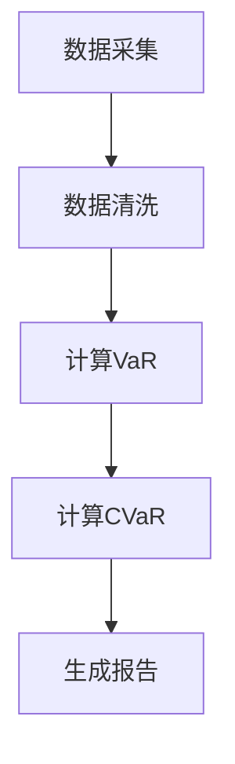
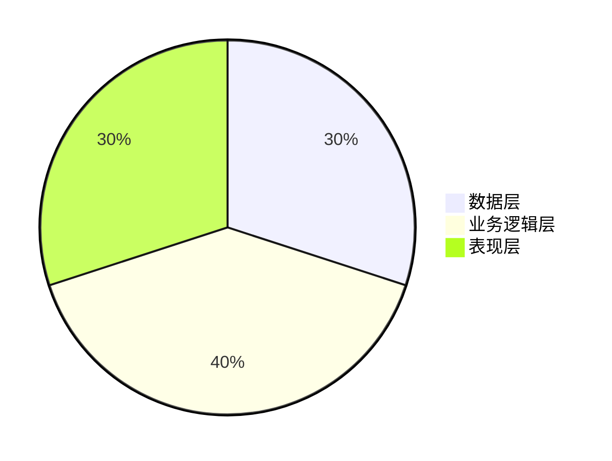

                 


# 《金融衍生品风险敞口分析》

> 关键词：金融衍生品，风险敞口，VaR，CVaR，风险分析，金融系统

> 摘要：本文深入探讨了金融衍生品风险敞口分析的核心概念、算法原理、系统架构及实际应用。通过理论分析与实践案例相结合的方式，系统性地阐述了如何利用量化方法和技术手段，准确评估和管理金融衍生品的风险敞口。文章内容涵盖从基础概念到高级算法的全链条分析，旨在为金融从业者和风险管理专家提供一份实用的参考手册。

---

## 第1章: 金融衍生品与风险敞口概述

### 1.1 金融衍生品的定义与特点

金融衍生品是一种金融合约，其价值依赖于基础资产（如股票、债券、商品等）的价格变动。衍生品主要包括期货、期权、互换和远期合约等类型。其核心特点如下：

- **杠杆效应**：衍生品通常具有杠杆效应，能够以较小的资金控制更大的市场头寸。
- **风险对冲**：衍生品主要用于对冲或投机，其价格波动往往比基础资产更为剧烈。
- **非线性风险**：与股票或债券等线性资产不同，衍生品的风险敞口通常是非线性的，尤其是在期权等复杂工具中。

---

### 1.2 风险敞口的定义与分类

风险敞口是指投资者在某一资产或市场中暴露于风险的程度。在金融衍生品中，风险敞口主要表现为价格波动对衍生品价值的影响。常见的风险敞口类型包括：

- **市场风险**：由于市场价格波动导致的风险敞口。
- **信用风险**：由于交易对手违约导致的风险敞口。
- **流动性风险**：由于市场流动性不足导致的风险敞口。

---

### 1.3 金融衍生品风险敞口分析的重要性

在金融衍生品交易中，准确评估风险敞口是确保交易安全和稳健收益的关键。通过风险敞口分析，金融机构可以：

- **量化风险**：通过VaR（风险价值）等指标量化潜在损失。
- **优化投资组合**：通过调整头寸降低整体风险敞口。
- **合规与监管**：满足监管机构对风险敞口的披露要求。

---

## 第2章: 金融衍生品风险敞口分析的核心概念

### 2.1 金融衍生品的定价与风险关系

衍生品的定价与风险密切相关。例如，期权的定价公式（Black-Scholes模型）中，波动率是一个关键参数，它直接影响期权的内在价值和时间价值。

#### 图表：Black-Scholes模型公式
$$ C = S_0 \Phi(d_1) - K e^{-rT} \Phi(d_2) $$
其中：
- $C$：期权的理论价格
- $S_0$：标的资产当前价格
- $K$：期权的执行价格
- $r$：无风险利率
- $T$：期权到期时间
- $\Phi$：标准正态分布的累积分布函数
- $d_1, d_2$：分别是 $d_1 = \frac{\ln(S_0/K) + (r + \sigma^2/2)T}{\sigma \sqrt{T}}$ 和 $d_2 = d_1 - \sigma \sqrt{T}$

---

### 2.2 风险敞口的度量方法

风险敞口的度量方法主要包括VaR和CVaR两种：

#### 2.2.1 VaR（风险价值）
VaR是指在给定置信水平下，可能的最大损失。例如，95%置信水平下的1天VaR表示在95%的概率下，未来1天的潜在损失不会超过VaR值。

#### 图表：VaR计算流程
1. 数据收集：获取金融衍生品的历史价格数据。
2. 计算收益率分布：假设收益率服从正态分布。
3. 计算VaR：根据置信水平查找对应的分位数，计算潜在损失。

#### 2.2.2 CVaR（条件风险价值）
CVaR是VaR的扩展，表示在VaR水平上的平均损失。CVaR通常用于风险厌恶型投资者，因为它考虑了尾部风险。

---

## 第3章: 金融衍生品风险敞口分析的算法原理

### 3.1 风险敞口分析的数学模型

#### 3.1.1 风险敞口的线性模型
对于简单的衍生品（如期货），风险敞口可以通过线性回归模型进行分析。例如，期货的风险敞口可以用以下公式表示：
$$ \text{风险敞口} = \beta \times \text{标的资产价格变化} $$
其中，$\beta$是期货的风险暴露系数。

#### 3.1.2 风险敞口的非线性模型
对于复杂的衍生品（如期权），风险敞口分析需要考虑非线性关系。Delta-Gamma模型是一种常用的非线性模型，其公式如下：
$$ \text{VaR} = \Delta \times \text{标的资产价格变化} + \Gamma \times (\text{标的资产价格变化})^2 $$
其中，$\Delta$是Delta，$\Gamma$是Gamma。

---

### 3.2 风险敞口分析的算法实现

#### 3.2.1 Python实现VaR计算
以下是使用Python计算VaR的示例代码：

```python
import numpy as np
import scipy.stats as stats

# 假设收益率数据
returns = np.array([...])

# 计算VaR（95%置信水平）
alpha = 0.05
sorted_returns = np.sort(returns)
quantile = np.quantile(sorted_returns, alpha)
VaR = -quantile

print(f"VaR at {1-alpha} confidence level: {VaR}")
```

#### 3.2.2 算法优化
为了提高计算效率，可以采用蒙特卡洛模拟方法来模拟标的资产的价格变化，并计算衍生品的风险敞口。

---

## 第4章: 金融衍生品风险敞口分析的系统架构

### 4.1 系统功能需求分析

#### 4.1.1 系统功能模块
- 数据采集模块：收集金融衍生品的价格数据和市场数据。
- 风险分析模块：计算VaR、CVaR等风险指标。
- 报告生成模块：输出风险敞口分析报告。

#### 4.1.2 系统功能流程图


---

### 4.2 系统架构设计

#### 4.2.1 系统架构选择
采用分层架构，包括数据层、业务逻辑层和表现层。

#### 4.2.2 系统架构图


---

## 第5章: 金融衍生品风险敞口分析的实战案例

### 5.1 环境安装

#### 5.1.1 安装Python环境
- 安装Python 3.8及以上版本。
- 安装必要的库：`numpy`, `pandas`, `scipy`, `matplotlib`。

---

### 5.2 核心代码实现

#### 5.2.1 计算VaR的代码
```python
import numpy as np

def calculate_var(returns, confidence_level=0.95):
    sorted_returns = np.sort(returns)
    alpha = 1 - confidence_level
    quantile = np.quantile(sorted_returns, alpha)
    VaR = -quantile
    return VaR

# 示例数据
returns = np.random.normal(0, 1, 1000)
VaR = calculate_var(returns)
print(f"VaR at {confidence_level} confidence level: {VaR}")
```

---

### 5.3 案例分析

#### 5.3.1 案例背景
假设我们有一个股票期权组合，需要计算其1天的95% VaR。

#### 5.3.2 分析过程
1. 收集标的股票的历史收益率数据。
2. 计算期权的Delta和Gamma。
3. 使用蒙特卡洛模拟计算期权的风险敞口。
4. 输出VaR和CVaR结果。

---

## 第6章: 总结与展望

### 6.1 本章小结
本文系统性地介绍了金融衍生品风险敞口分析的核心概念、算法原理和系统架构。通过实际案例分析，展示了如何利用技术手段量化和管理金融风险。

### 6.2 最佳实践Tips
- 在实际应用中，建议结合市场实际情况调整模型参数。
- 定期更新数据和模型，以应对市场变化。

### 6.3 展望
随着人工智能和大数据技术的发展，未来金融衍生品风险敞口分析将更加智能化和自动化。

---

## 作者：AI天才研究院/AI Genius Institute & 禅与计算机程序设计艺术 /Zen And The Art of Computer Programming

