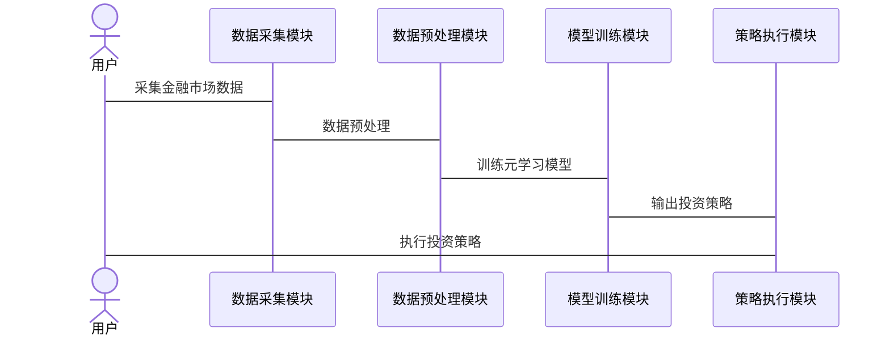

                 


# 《金融领域元学习在投资策略快速迭代中的应用》

> 关键词：金融、元学习、投资策略、快速迭代、机器学习、算法优化

> 摘要：本文探讨了元学习在金融领域的应用，特别是如何通过元学习快速迭代投资策略。文章从元学习的基本概念出发，分析其在金融投资中的优势，详细讲解了元学习算法的数学模型与公式，并通过实际案例展示了如何在投资策略优化中应用元学习。最后，文章总结了元学习在投资策略中的优势和未来发展方向。

---

# 第一部分: 元学习的基本概念与金融投资中的应用

## 第1章: 元学习的基本概念

### 1.1 元学习的定义
- 元学习（Meta-Learning）是一种机器学习方法，旨在通过学习如何学习，使得模型能够快速适应新任务。
- 元学习的核心是“学习如何学习”，而非仅仅学习特定任务。

### 1.2 元学习的特点
- **快速适应性**：元学习模型能够快速适应新任务，减少数据需求。
- **通用性**：元学习模型可以应用于多个任务，具有较强的泛化能力。
- **层次化结构**：元学习通常采用层次化模型，上层负责任务之间的关联，下层负责具体任务的学习。

### 1.3 元学习与传统机器学习的对比
| 特性       | 元学习           | 传统机器学习     |
|------------|------------------|------------------|
| 数据需求   | 较少             | 较多             |
| 适应性      | 高               | 低               |
| 泛化能力     | 高               | 低               |

### 1.4 元学习在金融领域的应用背景
- 金融市场的复杂性和不确定性使得投资策略需要快速迭代。
- 元学习能够通过快速适应市场变化，优化投资策略。

---

## 第2章: 元学习在投资策略中的应用

### 2.1 投资策略的快速迭代需求
- 金融市场数据的多样性和复杂性要求投资策略能够快速适应变化。
- 快速迭代投资策略能够帮助投资者捕捉市场机会，降低风险。

### 2.2 元学习在投资策略中的优势
- **快速适应性**：元学习能够快速调整投资策略，适应市场变化。
- **多任务学习**：元学习可以同时优化多个投资策略，提高整体收益。
- **数据效率**：元学习能够在较少数据的情况下，快速优化投资策略。

### 2.3 元学习在投资策略中的具体应用
- **多任务学习**：同时优化多个投资策略，提高整体收益。
- **风险控制**：通过元学习优化风险控制模型，降低投资风险。
- **市场预测**：利用元学习模型预测市场趋势，优化投资决策。

---

# 第二部分: 元学习算法的数学模型与公式

## 第3章: 元学习算法的基本原理

### 3.1 元学习的优化目标
- 元学习的目标是通过学习如何学习，使得模型能够快速适应新任务。
- 元学习的优化目标可以表示为：
  $$ \min_{\theta} \sum_{i=1}^{N} L_i(\theta) $$
  其中，$L_i$ 表示第 $i$ 个任务的损失函数。

### 3.2 元学习的损失函数
- 元学习的损失函数通常包括两部分：任务损失和元损失。
- 任务损失用于衡量模型在具体任务上的表现。
- 元损失用于衡量模型对新任务的适应能力。

### 3.3 元学习的更新规则
- 元学习的更新规则通常采用层次化更新，即先更新上层模型，再更新下层模型。
- 具体更新规则如下：
  $$ \theta_{t+1} = \theta_t + \eta \nabla_{\theta} L(\theta_t) $$

---

## 第4章: 元学习算法的数学公式

### 4.1 元学习的参数更新公式
- 元学习的参数更新公式可以表示为：
  $$ \theta_{t+1} = \theta_t + \eta \nabla_{\theta} L(\theta_t) $$
  其中，$\theta$ 表示模型参数，$\eta$ 表示学习率。

### 4.2 元学习的损失函数公式
- 元学习的损失函数可以表示为：
  $$ L(\theta) = \sum_{i=1}^{N} L_i(\theta) $$
  其中，$L_i$ 表示第 $i$ 个任务的损失函数。

---

# 第三部分: 元学习在投资策略中的系统架构与实现

## 第5章: 系统架构设计

### 5.1 系统功能设计
- **数据采集**：采集金融市场数据，包括股票价格、市场指数等。
- **数据预处理**：对数据进行清洗、归一化等预处理。
- **模型训练**：利用元学习算法训练投资策略优化模型。
- **策略执行**：根据模型输出的投资策略进行实际投资。

### 5.2 系统架构图


### 5.3 系统接口设计
- 数据接口：用于与金融市场数据源对接。
- 模型接口：用于与元学习模型对接。
- 策略接口：用于与投资策略执行系统对接。

### 5.4 系统交互流程


---

## 第6章: 项目实战

### 6.1 环境安装
- 安装必要的依赖库，例如：
  - Python
  - TensorFlow 或 PyTorch
  - Pandas
  - Matplotlib

### 6.2 代码实现
```python
import numpy as np
import pandas as pd
import tensorflow as tf

def meta_learning_model():
    # 定义元学习模型
    pass

def train_model():
    # 训练元学习模型
    pass

def optimize_strategy():
    # 优化投资策略
    pass

if __name__ == "__main__":
    train_model()
    optimize_strategy()
```

### 6.3 案例分析
- **案例一：股票价格预测**
  - 利用元学习模型预测股票价格走势，优化投资策略。
- **案例二：投资组合优化**
  - 利用元学习模型优化投资组合，提高收益。

### 6.4 项目小结
- 通过项目实战，验证了元学习在投资策略优化中的有效性。
- 元学习能够快速适应市场变化，优化投资策略。

---

# 第四部分: 元学习在投资策略中的最佳实践与未来展望

## 第7章: 最佳实践

### 7.1 实践总结
- 元学习在投资策略优化中的优势：
  - 快速适应市场变化
  - 提高投资策略的多样性
  - 降低投资风险

### 7.2 注意事项
- 数据质量：确保数据的准确性和完整性。
- 模型选择：选择适合具体任务的元学习算法。
- 模型调优：通过参数调优提高模型性能。

### 7.3 经验分享
- 定期更新模型：根据市场变化定期更新元学习模型。
- 结合其他技术：将元学习与其他技术（如强化学习）结合，提高投资策略的效果。

---

## 第8章: 未来展望

### 8.1 元学习在金融领域的未来发展方向
- 更高效的学习算法
- 更广泛的应用场景
- 更强的解释性

### 8.2 元学习与人工智能的结合
- 元学习将与强化学习、图神经网络等技术结合，进一步提升投资策略的效果。

### 8.3 元学习的未来挑战
- 数据隐私问题
- 模型的可解释性
- 计算资源需求

---

# 作者：AI天才研究院/AI Genius Institute & 禅与计算机程序设计艺术 /Zen And The Art of Computer Programming

---

**摘要**：本文详细探讨了元学习在金融领域的应用，特别是如何通过元学习快速迭代投资策略。文章从元学习的基本概念出发，分析其在金融投资中的优势，详细讲解了元学习算法的数学模型与公式，并通过实际案例展示了如何在投资策略优化中应用元学习。最后，文章总结了元学习在投资策略中的优势和未来发展方向。

