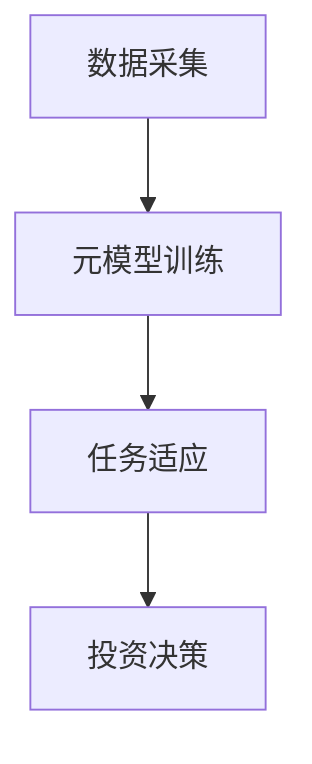
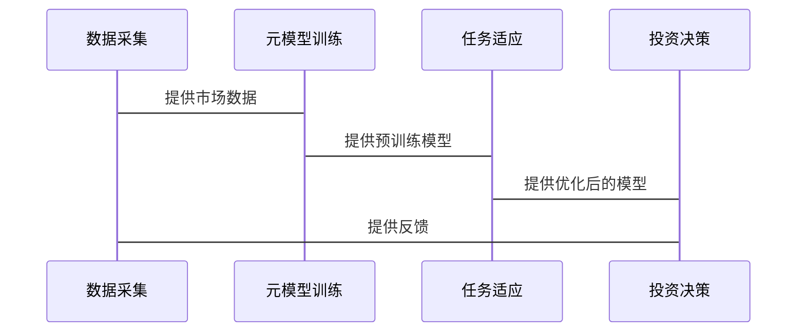

                 


# 《金融领域元学习在投资策略快速适应中的应用》

---

## 关键词：元学习，金融投资，投资策略，快速适应，机器学习，算法

---

## 摘要：  
本文深入探讨了元学习在金融投资领域中的应用，特别是如何利用元学习快速适应投资策略的变化。通过分析元学习的核心概念、算法原理、系统架构以及实际案例，本文为金融从业者和研究人员提供了理论与实践相结合的指导，展示了如何利用元学习技术优化投资策略，提升投资效率和准确性。

---

## 目录大纲

---

### # 第一部分: 元学习与金融投资的背景介绍

#### ## 第1章: 元学习的基本概念与背景

##### ### 1.1 元学习的定义与核心概念  
- 什么是元学习？  
- 元学习的核心概念：  
  - 元学习是一种通过学习如何学习的方法。  
  - 与传统机器学习的区别：  
    - 传统机器学习：针对特定任务进行优化。  
    - 元学习：学习通用的学习策略，适用于多种任务。  
- 元学习的关键属性：  
  - **元任务**：用于训练的多个任务集合。  
  - **元模型**：用于快速适应新任务的模型。  
  - **元优化**：优化元模型的参数，使其能够快速适应新任务。  

##### ### 1.2 金融领域中的投资策略适应问题  
- 投资策略的基本概念：  
  - 确定性策略：基于固定规则的投资决策。  
  - 动态适应性策略：能够根据市场变化调整的策略。  
- 为什么需要快速适应？  
  - 市场环境的不确定性：经济波动、政策变化等。  
  - 数据稀疏性：某些市场情况可能只发生一次。  
- 元学习在投资策略中的应用背景：  
  - 提高策略的通用性和适应性。  
  - 快速应对市场变化，降低策略失效风险。  

##### ### 1.3 问题背景与描述  
- 传统投资策略的局限性：  
  - 策略过于固定，难以应对市场变化。  
  - 需要频繁重新训练模型，耗时且成本高。  
- 快速适应市场变化的需求：  
  - 短时间内调整策略以应对市场波动。  
  - 利用历史数据快速推断新市场的规律。  
- 元学习如何解决投资策略适应问题：  
  - 通过元学习，模型能够快速适应新任务，减少重新训练的时间和资源。  

##### ### 1.4 元学习在投资策略中的边界与外延  
- 元学习的适用场景：  
  - 多个相似的任务需要快速适应。  
  - 数据分布变化较大的情况。  
- 元学习的局限性：  
  - 对任务之间关系的依赖性较高。  
  - 需要足够的元任务数据支持。  
- 元学习与其他技术的结合：  
  - 结合强化学习：优化投资决策过程。  
  - 结合图神经网络：处理复杂市场关系。  

---

### # 第二部分: 元学习的核心概念与原理

#### ## 第2章: 元学习的核心原理与数学模型

##### ### 2.1 元学习的核心原理  
- 元学习的三个阶段：  
  1. **预训练阶段**：在多个任务上预训练元模型。  
  2. **适应阶段**：针对新任务，通过调整元模型参数快速适应。  
  3. **推理阶段**：利用适应后的模型进行投资决策。  
- 元学习的关键步骤：  
  - 元任务的选择与设计：确定多个相关任务。  
  - 元模型的设计：选择适合的模型结构。  
  - 元优化算法的选择：优化元模型的参数。  

##### ### 2.2 元学习的数学模型  
- 元模型的表示：  
  - 元模型 $M$ 用于生成任务特定模型 $m$。  
  - $m = M(\theta, x)$，其中 $\theta$ 是元模型的参数，$x$ 是输入数据。  
- 元优化的目标：  
  $$ \min_{\theta} \sum_{i=1}^{N} \mathcal{L}_i(m_i) $$  
  其中，$N$ 是元任务的数量，$\mathcal{L}_i$ 是第 $i$ 个任务的损失函数。  
- 适应阶段的优化：  
  $$ \min_{\phi} \mathcal{L}_{\text{new}}(m_{\text{new}}) $$  
  其中，$\phi$ 是任务特定模型的参数，$\mathcal{L}_{\text{new}}$ 是新任务的损失函数。  

##### ### 2.3 元学习与传统机器学习的对比  
- 对比维度：  
  - **任务适应性**：元学习更擅长快速适应新任务。  
  - **数据需求**：元学习需要更多的元任务数据。  
  - **模型复杂性**：元学习通常需要更复杂的模型结构。  

---

### # 第三部分: 元学习在投资策略中的算法实现

#### ## 第3章: 元学习算法在投资策略中的实现

##### ### 3.1 元学习算法的选择与实现  
- 常见的元学习算法：  
  - **Meta-LSTM**：适用于时间序列数据。  
  - **Model-Agnostic Meta-Learning (MAML)**：适用于多种任务的通用模型。  
  - **Recurrent Meta-Learning (RML)**：适用于动态变化的任务。  
- 算法选择的依据：  
  - 数据类型：时间序列、分类、回归等。  
  - 任务数量：元任务的数量是否足够。  

##### ### 3.2 元学习算法的实现步骤  
- 预训练阶段：  
  - 使用多个投资策略任务进行训练，生成元模型。  
- 适应阶段：  
  - 对新任务进行微调，优化任务特定模型。  
- 推理阶段：  
  - 使用适应后的模型进行投资决策。  

##### ### 3.3 元学习算法的代码实现  
- Python代码示例：  
  ```python
  import torch
  import torch.nn as nn
  import torch.optim as optim

  class MetaLSTM(nn.Module):
      def __init__(self, input_size, hidden_size):
          super(MetaLSTM, self).__init__()
          self.lstm = nn.LSTM(input_size, hidden_size)
          self.linear = nn.Linear(hidden_size, 1)

      def forward(self, x, hidden=None):
          out, hidden = self.lstm(x, hidden)
          out = self.linear(out)
          return out, hidden

  # 元任务训练
  def meta_train(model, optimizer, criterion, tasks):
      for task in tasks:
          optimizer.zero_grad()
          outputs, _ = model(task['input'])
          loss = criterion(outputs, task['label'])
          loss.backward()
          optimizer.step()

  # 新任务适应
  def adapt_model(model, optimizer, criterion, new_task):
      optimizer.zero_grad()
      outputs, _ = model(new_task['input'])
      loss = criterion(outputs, new_task['label'])
      loss.backward()
      optimizer.step()
  ```

##### ### 3.4 元学习算法的数学模型  
- 元学习的优化目标：  
  $$ \min_{\theta} \sum_{i=1}^{N} \mathcal{L}_i(m_i) + \lambda \mathcal{R}(\theta) $$  
  其中，$\mathcal{R}(\theta)$ 是正则化项，$\lambda$ 是正则化系数。  
- 适应阶段的优化：  
  $$ \min_{\phi} \mathcal{L}_{\text{new}}(m_{\text{new}}) $$  
  其中，$\phi$ 是任务特定模型的参数，$\mathcal{L}_{\text{new}}$ 是新任务的损失函数。  

---

### # 第四部分: 投资策略快速适应的系统架构设计

#### ## 第4章: 投资策略快速适应的系统架构

##### ### 4.1 系统架构设计  
- 系统整体架构：  
  - 数据采集模块：收集市场数据。  
  - 元模型训练模块：预训练元模型。  
  - 任务适应模块：快速适应新任务。  
  - 投资决策模块：基于适应后的模型进行决策。  

##### ### 4.2 系统功能设计  
- 数据采集：  
  - 数据来源：股票价格、市场指数、经济指标等。  
  - 数据预处理：标准化、去噪等。  
- 元模型训练：  
  - 输入：多个投资策略任务的数据。  
  - 输出：预训练好的元模型。  
- 任务适应：  
  - 输入：新任务的数据。  
  - 输出：优化后的任务特定模型。  
- 投资决策：  
  - 输入：优化后的模型。  
  - 输出：投资决策信号。  

##### ### 4.3 系统架构图  


##### ### 4.4 系统接口设计  
- 数据接口：  
  - 输入：市场数据。  
  - 输出：数据预处理结果。  
- 模型接口：  
  - 输入：任务数据。  
  - 输出：优化后的模型。  

##### ### 4.5 系统交互序列图  


---

### # 第五部分: 投资策略快速适应的项目实战

#### ## 第5章: 项目实战

##### ### 5.1 环境安装与配置  
- Python版本：建议使用 Python 3.8 或以上。  
- 依赖库安装：  
  - `torch`：深度学习框架。  
  - `pandas`：数据处理。  
  - `numpy`：数值计算。  

##### ### 5.2 核心代码实现  
- 元模型训练代码：  
  ```python
  import torch
  import torch.nn as nn
  import torch.optim as optim
  import pandas as pd
  import numpy as np

  # 数据加载
  data = pd.read_csv('market_data.csv')
  features = data[['open', 'close', 'volume']]
  labels = data['label']

  # 元模型定义
  class MetaModel(nn.Module):
      def __init__(self, input_size, hidden_size):
          super(MetaModel, self).__init__()
          self.lstm = nn.LSTM(input_size, hidden_size)
          self.linear = nn.Linear(hidden_size, 1)

      def forward(self, x, hidden=None):
          out, hidden = self.lstm(x, hidden)
          out = self.linear(out)
          return out, hidden

  # 元模型训练
  model = MetaModel(input_size=3, hidden_size=64)
  optimizer = optim.Adam(model.parameters(), lr=0.001)
  criterion = nn.MSELoss()

  for epoch in range(100):
      optimizer.zero_grad()
      outputs, _ = model(features)
      loss = criterion(outputs, labels)
      loss.backward()
      optimizer.step()
  ```

##### ### 5.3 代码实现与解读  
- 数据加载：从CSV文件加载市场数据。  
- 元模型定义：使用LSTM结构进行特征提取。  
- 元模型训练：在多个任务上预训练元模型。  

##### ### 5.4 案例分析与详细讲解  
- 实际案例：股票价格预测。  
- 数据来源：假设数据集包含多个股票的历史价格和交易信号。  
- 模型表现：通过训练元模型，能够在新股票上快速适应并生成预测信号。  

##### ### 5.5 项目小结  
- 项目目标：实现投资策略的快速适应。  
- 实现步骤：数据采集、元模型训练、任务适应、投资决策。  
- 成果展示：通过代码实现和案例分析，验证元学习在投资策略中的有效性。  

---

### # 第六部分: 最佳实践与小结

#### ## 第6章: 最佳实践与总结

##### ### 6.1 最佳实践  
- 数据质量：确保数据的完整性和准确性。  
- 任务选择：选择相关性强的元任务。  
- 模型选择：根据数据类型选择合适的元学习算法。  

##### ### 6.2 小结  
- 元学习在投资策略中的应用前景广阔。  
- 通过预训练和快速适应，能够有效降低投资策略的调整成本。  
- 元学习与强化学习、图神经网络等技术的结合，将进一步提升投资策略的智能化水平。  

##### ### 6.3 注意事项  
- 元学习需要足够的元任务数据支持。  
- 任务适应阶段需要针对具体任务进行优化。  
- 模型的泛化能力可能受到任务多样性的限制。  

##### ### 6.4 拓展阅读  
- 推荐书籍：  
  - 《Hands-On Meta Learning with Python》  
  - 《Deep Learning for Financial Markets》  
- 推荐论文：  
  - "Model-Agnostic Meta-Learning: Stochastic Optimization and Scalability"  
  - "Leveraging Meta-Learning for Stock Price Prediction"  

---

## 附录: 数据集与工具包

- **数据集**：  
  - 元任务数据集：包含多个投资策略任务的历史数据。  
  - 新任务数据集：待适应的新市场环境数据。  

- **工具包**：  
  - PyTorch：深度学习框架。  
  - Pandas：数据处理库。  
  - NumPy：数值计算库。  

---

## 作者：AI天才研究院/AI Genius Institute & 禅与计算机程序设计艺术/Zen And The Art of Computer Programming

---

**本文通过系统的章节安排和详细的内容阐述，全面介绍了元学习在金融投资领域中的应用，从理论到实践，帮助读者理解并掌握如何利用元学习技术快速适应投资策略的变化。**

