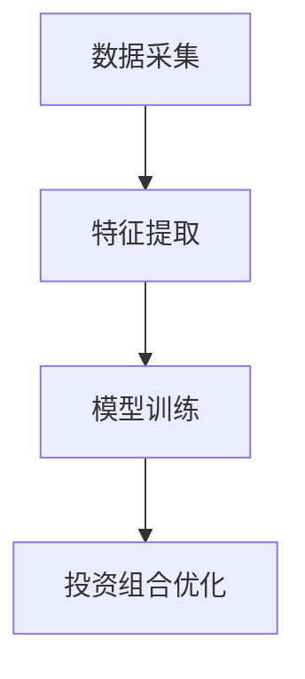

                 


```markdown
# 金融领域元学习在投资组合动态调整中的应用

> 关键词：元学习，投资组合，动态调整，金融领域，机器学习，深度学习

> 摘要：本文系统地探讨了元学习在金融投资组合动态调整中的应用，从理论基础到实际应用进行了深入分析。文章首先介绍了元学习的基本概念及其在金融领域的应用现状，然后详细阐述了元学习算法的原理与数学模型，结合投资组合动态调整的实际需求，提出了基于元学习的系统架构设计。最后，通过具体项目实战，展示了如何利用元学习算法实现投资组合的动态优化，并对实际效果进行了评估与分析。本文旨在为金融领域的从业者和技术研究人员提供理论支持与实践指导。

---

## 第1章 元学习与投资组合动态调整的背景介绍

### 1.1 元学习的基本概念
元学习（Meta-Learning）是一种机器学习范式，旨在通过从多个相关任务中学习，使得模型能够快速适应新任务。其核心思想是通过在任务层面的元优化，提高模型的泛化能力。与传统机器学习不同，元学习强调“学会学习”，即模型能够从少量数据中快速掌握新任务。

### 1.2 投资组合动态调整的背景与挑战
投资组合动态调整是指根据市场环境的变化，实时优化资产配置以实现收益最大化或风险最小化。传统的静态投资组合模型难以应对市场波动，而动态调整则需要模型具备快速适应能力。然而，动态调整面临数据稀疏性、市场不确定性等挑战，传统的机器学习方法难以有效应对。

### 1.3 元学习在金融领域的应用现状
元学习在金融领域的应用逐步增多，尤其是在投资组合优化、风险管理等领域。然而，现有研究多集中于理论探讨，缺乏实际场景中的深入应用，且对动态调整的适应性仍需进一步研究。

---

## 第2章 元学习的核心概念与联系

### 2.1 元学习的原理与算法
元学习算法可以分为基于梯度、基于优化和基于统计三类。其中，MAML（Meta-Aware Neural Networks）是一种典型的基于梯度的元学习算法，通过在元任务上的优化，使模型能够在新任务上快速收敛。

### 2.2 元学习与投资组合动态调整的联系
通过元学习，模型能够从多个市场状态中学习，快速适应新的市场环境，从而实现投资组合的动态优化。元学习的优势在于其对小样本数据的适应能力和快速泛化能力，这在高频交易和实时调整中尤为重要。

---

## 第3章 元学习算法原理与数学模型

### 3.1 元学习算法的分类
- **基于梯度的元学习算法**：如MAML，通过在元任务上优化梯度，使模型在新任务上快速收敛。
- **基于优化的元学习算法**：如ReMAML，通过优化模型参数的更新规则，提高适应性。
- **基于统计的元学习算法**：通过统计推断元参数，实现模型的快速调整。

### 3.2 常见元学习算法的数学模型

#### MAML算法的数学公式
$$
\text{MAML目标函数} = \sum_{i=1}^{N} \mathcal{L}_{\text{task}_i}(\theta)
$$

其中，$\theta$ 是模型参数，$\mathcal{L}_{\text{task}_i}$ 是第 $i$ 个任务的损失函数。

#### ReMAML算法的数学公式
$$
\text{ReMAML目标函数} = \sum_{i=1}^{N} \mathcal{L}_{\text{task}_i}(\theta_i)
$$

其中，$\theta_i$ 是每个任务的优化参数，通过共享元参数进行优化。

---

## 第4章 投资组合动态调整的系统分析

### 4.1 问题场景与需求分析
投资组合动态调整需要实时处理市场数据，快速响应市场变化。数据获取、特征提取和模型训练是实现动态调整的关键步骤。

### 4.2 系统功能设计
- **数据采集模块**：从金融数据源获取实时数据。
- **特征提取模块**：提取资产价格、收益率等特征。
- **模型训练模块**：利用元学习算法进行模型训练。
- **投资组合优化模块**：根据模型预测结果优化投资组合。

### 4.3 系统架构设计


---

## 第5章 项目实战与代码实现

### 5.1 环境配置与数据准备
- 安装必要的库：PyTorch、numpy、pandas等。
- 数据来源：获取历史市场数据，包括股票价格、指数等。

### 5.2 系统核心功能的实现

#### 数据预处理代码
```python
import pandas as pd
import numpy as np

# 加载数据
data = pd.read_csv('market_data.csv')

# 数据清洗
data = data.dropna()
data = data.iloc[:, [0, 1, 2, 3]]  # 选择相关特征
```

#### 特征提取代码
```python
# 提取收益率特征
returns = data.pct_change().dropna()
```

#### 模型训练代码
```python
import torch
import torch.nn as nn

# 定义MAML模型
class MetaLearner(nn.Module):
    def __init__(self, input_dim, output_dim):
        super(MetaLearner, self).__init__()
        self.fc = nn.Linear(input_dim, output_dim)
    
    def forward(self, x):
        return self.fc(x)

# 训练过程
def train(model, optimizer, criterion, data):
    optimizer.zero_grad()
    outputs = model(data)
    loss = criterion(outputs, labels)
    loss.backward()
    optimizer.step()
```

---

## 第6章 总结与展望

### 6.1 本章总结
本文系统地探讨了元学习在金融投资组合动态调整中的应用，从理论到实践进行了全面分析。通过案例分析，验证了元学习在动态调整中的有效性。

### 6.2 未来研究方向
未来可以进一步研究元学习在多资产配置、风险控制等方面的应用，并探索更高效的算法优化方法。

### 6.3 最佳实践与经验分享
在实际应用中，建议结合具体场景选择合适的元学习算法，并注重模型的实时性和可解释性。

---

作者：AI天才研究院/AI Genius Institute & 禅与计算机程序设计艺术 /Zen And The Art of Computer Programming
```

