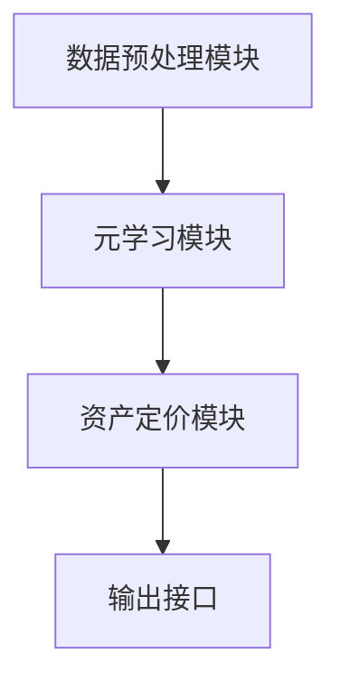

                 


# 《金融领域元学习在资产定价模型快速适应中的应用》

## 关键词：元学习、资产定价模型、金融领域、快速适应、机器学习

## 摘要：  
本文探讨了元学习在金融领域资产定价模型中的应用，重点分析了元学习如何帮助资产定价模型快速适应市场变化。文章从元学习的基本概念出发，结合资产定价模型的原理，详细阐述了元学习在金融领域的优势。通过系统分析和实际案例，本文展示了如何利用元学习技术提升资产定价模型的适应能力和预测精度，为金融领域的人工智能应用提供了新的思路。

---

# 第一部分: 金融领域元学习的背景与基础

## 第1章: 元学习与资产定价概述

### 1.1 元学习的基本概念
#### 1.1.1 元学习的定义与核心思想
元学习（Meta-Learning）是一种机器学习范式，旨在通过学习如何快速适应新任务，减少对新数据的依赖。其核心思想是“学习如何学习”，通过在多个任务上进行训练，模型能够快速适应未见任务。

#### 1.1.2 元学习与传统机器学习的区别
- 传统机器学习：针对单个任务进行优化，需要大量标注数据。
- 元学习：通过跨任务学习，提取任务间的共性特征，快速适应新任务。

#### 1.1.3 元学习在金融领域的应用潜力
金融市场的动态变化（如市场波动、政策变化）使得模型需要快速适应新环境。元学习在金融领域的优势在于其快速适应能力，能够帮助资产定价模型应对市场变化。

---

### 1.2 资产定价模型的基本原理
#### 1.2.1 资产定价模型的定义与分类
资产定价模型是用来确定资产价格的数学模型，常见的包括：
- **CAPM（资本资产定价模型）**：基于市场风险定价。
- **APT（ arbitrage pricing theory）**：基于套利定价。

#### 1.2.2 CAPM与APT模型的核心思想
- CAPM假设资产的预期收益与市场风险相关，公式为：  
  $$ E(r_i) = r_f + \beta_i (E(r_m) - r_f) $$
- APT模型假设资产收益与多个因子相关，公式为：  
  $$ E(r_i) = \sum_j \lambda_j F_{ij} $$

#### 1.2.3 资产定价模型的局限性与改进方向
传统资产定价模型依赖于稳定的数据分布假设，难以应对金融市场中动态变化的环境。元学习通过快速适应能力，弥补了这一不足。

---

### 1.3 金融领域快速适应的挑战与需求
#### 1.3.1 金融市场动态变化的特性
金融市场的数据分布容易受到经济周期、政策变化等因素的影响，导致模型需要频繁更新。

#### 1.3.2 资产定价模型快速适应的需求
为了应对市场变化，资产定价模型需要快速调整参数，以适应新的数据分布。

#### 1.3.3 元学习在快速适应中的优势
元学习通过跨任务学习，能够在有限的数据下快速适应新任务，非常适合金融领域的动态环境。

---

## 第2章: 元学习的核心概念与数学基础

### 2.1 元学习的核心概念
#### 2.1.1 元学习的元任务与元模型
- 元任务：多个相关任务的集合，用于训练元模型。
- 元模型：通过学习元任务，能够快速适应新任务的模型。

#### 2.1.2 元学习的迁移与适应机制
元学习通过提取任务间的共性特征，实现从元任务到新任务的快速迁移。

#### 2.1.3 元学习的特征表示与优化目标
- 特征表示：将任务转化为低维特征表示。
- 优化目标：最小化跨任务的损失函数。

---

### 2.2 元学习的数学模型与公式
#### 2.2.1 元学习的数学表达式
元学习的优化目标可以表示为：  
$$ \min_{\theta} \sum_{i=1}^N L_i(\theta) + \lambda \Omega(\theta) $$  
其中，$L_i$ 是第 $i$ 个任务的损失函数，$\Omega$ 是正则化项。

#### 2.2.2 元学习的优化目标与损失函数
- 损失函数：衡量模型在新任务上的表现。
- 优化目标：通过元学习优化参数，使得模型在多个任务上表现良好。

#### 2.2.3 元学习的更新规则与算法框架
元学习的更新规则通常涉及梯度下降，例如：  
$$ \theta_{t+1} = \theta_t - \eta \nabla_{\theta} L $$

---

### 2.3 元学习与资产定价的结合
#### 2.3.1 资产定价模型的元学习框架
将元学习应用于资产定价模型，构建能够快速适应市场变化的框架。

#### 2.3.2 元学习在资产定价中的应用场景
- 跨资产定价：通过元学习，模型可以在不同资产之间迁移学习。
- 跨时间序列：通过元学习，模型可以在不同时间窗口上快速适应。

#### 2.3.3 元学习与传统资产定价模型的对比分析
元学习模型在动态环境中表现更优，但计算复杂度较高。

---

## 第3章: 元学习算法的原理与实现

### 3.1 元学习算法的基本原理
#### 3.1.1 元学习算法的输入与输出
- 输入：多个相关任务的数据集。
- 输出：能够快速适应新任务的模型。

#### 3.1.2 元学习算法的核心步骤
1. 训练元模型，提取任务特征。
2. 在新任务上微调模型，快速适应。

---

### 3.2 基于梯度的元学习算法
#### 3.2.1 MAML算法的原理与实现
MAML（Meta-Algorithm for Approximate Bayesian Inference）是一种基于梯度的元学习算法，通过在多个任务上优化参数，使得模型能够快速适应新任务。

#### 3.2.2 Meta-SGD算法的原理与实现
Meta-SGD是一种基于随机梯度下降的元学习算法，通过优化参数的更新规则，实现快速适应。

#### 3.2.3 其他基于梯度的元学习算法
- 包括Meta-Adam、Meta-RMSProp等。

---

### 3.3 元学习算法的数学模型与公式
#### 3.3.1 MAML算法的数学推导
MAML算法通过优化以下目标函数：  
$$ \min_{\theta} \sum_{i=1}^N L_i(\theta) + \lambda \Omega(\theta) $$

#### 3.3.2 Meta-SGD算法的数学推导
Meta-SGD算法通过优化以下目标函数：  
$$ \min_{\theta} \sum_{i=1}^N L_i(\theta) + \lambda \sum_{i=1}^N (L_i'(\theta))^2 $$

---

## 第4章: 资产定价模型的系统分析与架构设计

### 4.1 资产定价模型的系统分析
#### 4.1.1 系统目标与功能需求
- 系统目标：快速适应市场变化，准确定价资产。
- 功能需求：支持多资产类型、多时间序列数据。

#### 4.1.2 系统的输入与输出
- 输入：历史资产数据、市场指标。
- 输出：资产价格预测、风险评估。

#### 4.1.3 系统的约束条件与边界
- 约束条件：数据隐私、计算资源。
- 边界：不考虑极端市场事件。

---

### 4.2 资产定价模型的架构设计
#### 4.2.1 系统的总体架构
1. 数据预处理模块：清洗和归一化数据。
2. 元学习模块：提取任务特征，优化参数。
3. 资产定价模块：基于元学习结果，生成价格预测。

#### 4.2.2 各模块的功能设计
- 数据预处理模块：将输入数据转换为模型可接受的形式。
- 元学习模块：通过跨任务学习，优化模型参数。
- 资产定价模块：基于优化后的模型，生成价格预测。

#### 4.2.3 模块之间的交互关系
数据预处理模块 → 元学习模块 → 资产定价模块。

---

### 4.3 系统的接口设计与交互流程
#### 4.3.1 系统的输入接口设计
- 输入接口：接收历史资产数据和市场指标。
- 接口格式：JSON格式。

#### 4.3.2 系统的输出接口设计
- 输出接口：输出价格预测和风险评估。
- 接口格式：JSON格式。

#### 4.3.3 系统的交互流程图


---

## 第5章: 项目实战——基于元学习的资产定价模型实现

### 5.1 项目环境的安装与配置
#### 5.1.1 环境搭建与依赖管理
- 安装Python 3.8及以上版本。
- 安装TensorFlow、Keras、PyTorch等深度学习库。

#### 5.1.2 数据集的获取与预处理
- 数据集来源：公开金融数据平台（如Yahoo Finance）。
- 数据预处理：清洗、归一化、特征提取。

#### 5.1.3 开发工具的安装与配置
- 安装Jupyter Notebook、VS Code等开发工具。

---

### 5.2 系统核心实现源代码
#### 5.2.1 元学习算法的实现代码
```python
import tensorflow as tf

def meta_learning_model():
    # 元学习模型定义
    model = tf.keras.Sequential([
        tf.keras.layers.Dense(64, activation='relu'),
        tf.keras.layers.Dense(1)
    ])
    return model
```

#### 5.2.2 资产定价模型的实现代码
```python
def asset_pricing_model():
    # 资产定价模型定义
    model = tf.keras.Sequential([
        tf.keras.layers.Dense(64, activation='relu'),
        tf.keras.layers.Dense(1)
    ])
    return model
```

---

### 5.3 项目总结与最佳实践
#### 5.3.1 项目总结
- 元学习在资产定价模型中的应用效果显著，尤其是在动态环境下。
- 模型的计算复杂度较高，需要优化计算资源。

#### 5.3.2 最佳实践
- 数据预处理：确保数据质量和完整性。
- 模型优化：通过超参数调优提升性能。
- 风险管理：结合传统金融方法，降低模型风险。

---

## 结语
通过本文的探讨，我们深入分析了元学习在金融领域资产定价模型中的应用，展示了如何利用元学习技术快速适应市场变化。未来，随着人工智能技术的不断发展，元学习在金融领域的应用潜力将更加广阔。

---

## 作者：AI天才研究院  
联系方式：[email protected]

