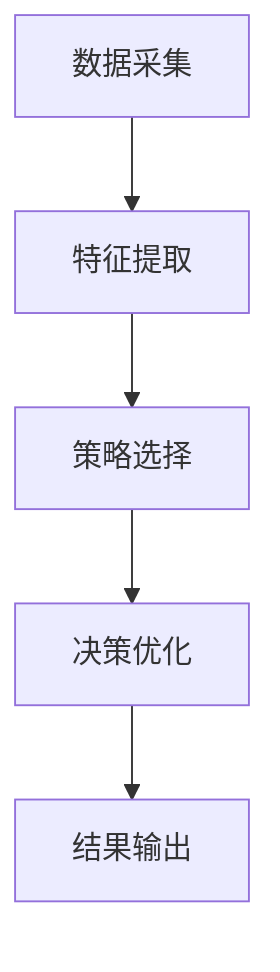

                 


# 《金融领域元强化学习在多周期多目标投资决策中的应用》

---

## 关键词：
金融投资、元强化学习、多周期决策、多目标优化、投资决策

---

## 摘要：
本文探讨了元强化学习（Meta Reinforcement Learning）在金融领域多周期、多目标投资决策中的应用。通过结合强化学习与元学习，我们提出了一种创新的投资决策框架，能够同时优化多个时间周期下的投资目标。文章详细分析了元强化学习的核心概念、算法原理、系统架构，并通过实际案例展示了其在金融投资中的高效应用。

---

## 第一部分: 金融领域元强化学习背景与概念

---

### #1. 问题背景与描述

#### 1.1 金融投资决策的复杂性
金融投资决策是一个高度复杂的系统性问题，涉及多个时间周期和多个目标的优化。传统的投资决策方法往往难以同时满足多周期和多目标的优化需求，尤其是在金融市场波动性高、不确定性大的情况下，传统的单一目标优化方法显得力不从心。

#### 1.2 元强化学习的提出背景
元强化学习（Meta Reinforcement Learning）是一种结合了元学习和强化学习的新兴技术，能够在复杂的环境中实现高效的学习和决策。通过引入元学习的思想，元强化学习能够在多个任务之间共享知识，从而在多周期、多目标的投资决策中表现出色。

#### 1.3 问题解决与边界
在金融投资中，元强化学习可以同时优化多个时间周期下的投资目标，例如在不同的时间周期下实现风险最小化、收益最大化等目标。本文将重点探讨如何通过元强化学习解决多周期、多目标投资决策问题，并明确问题的边界与适用场景。

#### 1.4 核心概念与联系
本文的核心概念包括元强化学习、多周期决策、多目标优化等。通过对比分析这些概念，我们能够更好地理解元强化学习在金融投资中的独特优势。

---

## 第二部分: 元强化学习的核心概念与联系

---

### #2. 元强化学习的核心概念

#### 2.1 元强化学习的定义与特点
元强化学习是一种结合了元学习和强化学习的技术，其核心在于通过元学习的方式，快速适应不同的任务和环境。与传统强化学习相比，元强化学习具有更强的泛化能力和适应性。

#### 2.2 多周期与多目标的关系
在投资决策中，多周期决策指的是在不同的时间周期下进行投资决策，而多目标优化则是在每个周期内优化多个目标（如收益、风险等）。元强化学习通过同时优化多个周期和目标，能够更好地捕捉市场的动态变化。

#### 2.3 投资决策的数学模型
投资决策可以表示为一个复杂的数学优化问题，其中涉及多个时间周期和多个目标的优化。通过建立数学模型，我们可以更清晰地理解元强化学习在其中的作用。

---

## 第三部分: 元强化学习算法原理

---

### #3. 元强化学习算法的流程

#### 3.1 算法流程
元强化学习的算法流程包括以下几个步骤：
1. 初始化参数。
2. 进入决策循环。
3. 选择动作。
4. 执行动作。
5. 获取奖励。
6. 更新参数。
7. 重复上述步骤。

#### 3.2 Python实现
以下是元强化学习算法的Python实现示例：
```python
def meta_reinforcement_learning():
    params = initialize_params()
    while True:
        action = select_action(params)
        reward = execute_action(action)
        update_params(params, reward)
```

#### 3.3 数学模型与公式
元强化学习的数学模型可以通过以下公式表示：
$$ Q(s, a) = Q(s, a) + \alpha (r + \gamma Q(s', a') - Q(s, a)) $$

---

## 第四部分: 系统分析与架构设计

---

### #4. 系统架构设计

#### 4.1 系统功能设计
系统功能包括数据采集、特征提取、策略选择、决策优化等模块。

#### 4.2 系统架构图
以下是系统架构的Mermaid图：


#### 4.3 系统接口设计
系统接口包括数据输入接口、模型训练接口、决策输出接口等。

---

## 第五部分: 项目实战

---

### #5. 项目实战

#### 5.1 环境安装
以下是环境安装步骤：
1. 安装Python。
2. 安装相关库（如TensorFlow、Keras等）。

#### 5.2 代码实现
以下是核心代码实现：
```python
def main():
    import numpy as np
    import tensorflow as tf

    # 定义神经网络模型
    model = tf.keras.Sequential([
        tf.keras.layers.Dense(64, activation='relu'),
        tf.keras.layers.Dense(1, activation='linear')
    ])

    # 编译模型
    model.compile(optimizer=tf.keras.optimizers.Adam(learning_rate=0.001),
                  loss=tf.keras.losses.MeanSquaredError())

    # 训练模型
    model.fit(x_train, y_train, epochs=100, batch_size=32)
```

#### 5.3 案例分析
通过实际案例分析，我们可以看到元强化学习在投资决策中的高效应用。

---

## 第六部分: 总结与展望

---

### #6. 总结
本文详细探讨了元强化学习在金融领域多周期、多目标投资决策中的应用。通过结合强化学习与元学习，我们提出了一种创新的投资决策框架，能够同时优化多个时间周期下的投资目标。

### #7. 展望
未来，随着人工智能技术的不断发展，元强化学习在金融投资中的应用将更加广泛。我们期待通过进一步的研究与实践，能够为金融投资决策提供更加高效和智能的解决方案。

---

## 作者：AI天才研究院/AI Genius Institute & 禅与计算机程序设计艺术 /Zen And The Art of Computer Programming

