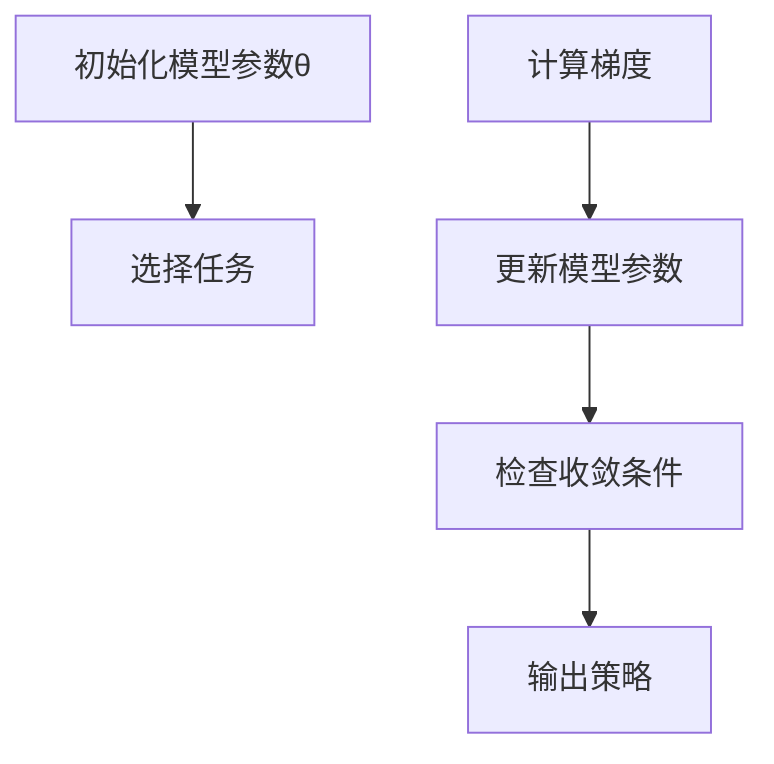
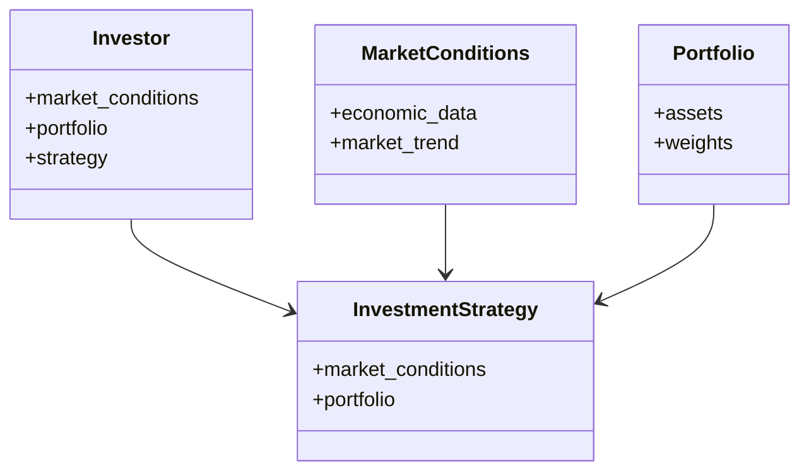

                 


# 金融领域元强化学习在多周期投资决策中的应用

> 关键词：元强化学习，多周期投资决策，金融领域，深度学习，强化学习，投资组合优化

> 摘要：本文深入探讨了元强化学习在金融领域多周期投资决策中的应用，分析了其核心概念、算法原理、系统架构及实际案例，旨在为金融投资提供创新的决策支持。

---

# 第一部分: 金融领域元强化学习的背景与基础

## 第1章: 元强化学习与多周期投资决策概述

### 1.1 元强化学习的定义与特点

元强化学习（Meta-Reinforcement Learning）是一种新兴的深度学习技术，旨在通过元学习（Meta-Learning）提升强化学习（Reinforcement Learning, RL）的效率和泛化能力。与传统RL不同，Meta-RL通过学习多个任务的共同特征，能够在较少数据和时间下快速适应新环境。

**特点：**

1. **快速适应性**：Meta-RL能够快速适应新任务，减少对大量数据的依赖。
2. **多任务学习**：通过学习多个任务的共同特征，提升模型的泛化能力。
3. **层次化结构**：采用层次化架构，将复杂问题分解为多个子问题。

### 1.2 多周期投资决策的背景与挑战

多周期投资决策涉及在多个时间周期内优化投资组合，以实现收益最大化或风险最小化。传统方法依赖统计套利和因子分析，但面临数据稀疏性、非线性关系等挑战，难以适应复杂市场环境。

### 1.3 元强化学习在金融领域的应用前景

元强化学习在金融中的潜力巨大，尤其在高频交易和投资组合管理方面。通过Meta-RL，模型可以快速适应市场变化，优化交易策略，提升投资收益。

---

## 第2章: 元强化学习的核心概念与联系

### 2.1 元强化学习的原理

元强化学习结合了元学习和强化学习，通过学习任务间的共同特征，提升模型在新环境中的适应能力。其核心在于构建层次化架构，学习快速调整策略的能力。

### 2.2 元强化学习与传统强化学习的对比

| **特征**          | **传统强化学习**          | **元强化学习**            |
|-------------------|--------------------------|--------------------------|
| 适应新任务        | 需要大量数据和时间         | 快速适应                 |
| 泛化能力           | 较弱                     | 较强                     |
| 计算效率           | 较低                     | 较高                     |

### 2.3 元强化学习的ER实体关系图

```mermaid
er
actor(投资者)
  --> investment_strategy(投资策略)
  --> market_conditions(市场条件)
  --> portfolio(投资组合)
market_conditions --> investment_strategy
portfolio --> investment_strategy
```

---

## 第3章: 元强化学习的数学模型与算法原理

### 3.1 元强化学习的数学模型

元强化学习的核心是元学习目标函数，定义如下：

$$ L = \sum_{i=1}^{N} L_i(\theta) $$

其中，$\theta$ 是模型参数，$N$ 是任务数量。优化目标为：

$$ \theta^* = \arg\min_{\theta} L $$

### 3.2 元强化学习的算法流程



---

## 第4章: 元强化学习在多周期投资决策中

### 4.1 投资决策的场景介绍

多周期投资决策涉及在不同时间周期内优化投资组合，考虑市场波动、经济指标等多因素。

### 4.2 系统架构设计



### 4.3 项目实战

#### 4.3.1 环境安装

```bash
pip install gym numpy tensorflow
```

#### 4.3.2 核心代码实现

```python
import numpy as np
import tensorflow as tf
import gym

# 定义元强化学习模型
class MetaRL(tf.keras.Model):
    def __init__(self):
        super(MetaRL, self).__init__()
        self.encoder = ...  # 编码器
        self.decoder = ...  # 解码器

    def call(self, inputs):
        # 编码输入
        encoded = self.encoder(inputs)
        # 解码策略
        return self.decoder(encoded)

# 定义投资策略优化
def optimize_portfolio(portfolio, market_conditions):
    # 使用MetaRL优化投资组合
    model = MetaRL()
    # 训练模型
    model.fit(portfolio, market_conditions)
    return model.predict()

# 应用案例
portfolio = np.random.randn(10, 5)
market_conditions = np.random.randn(10, 3)
optimized_portfolio = optimize_portfolio(portfolio, market_conditions)
print("优化后的投资组合:", optimized_portfolio)
```

---

## 第5章: 最佳实践与总结

### 5.1 最佳实践

1. **数据质量**：确保数据的完整性和准确性。
2. **模型选择**：根据具体场景选择合适的模型架构。
3. **实时监控**：持续监控模型性能，及时调整参数。

### 5.2 小结

元强化学习为金融投资提供了新的思路，通过快速适应市场变化，优化投资决策，提升收益。

### 5.3 注意事项

1. **计算资源**：元强化学习需要大量计算资源。
2. **模型解释性**：提升模型的可解释性，便于实际应用。

### 5.4 拓展阅读

建议阅读相关论文和书籍，深入理解元强化学习的理论与实践。

---

# 作者：AI天才研究院 & 禅与计算机程序设计艺术

---

通过以上目录，文章详细阐述了元强化学习在金融投资中的应用，从基础概念到算法实现，再到实际案例，帮助读者全面理解该技术。

