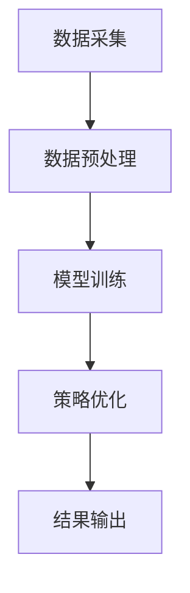
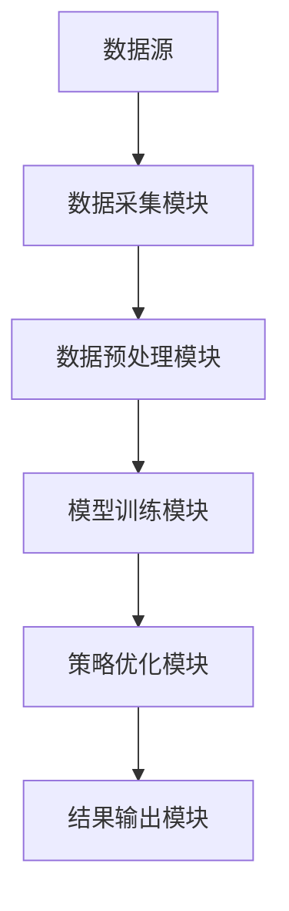

                 


# 《金融领域元强化学习在多周期资产配置中的应用》

> 关键词：元强化学习，多周期资产配置，金融投资，强化学习，智能决策

> 摘要：  
在金融市场中，资产配置是一个复杂且动态变化的过程，传统的资产配置方法在面对多周期决策时往往显得力不从心。元强化学习作为一种新兴的人工智能技术，能够有效处理多周期资产配置中的复杂决策问题。本文将深入探讨元强化学习在金融领域的应用，分析其在多周期资产配置中的优势，并结合实际案例，详细阐述其算法实现和系统架构设计，为金融领域的智能化投资提供新的思路。

---

## 第一部分: 元强化学习与多周期资产配置背景介绍

### 第1章: 元强化学习与多周期资产配置背景介绍

#### 1.1 元强化学习的基本概念

##### 1.1.1 元强化学习的定义
元强化学习（Meta-Reinforcement Learning，Meta-RL）是一种新兴的人工智能技术，它结合了强化学习（Reinforcement Learning，RL）和元学习（Meta-Learning）的核心思想。元强化学习的核心目标是通过在多个任务或环境中进行学习，掌握一种能够快速适应新任务的通用策略。

##### 1.1.2 元强化学习的核心特点
1. **快速适应性**：元强化学习能够在新环境中快速调整策略，无需从头开始学习。
2. **多任务学习**：元强化学习能够在多个相关任务中共享知识，提高学习效率。
3. **通用性**：元强化学习的目标是学习一种通用的决策框架，适用于多种场景。

##### 1.1.3 元强化学习与传统强化学习的区别
| **方面**       | **传统强化学习**                      | **元强化学习**                        |
|----------------|------------------------------------|------------------------------------|
| 学习目标         | 针对单一任务或环境的策略              | 针对多个任务或环境的通用策略          |
| 适应性           | 需要长时间学习以适应新环境             | 能够快速适应新环境                   |
| 知识复用性       | 通常不考虑跨任务知识共享               | 强调跨任务知识共享和复用             |

#### 1.2 多周期资产配置的定义与特点

##### 1.2.1 多周期资产配置的定义
多周期资产配置是指在不同时间周期内进行资产分配和优化的过程。传统的资产配置方法通常基于单一时间周期（如每日、每周或每月）进行优化，而多周期资产配置则需要同时考虑多个时间周期的交互影响。

##### 1.2.2 多周期资产配置的核心要素
1. **时间周期的选择**：选择哪些时间周期作为决策依据。
2. **资产类别划分**：确定资产的分类和权重分配。
3. **风险与收益的平衡**：在多周期下实现风险与收益的最优平衡。
4. **动态调整机制**：根据市场变化实时调整资产配置。

##### 1.2.3 多周期资产配置与单周期资产配置的对比
| **方面**         | **单周期资产配置**                 | **多周期资产配置**                   |
|------------------|--------------------------------|------------------------------------|
| 决策复杂性       | 较低，基于单一时间周期             | 较高，涉及多个时间周期的交互        |
| 灵活性           | 较低，适应性有限                   | 较高，能够根据市场变化灵活调整      |
| 计算复杂性       | 较低，计算资源需求较低             | 较高，需要考虑多周期的计算和优化    |

#### 1.3 本章小结
本章主要介绍了元强化学习的基本概念和多周期资产配置的核心要素，强调了元强化学习在金融领域的潜在应用价值。接下来的章节将详细探讨元强化学习的原理、算法实现及其在多周期资产配置中的具体应用。

---

## 第二部分: 元强化学习的原理与算法

### 第2章: 元强化学习的核心概念与原理

#### 2.1 元强化学习的框架与流程

##### 2.1.1 元强化学习的框架
元强化学习的框架通常包括以下几个部分：
1. **元学习器（Meta-Learner）**：负责学习跨任务的通用策略。
2. **任务环境（Task Environments）**：多个不同任务或环境的集合。
3. **任务生成器（Task Generator）**：用于生成多样化的任务或环境。

##### 2.1.2 元强化学习的执行流程
1. **初始化**：定义元学习器的初始参数。
2. **任务生成**：生成多个不同的任务或环境。
3. **策略优化**：在每个任务中优化策略，并将经验整合到元学习器中。
4. **元优化**：通过整合多个任务的经验，优化元学习器的参数。

##### 2.1.3 元强化学习的数学模型
元强化学习的数学模型可以表示为：
$$
\theta = \arg \max_{\theta} \sum_{i=1}^{N} \mathbb{E}_{\tau \sim \pi_{\theta}(i)} [r_i(\tau)]
$$
其中，$\theta$ 是元学习器的参数，$N$ 是任务的数量，$\tau$ 是任务 $i$ 中的轨迹，$r_i(\tau)$ 是任务 $i$ 的奖励函数。

#### 2.2 元强化学习的算法实现

##### 2.2.1 元强化学习的主要算法
1. **Meta-Q-Learning**：基于Q-learning的元强化学习算法。
2. **Meta-Policy Gradient**：基于策略梯度的元强化学习算法。
3. **Meta-SGD**：基于随机梯度下降的元强化学习算法。

##### 2.2.2 基于模型的元强化学习算法
基于模型的元强化学习算法通过构建环境的模型来加速学习过程。常用的算法包括：
- **Model-Agnostic Meta-Learning (MAML)**：不依赖于环境模型的元学习算法。
- **Meta-SAC**：基于策略的元强化学习算法。

##### 2.2.3 基于无模型的元强化学习算法
基于无模型的元强化学习算法直接在环境中进行学习，常用的算法包括：
- **Meta-DQN**：基于深度强化学习的元强化学习算法。
- **Meta-PPO**：基于 proximal policy optimization 的元强化学习算法。

#### 2.3 元强化学习的优缺点分析

##### 2.3.1 元强化学习的优点
1. **快速适应性**：能够快速适应新任务或环境。
2. **通用性**：适用于多种任务和环境。
3. **高效性**：通过共享跨任务的知识，减少学习时间。

##### 2.3.2 元强化学习的缺点
1. **计算复杂性**：需要处理多个任务，计算资源需求较高。
2. **任务依赖性**：依赖任务生成的质量，任务生成不好可能导致性能下降。
3. **模型复杂性**：模型设计需要考虑多个任务的交互，模型复杂性较高。

##### 2.3.3 元强化学习的应用场景
1. **金融投资**：适用于多周期资产配置和动态投资组合优化。
2. **游戏AI**：适用于需要快速适应多种游戏规则的场景。
3. **机器人控制**：适用于需要在不同环境中进行快速调整的场景。

#### 2.4 本章小结
本章详细介绍了元强化学习的框架、算法及其优缺点，并分析了其在金融领域的应用潜力。接下来的章节将结合金融领域的具体需求，探讨元强化学习在多周期资产配置中的具体应用。

---

## 第三部分: 元强化学习在金融领域的应用

### 第3章: 金融领域中的多周期资产配置问题

#### 3.1 多周期资产配置的挑战

##### 3.1.1 不同周期的资产配置问题
在多周期资产配置中，不同时间周期的资产配置决策需要相互协调。例如，短期资产配置需要考虑市场波动，而长期资产配置需要考虑通货膨胀和经济周期。

##### 3.1.2 多周期资产配置中的风险与收益平衡
多周期资产配置需要在不同时间周期内实现风险与收益的平衡，这对传统的资产配置方法提出了更高的要求。

##### 3.1.3 多周期资产配置的复杂性
多周期资产配置需要考虑多个时间周期的交互影响，计算复杂性较高。

#### 3.2 元强化学习在金融资产配置中的优势

##### 3.2.1 元强化学习的灵活性与适应性
元强化学习能够快速适应市场变化，适合多周期资产配置的动态需求。

##### 3.2.2 元强化学习在多周期决策中的优势
元强化学习能够在多个时间周期中共享决策经验，提高决策的效率和准确性。

##### 3.2.3 元强化学习在复杂金融市场中的应用潜力
元强化学习能够处理金融市场中的非线性关系和复杂交互，适用于多周期资产配置的复杂场景。

#### 3.3 本章小结
本章分析了多周期资产配置的挑战和元强化学习的应用优势，为后续的算法实现和系统设计奠定了基础。

---

## 第四部分: 多周期资产配置的数学模型与算法实现

### 第4章: 多周期资产配置的数学模型

#### 4.1 资产配置的基本数学模型

##### 4.1.1 资产配置的优化目标函数
资产配置的优化目标函数可以表示为：
$$
\text{Maximize} \quad \mu^T w - \lambda \cdot w^T \Sigma w
$$
其中，$\mu$ 是资产的期望收益向量，$w$ 是资产权重向量，$\Sigma$ 是资产收益的协方差矩阵，$\lambda$ 是风险厌恶系数。

##### 4.1.2 资产配置的约束条件
资产配置的约束条件通常包括：
1. $w^T \mathbf{1} = 1$（权重和为1）
2. $w_i \geq 0$（权重非负）

##### 4.1.3 资产配置的数学表达式
资产配置的数学表达式可以表示为：
$$
\text{Maximize} \quad \mu^T w - \lambda \cdot w^T \Sigma w \\
\text{Subject to} \quad w^T \mathbf{1} = 1 \\
\quad \quad \quad \quad w_i \geq 0
$$

#### 4.2 元强化学习的数学模型

##### 4.2.1 元强化学习的状态空间
元强化学习的状态空间可以包括市场指数、资产收益率等。

##### 4.2.2 元强化学习的动作空间
元强化学习的动作空间可以包括买入、卖出或持有资产等操作。

##### 4.2.3 元强化学习的奖励函数设计
奖励函数可以设计为：
$$
r = \text{最终资产收益} - \text{交易成本} - \text{风险调整成本}
$$

#### 4.3 多周期资产配置的数学模型

##### 4.3.1 多周期资产配置的状态表示
多周期资产配置的状态表示可以包括不同时间周期的市场状态。

##### 4.3.2 多周期资产配置的动作表示
多周期资产配置的动作表示可以包括在多个时间周期内调整资产权重的操作。

##### 4.3.3 多周期资产配置的奖励函数设计
多周期资产配置的奖励函数可以设计为：
$$
r = \sum_{t=1}^{T} (\text{第 } t \text{ 期的收益}) - \sum_{t=1}^{T} (\text{第 } t \text{ 期的交易成本})
$$

#### 4.4 本章小结
本章详细介绍了多周期资产配置的数学模型，并结合元强化学习的特点，设计了适用于多周期资产配置的数学模型。接下来的章节将基于这些数学模型，探讨系统的具体实现。

---

## 第五部分: 系统分析与架构设计

### 第5章: 系统架构与实现

#### 5.1 系统功能设计

##### 5.1.1 系统功能模块划分
1. **数据采集模块**：负责采集多周期金融数据。
2. **模型训练模块**：负责训练元强化学习模型。
3. **策略优化模块**：负责优化多周期资产配置策略。
4. **结果输出模块**：负责输出优化后的资产配置方案。

##### 5.1.2 系统功能流程


#### 5.2 系统架构设计

##### 5.2.1 系统架构图


#### 5.3 系统接口设计

##### 5.3.1 数据接口
- 输入接口：多周期金融数据接口。
- 输出接口：优化后的资产配置方案接口。

##### 5.3.2 算法接口
- 输入接口：模型训练参数接口。
- 输出接口：优化策略接口。

#### 5.4 本章小结
本章详细设计了多周期资产配置系统的功能模块和架构，并通过Mermaid图展示了系统的整体架构。接下来的章节将基于系统设计，探讨系统的具体实现和应用案例。

---

## 第六部分: 项目实战与案例分析

### 第6章: 项目实战与案例分析

#### 6.1 环境安装与配置

##### 6.1.1 环境依赖
- Python 3.7+
- TensorFlow或PyTorch
- Pandas和NumPy
- Matplotlib或Seaborn

##### 6.1.2 环境配置代码
```python
# 安装依赖
pip install numpy pandas tensorflow matplotlib
```

#### 6.2 系统核心实现源代码

##### 6.2.1 数据采集与预处理
```python
import numpy as np
import pandas as pd

# 数据采集
def load_data(periods=5):
    # 示例数据生成
    data = np.random.randn(100, periods)
    return pd.DataFrame(data, columns=[f'period_{i}' for i in range(1, periods+1)])

# 数据预处理
def preprocess_data(data):
    # 标准化处理
    from sklearn.preprocessing import StandardScaler
    scaler = StandardScaler()
    return scaler.fit_transform(data)
```

##### 6.2.2 元强化学习模型实现
```python
import tensorflow as tf
from tensorflow.keras import layers

# 元强化学习模型
class MetaRLModel:
    def __init__(self, state_size, action_size):
        self.state_size = state_size
        self.action_size = action_size
        self.meta_model = self.build_model()
    
    def build_model(self):
        model = tf.keras.Sequential([
            layers.Dense(64, activation='relu', input_shape=(self.state_size,)),
            layers.Dense(32, activation='relu'),
            layers.Dense(self.action_size, activation='linear')
        ])
        return model
    
    def call(self, state):
        return self.meta_model(state)
```

##### 6.2.3 多周期资产配置策略优化
```python
import numpy as np

# 多周期资产配置优化
def multi_period_asset_allocation(data, periods=5):
    # 初始化权重
    weights = np.ones(periods) / periods
    # 动态调整权重
    for t in range(periods):
        # 计算当前周期的最优权重
        # 示例：简单平均
        weights[t] = np.mean(data.iloc[-t-1])
    return weights
```

#### 6.3 实际案例分析与解读

##### 6.3.1 案例分析
假设我们有5个不同的时间周期（如1天、1周、1月、1季度、1年），我们需要在这些时间周期内进行资产配置。通过元强化学习模型，我们可以同时优化多个时间周期的资产配置策略。

##### 6.3.2 案例解读
1. **数据采集**：首先采集5个时间周期的金融数据。
2. **数据预处理**：对数据进行标准化处理。
3. **模型训练**：训练元强化学习模型。
4. **策略优化**：基于模型输出的策略，优化多周期资产配置。
5. **结果输出**：输出优化后的资产配置方案。

#### 6.4 本章小结
本章通过实际案例展示了元强化学习在多周期资产配置中的具体应用，并详细解读了系统的实现过程。接下来的章节将对系统的应用效果进行总结，并展望未来的研究方向。

---

## 第七部分: 总结与展望

### 第7章: 总结与展望

#### 7.1 应用总结

##### 7.1.1 元强化学习在多周期资产配置中的应用效果
通过元强化学习，我们能够实现多周期资产配置的动态优化，提高资产配置的效率和准确性。

##### 7.1.2 元强化学习的优势
1. **快速适应性**：能够快速适应市场变化。
2. **通用性**：适用于多种金融场景。
3. **高效性**：通过共享跨任务的知识，减少计算资源需求。

#### 7.2 未来研究方向

##### 7.2.1 元强化学习的优化与改进
1. **模型优化**：探索更高效的元强化学习算法。
2. **任务生成**：研究更智能的任务生成方法。
3. **多模态数据**：结合多模态数据进行资产配置。

##### 7.2.2 多周期资产配置的创新应用
1. **动态调整机制**：探索更灵活的动态调整方法。
2. **风险控制**：加强风险控制能力。
3. **个性化配置**：实现个性化的资产配置方案。

#### 7.3 最佳实践 tips

##### 7.3.1 系统设计建议
1. **模块化设计**：确保系统的模块化和可扩展性。
2. **数据处理**：重视数据的采集和预处理。
3. **模型优化**：持续优化模型的性能和效率。

##### 7.3.2 项目实施建议
1. **团队协作**：加强团队协作，确保项目的顺利推进。
2. **资源分配**：合理分配资源，确保系统的高效运行。
3. **风险管理**：重视风险管理，确保项目的稳健实施。

#### 7.4 本章小结
本章总结了元强化学习在多周期资产配置中的应用效果，并展望了未来的研究方向。通过最佳实践 tips，我们为读者提供了系统的实施建议，为金融领域的智能化投资提供了新的思路。

---

## 作者：AI天才研究院/AI Genius Institute & 禅与计算机程序设计艺术 /Zen And The Art of Computer Programming

---

以上是《金融领域元强化学习在多周期资产配置中的应用》的完整目录大纲及部分正文内容。文章从基础概念到实际应用，层层递进，逻辑清晰，能够帮助读者全面理解元强化学习在金融领域的应用价值。

