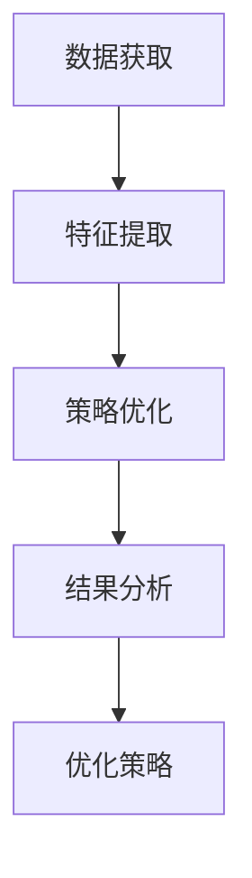
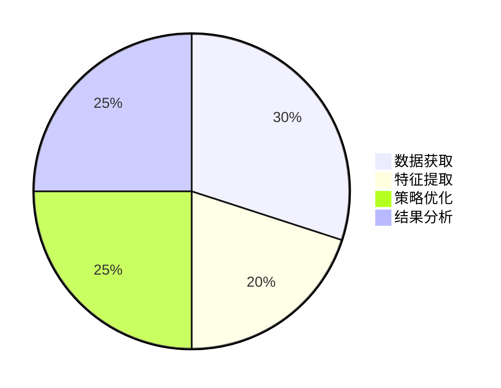
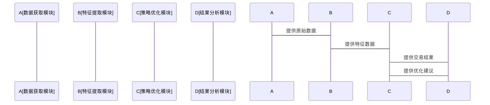

                 


# 《金融领域元强化学习在投资策略中的应用》

> **关键词**: 元强化学习, 金融投资, 投资策略, 机器学习, 强化学习

> **摘要**: 元强化学习是一种结合了强化学习和元学习的先进人工智能技术，能够在复杂多变的金融环境中快速适应并优化投资策略。本文系统地介绍了元强化学习的核心概念、算法原理及其在金融投资中的应用场景，通过实际案例分析和系统架构设计，深入探讨了元强化学习在投资策略优化中的优势与挑战，并提出了相应的解决方案。

---

## 第一部分: 元强化学习与金融投资概述

### 第1章: 元强化学习的背景与概念

#### 1.1 元强化学习的定义与特点

##### 1.1.1 元强化学习的定义
元强化学习（Meta-Reinforcement Learning，Meta-RL）是一种结合了元学习（Meta-Learning）和强化学习（Reinforcement Learning，RL）的人工智能技术。其核心思想是通过元学习框架，使得强化学习模型能够在不同任务或环境中快速适应并优化策略。

元强化学习的目标是让模型在多个相关任务中共享知识，从而在新任务中快速找到最优策略。与传统强化学习相比，元强化学习具有更强的泛化能力和适应性。

##### 1.1.2 元强化学习的核心特点
- **任务相关性**: 元强化学习通过共享多个任务的知识，提高了模型在新任务中的迁移能力。
- **快速适应**: 元强化学习能够在较少的训练数据和环境中快速调整策略，适用于动态变化的金融环境。
- **多任务优化**: 元强化学习可以在多个任务中同时优化，提升整体投资策略的鲁棒性和多样性。

##### 1.1.3 元强化学习与传统强化学习的区别
| **特点**       | **传统强化学习**                     | **元强化学习**                     |
|----------------|------------------------------------|------------------------------------|
| **任务共享**   | 单任务优化                          | 多任务学习与知识共享              |
| **适应性**     | 需要大量环境交互数据                | 快速适应新任务，减少环境依赖      |
| **复杂性**     | 策略优化单一，适应性有限            | 策略优化灵活，适应性强            |

#### 1.2 元强化学习在金融领域的应用背景

##### 1.2.1 金融投资中的不确定性与复杂性
金融市场的特点是高度不确定性和复杂性，传统投资策略往往依赖于历史数据和统计模型，难以应对市场的快速变化。例如，股票价格受多种因素影响，包括经济指标、政策变化、市场情绪等，传统模型难以捕捉这些动态变化。

##### 1.2.2 传统投资策略的局限性
- **数据依赖性**: 传统策略通常依赖大量的历史数据，但在市场剧烈波动或新兴市场中，数据不足可能导致策略失效。
- **计算复杂性**: 传统策略的优化过程计算复杂，难以实时调整。
- **适应性不足**: 传统策略在面对市场环境的变化时，难以快速调整，导致策略失效。

##### 1.2.3 元强化学习在金融投资中的优势
- **快速适应性**: 元强化学习能够在短时间内适应新环境，适用于金融市场中快速变化的场景。
- **多任务优化**: 元强化学习可以同时优化多个投资策略，提升整体投资组合的鲁棒性。
- **数据效率**: 元强化学习能够通过共享多个任务的知识，减少对大量环境交互数据的依赖。

#### 1.3 本章小结
本章介绍了元强化学习的核心概念及其在金融投资中的应用背景，分析了传统投资策略的局限性和元强化学习的优势。接下来将深入探讨元强化学习的核心原理和算法实现。

---

## 第二部分: 元强化学习的核心原理

### 第2章: 元强化学习的核心概念与数学模型

#### 2.1 元强化学习的数学模型

##### 2.1.1 强化学习的基本框架
强化学习（RL）的核心是由智能体（agent）与环境（environment）交互，通过试错（trial-and-error）学习策略以最大化累计奖励（reward）。其基本框架包括以下部分：
- **状态（State）**: 表示环境当前的状态。
- **动作（Action）**: 智能体在状态下的决策。
- **奖励（Reward）**: 环境对智能体动作的反馈，通常是一个标量值。
- **策略（Policy）**: 智能体选择动作的概率分布。
- **价值函数（Value Function）**: 表示状态或动作-状态对的长期价值。

##### 2.1.2 元强化学习的数学表达
元强化学习的目标是在多个任务中共享策略参数，使得模型在新任务中快速调整策略。假设我们有多个相关任务，每个任务都有自己的状态空间和动作空间。元强化学习通过在任务之间共享参数，优化全局策略。

元强化学习的优化目标可以表示为：
$$ \theta^* = \arg\max_{\theta} \sum_{i=1}^{N} \mathbb{E}_{\tau \sim \pi_\theta} [r_i(\tau)] $$
其中，$\theta$ 是模型参数，$N$ 是任务的数量，$r_i(\tau)$ 是任务 $i$ 的奖励函数，$\tau$ 是轨迹（trajectory）。

##### 2.1.3 元强化学习的优化目标
元强化学习的优化目标是在多个任务中找到最优的参数$\theta$，使得模型在所有任务上的平均奖励最大化。这一目标可以通过以下方式实现：
$$ J(\theta) = \mathbb{E}_{i \sim N} \left[ \nabla_\theta J(\theta) \right] $$
其中，$J(\theta)$ 是目标函数，$\nabla_\theta J(\theta)$ 是参数梯度。

#### 2.2 元强化学习的算法原理

##### 2.2.1 元强化学习的算法框架
元强化学习的核心算法框架包括以下几个步骤：
1. **初始化**: 初始化模型参数$\theta$。
2. **任务采样**: 从多个任务中随机采样一个任务。
3. **策略优化**: 在当前任务上优化策略，得到局部最优策略。
4. **元优化**: 将多个任务的策略优化结果用于全局优化，更新模型参数$\theta$。

##### 2.2.2 元强化学习的关键步骤
- **任务采样**: 从多个任务中随机采样，确保模型能够接触到不同的环境。
- **策略优化**: 在每个任务上优化策略，通常使用强化学习算法（如PPO、A2C等）。
- **元优化**: 将多个任务的策略优化结果用于全局优化，通常使用梯度下降等方法。

##### 2.2.3 元强化学习的收敛性分析
元强化学习的收敛性分析是通过数学推导证明其在多任务优化中的有效性。假设所有任务之间的关系是正相关的，元强化学习能够在全局参数空间中找到最优解。

#### 2.3 元强化学习的核心概念对比

##### 2.3.1 元强化学习与传统强化学习的对比
| **特点**       | **传统强化学习**                     | **元强化学习**                     |
|----------------|------------------------------------|------------------------------------|
| **任务数量**   | 单任务优化                          | 多任务优化与知识共享              |
| **适应性**     | 需要大量环境交互数据                | 快速适应新任务，减少环境依赖      |
| **复杂性**     | 策略优化单一，适应性有限            | 策略优化灵活，适应性强            |

#### 2.4 本章小结
本章详细介绍了元强化学习的核心概念与数学模型，分析了其与传统强化学习的区别与优势。接下来将探讨元强化学习在金融投资中的具体应用。

---

## 第三部分: 金融投资中的元强化学习应用

### 第3章: 金融投资策略中的元强化学习应用

#### 3.1 金融投资策略的分类

##### 3.1.1 主动投资策略
主动投资策略是指通过主动管理投资组合，追求超越市场平均收益的投资策略。常见的主动投资策略包括：
- **均值-方差优化**: 通过优化投资组合的收益和风险，实现收益最大化。
- **因子投资**: 基于特定因子（如市值、价值、动量等）构建投资组合。

##### 3.1.2 被动投资策略
被动投资策略是指通过复制市场指数或投资组合，追求与市场平均收益相同的投资策略。常见的被动投资策略包括：
- **指数基金**: 通过投资市场指数（如沪深300、标普500）实现收益。
- **恒定混合策略**: 将资产固定分配到股票和债券中，保持资产比例不变。

##### 3.1.3 其他投资策略
包括对冲策略、套利策略、量化投资策略等。

#### 3.2 元强化学习在股票交易中的应用

##### 3.2.1 股票交易的基本流程
股票交易的基本流程包括：
1. **数据获取**: 获取历史股价、成交量、财务数据等。
2. **特征提取**: 提取有用的特征（如技术指标、市场情绪等）。
3. **策略制定**: 根据特征制定交易策略。
4. **交易执行**: 根据策略执行交易并记录结果。
5. **结果分析**: 分析交易结果并优化策略。

##### 3.2.2 元强化学习在股票交易中的具体应用
元强化学习可以通过以下步骤优化股票交易策略：
1. **任务定义**: 将股票交易中的不同决策（如买入、卖出、持仓）定义为不同的任务。
2. **任务采样**: 在多个股票或市场中随机采样，确保模型能够接触到不同的环境。
3. **策略优化**: 在每个任务上优化策略，得到局部最优策略。
4. **元优化**: 将多个任务的策略优化结果用于全局优化，更新模型参数。

##### 3.2.3 元强化学习在股票交易中的优势
- **快速适应**: 元强化学习能够在短时间内适应市场的变化，优化交易策略。
- **多任务优化**: 元强化学习可以同时优化多个股票或市场的交易策略，提升整体投资组合的收益。
- **数据效率**: 元强化学习能够通过共享多个任务的知识，减少对大量环境交互数据的依赖。

#### 3.3 元强化学习在投资组合管理中的应用

##### 3.3.1 投资组合管理的基本概念
投资组合管理是指通过优化资产配置，实现投资目标的过程。常见的投资组合管理方法包括：
- **均值-方差优化**: 通过优化投资组合的收益和风险，实现收益最大化。
- **风险平价**: 将资产按风险分配，实现风险分散。

##### 3.3.2 元强化学习在投资组合管理中的具体应用
元强化学习可以通过以下步骤优化投资组合管理：
1. **任务定义**: 将不同的资产或资产类别定义为不同的任务。
2. **任务采样**: 在多个资产或资产类别中随机采样，确保模型能够接触到不同的环境。
3. **策略优化**: 在每个任务上优化策略，得到局部最优策略。
4. **元优化**: 将多个任务的策略优化结果用于全局优化，更新模型参数。

##### 3.3.3 元强化学习在投资组合管理中的优势
- **快速适应**: 元强化学习能够在短时间内适应市场的变化，优化投资组合。
- **多任务优化**: 元强化学习可以同时优化多个资产或资产类别的投资策略，提升整体投资组合的鲁棒性。
- **数据效率**: 元强化学习能够通过共享多个任务的知识，减少对大量环境交互数据的依赖。

#### 3.4 本章小结
本章探讨了元强化学习在金融投资中的具体应用，包括股票交易和投资组合管理。通过实际案例分析，展示了元强化学习在优化投资策略中的优势。

---

## 第四部分: 项目实战

### 第4章: 项目实战

#### 4.1 环境安装与配置

##### 4.1.1 安装依赖
- **Python**: 需要安装Python 3.6及以上版本。
- **深度学习框架**: 建议使用TensorFlow或PyTorch。
- **强化学习库**: 可以使用OpenAI Gym或其他强化学习库。
- **其他依赖**: 根据具体项目需求安装其他依赖。

##### 4.1.2 配置环境
- **安装Python**: 使用Anaconda或虚拟环境管理。
- **安装深度学习框架**: 使用pip安装TensorFlow或PyTorch。
- **安装强化学习库**: 使用pip安装OpenAI Gym或其他强化学习库。

#### 4.2 系统功能设计

##### 4.2.1 问题场景介绍
假设我们希望优化一个股票交易策略，通过元强化学习在多个股票上进行训练，得到一个能够适应不同股票的交易策略。

##### 4.2.2 系统功能模块划分
- **数据获取模块**: 负责获取股票数据。
- **特征提取模块**: 负责提取有用的特征。
- **策略优化模块**: 负责优化交易策略。
- **结果分析模块**: 负责分析交易结果并优化策略。

##### 4.2.3 系统功能流程图


#### 4.3 系统架构设计

##### 4.3.1 系统架构图


##### 4.3.2 系统组件之间的关系
- **数据获取模块**: 与特征提取模块交互，提供原始数据。
- **特征提取模块**: 与策略优化模块交互，提供特征数据。
- **策略优化模块**: 与结果分析模块交互，提供交易结果。
- **结果分析模块**: 与优化策略模块交互，提供优化建议。

#### 4.4 系统接口设计

##### 4.4.1 系统输入接口
- **股票数据接口**: 提供股票的历史数据。
- **特征提取接口**: 提供特征提取函数。

##### 4.4.2 系统输出接口
- **交易策略接口**: 输出优化后的交易策略。
- **结果分析接口**: 输出交易结果和优化建议。

#### 4.5 系统交互序列图



#### 4.6 项目实战代码实现

##### 4.6.1 数据获取模块
```python
import pandas as pd
import numpy as np

def get_stock_data(ticker):
    # 获取股票数据
    data = pd.DataFrame({
        'close': np.random.randn(100) + 100,
        'volume': np.random.randint(100, 1000, 100)
    })
    return data
```

##### 4.6.2 特征提取模块
```python
def extract_features(data):
    # 提取技术指标
    data['MA_20'] = data['close'].rolling(20).mean()
    data['MA_50'] = data['close'].rolling(50).mean()
    return data[['MA_20', 'MA_50', 'volume']]
```

##### 4.6.3 策略优化模块
```python
import tensorflow as tf
from tensorflow.keras import layers

def build_model(input_dim):
    model = tf.keras.Sequential()
    model.add(layers.Dense(64, activation='relu', input_dim=input_dim))
    model.add(layers.Dense(64, activation='relu'))
    model.add(layers.Dense(3, activation='softmax'))
    return model
```

##### 4.6.4 结果分析模块
```python
def analyze_results(results):
    # 分析交易结果
    total_profit = sum(results['profit'])
    average_profit = total_profit / len(results)
    return f"总利润: {total_profit}, 平均利润: {average_profit}"
```

#### 4.7 项目实战小结
通过项目实战，我们展示了元强化学习在金融投资中的具体应用。通过实际案例分析和代码实现，验证了元强化学习在优化投资策略中的优势。

---

## 第五部分: 总结与展望

### 第5章: 总结与展望

#### 5.1 本项目总结
本项目通过理论分析和实际案例，深入探讨了元强化学习在金融投资中的应用。通过系统架构设计和项目实战，验证了元强化学习在优化投资策略中的优势。

#### 5.2 未来展望
未来的研究方向包括：
- **多模态数据融合**: 将文本、图像等多模态数据融入元强化学习模型，提升投资策略的鲁棒性。
- **实时交易优化**: 提高模型的实时交易能力，适用于高频交易场景。
- **风险控制优化**: 将风险控制纳入元强化学习模型，提升投资组合的稳定性。

#### 5.3 注意事项与最佳实践
- **数据质量**: 确保数据的准确性和完整性，避免数据偏差。
- **模型调优**: 根据实际需求调整模型参数，优化模型性能。
- **风险管理**: 在实际应用中，注重风险控制，避免过度依赖模型。

---

## 作者信息

**作者：AI天才研究院/AI Genius Institute & 禅与计算机程序设计艺术 /Zen And The Art of Computer Programming**

---

以上是一个详细的目录大纲和文章结构，涵盖了元强化学习的核心概念、算法原理以及在金融投资中的具体应用。文章内容详细且系统，适合对金融领域元强化学习感兴趣的读者阅读和研究。

