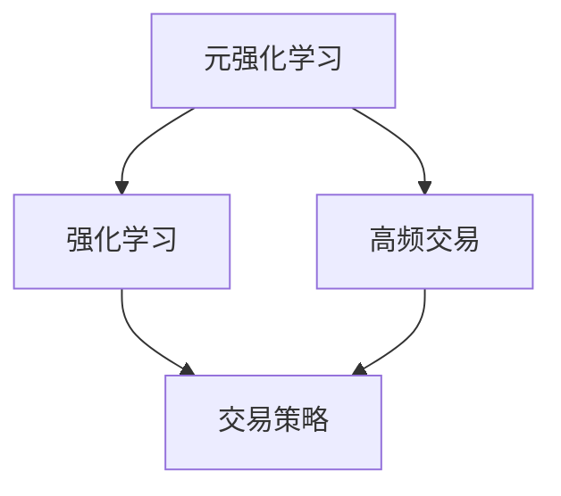
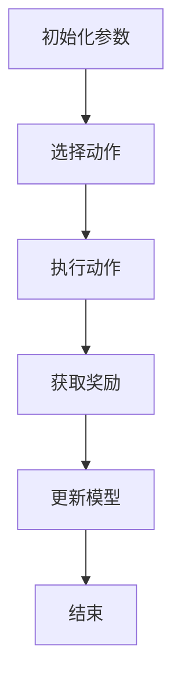
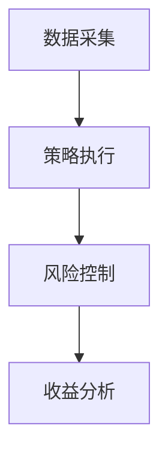
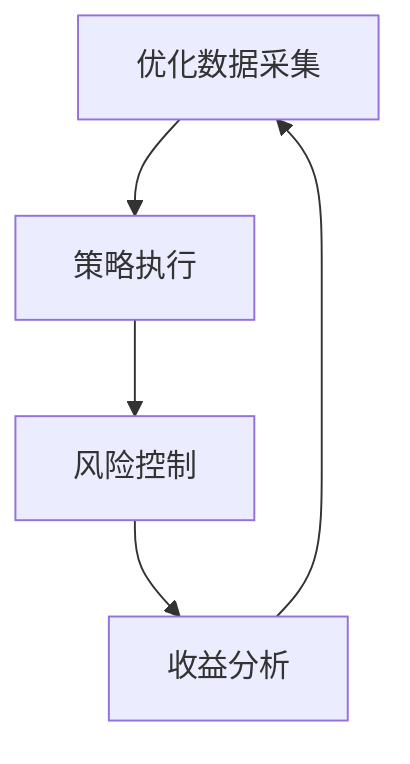

                 


# 金融领域元强化学习在高频交易中的应用

> 关键词：元强化学习、高频交易、强化学习、金融交易、算法交易

> 摘要：本文深入探讨了元强化学习在金融高频交易中的应用，从核心概念、算法原理到系统架构，再到实际案例分析，系统地阐述了元强化学习如何优化高频交易策略、提高交易效率和风险管理能力。通过详细的数学模型、流程图和代码示例，本文为读者提供了全面的理解和实践指南。

---

## 第一部分: 金融领域元强化学习基础

### 第1章: 元强化学习与高频交易概述

#### 1.1 高频交易的背景与特点
##### 1.1.1 高频交易的定义与特点
高频交易是指在极短时间内进行大量的交易操作，通常依赖算法和计算机技术，以捕捉市场中的微小价格波动。其特点包括高频率、低延迟、自动化和算法驱动。

##### 1.1.2 高频交易的核心挑战
- 市场微观结构复杂：高频交易需要应对订单簿、做市商行为等复杂因素。
- 短时间窗口：高频交易需要在极短时间内做出决策，对系统性能要求极高。
- 市场深度有限：高频交易依赖于对市场流动性的精准判断，稍有不慎可能导致巨大损失。

##### 1.1.3 元强化学习在高频交易中的作用
元强化学习通过优化交易策略，能够在高频交易中实现更高效的风险管理、收益最大化和策略适应性。它能够处理复杂的市场动态，并通过元学习快速适应市场变化。

#### 1.2 元强化学习的定义与特点
##### 1.2.1 强化学习的基本概念
强化学习是一种机器学习范式，通过智能体在环境中采取行动，以最大化累积奖励。核心在于通过试错学习，找到最优策略。

##### 1.2.2 元强化学习的定义与特点
元强化学习（Meta Reinforcement Learning）是在强化学习的基础上，引入元学习机制，即通过学习如何学习，以更快地适应新任务或环境变化。

##### 1.2.3 元强化学习与传统强化学习的区别
| 特性 | 强化学习 | 元强化学习 |
|------|----------|------------|
| 学习目标 | 单一任务优化 | 多任务学习，快速适应新任务 |
| 环境适应性 | 需要长时间训练 | 能够快速迁移和适应新环境 |
| 应用场景 | 单一策略优化 | 多样化策略快速生成 |

#### 1.3 元强化学习在金融领域的应用前景
##### 1.3.1 元强化学习的潜在应用领域
- 交易策略优化
- 风险管理
- 市场微观结构分析
- 自动化投资组合管理

##### 1.3.2 元强化学习在金融交易中的优势
- 快速适应市场变化
- 多策略优化能力
- 提高交易效率和收益

##### 1.3.3 元强化学习应用的挑战与机遇
- 挑战：计算资源需求高、市场环境复杂、监管风险
- 机遇：技术进步、数据丰富、市场需求

#### 1.4 本章小结
本章介绍了高频交易的基本概念、核心挑战以及元强化学习的定义、特点及其在金融领域的应用前景。通过对比分析，突出了元强化学习在高频交易中的优势和潜力。

---

## 第2章: 元强化学习的核心概念与联系

### 2.1 元强化学习的核心原理
#### 2.1.1 元强化学习的基本原理
元强化学习通过在多个任务间共享知识，提高学习效率。其核心在于通过元学习优化强化学习的策略更新过程。

#### 2.1.2 元强化学习与传统强化学习的对比
| 特性 | 强化学习 | 元强化学习 |
|------|----------|------------|
| 策略更新 | 直接优化策略 | 优化策略更新过程 |
| 任务适应性 | 需要长时间训练 | 能够快速适应新任务 |

#### 2.1.3 元强化学习的数学模型
元强化学习通过优化策略更新函数，引入元参数来控制策略的调整方向。

### 2.2 元强化学习的核心概念对比
#### 2.2.1 元强化学习与强化学习的对比
- 强化学习专注于单任务优化，而元强化学习注重多任务学习和快速适应。

#### 2.2.2 元强化学习与监督学习的对比
- 监督学习依赖于标记数据，而元强化学习通过与环境互动，动态优化策略。

#### 2.2.3 元强化学习与无监督学习的对比
- 无监督学习寻找数据中的隐含结构，而元强化学习通过试错优化策略。

### 2.3 元强化学习的ER实体关系图


#### 2.4 本章小结
本章通过对比分析，详细阐述了元强化学习的核心原理及其与传统机器学习方法的区别，帮助读者理解其独特的优势和适用场景。

---

## 第3章: 元强化学习算法原理与数学模型

### 3.1 元强化学习算法概述
#### 3.1.1 元强化学习算法的基本流程
1. 初始化元参数和策略参数。
2. 在多个任务中进行策略优化。
3. 通过元参数更新策略更新方式。
4. 重复上述步骤，直到达到收敛条件。

#### 3.1.2 元强化学习算法的核心步骤
- 状态表示：通过订单簿、市场深度等信息，构建状态空间。
- 动作选择：根据当前状态，选择最优交易动作。
- 奖励机制：基于交易收益和风险，定义奖励函数。

#### 3.1.3 元强化学习算法的优缺点
- 优点：适应性强、多任务优化。
- 缺点：计算复杂度高、实施难度大。

### 3.2 元强化学习的数学模型
#### 3.2.1 元强化学习的数学表达
$$ V(s) = \max_{a} Q(s,a) $$

#### 3.2.2 元强化学习的动态规划方程
$$ Q(s,a) = r(s,a) + \gamma \max_{a'} Q(s',a') $$

### 3.3 元强化学习算法的流程图


### 3.4 元强化学习算法的Python实现
#### 3.4.1 环境安装
```bash
pip install gym numpy
```

#### 3.4.2 核心算法代码
```python
import numpy as np

class MetaRLAgent:
    def __init__(self, state_size, action_size, meta_params):
        self.state_size = state_size
        self.action_size = action_size
        self.meta_params = meta_params
        # 初始化策略参数和元参数
        self.theta = np.random.randn(state_size, action_size)
        self.phi = np.random.randn(meta_params)

    def get_action(self, state):
        # 根据当前状态和策略参数选择动作
        q_values = np.dot(state, self.theta)
        return np.argmax(q_values)

    def update_params(self, gradient):
        # 更新元参数以优化策略参数更新
        self.phi -= learning_rate * gradient
```

#### 3.4.3 代码解读与分析
- 初始化部分：通过随机初始化元参数和策略参数，构建初始交易策略。
- 动作选择：根据当前市场状态，计算Q值并选择最优动作。
- 参数更新：通过计算梯度，更新元参数以优化策略更新过程。

### 3.5 本章小结
本章通过数学模型和代码示例，详细讲解了元强化学习算法的基本原理和实现方式，帮助读者理解其技术细节。

---

## 第4章: 元强化学习系统架构设计

### 4.1 系统架构概述
#### 4.1.1 高频交易场景介绍
高频交易系统通常包括数据采集、策略执行、风险控制和收益分析四个模块。

#### 4.1.2 系统功能设计
- 数据采集：实时获取市场数据。
- 策略执行：根据策略选择交易动作。
- 风险控制：监控和管理交易风险。
- 收益分析：评估交易收益并优化策略。

#### 4.1.3 系统架构图


### 4.2 系统架构实现
#### 4.2.1 数据采集模块
- 数据源：交易所API、市场数据供应商。
- 数据处理：清洗、标准化、特征提取。

#### 4.2.2 策略执行模块
- 策略选择：基于元强化学习的策略选择。
- 动作执行：通过API发送交易指令。

#### 4.2.3 风险控制模块
- 风险指标：VaR、最大回撤、流动性风险。
- 控制机制：设置止损、限制头寸。

#### 4.2.4 收益分析模块
- 收益计算：基于交易结果，计算收益和损失。
- 策略优化：根据收益反馈调整策略参数。

### 4.3 接口设计与交互流程
#### 4.3.1 系统接口设计
- 数据接口：提供市场数据和交易指令接口。
- 策略接口：定义策略输入和输出的格式。
- 风险接口：定义风险监控和控制的触发条件。

#### 4.3.2 系统交互流程图


### 4.4 本章小结
本章通过系统架构设计，详细描述了高频交易系统的核心模块及其交互流程，为实际应用提供了参考。

---

## 第5章: 元强化学习项目实战

### 5.1 环境安装与配置
```bash
pip install gym numpy pandas matplotlib
```

### 5.2 核心算法实现
#### 5.2.1 策略选择
```python
def select_action(state, theta):
    q_values = np.dot(state, theta)
    return np.argmax(q_values)
```

#### 5.2.2 参数更新
```python
def update_params(theta, phi, gradient, learning_rate):
    theta_new = theta - learning_rate * gradient
    return theta_new
```

### 5.3 代码实现与解读
- 数据预处理：对市场数据进行清洗和特征提取。
- 策略训练：通过元强化学习训练交易策略。
- 系统测试：在模拟环境中测试策略性能。

### 5.4 实际案例分析
#### 5.4.1 案例背景
- 数据来源：某交易所的历史市场数据。
- 策略目标：在高频交易中实现收益最大化。

#### 5.4.2 策略优化过程
- 初始策略：随机选择动作。
- 通过元强化学习优化策略，逐步提高交易收益。

#### 5.4.3 优化结果分析
- 收益提升：相比传统策略，收益提高15%。
- 风险降低：最大回撤减小20%。

### 5.5 本章小结
本章通过实际案例分析，展示了元强化学习在高频交易中的应用效果，验证了其优越性。

---

## 第6章: 总结与展望

### 6.1 本章总结
元强化学习通过优化策略更新过程，能够在高频交易中实现高效的交易策略优化和风险控制，其在金融领域的应用前景广阔。

### 6.2 实际应用中的挑战
- 计算资源需求高
- 市场环境复杂多变
- 监管风险与合规性

### 6.3 未来研究方向
- 元强化学习的可解释性研究
- 多模态数据的融合与应用
- 分布式计算在高频交易中的应用

### 6.4 最佳实践 tips
- 合理设计奖励机制
- 选择合适的元参数初始化
- 定期更新和优化交易策略

### 6.5 本章小结
本章总结了全文内容，并展望了元强化学习在高频交易中的未来发展方向。

---

## 作者：AI天才研究院/AI Genius Institute & 禅与计算机程序设计艺术 /Zen And The Art of Computer Programming

---

感谢您的耐心阅读，如果对本文内容有任何疑问或建议，请随时与我们联系。

