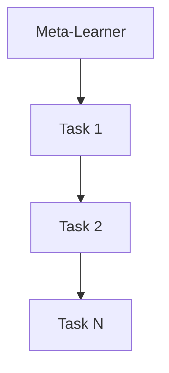
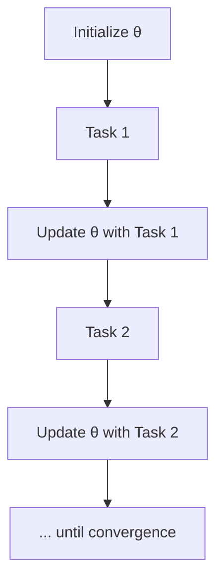
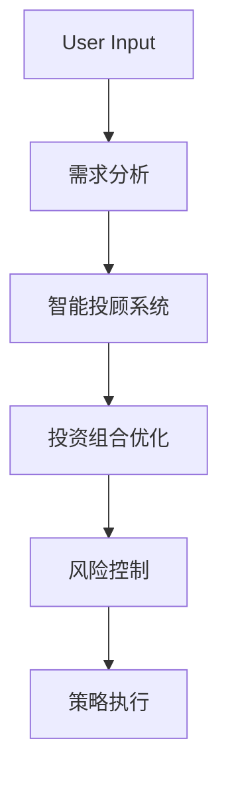
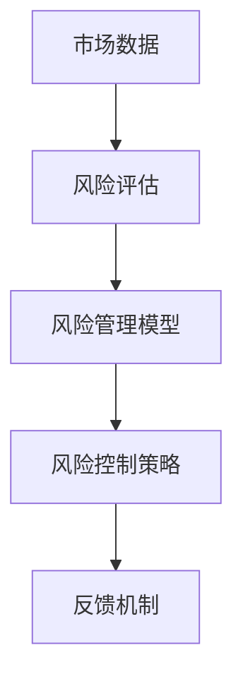
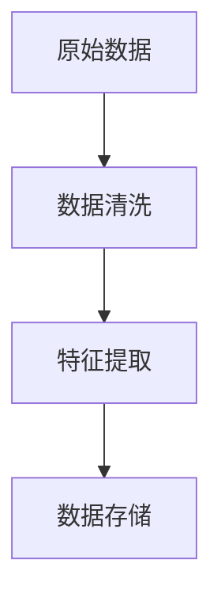
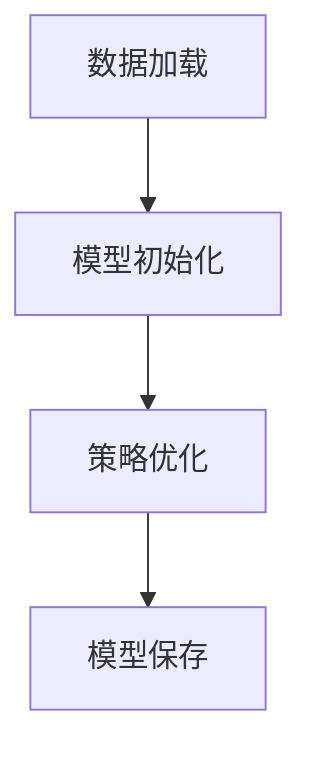

                 


# 金融领域元强化学习的探索与应用

> 关键词：元强化学习，强化学习，金融应用，人工智能，机器学习

> 摘要：本文深入探讨了元强化学习（Meta-Reinforcement Learning）在金融领域的应用，分析了其核心概念、算法原理、系统架构以及实际案例，旨在为读者提供全面的理论与实践指导。

---

# 第一部分：元强化学习的背景与基础

## 第1章：元强化学习的定义与背景

### 1.1 元强化学习的定义

#### 1.1.1 元学习的定义与核心概念
元学习（Meta-Learning）是一种机器学习范式，旨在通过学习如何学习，使得模型能够快速适应新任务。其核心在于通过元学习器（Meta-Learner）来优化多个任务的参数，从而在新任务上实现快速泛化。

**关键概念对比表**：

| **概念**       | **传统机器学习**                     | **元学习**                          |
|----------------|------------------------------------|------------------------------------|
| 学习目标       | 直接解决特定任务                   | 学习如何解决新任务                 |
| 数据需求       | 需要大量标注数据                   | 适用于小样本或零样本任务           |
| 灵活性         | 适应性差，任务变化需重新训练       | 适应性强，能够快速调整以应对新任务 |

#### 1.1.2 强化学习的基本原理
强化学习（Reinforcement Learning, RL）是一种通过智能体与环境交互来学习策略的方法。智能体通过与环境交互，获得奖励或惩罚，并通过调整策略来最大化累计奖励。

**强化学习的基本流程**：
1. 智能体观察环境状态。
2. 根据策略选择动作。
3. 执行动作，获得奖励和新状态。
4. 根据奖励更新策略。

#### 1.1.3 元强化学习与传统强化学习的区别
元强化学习（Meta-Reinforcement Learning, Meta-RL）结合了元学习和强化学习的优势，能够在多个任务之间共享知识，快速适应新任务。与传统RL相比，Meta-RL在以下方面有所不同：

- **任务多样性**：Meta-RL处理多个相关任务，而传统RL专注于单个任务。
- **快速适应**：Meta-RL能够在新任务上快速调整策略，而传统RL需要长时间训练。
- **知识复用**：Meta-RL通过元学习器共享多个任务的知识，而传统RL每个任务独立训练。

### 1.2 元强化学习在金融领域的应用背景

#### 1.2.1 金融领域的复杂性与挑战
金融领域的决策问题通常具有以下特点：
- **高不确定性**：市场波动大，难以预测。
- **多目标优化**：需要在风险与收益之间权衡。
- **快速决策**：高频交易需要实时响应。

#### 1.2.2 元强化学习在金融中的潜在价值
元强化学习能够帮助金融模型快速适应市场变化，优化交易策略，降低风险。例如：
- **智能投顾**：根据用户需求快速调整投资组合。
- **高频交易**：快速适应市场波动，优化交易策略。
- **风险管理**：根据市场变化快速调整风险控制策略。

#### 1.2.3 元强化学习在金融中的典型应用场景
- **智能投顾**：基于用户风险偏好，动态调整投资组合。
- **高频交易**：在短时间内快速决策，捕捉市场机会。
- **风险管理**：实时监控市场风险，快速调整策略。

### 1.3 元强化学习的技术优势与挑战

#### 1.3.1 元强化学习的技术优势
- **快速适应性**：能够快速适应新任务，减少训练时间。
- **多任务学习**：通过共享多个任务的知识，提高模型泛化能力。
- **高效性**：在小样本数据下表现优异，减少数据依赖。

#### 1.3.2 元强化学习在金融中的主要挑战
- **复杂性**：金融市场的复杂性可能增加模型的不确定性。
- **数据稀缺性**：某些金融场景可能缺乏足够的数据。
- **模型解释性**：强化学习模型通常缺乏可解释性，增加了风险。

#### 1.3.3 元强化学习的未来发展方向
- **结合生成模型**：利用生成对抗网络（GAN）等技术，增强模型的生成能力。
- **多智能体协作**：在高频交易中，多个智能体协作优化策略。
- **强化学习与知识图谱结合**：通过知识图谱提供领域知识，提升模型决策能力。

### 1.4 元强化学习与相关技术的联系

#### 1.4.1 元学习与迁移学习的对比
| **技术**       | **元学习**                     | **迁移学习**                     |
|----------------|--------------------------------|---------------------------------|
| 核心目标       | 学习如何学习                   | 将已学习的知识应用到新任务       |
| 数据需求       | 小样本或零样本                 | 需要大量标注数据                 |
| 适应性         | 高度适应新任务                 | 适应性一般，需特定领域知识       |

#### 1.4.2 元强化学习与深度学习的关系
元强化学习依赖于深度学习技术，特别是深度神经网络（DNN）。通过深度学习，元强化学习能够更好地捕捉复杂的金融特征。

#### 1.4.3 元强化学习与其他机器学习技术的结合
- **与生成模型结合**：利用生成模型（如GAN）生成虚拟数据，增强元学习的效果。
- **与强化学习结合**：通过多任务强化学习，进一步提升模型的泛化能力。

---

## 第2章：元强化学习的核心概念与联系

### 2.1 元强化学习的核心概念

#### 2.1.1 元强化学习的数学模型
元强化学习的核心在于通过元学习器（Meta-Learner）优化多个任务的参数。其数学模型可以表示为：

$$
\theta_{\text{meta}} = \arg\max_{\theta} \sum_{i=1}^{N} \mathcal{L}_i(\theta)
$$

其中，$\theta$ 是模型参数，$\mathcal{L}_i$ 是第$i$个任务的损失函数。

**流程图：元强化学习的数学模型**



#### 2.1.2 元强化学习的算法原理
元强化学习的基本流程包括以下几个步骤：
1. 初始化模型参数。
2. 对每个任务进行强化学习，更新模型参数。
3. 通过元优化器（Meta-Optimizer）优化模型参数，以适应所有任务。

**算法流程图**



### 2.2 元强化学习与传统强化学习的对比

#### 2.2.1 传统强化学习的局限性
- **数据需求高**：需要大量数据训练。
- **适应性差**：难以快速适应新任务。

#### 2.2.2 元强化学习的优势
- **快速适应性**：能够在新任务上快速调整策略。
- **多任务学习**：通过共享知识，提高模型泛化能力。

#### 2.2.3 元强化学习与传统强化学习的结合
通过结合传统强化学习和元学习，可以在保持快速适应性的同时，利用传统RL的稳定性。

---

## 第3章：元强化学习的算法原理

### 3.1 元强化学习的数学模型

#### 3.1.1 元强化学习的损失函数
元强化学习的损失函数通常包括任务损失和元损失：

$$
\mathcal{L}_{\text{meta}} = \sum_{i=1}^{N} \mathcal{L}_i(\theta_i) + \lambda \mathcal{L}_{\text{meta}}(\theta)
$$

其中，$\lambda$ 是调节系数，$\mathcal{L}_{\text{meta}}$ 是元损失函数。

#### 3.1.2 元强化学习的策略优化
通过优化器（如Adam）对模型参数进行优化：

$$
\theta_{\text{new}} = \theta - \eta \nabla_{\theta} \mathcal{L}_{\text{meta}}
$$

其中，$\eta$ 是学习率。

### 3.2 元强化学习的算法实现

#### 3.2.1 基于模型的元强化学习
基于模型的Meta-RL方法通过构建元模型，预测新任务的参数更新。

**代码示例：基于模型的Meta-RL**

```python
class MetaLearner:
    def __init__(self, state_dim, action_dim):
        self.state_dim = state_dim
        self.action_dim = action_dim
        self.meta_network = self._build_network(state_dim, action_dim)
    
    def _build_network(self, state_dim, action_dim):
        # 构建元学习网络
        pass
    
    def update(self, tasks):
        # 更新元学习器参数
        pass
```

#### 3.2.2 无模型的元强化学习
无模型的Meta-RL方法直接优化策略，而不依赖于模型。

**代码示例：无模型的Meta-RL**

```python
def meta_reinforce(env, meta_params):
    optimizer = Adam(meta_params)
    for task in tasks:
        for _ in range(meta_steps):
            states, actions, rewards = collect_samples(env, task)
            # 更新策略
            optimizer.step()
```

---

## 第4章：元强化学习在金融系统中的应用

### 4.1 金融场景下的系统架构设计

#### 4.1.1 智能投顾系统
智能投顾系统通过元强化学习，根据用户需求动态调整投资策略。

**系统架构图**



#### 4.1.2 风险管理系统
风险管理系统通过元强化学习实时监控市场风险，动态调整风险控制策略。

**系统交互图**



### 4.2 元强化学习的系统实现

#### 4.2.1 数据处理模块
数据处理模块负责收集和预处理金融数据。

**数据处理流程图**



#### 4.2.2 模型训练模块
模型训练模块负责训练元强化学习模型。

**模型训练流程图**



---

## 第5章：项目实战——智能投顾系统

### 5.1 环境安装与数据准备

#### 5.1.1 环境安装
安装必要的Python库：

```bash
pip install numpy pandas gym matplotlib
```

#### 5.1.2 数据准备
收集和整理金融数据，如股票价格、市场指数等。

### 5.2 系统核心实现

#### 5.2.1 模型实现
实现元强化学习模型，包括元学习器和策略网络。

**代码示例：元强化学习模型**

```python
import torch
import torch.nn as nn

class MetaLearner(nn.Module):
    def __init__(self, state_dim, action_dim):
        super().__init__()
        self.state_dim = state_dim
        self.action_dim = action_dim
        self.meta_network = nn.Linear(state_dim, action_dim)
    
    def forward(self, state):
        return self.meta_network(state)
```

#### 5.2.2 策略优化
通过优化器更新模型参数。

**代码示例：策略优化**

```python
optimizer = torch.optim.Adam(meta_learner.parameters(), lr=0.001)
for state in states:
    action = meta_learner(state)
    # 计算损失
    loss = ...
    optimizer.zero_grad()
    loss.backward()
    optimizer.step()
```

### 5.3 实际案例分析

#### 5.3.1 案例背景
以智能投顾为例，假设用户需求为风险偏好中等。

#### 5.3.2 模型训练与测试
训练模型，测试其在新任务上的表现。

#### 5.3.3 结果分析
分析模型在不同任务上的表现，优化模型参数。

### 5.4 项目小结

---

## 第6章：元强化学习的扩展与展望

### 6.1 元强化学习的前沿技术

#### 6.1.1 结合生成模型
利用生成对抗网络（GAN）生成虚拟数据，增强元学习的效果。

#### 6.1.2 多智能体协作
在高频交易中，多个智能体协作优化交易策略。

#### 6.1.3 增量学习
通过增量学习，进一步提升模型的适应性。

### 6.2 金融领域的未来发展方向

#### 6.2.1 更复杂的金融场景
如多资产配置、动态风险控制等。

#### 6.2.2 更高效的算法
如更高效的元优化算法、分布式元学习等。

#### 6.2.3 更强的解释性
提升模型的可解释性，降低金融风险。

### 6.3 本章小结

---

# 作者：AI天才研究院/AI Genius Institute & 禅与计算机程序设计艺术 /Zen And The Art of Computer Programming

---

### 注意事项
- 元强化学习在金融领域的应用需要谨慎处理模型的不确定性和风险。
- 在实际应用中，建议结合领域知识和模型解释性，确保模型的可靠性和可解释性。

### 最佳实践
- 在实际项目中，建议先从简单的任务入手，逐步优化模型。
- 定期监控模型表现，及时调整参数和策略。

### 拓展阅读
- 推荐阅读相关论文，如《Meta-Reinforcement Learning for Financial Decision Making》。

---

以上是《金融领域元强化学习的探索与应用》的完整目录和文章结构。

