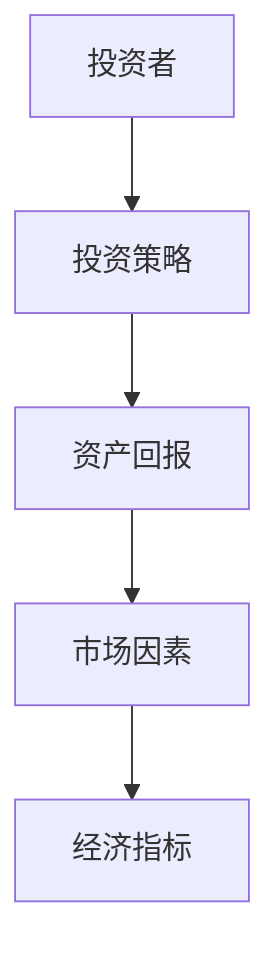
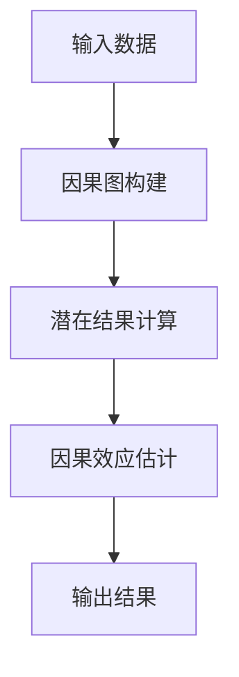
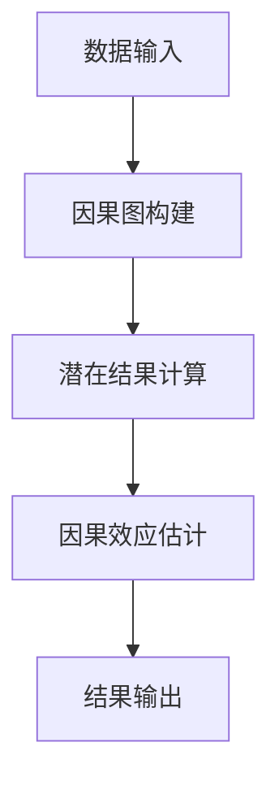
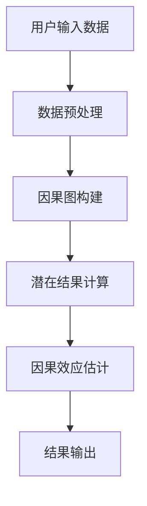
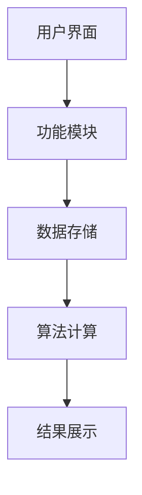
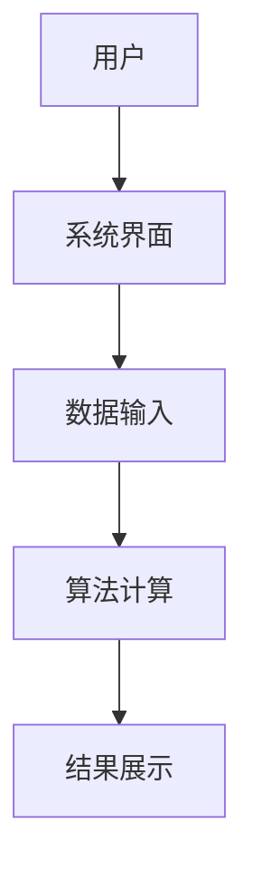

                 


# 金融领域因果推断在投资策略归因分析中的应用

关键词：因果推断、投资策略、归因分析、金融领域、因果图、潜在结果、贝叶斯网络

摘要：本文深入探讨了因果推断在金融领域投资策略归因分析中的应用。通过分析因果推断的核心概念、数学模型、算法原理以及系统架构设计，结合实际投资案例，详细阐述了因果推断如何帮助投资者更好地理解和优化投资策略。文章结构清晰，内容详实，涵盖从理论到实践的各个方面，为金融领域的因果推断研究提供了有价值的参考。

---

## 第1章: 问题背景与核心概念

### 1.1 问题背景
#### 1.1.1 投资策略归因分析的定义
投资策略归因分析是通过分析投资组合的收益来源，确定各项资产或因子对收益的贡献程度。归因分析能够帮助投资者理解收益的来源，优化投资策略，并评估投资决策的有效性。

#### 1.1.2 归因分析的重要性
归因分析在金融领域具有重要意义。通过归因分析，投资者可以：
- 评估投资策略的有效性；
- 识别收益的主要驱动因素；
- 优化投资组合；
- 控制风险。

#### 1.1.3 因果推断在归因分析中的作用
因果推断是一种从数据中识别因果关系的方法。在归因分析中，因果推断能够帮助投资者确定哪些变量对投资收益具有因果关系，而不仅仅是相关关系。

### 1.2 核心概念与联系
#### 1.2.1 因果推断的基本原理
因果推断基于潜在结果框架，通过构建因果图来分析变量之间的因果关系。因果图通过节点表示变量，通过边表示因果关系。

#### 1.2.2 潜在结果框架
潜在结果框架假设每个变量在不同处理下的潜在结果，通过比较潜在结果来估计因果效应。

#### 1.2.3 因果图与因果关系
因果图通过可视化变量之间的因果关系，帮助我们理解变量之间的关系。因果图中的变量可以分为处理变量、结果变量和干扰变量。

### 1.3 本章小结
本章介绍了因果推断在投资策略归因分析中的背景、核心概念和基本原理。通过潜在结果框架和因果图的介绍，为后续的因果推断分析奠定了基础。

---

## 第2章: 因果推断的核心概念与联系

### 2.1 因果推断的核心原理
#### 2.1.1 因果关系的定义
因果关系是指一个变量（处理变量）的变化会导致另一个变量（结果变量）的变化。因果关系不同于相关关系，因为它强调因果关系的方向性和必然性。

#### 2.1.2 因果图的基本结构
因果图由节点和边组成，节点表示变量，边表示因果关系。因果图可以通过因果关系的路径来分析变量之间的关系。

#### 2.1.3 潜在结果框架
潜在结果框架通过假设每个变量在不同处理下的潜在结果，通过比较潜在结果来估计因果效应。

### 2.2 核心概念对比
#### 2.2.1 因果推断与相关性分析对比
因果推断关注因果关系，而相关性分析只关注变量之间的关联性。因果推断可以通过因果图来识别变量之间的因果关系，而相关性分析无法区分因果关系和相关关系。

#### 2.2.2 随机化试验与观察性研究对比
随机化试验通过随机分配处理变量来估计因果效应，而观察性研究通过观察数据来估计因果效应。随机化试验可以提供可靠的因果效应估计，而观察性研究需要通过因果图来调整混杂变量。

#### 2.2.3 因果图与统计模型对比
因果图通过可视化变量之间的因果关系，帮助我们理解变量之间的关系。统计模型通过数学方法来估计因果效应。

### 2.3 实体关系图


### 2.4 本章小结
本章详细介绍了因果推断的核心原理、核心概念对比以及实体关系图。通过对比因果推断与相关性分析、随机化试验与观察性研究、因果图与统计模型，帮助读者更好地理解因果推断的核心概念。

---

## 第3章: 因果推断的数学模型与算法原理

### 3.1 因果推断的数学模型
#### 3.1.1 潜在结果框架
潜在结果框架通过假设每个变量在不同处理下的潜在结果，通过比较潜在结果来估计因果效应。潜在结果框架可以用公式表示为：
$$Y_i(t)$$
其中，\(Y_i(t)\) 表示在处理 \(t\) 下，第 \(i\) 个样本的结果。

#### 3.1.2 因果图的数学表示
因果图可以用数学公式表示为：
$$Y = \sum_{j} b_j X_j + \epsilon$$
其中，\(Y\) 是结果变量，\(X_j\) 是处理变量和混杂变量，\(b_j\) 是系数，\(\epsilon\) 是误差项。

#### 3.1.3 随机化试验的数学模型
随机化试验的数学模型可以通过以下公式表示：
$$Y_i = \beta X_i + \epsilon_i$$
其中，\(Y_i\) 是结果变量，\(X_i\) 是处理变量，\(\beta\) 是因果效应，\(\epsilon_i\) 是误差项。

### 3.2 因果推断算法
#### 3.2.1 因果森林算法
因果森林算法通过构建多棵回归树来估计因果效应。因果森林算法可以用以下步骤表示：
1. 将数据分成多个子样本；
2. 对每个子样本构建回归树；
3. 对每个节点计算因果效应；
4. 输出因果效应的汇总结果。

#### 3.2.2 马尔可夫转换模型
马尔可夫转换模型通过构建马尔可夫链来估计因果效应。马尔可夫转换模型可以用以下步骤表示：
1. 构建马尔可夫链；
2. 计算转移概率矩阵；
3. 通过马尔可夫链的转移概率矩阵估计因果效应。

#### 3.2.3 贝叶斯网络
贝叶斯网络通过构建贝叶斯网络来估计因果效应。贝叶斯网络可以用以下步骤表示：
1. 构建贝叶斯网络；
2. 计算每个节点的条件概率分布；
3. 通过贝叶斯网络的条件概率分布估计因果效应。

### 3.3 算法原理


### 3.4 本章小结
本章详细介绍了因果推断的数学模型与算法原理，包括潜在结果框架、因果图的数学表示、随机化试验的数学模型，以及因果森林算法、马尔可夫转换模型和贝叶斯网络的算法原理。

---

## 第4章: 投资策略归因分析中的因果推断应用

### 4.1 投资策略归因分析
#### 4.1.1 投资策略归因的定义
投资策略归因分析是通过分析投资组合的收益来源，确定各项资产或因子对收益的贡献程度。

#### 4.1.2 归因分析的常见方法
归因分析的常见方法包括：
- 总收益法；
- 因子分解法；
- 情景分析法。

#### 4.1.3 因果推断在归因分析中的优势
因果推断在归因分析中的优势包括：
- 能够识别因果关系；
- 能够控制混杂变量；
- 能够优化投资策略。

### 4.2 因果推断在投资策略中的应用
#### 4.2.1 资产配置中的因果推断
资产配置中的因果推断可以帮助投资者确定不同资产类别对投资收益的因果效应。

#### 4.2.2 风险因素分析
风险因素分析通过因果推断可以确定哪些风险因素对投资收益具有因果关系。

#### 4.2.3 交易策略优化
交易策略优化通过因果推断可以确定哪些交易策略对投资收益具有因果效应。

### 4.3 本章小结
本章详细介绍了因果推断在投资策略归因分析中的应用，包括投资策略归因分析的定义、常见方法以及因果推断在资产配置、风险因素分析和交易策略优化中的应用。

---

## 第5章: 系统分析与架构设计方案

### 5.1 系统功能设计
#### 5.1.1 系统功能模块划分
系统功能模块包括：
- 数据输入模块；
- 因果图构建模块；
- 潜在结果计算模块；
- 因果效应估计模块；
- 结果输出模块。

#### 5.1.2 功能模块之间的关系
功能模块之间的关系可以通过以下流程图表示：


#### 5.1.3 系统功能流程图
系统功能流程图如下：


### 5.2 系统架构设计
#### 5.2.1 系统架构图
系统架构图如下：


#### 5.2.2 系统接口设计
系统接口设计包括：
- 数据输入接口；
- 数据输出接口；
- 算法接口；
- 用户界面接口。

#### 5.2.3 系统交互图
系统交互图如下：


### 5.3 本章小结
本章详细介绍了系统分析与架构设计方案，包括系统功能设计、系统架构设计以及系统交互设计。

---

## 第6章: 项目实战与案例分析

### 6.1 项目实战
#### 6.1.1 环境搭建
项目实战需要以下环境：
- Python编程语言；
- 数据处理库（如Pandas）；
- 可视化库（如Matplotlib）；
- 因果推断库（如Dowhy）。

#### 6.1.2 系统核心实现
系统核心实现包括：
- 数据预处理；
- 因果图构建；
- 潜在结果计算；
- 因果效应估计；
- 结果输出。

#### 6.1.3 代码实现
以下是因果推断算法的Python代码实现：
```python
import pandas as pd
from dowhy import CausalGraph

# 数据预处理
data = pd.read_csv('data.csv')

# 因果图构建
cg = CausalGraph(data, treatments=['treatment'], outcome='outcome')

# 潜在结果计算
cg.identify_latent_vars()

# 因果效应估计
cg.do_causal_inference()

# 结果输出
print(cg.estimate_effect())
```

### 6.2 案例分析
#### 6.2.1 案例背景
案例背景：某投资组合的收益来源分析。

#### 6.2.2 数据分析
数据分析：通过因果推断算法分析投资组合的收益来源，确定各项资产对收益的因果效应。

#### 6.2.3 结果解读
结果解读：通过因果效应估计结果，优化投资策略。

### 6.3 本章小结
本章通过项目实战和案例分析，详细介绍了因果推断算法的实现和应用，帮助读者更好地理解和应用因果推断技术。

---

## 第7章: 总结与展望

### 7.1 总结
本章对全文进行了总结，回顾了因果推断在投资策略归因分析中的应用，包括核心概念、数学模型、算法原理以及系统设计等方面。

### 7.2 未来展望
未来展望：因果推断在金融领域的应用前景广阔，未来可以进一步研究因果推断在其他金融领域的应用，如风险管理、资产定价等。

### 7.3 最佳实践 tips
- 在应用因果推断时，需要确保数据的质量和完整性；
- 需要结合具体业务场景选择合适的因果推断方法；
- 需要通过实验验证因果推断结果的有效性。

### 7.4 本章小结
本章对全文进行了总结，并展望了因果推断在金融领域的未来应用。

---

## 作者：AI天才研究院/AI Genius Institute & 禅与计算机程序设计艺术 /Zen And The Art of Computer Programming

---

本文通过系统的分析和详细的讲解，全面介绍了因果推断在金融领域投资策略归因分析中的应用。从理论到实践，从概念到算法，从系统设计到项目实战，为读者提供了一个完整的知识框架。希望本文能够为金融领域的因果推断研究提供有价值的参考。

