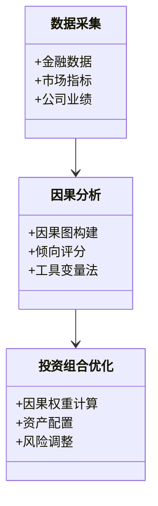
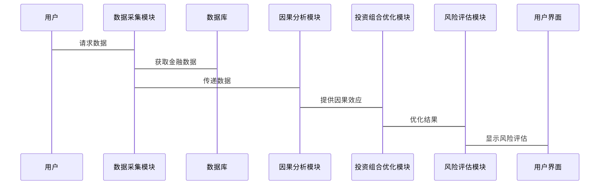

                 


---

# 《金融领域因果推断在投资组合构建中的应用》

**关键词：** 金融，因果推断，投资组合，资产定价，风险管理，机器学习

**摘要：** 本文深入探讨因果推断在金融投资中的应用，特别是在投资组合构建中的作用。通过分析因果关系，投资者可以更好地理解资产间的相互作用，优化投资决策，降低风险。本文从理论基础到实际应用，结合数学模型和代码实现，全面解析因果推断在金融领域的应用。

---

## 第一章: 因果推断的基本概念

### 1.1 什么是因果推断

因果推断是一种分析变量间因果关系的方法，旨在识别变量间的因果联系，而不仅仅是相关关系。例如，因果推断可以确定投资组合中某一资产的变化是否由其他资产的变化引起。

**关键术语：**
- **因果关系：** 如果变量X的变化引起变量Y的变化，则X是Y的因果因素。
- **相关关系：** 两个变量可能同时变化，但不一定存在因果关系。

**背景与意义：**
在金融领域，因果推断可以帮助投资者识别真正的风险来源，优化投资组合，提高收益。传统统计方法依赖相关性，可能导致错误的结论，而因果推断则能提供更深层次的见解。

---

## 第二章: 因果图与潜在结果

### 2.1 因果图的构建

因果图通过节点和边表示变量间的因果关系。例如，资产价格可能受市场趋势和公司业绩的影响，因果图可以清晰展示这些关系。

**因果图的构建步骤：**
1. 确定所有相关变量（如资产价格、市场指数）。
2. 分析变量间可能的因果关系，绘制有向无环图（DAG）。

**示例：**
- 资产价格受市场趋势和公司业绩的影响，但市场趋势不受公司业绩影响。

### 2.2 潜在结果与平均处理效应

**潜在结果：** 对于每个样本，在不同处理情况下的结果。例如，如果公司业绩得到改善，资产价格会如何变化。

**平均处理效应（ATE）：** 处理对整体结果的影响，帮助评估因果关系的强度。

### 2.3 倾向评分与匹配

**倾向评分：** 估计样本在处理组的概率，用于平衡对照组和处理组的混杂变量。

**匹配方法：** 将处理组和对照组样本进行匹配，减少混杂变量的影响，提高因果推断的准确性。

---

## 第三章: 金融领域的因果模型

### 3.1 线性因果模型

**线性模型：** Y = aX + bZ + ε，其中X是处理变量，Z是控制变量，ε是误差项。

**应用：** 评估市场趋势对资产价格的影响，考虑其他因素如利率的影响。

### 3.2 面板数据分析的因果推断

**面板数据：** 包含多个个体在不同时间点的数据，如多个资产在不同时间的价格。

**因果推断方法：**
- 固定效应模型：控制个体固定效应，识别时间趋势的影响。
- 随机效应模型：估计个体效应的平均值。

### 3.3 工具变量法

**工具变量：** 用于解决遗漏变量偏差，如使用地理位置作为工具变量分析环境政策的影响。

**步骤：**
1. 选择工具变量，确保它影响结果变量仅通过处理变量。
2. 检验工具变量的有效性和相关性。
3. 使用工具变量估计处理效应。

---

## 第四章: 资产定价与风险评估

### 4.1 资产定价模型的因果分析

**CAPM模型的因果推断：**
- 市场回报对资产回报的影响。
- 使用因果图分析其他因素（如公司业绩）的影响。

**Fama-French三因子模型：**
- 评估规模溢价、价值溢价的因果关系，优化资产定价。

### 4.2 风险评估中的因果推断

**VaR与CVaR的因果分析：**
- 确定市场波动对VaR的影响，评估风险因素的因果关系。

**风险因素的因果关系建模：**
- 识别主要风险驱动因素，如市场趋势、利率变化。

---

## 第五章: 投资组合管理的因果推断方法

### 5.1 因果推断在投资组合优化中的应用

**因果权重：**
- 根据因果关系计算各资产的权重，构建稳健的投资组合。

**机器学习方法：**
- 使用因果森林分析资产间的相互作用，优化投资组合配置。

### 5.2 基于机器学习的因果推断

**因果森林：**
- 非参数方法，估计处理效应的异质性，帮助识别不同资产的因果关系。

**强化学习策略：**
- 利用因果推断优化投资组合的动态调整策略，提高收益和降低风险。

---

## 第六章: 数学模型与算法实现

### 6.1 线性因果模型的数学公式

$$ Y = aX + bZ + \epsilon $$

**实现步骤：**
1. 收集数据，包括处理变量X和控制变量Z。
2. 估计模型参数a和b。
3. 检验模型的合理性。

### 6.2 工具变量法的实现

$$ Y = aX + bW + \epsilon $$

**工具变量法的代码实现：**

```python
import statsmodels.api as sm

# 使用工具变量W估计X对Y的因果效应
model = sm.OLS(Y, sm.add_constant(X))
results = model.fit()
ate = results.params[1]
```

---

## 第七章: 系统分析与架构设计

### 7.1 项目介绍

**项目目标：** 构建一个基于因果推断的投资组合管理系统。

### 7.2 系统功能设计

**功能模块：**
1. 数据采集：收集相关金融数据。
2. 因果分析：构建因果图，估计因果效应。
3. 投资组合优化：基于因果分析结果优化投资组合。
4. 风险评估：评估投资组合的风险，调整策略。

**领域模型（Mermaid 类图）：**


### 7.3 系统架构设计

**系统架构（Mermaid 架构图）：**
```mermaid
archi
    一个顶部矩形，顶部标为"投资组合管理系统"，内部包含：
        数据采集模块：连接外部数据源
        因果分析模块：连接数据采集模块
        投资组合优化模块：连接因果分析模块
        风险评估模块：连接投资组合优化模块
        用户界面：连接投资组合优化模块和风险评估模块
```

### 7.4 系统接口设计

**主要接口：**
1. 数据接口：从数据库获取金融数据。
2. 分析接口：调用因果分析模块进行处理。
3. 优化接口：基于分析结果优化投资组合。

### 7.5 系统交互（Mermaid 序列图）：**


---

## 第八章: 项目实战

### 8.1 环境安装

**安装Python和相关库：**
```bash
pip install numpy pandas statsmodels matplotlib
```

### 8.2 核心代码实现

**因果分析代码：**

```python
import numpy as np
import pandas as pd
import statsmodels.api as sm

# 示例数据
data = pd.DataFrame({
    'X': np.random.randn(100),
    'Z': np.random.randn(100),
    'Y': np.random.randn(100) + 0.5 * data['X'] + 0.3 * data['Z']
})

# 构建线性因果模型
model = sm.OLS(data['Y'], sm.add_constant(data[['X', 'Z']]))
results = model.fit()
print(results.summary())
```

### 8.3 案例分析

**案例：** 使用工具变量法分析市场趋势对资产价格的影响。

**数据准备：**
```python
market_trend = pd.Series(np.random.randn(100))
asset_price = pd.Series(np.random.randn(100) + 0.3 * market_trend)
```

**工具变量法实现：**

```python
# 工具变量W（如地理位置）
W = pd.Series(np.random.randn(100))

model_iv = sm.OLS(asset_price, sm.add_constant(market_trend))
results_iv = model_iv.fit()
ate = results_iv.params[1]
print(f"市场趋势的平均处理效应：{ate}")
```

### 8.4 代码解读与分析

- 数据准备：生成模拟数据，包括市场趋势、资产价格和其他变量。
- 因果分析：使用工具变量法估计市场趋势对资产价格的因果效应。
- 结果分析：解读回归结果，评估因果效应的显著性和影响程度。

---

## 第九章: 总结与展望

### 9.1 最佳实践 tips

1. **数据质量：** 确保数据的准确性和完整性。
2. **模型选择：** 根据具体情况选择合适的因果分析方法。
3. **结果验证：** 使用交叉验证等方法验证模型的稳健性。

### 9.2 小结

因果推断在金融投资中的应用可以帮助投资者更好地理解变量间的因果关系，优化投资组合，降低风险。通过结合理论与实践，投资者可以制定更科学的投资策略。

### 9.3 注意事项

- **混杂变量：** 忽略重要的混杂变量可能导致错误结论。
- **模型假设：** 确保模型假设符合实际，避免偏差。
- **结果解释：** 避免过度解读因果效应，关注实际意义。

### 9.4 拓展阅读

- 被忽略的混杂变量的发现与控制。
- 因果推断在金融风险管理中的更多应用。
- 最新机器学习方法在因果推断中的应用。

---

## 作者：AI天才研究院/AI Genius Institute & 禅与计算机程序设计艺术 /Zen And The Art of Computer Programming

--- 

希望这篇文章能为您提供深入的见解，并在实际应用中为您提供有价值的指导！

