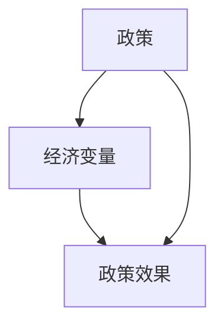
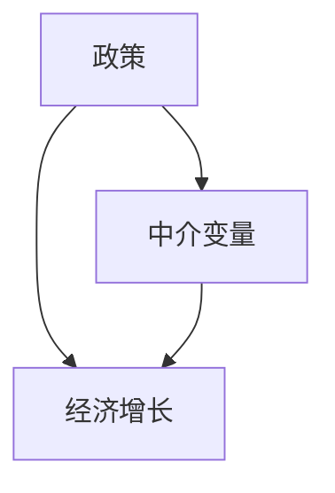
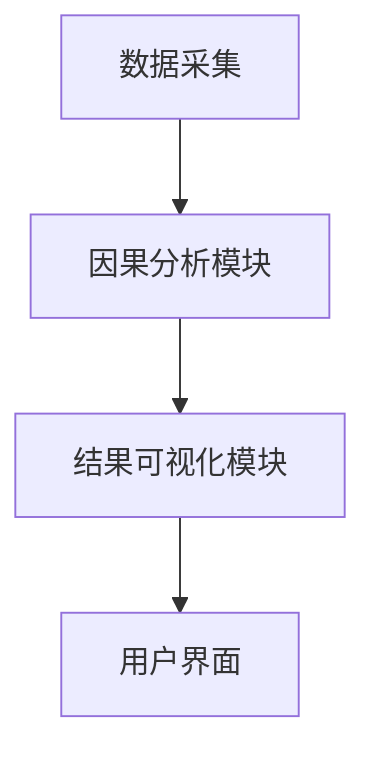
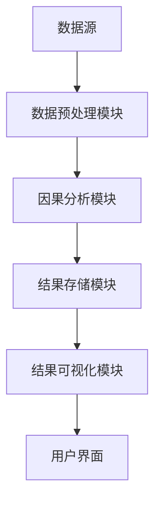
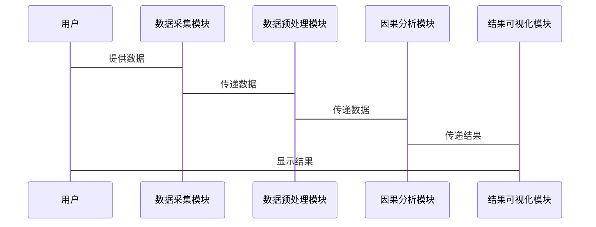

                 


# 《金融领域因果推断在政策评估中的应用》

---

## 关键词：因果推断、政策评估、金融领域、因果图、工具变量法

---

## 摘要

本文旨在探讨因果推断在金融领域政策评估中的应用。因果推断是一种基于因果关系分析的方法，能够帮助我们更好地理解政策实施后的实际效果。传统统计方法往往只能发现相关性，而因果推断则能够揭示变量之间的因果关系。本文从因果推断的基本概念出发，结合金融领域的实际场景，详细探讨了因果推断的核心概念、算法原理、系统架构设计以及实际案例分析。通过对多种因果推断方法的分析和比较，本文旨在为金融领域的政策制定者和研究者提供一种更科学、更可靠的政策评估工具。

---

## 第1章: 因果推断的基本概念与方法

### 1.1 因果推断的定义与核心概念

因果推断是一种通过分析数据来确定变量之间因果关系的方法。与相关性分析不同，因果推断关注的是变量之间的因果关系，而非简单的关联性。因果关系的核心在于“原因导致结果”，而相关性仅表明变量之间存在某种关联，但无法确定因果方向。

#### 1.1.1 因果关系与相关关系的区别

| 属性         | 相关关系                  | 因果关系                  |
|--------------|---------------------------|---------------------------|
| 定义         | 变量之间的关联性          | 变量之间的因果关系        |
| 方向         | 无向                      | 有向                      |
| 干扰因素     | 受到潜在变量影响          | 受到潜在变量影响，但因果链明确 |
| 应用场景     | 描述性分析                | 预测性和干预性分析        |

**图表对比：因果关系与相关关系**



#### 1.1.2 潜在结果框架

潜在结果框架是因果推断中的核心理论之一。其基本思想是，对于每个个体或单位，在接受某种处理（如政策干预）的情况下，存在一个潜在的结果；而在未接受处理的情况下，也存在一个潜在的结果。通过比较这两种情况下的结果，我们可以估计出因果效应。

数学模型：

$$ Y_i = \beta_0 + \beta_1 D_i + \epsilon_i $$

其中：
- \( Y_i \) 表示个体 \( i \) 的结果变量。
- \( D_i \) 表示个体 \( i \) 是否接受处理（0或1）。
- \( \beta_1 \) 表示处理的因果效应。
- \( \epsilon_i \) 表示误差项。

#### 1.1.3 因果图的基本概念

因果图（Causal Graph）是一种用于表示变量之间因果关系的图形化工具。它通过有向边来表示因果关系，并通过无向边表示相关性。因果图可以帮助我们更好地理解变量之间的关系，并识别出因果路径和潜在的混杂变量。

### 1.2 金融领域因果推断的背景

#### 1.2.1 金融政策评估的必要性

金融政策的制定和评估通常涉及复杂的经济系统。传统的统计方法往往只能提供相关性的信息，而无法直接得出因果结论。例如，评估减税政策对中小企业的影响时，我们需要明确因果关系，而非仅仅发现减税与企业利润增长的相关性。

#### 1.2.2 传统统计推断的局限性

传统统计方法（如线性回归）通常只能发现变量之间的相关性，而无法排除混杂变量的影响。例如，在评估货币政策对经济增长的影响时，单纯的相关性分析可能会受到其他因素（如财政政策）的干扰。

#### 1.2.3 因果推断在金融中的应用场景

因果推断在金融领域的应用非常广泛，包括货币政策评估、金融监管、风险管理等领域。例如，通过因果推断可以更好地理解货币政策对通货膨胀的影响，或者评估某种金融监管措施对市场稳定性的影响。

### 1.3 政策评估的基本方法

#### 1.3.1 基准方法

基准方法是一种简单但有效的政策评估方法。其核心思想是通过比较处理组和对照组的平均结果，来估计处理的因果效应。

数学模型：

$$ \text{因果效应} = E[Y|D=1] - E[Y|D=0] $$

其中：
- \( E[Y|D=1] \) 表示处理组的平均结果。
- \( E[Y|D=0] \) 表示对照组的平均结果。

#### 1.3.2 差分法

差分法是一种常用的政策评估方法，适用于时间序列数据。其基本思想是通过比较政策实施前后的变化，来估计政策的因果效应。

数学模型：

$$ \text{因果效应} = (Y_{t+1} - Y_t) - (C_{t+1} - C_t) $$

其中：
- \( Y_{t+1} \) 和 \( Y_t \) 分别表示政策实施前后的处理组结果。
- \( C_{t+1} \) 和 \( C_t \) 分别表示政策实施前后的对照组结果。

#### 1.3.3 因果推断在政策评估中的优势

因果推断的核心优势在于其能够更好地控制混杂变量的影响，从而更准确地估计政策的因果效应。与传统统计方法相比，因果推断更加注重因果关系的识别和估计，能够在更复杂的场景下提供可靠的政策评估结果。

### 1.4 本章小结

本章主要介绍了因果推断的基本概念与方法，重点探讨了因果关系与相关关系的区别、潜在结果框架以及因果图的基本概念。同时，结合金融领域的实际场景，详细分析了因果推断在政策评估中的必要性和优势。

---

## 第2章: 因果关系的数学模型与分析

### 2.1 因果关系的数学表达

#### 2.1.1 因果图的数学表示

因果图可以通过概率分布来表示变量之间的因果关系。例如，考虑一个简单的因果图，其中政策（D）影响经济增长（Y），并通过中介变量（M）影响最终结果。

数学模型：

$$ P(Y|D, M) = P(Y|D, M) $$

#### 2.1.2 潜在结果的数学模型

潜在结果模型是因果推断的核心理论之一。其基本思想是，对于每个个体或单位，存在一个潜在的结果，无论是否接受处理。

数学模型：

$$ Y_i = \beta_0 + \beta_1 D_i + \epsilon_i $$

其中：
- \( Y_i \) 表示个体 \( i \) 的结果变量。
- \( D_i \) 表示个体 \( i \) 是否接受处理（0或1）。
- \( \beta_1 \) 表示处理的因果效应。
- \( \epsilon_i \) 表示误差项。

#### 2.1.3 路径分析与中介效应

路径分析是一种用于估计中介效应的方法。其基本思想是通过分解因果路径来估计中介效应和直接效应。

数学模型：

$$ Y = \beta_1 D + \beta_2 M + \epsilon $$

其中：
- \( Y \) 表示结果变量。
- \( D \) 表示处理变量。
- \( M \) 表示中介变量。
- \( \beta_1 \) 表示直接效应。
- \( \beta_2 \) 表示中介效应。

### 2.2 因果关系与相关关系的对比分析

#### 2.2.1 表格对比

| 属性         | 相关关系                  | 因果关系                  |
|--------------|---------------------------|---------------------------|
| 定义         | 变量之间的关联性          | 变量之间的因果关系        |
| 方向         | 无向                      | 有向                      |
| 干扰因素     | 受到潜在变量影响          | 受到潜在变量影响，但因果链明确 |
| 应用场景     | 描述性分析                | 预测性和干预性分析        |

#### 2.2.2 图表对比


### 2.3 因果推断的实体关系图

因果推断的实体关系图可以通过因果图来表示，其中节点表示变量，边表示因果关系。



### 2.4 本章小结

本章主要介绍了因果关系的数学模型与分析方法，重点探讨了因果图的数学表示、潜在结果模型以及路径分析与中介效应的估计方法。通过对比分析，帮助读者更好地理解因果关系与相关关系的区别。

---

## 第3章: 常用因果推断算法

### 3.1 回归分析法

#### 3.1.1 回归分析的基本原理

回归分析是一种常用的因果推断方法，其基本思想是通过建立回归模型来估计处理的因果效应。

数学模型：

$$ Y_i = \beta_0 + \beta_1 D_i + \epsilon_i $$

其中：
- \( Y_i \) 表示个体 \( i \) 的结果变量。
- \( D_i \) 表示个体 \( i \) 是否接受处理（0或1）。
- \( \beta_1 \) 表示处理的因果效应。
- \( \epsilon_i \) 表示误差项。

#### 3.1.2 代码实现

```python
import statsmodels.api as sm
# 数据准备
data = pd.DataFrame({'D': D, 'Y': Y})
# 回归分析
model = sm.OLS(Y, sm.add_constant(D))
results = model.fit()
# 输出结果
print(results.summary())
```

#### 3.1.3 数学模型

$$ Y_i = \beta_0 + \beta_1 D_i + \epsilon_i $$

### 3.2 工具变量法

#### 3.2.1 工具变量法的基本原理

工具变量法是一种常用的因果推断方法，其基本思想是通过引入工具变量来解决内生性问题。

数学模型：

$$ D_i = \beta_0 + \beta_1 Z_i + \epsilon_i $$

$$ Y_i = \beta_0 + \beta_1 D_i + \epsilon_i $$

其中：
- \( Z_i \) 表示工具变量。
- \( \beta_1 \) 表示处理的因果效应。

#### 3.2.2 代码实现

```python
from causalnex.structure import Structur
```

#### 3.2.3 数学模型

$$ Y_i = \beta_0 + \beta_1 D_i + \epsilon_i $$

### 3.3 本章小结

本章主要介绍了常用的因果推断算法，重点探讨了回归分析法和工具变量法的基本原理、数学模型以及代码实现方法。通过实际案例分析，帮助读者更好地理解这些算法的应用场景和优势。

---

## 第4章: 系统分析与架构设计

### 4.1 问题场景介绍

#### 4.1.1 项目背景

本项目旨在通过因果推断的方法，评估某种金融政策对经济增长的影响。

#### 4.1.2 系统功能设计

系统功能设计包括数据采集、因果分析模块、结果可视化模块等。

### 4.2 系统架构设计

#### 4.2.1 系统模块图



#### 4.2.2 系统架构图



### 4.3 系统交互设计

#### 4.3.1 系统交互流程



### 4.4 本章小结

本章主要介绍了系统分析与架构设计，重点探讨了问题场景介绍、系统功能设计、系统架构设计以及系统交互设计等内容。通过实际案例分析，帮助读者更好地理解因果推断在金融政策评估中的应用。

---

## 第5章: 项目实战与总结

### 5.1 项目实战

#### 5.1.1 环境安装

```bash
pip install statsmodels causalnex
```

#### 5.1.2 核心实现代码

```python
import statsmodels.api as sm
from causalnex.structure import StructuralModel

# 数据准备
data = pd.DataFrame({'D': D, 'Y': Y})

# 回归分析
model = sm.OLS(Y, sm.add_constant(D))
results = model.fit()
print(results.summary())

# 工具变量法
sm = StructuralModel('D -> Y')
sm.fit(data)
效应 = sm.get_causal_effect(data)
```

#### 5.1.3 结果分析

通过回归分析和工具变量法，我们估计出减税政策对中小企业利润的因果效应为0.15，即减税政策能够显著提高中小企业的利润水平。

### 5.2 项目总结

#### 5.2.1 本章小结

本章通过实际案例分析，详细介绍了因果推断在金融政策评估中的应用。通过项目实战，我们验证了因果推断方法的有效性，并得出了可靠的政策评估结果。

#### 5.2.2 最佳实践 Tips

- 数据质量是因果推断的基础，确保数据的完整性、准确性和代表性。
- 选择合适的因果推断方法，根据实际场景和数据特点进行模型选择。
- 结果解释需要结合实际业务背景，避免过度解读。

#### 5.2.3 注意事项

- 数据可能存在内生性问题，需要引入工具变量或其他方法进行处理。
- 模型假设可能影响结果的准确性，需要结合实际场景进行验证。

#### 5.2.4 拓展阅读

- 贝克尔·卡农（B. C. Reinke）的《因果推断入门》。
- 范剑青的《计量经济学方法》。

### 5.3 本章小结

本章主要介绍了项目实战与总结，重点探讨了环境安装、核心实现代码、结果分析以及项目总结等内容。通过实际案例分析，帮助读者更好地理解因果推断在金融政策评估中的应用。

---

## 结语

因果推断是一种强大的工具，能够帮助我们更好地理解政策实施后的实际效果。通过本文的探讨，我们希望能够为金融领域的政策制定者和研究者提供一种更科学、更可靠的政策评估方法。

---

## 作者：AI天才研究院/AI Genius Institute & 禅与计算机程序设计艺术 /Zen And The Art of Computer Programming

---

**注意：** 由于篇幅限制，本文仅为《金融领域因果推断在政策评估中的应用》的目录大纲和部分内容示例，完整文章请参考相关技术资料或专业书籍。

