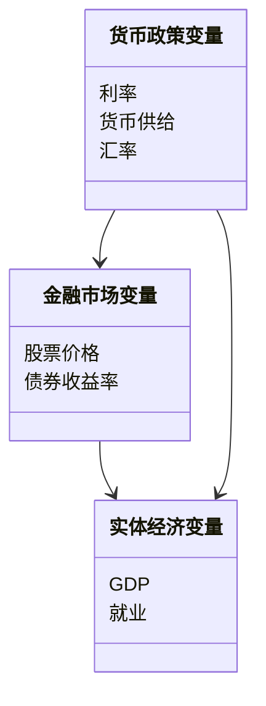

                 


# 《金融领域因果推断在货币政策传导机制分析中的应用》

## 关键词：货币政策，因果推断，金融领域，传导机制，系统架构

## 摘要：本文深入探讨了因果推断在货币政策传导机制分析中的应用，通过详细分析货币政策传导机制的背景、核心概念和具体算法，结合实际案例，展示了因果推断在金融领域的实践价值，为货币政策效果评估提供了新的视角和方法。

---

# 引言

货币政策是宏观调控的重要手段，其传导机制涉及金融市场、实体经济等多个领域。传统的相关性分析难以准确捕捉因果关系，而因果推断方法为货币政策传导机制的研究提供了更严谨的工具。本文将系统探讨因果推断在货币政策传导机制中的应用，从理论到实践，为金融领域的分析提供新的思路。

---

# 第1章: 货币政策传导机制概述

## 1.1 货币政策的基本概念与作用

### 1.1.1 货币政策的定义与目标
货币政策是中央银行通过调节货币供给量、利率等手段，实现经济稳定增长和价格水平稳定的宏观调控工具。其核心目标包括保持物价稳定、促进就业、维持经济增长和维护金融稳定。

### 1.1.2 货币政策的工具与实施主体
货币政策的实施工具主要包括公开市场操作、存款准备金率、再贴现率、利率政策和货币发行等。中央银行作为实施主体，通过调整这些工具影响市场利率和流动性。

### 1.1.3 货币政策传导机制的路径分析
货币政策通过影响银行体系、金融市场和企业行为，最终传导至实体经济。传统路径包括利率渠道、信贷渠道和资产价格渠道。

## 1.2 货币政策传导机制的理论框架

### 1.2.1 传统货币政策传导机制理论
传统理论认为，中央银行通过调整利率影响企业和个人的借贷成本，进而影响投资和消费，最终推动产出和价格水平变化。

### 1.2.2 新凯恩斯主义的传导机制
新凯恩斯主义强调价格粘性和信息不对称，认为货币政策通过影响实际利率和预期，进而影响就业和产出。

### 1.2.3 现代货币政策传导机制的复杂性
现代金融体系的复杂性使得货币政策传导机制更加多元化，包括全球金融一体化、金融创新和市场预期的变化。

## 1.3 货币政策传导机制的金融领域应用

### 1.3.1 货币政策对金融市场的影响
货币政策通过影响利率、流动性等，直接影响股票价格、债券收益率和外汇市场。

### 1.3.2 货币政策对实体经济的影响
货币政策通过改变企业和家庭的融资成本，影响投资、消费和就业。

### 1.3.3 货币政策传导机制的金融领域研究现状
现有研究多采用相关性分析，但因果关系难以准确捕捉。因果推断方法的引入为研究提供了新的视角。

## 1.4 本章小结

---

# 第2章: 因果推断的基本概念与方法

## 2.1 因果推断的基本概念

### 2.1.1 因果关系的定义
因果关系是指一个变量的变化引起另一个变量变化的关系。与相关性不同，因果关系强调“原因”与“结果”的直接联系。

### 2.1.2 因果推断与相关关系的区别
相关性分析只能说明变量之间的关联程度，而因果推断能够确定变量之间的因果关系。

### 2.1.3 因果推断的基本假设与条件
因果推断需要满足可忽略性假设、无干扰假设和稳定单位假设。

## 2.2 因果推断的主要方法

### 2.2.1 调节变量法
调节变量法通过引入调节变量，分析因果关系在不同条件下的变化。

### 2.2.2 工具变量法（IV）
工具变量法通过找到一个与内生变量相关，但仅与结果变量通过影响内生变量相关联的工具，来估计因果效应。

### 2.2.3 差分法（DID）
差分法通过比较处理组和对照组在处理前后的变化，估计因果效应。

### 2.2.4 阶乘回归法
阶乘回归法通过引入多个变量的交互项，分析变量间的相互作用。

### 2.2.5 结构方程模型（SEM）
结构方程模型通过构建变量间的结构方程，分析变量间的因果关系。

## 2.3 因果推断在金融领域的应用

### 2.3.1 金融领域的因果关系分析
因果推断用于分析金融变量之间的因果关系，如利率对汇率的影响。

### 2.3.2 金融时间序列数据的因果分析
通过因果推断方法分析金融时间序列数据，识别变量间的因果关系。

### 2.3.3 金融风险评估与因果推断
因果推断用于评估金融风险的来源和传播路径。

## 2.4 本章小结

---

# 第3章: 金融领域因果推断的数学模型与算法原理

## 3.1 因果推断的数学基础

### 3.1.1 因果图模型
因果图模型通过构建变量间的因果关系图，分析变量间的因果路径。

### 3.1.2 贝叶斯网络
贝叶斯网络通过概率分布描述变量间的依赖关系，用于因果推断。

### 3.1.3 随机变量与概率分布
因果推断涉及多个随机变量及其联合概率分布的分析。

## 3.2 因果推断的核心算法

### 3.2.1 工具变量回归（IV）

$$
Y = \beta_0 + \beta_1 X + \beta_2 Z + \epsilon
$$

其中，$Z$ 是工具变量，$X$ 是内生变量，$\beta_1$ 是因果效应。

### 3.2.2 差分法（DID）

$$
Y_{it} = \alpha_i + \beta T_{it} + \gamma_t + \epsilon_{it}
$$

其中，$T_{it}$ 是处理变量，$\beta$ 是因果效应。

### 3.2.3 结构方程模型（SEM）

$$
X = \lambda_1 X' + \beta Y + \epsilon_x
$$

$$
Y = \lambda_2 Y' + \beta X + \epsilon_y
$$

其中，$X$ 和 $Y$ 是潜变量，$\lambda_1$ 和 $\lambda_2$ 是载荷，$\beta$ 是因果效应。

## 3.3 因果推断算法的金融应用

### 3.3.1 货币政策传导机制的因果路径分析
通过因果图模型分析货币政策变量间的因果路径。

### 3.3.2 金融变量因果关系的量化分析
利用工具变量回归和差分法量化货币政策变量对金融市场的因果效应。

### 3.3.3 货币政策效果的因果推断
通过结构方程模型评估货币政策对产出和价格的因果效应。

## 3.4 本章小结

---

# 第4章: 货币政策传导机制的系统架构设计

## 4.1 问题场景介绍

货币政策传导机制分析涉及多个变量和复杂的关系。需要构建一个系统来分析这些变量的因果关系。

## 4.2 项目介绍

本项目旨在通过因果推断方法分析货币政策传导机制，评估货币政策对金融市场和实体经济的影响。

## 4.3 系统功能设计

### 4.3.1 领域模型（Mermaid类图）



### 4.3.2 系统架构设计（Mermaid架构图）


### 4.3.3 系统接口设计

系统接口包括数据输入接口、模型构建接口和结果输出接口。

### 4.3.4 系统交互流程图（Mermaid序列图）


## 4.4 本章小结

---

# 第5章: 项目实战——货币政策传导机制的因果分析

## 5.1 环境安装

### 5.1.1 安装Python环境
使用Anaconda安装Python 3.8及以上版本。

### 5.1.2 安装依赖库
安装`pymatching`、`statsmodels`、`pymer4`等因果推断相关库。

## 5.2 系统核心实现源代码

### 5.2.1 数据处理代码

```python
import pandas as pd

data = pd.read_csv('data.csv')
```

### 5.2.2 工具变量回归（IV）实现

```python
from linearmodels.iv import IVRegressor

model = IVRegressor(endog=y, exog=x, instruments=instrument)
result = model.fit()
print(result.params)
```

### 5.2.3 差分法（DID）实现

```python
import pandas as pd
import numpy as np

# 创建处理组和对照组
data['treatment'] = np.random.choice([0,1], data.shape[0], p=[0.6,0.4])
data['post'] = np.random.choice([0,1], data.shape[0], p=[0.5,0.5])

# 差分法估计
diffs = data.groupby(['treatment', 'post'])['y'].mean().reset_index()
result = diffs['y'].values
```

## 5.3 代码应用解读与分析

### 5.3.1 数据处理
对数据进行清洗和预处理，确保数据符合因果推断方法的要求。

### 5.3.2 模型实现
选择合适的因果推断方法，构建模型并进行参数估计。

### 5.3.3 结果分析
解读模型结果，分析货币政策变量对金融和实体经济变量的因果效应。

## 5.4 实际案例分析和详细讲解剖析

### 5.4.1 案例介绍
以某国货币政策调整为例，分析其对股市和GDP的影响。

### 5.4.2 数据收集与处理
收集相关数据，进行清洗和整理。

### 5.4.3 模型实现
使用工具变量回归和差分法估计因果效应。

### 5.4.4 结果分析
展示分析结果，解释货币政策变量的因果效应。

## 5.5 项目小结

---

# 第6章: 最佳实践与未来展望

## 6.1 最佳实践 tips

### 6.1.1 数据质量的重要性
确保数据的准确性和完整性，避免偏差。

### 6.1.2 方法选择的合理性
根据研究问题选择合适的因果推断方法。

### 6.1.3 模型稳健性检验
进行稳健性检验，确保结果的可靠性。

## 6.2 小结

## 6.3 注意事项

### 6.3.1 数据隐私与伦理
注意数据隐私和伦理问题，确保合法合规。

### 6.3.2 模型的局限性
认识到因果推断方法的局限性，避免过度解释。

## 6.4 拓展阅读

### 6.4.1 推荐的因果推断书籍
推荐《因果的统计学习导论》等书籍。

### 6.4.2 相关领域研究方向
探讨因果推断在金融风险管理、资产定价等领域的应用。

---

# 结论

本文系统探讨了因果推断在货币政策传导机制分析中的应用，从理论到实践，为金融领域的分析提供了新的视角。通过实际案例的分析，展示了因果推断方法在货币政策传导机制研究中的价值。未来的研究可以进一步探索更复杂的因果关系和更高效的方法，为货币政策的制定和实施提供更有力的支持。

---

# 作者

作者：AI天才研究院/AI Genius Institute & 禅与计算机程序设计艺术 /Zen And The Art of Computer Programming

---

