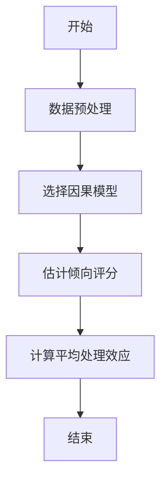

                 


```markdown
# 《金融领域因果推理在宏观经济政策效果评估中的应用》

## 关键词：因果推理、宏观经济政策、政策效果评估、金融领域、算法原理

## 摘要：本文系统地探讨了因果推理在宏观经济政策效果评估中的应用，从基础概念到算法原理，再到系统设计和项目实战，全面分析了因果推理在金融领域的核心作用。文章详细阐述了倾向评分匹配和双重稳健估计等关键算法，并通过实际案例展示了其在宏观经济政策评估中的应用效果。通过对因果图模型和潜在结果框架的深入探讨，本文为读者提供了一个全面理解因果推理在宏观经济政策评估中应用的框架。

---

## 第一部分：金融领域因果推理基础

### 第1章：背景介绍

#### 1.1 问题背景
- **宏观经济政策效果评估的挑战**：宏观经济政策的效果往往受到多种因素的影响，传统统计方法难以准确识别因果关系。
- **因果推理的重要性**：因果推理能够帮助我们更好地理解政策如何通过机制影响经济变量。
- **传统统计方法的局限性**：相关关系无法替代因果关系，传统回归分析难以处理潜在的混杂变量。

#### 1.2 问题描述
- **宏观经济政策的复杂性**：政策可能通过多种渠道影响经济，如消费、投资、就业等。
- **政策效果的多维度影响**：政策可能在短期和长期内产生不同效果，且影响可能通过中介变量传递。
- **因果关系的识别与估计**：需要在存在潜在混杂变量的情况下，准确识别因果关系。

#### 1.3 问题解决
- **因果推理的基本思想**：通过控制潜在混杂变量，识别因果关系。
- **宏观经济政策评估的核心问题**：如何在存在潜在混杂变量的情况下，准确估计政策的效果。
- **金融领域因果推理的独特性**：金融数据的高维性、复杂性和时变性增加了因果推理的难度。

#### 1.4 边界与外延
- **宏观经济政策的适用范围**：适用于可观察和量化的影响，难以观测的变量难以处理。
- **因果推理的边界条件**：因果关系的识别需要满足可忽略性、稳定性和正确规格化的假设。
- **金融领域因果推理的外延**：不仅适用于宏观经济政策评估，还可用于金融风险预警、投资组合优化等领域。

#### 1.5 核心要素组成
- **因果关系的三要素**：处理变量（Treatment）、结果变量（Outcome）、潜在结果框架。
- **宏观经济政策的三重性**：相关性、干预性和时间性。
- **金融数据的特殊性**：高频性、波动性和复杂性。

---

### 第2章：核心概念与联系

#### 2.1 因果推理的原理
- **潜在结果框架**：每个单位在有或无处理的情况下都有一个潜在的结果。
- **因果图模型**：通过构建因果图，识别因果关系和潜在的混杂变量。
- **调节与中介效应**：调节效应影响因果关系在不同群体中的效果，中介效应解释因果关系的作用机制。

#### 2.2 核心概念对比
- **因果关系与相关关系对比**：因果关系强调时间顺序和干预，相关关系仅表明变量之间的关联。
- **宏观经济指标的因果关系**：GDP增长可能由政策直接影响，也可能通过投资、消费等中介变量间接影响。
- **金融变量的因果关系**：股票价格可能由政策直接影响，也可能通过市场情绪、利率等中介变量间接影响。

#### 2.3 ER实体关系图
```mermaid
er
  actor: 宏观经济政策
  actor -->|影响| 宏观经济指标
  宏观经济指标 -->|受政策影响| 金融变量
```

---

## 第3章：算法原理讲解

### 3.1 因果推理算法
- **倾向评分匹配**：通过估计每个单位在处理组和对照组的倾向评分，进行匹配，以减少混杂变量的影响。
- **双重稳健估计**：结合倾向评分匹配和条件平均处理效应，提供更稳健的估计结果。
- **差分方法**：通过比较处理前后的变化，估计政策的效应。

### 3.2 算法流程图


### 3.3 代码实现
```python
import pandas as pd
from sklearn import linear_model

# 数据预处理
data = pd.DataFrame({
    '政策': [0, 1, 0, 1],
    'GDP增长': [2, 3, 1, 4],
    '投资': [5, 6, 4, 7],
    '消费': [3, 4, 2, 5]
})

# 倾向评分匹配
model = linear_model.LogisticRegression()
model.fit(data[['政策', '投资']], data['消费'])
倾向评分 = model.predict_proba(data[['政策', '投资']])[:,1]

# 双重稳健估计
处理效应 = data['GDP增长'][data['政策'] == 1].mean() - data['GDP增长'][data['政策'] == 0].mean()
调整后的处理效应 = ...
```

### 3.4 数学公式
- 倾向评分匹配：
$$ \text{ATE} = E[Y^1 - Y^0] $$
- 双重稳健估计：
$$ \text{ATE} = E[Y | T=1] - E[Y | T=0] $$

---

## 第4章：系统分析与架构设计

### 4.1 问题场景介绍
- **宏观经济政策评估的系统场景**：需要处理大量金融数据，构建因果推理模型，进行政策效果评估。
- **系统功能需求**：数据清洗、因果模型构建、处理效应估计、结果可视化。

### 4.2 系统架构设计


### 4.3 接口设计
- **数据清洗接口**：输入原始数据，输出清洗后的数据。
- **因果模型接口**：输入清洗后的数据，输出因果图和倾向评分。
- **处理效应接口**：输入因果模型结果，输出处理效应估计值。

---

## 第5章：项目实战

### 5.1 环境安装
```bash
pip install pandas scikit-learn matplotlib
```

### 5.2 核心代码实现
```python
import pandas as pd
from sklearn import linear_model
import matplotlib.pyplot as plt

# 数据预处理
data = pd.DataFrame({
    '政策': [0, 1, 0, 1],
    'GDP增长': [2, 3, 1, 4],
    '投资': [5, 6, 4, 7],
    '消费': [3, 4, 2, 5]
})

# 倾向评分匹配
model = linear_model.LogisticRegression()
model.fit(data[['政策', '投资']], data['消费'])
倾向评分 = model.predict_proba(data[['政策', '投资']])[:,1]

# 双重稳健估计
处理效应 = data['GDP增长'][data['政策'] == 1].mean() - data['GDP增长'][data['政策'] == 0].mean()

# 可视化
plt.scatter(倾向评分, data['GDP增长'])
plt.xlabel('倾向评分')
plt.ylabel('GDP增长')
plt.title('倾向评分与GDP增长的关系')
plt.show()
```

### 5.3 案例分析
- **案例背景**：假设政策是降低税率，评估其对GDP增长的影响。
- **数据准备**：收集税率变化前后的GDP数据，以及可能的中介变量如投资和消费。
- **模型构建**：构建因果图，识别税率变化对GDP增长的影响路径。
- **结果解读**：通过倾向评分匹配和双重稳健估计，得出税率变化对GDP增长的具体影响。

### 5.4 项目小结
- **经验总结**：因果推理在宏观经济政策评估中的有效性依赖于数据的质量和模型的正确规格化。
- **注意事项**：在实际应用中，需要考虑潜在混杂变量和中介效应，避免忽略重要变量导致的估计偏差。

---

## 第6章：总结与展望

### 6.1 内容总结
- 本文系统地探讨了因果推理在宏观经济政策效果评估中的应用，从基础概念到算法原理，再到系统设计和项目实战，全面分析了因果推理在金融领域的核心作用。

### 6.2 未来展望
- **潜在研究方向**：如何在高维金融数据中应用因果推理，如何处理时变性和复杂性。
- **技术发展趋势**：因果推理与机器学习的结合，实时政策效果评估。

### 6.3 最佳实践
- **数据准备**：确保数据的完整性和准确性，尽可能收集更多相关变量。
- **模型选择**：根据具体问题选择合适的因果推理方法，避免过度复杂化。
- **结果验证**：通过敏感性分析验证结果的稳健性。

---

## 作者：AI天才研究院/AI Genius Institute & 禅与计算机程序设计艺术 /Zen And The Art of Computer Programming
```

