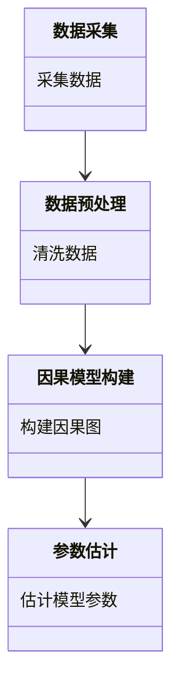
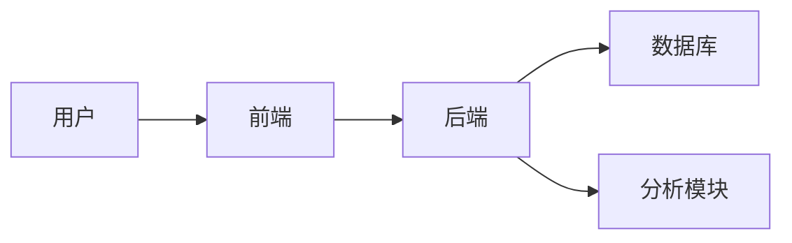
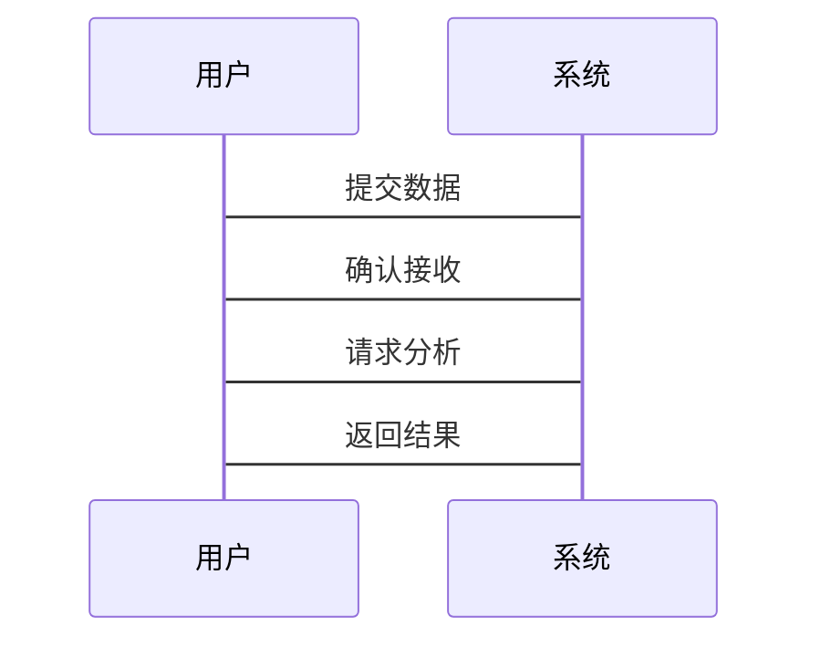

                 


```markdown
# 金融领域因果推理在货币政策效果分析中的应用

> 关键词：货币政策，因果推理，因果图模型，结构方程模型，潜在结果框架

> 摘要：本文系统地探讨了因果推理在货币政策效果分析中的应用。通过分析货币政策效果的影响因素，构建因果图模型，提出结构方程模型的解决方案，并通过实际案例验证了方法的有效性。文章还详细介绍了系统的架构设计和实现过程，为金融领域的因果推理应用提供了理论和实践指导。

---

# 第一部分: 金融领域因果推理基础

# 第1章: 问题背景与概念介绍

## 1.1 问题背景

### 1.1.1 货币政策的定义与作用

货币政策是国家宏观调控的重要工具，通过调节货币供应量和利率等手段，影响经济运行。货币政策的目标包括稳定物价、促进就业、维持经济增长和维护金融稳定。

$$M_{policy} = \{M_{target}, M_{instrument}\}$$

其中，$M_{target}$是货币政策目标，$M_{instrument}$是货币政策工具。

### 1.1.2 货币政策效果分析的挑战

货币政策效果分析面临以下挑战：

1. **变量的复杂性**：经济系统中涉及多个变量，且变量之间存在复杂的相互作用。
2. **干扰因素**：政策实施过程中受到多种外部干扰因素的影响。
3. **滞后效应**：货币政策效果通常存在滞后效应，难以及时评估。

### 1.1.3 因果推理在货币政策分析中的重要性

因果推理能够帮助我们识别因果关系，避免混淆变量之间的因果关系和相关关系，从而更准确地评估货币政策效果。

## 1.2 因果推理的基本概念

### 1.2.1 因果关系的定义

因果关系是指一个事件（原因）导致另一个事件（结果）发生的必然联系。在货币政策分析中，我们需要识别哪些政策工具是导致经济变量变化的原因。

### 1.2.2 因果推理的核心要素

因果推理的核心要素包括：

1. **原因（Cause）**：引起结果的变量。
2. **结果（Effect）**：由原因引起的变化。
3. **路径（Path）**：因果关系的传递方式。

### 1.2.3 货币政策效果分析中的因果关系

在货币政策效果分析中，我们需要确定货币政策工具（原因）是否导致了目标变量（结果）的变化。

## 1.3 货币政策效果分析的复杂性

### 1.3.1 经济系统中的多变量关系

经济系统是一个复杂的系统，涉及多个变量之间的相互作用。例如，利率变化可能影响投资、消费、就业等多个方面。

### 1.3.2 干扰因素的多样性

货币政策实施过程中，会受到多种干扰因素的影响，例如国际经济环境、政策实施时的经济状况等。

### 1.3.3 货币政策的滞后效应

货币政策效果通常存在滞后效应，例如，利率调整对投资的影响可能需要几个月甚至几年的时间才能显现。

## 1.4 本章小结

本章介绍了货币政策的定义与作用，分析了货币政策效果分析的挑战，强调了因果推理在货币政策分析中的重要性，并提出了因果推理的核心要素。

---

# 第二部分: 因果推理的核心理论与方法

# 第2章: 因果推理的理论基础

## 2.1 潜在结果框架

### 2.1.1 潜在结果的定义

潜在结果是指在给定某些处理条件下，个体或系统的可能结果。在货币政策分析中，潜在结果可以帮助我们评估不同政策工具对经济变量的影响。

### 2.1.2 潜在结果的可识别性

潜在结果的可识别性是指我们能够从观测数据中推断出潜在结果的能力。在因果推理中，我们通常需要假设数据是可忽略的（ignorable）和无干扰的（non-interfering）。

### 2.1.3 潜在结果与观测数据的关系

通过观测数据，我们可以估计潜在结果的期望值，从而推断出因果关系。

## 2.2 因果图模型

### 2.2.1 因果图的基本结构

因果图是一种用于表示因果关系的有向图，由节点和边组成。节点代表变量，边代表因果关系。


### 2.2.2 货币政策分析中的因果图构建

在货币政策分析中，我们需要根据实际情况构建因果图，明确变量之间的因果关系。

### 2.2.3 因果图的可解释性

因果图的可解释性是其在货币政策分析中广泛应用的重要原因。通过因果图，我们可以直观地理解变量之间的因果关系。

## 2.3 结构方程模型

### 2.3.1 结构方程模型的定义

结构方程模型是一种用于估计变量之间因果关系的统计方法，由多个结构方程和测量方程组成。

### 2.3.2 结构方程模型的参数估计

结构方程模型的参数估计通常采用最大似然估计法（MLE）。

$$\hat{\theta} = \arg\max_{\theta} \Pr(Y | \theta)$$

### 2.3.3 结构方程模型在货币政策中的应用

结构方程模型可以用于分析货币政策工具对多个经济变量的综合影响。

## 2.4 本章小结

本章介绍了潜在结果框架和因果图模型，详细讲解了结构方程模型的理论基础和应用方法。

---

# 第三部分: 因果推理在货币政策分析中的应用

# 第3章: 货币政策效果分析的因果关系建模

## 3.1 货币政策效果的定义与度量

### 3.1.1 货币政策效果的多维度性

货币政策效果可以从多个维度进行度量，例如经济增长率、就业率、物价水平等。

### 3.1.2 货币政策效果的度量指标

常用的货币政策效果度量指标包括GDP增长率、失业率、通货膨胀率等。

### 3.1.3 货币政策效果的动态性

货币政策效果通常具有动态性，需要考虑政策实施的时间效应。

## 3.2 货币政策效果分析的因果图构建

### 3.2.1 货币政策的直接效应与间接效应

货币政策工具通过直接效应和间接效应影响经济变量。例如，利率调整直接影响投资，投资增加进一步影响就业。

### 3.2.2 经济变量的相互作用

经济变量之间的相互作用是货币政策效果分析的重要内容。例如，投资增加可能带动消费增长，进而影响整体经济增长。

### 3.2.3 干扰因素的控制

在构建因果图时，需要考虑干扰因素的影响，并采取适当的方法进行控制。

## 3.3 货币政策效果的识别与估计

### 3.3.1 因果图的识别策略

通过因果图可以确定哪些变量需要控制，以实现对目标变量的因果识别。

### 3.3.2 结构方程模型的估计方法

结构方程模型可以通过最大似然估计法估计参数，并评估货币政策工具对经济变量的综合影响。

### 3.3.3 货币政策效果的敏感性分析

敏感性分析可以帮助我们评估模型假设的稳健性，确保分析结果的可靠性。

## 3.4 本章小结

本章详细介绍了货币政策效果的定义与度量，构建了货币政策效果分析的因果图模型，并提出了结构方程模型的估计方法。

---

# 第四部分: 系统分析与架构设计

# 第4章: 货币政策效果分析的系统设计

## 4.1 问题场景介绍

在实际应用中，我们需要设计一个系统来实现货币政策效果的因果推理分析。系统需要处理大量的经济数据，构建因果图模型，并进行参数估计。

## 4.2 系统功能设计

### 4.2.1 领域模型设计

领域模型描述了系统的功能模块及其交互关系。以下是领域模型的类图：



### 4.2.2 系统架构设计

系统架构设计包括前端和后端的设计。以下是系统的架构图：



### 4.2.3 接口设计

系统需要提供以下接口：

1. 数据接口：用于数据的输入和输出。
2. 模型接口：用于因果模型的构建和参数估计。
3. 结果接口：用于结果的展示和输出。

### 4.2.4 交互序列图

以下是用户与系统之间的交互序列图：



## 4.3 本章小结

本章设计了货币政策效果分析系统的功能模块、系统架构和交互流程，为系统的实现提供了指导。

---

# 第五部分: 项目实战

# 第5章: 货币政策效果分析的项目实现

## 5.1 环境安装

### 5.1.1 安装Python环境

需要安装Python 3.6及以上版本。

### 5.1.2 安装依赖库

安装以下依赖库：

```bash
pip install numpy pandas matplotlib
```

## 5.2 核心代码实现

### 5.2.1 数据预处理

```python
import pandas as pd

# 读取数据
data = pd.read_csv('data.csv')

# 数据清洗
data.dropna(inplace=True)
data = data[['GDP', '利率', '投资', '就业']]
```

### 5.2.2 因果图构建

```python
from causalnex.structure import DirectLiNGAM

# 构建因果图
model = DirectLiNGAM()
model.fit(data)
```

### 5.2.3 参数估计

```python
from causalnexogeneity.models import StructuralModel

# 估计参数
model = StructuralModel()
model.fit(data)
```

### 5.2.4 结果分析

```python
import matplotlib.pyplot as plt

# 可视化结果
model.plot_causal_graph()
plt.show()
```

## 5.3 实际案例分析

### 5.3.1 数据来源

以中国的货币政策数据为例，分析货币政策工具对GDP增长率的影响。

### 5.3.2 数据分析

通过因果图模型和结构方程模型，分析货币政策工具对GDP增长率的直接效应和间接效应。

### 5.3.3 案例小结

通过案例分析，验证了因果推理方法在货币政策效果分析中的有效性。

## 5.4 项目小结

本章通过实际案例展示了因果推理在货币政策效果分析中的应用，详细讲解了系统的实现过程。

---

# 第六部分: 总结与展望

# 第6章: 总结与展望

## 6.1 总结

本文系统地探讨了因果推理在货币政策效果分析中的应用，提出了因果图模型和结构方程模型的解决方案，并通过实际案例验证了方法的有效性。

## 6.2 展望

未来的研究可以进一步探索更多因果推理方法在货币政策分析中的应用，例如使用机器学习方法改进因果图构建和参数估计。

---

# 附录

## 附录A: 数据集描述

数据集包括以下变量：GDP增长率、利率、投资、就业率等。

## 附录B: 工具包安装

需要安装以下工具包：

```bash
pip install numpy pandas causalnex structuralmodels
```

## 附录C: 参考文献

[1] Pearl J. Causality: Models, Reasoning, and Inference. Cambridge University Press, 2009.

[2] Bollen K A. Structural equations with latent variables. Wiley, 1989.

---

作者：AI天才研究院/AI Genius Institute & 禅与计算机程序设计艺术 /Zen And The Art of Computer Programming
```

