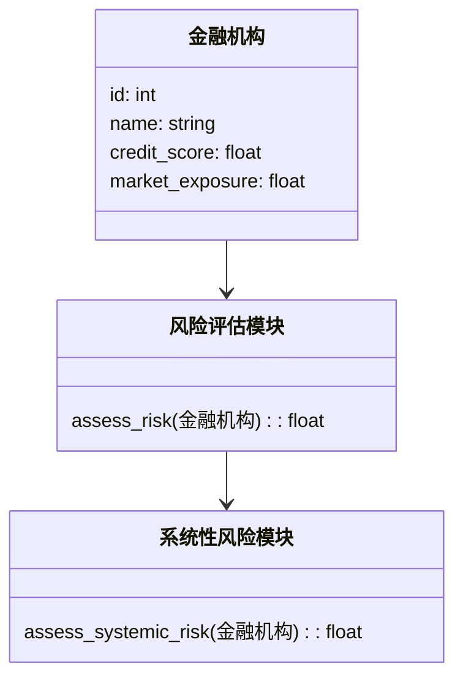
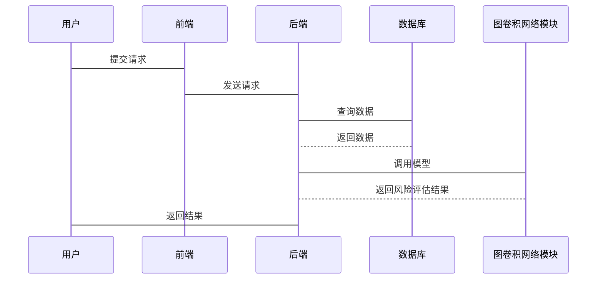

                 


# 《金融领域图卷积网络在全球金融网络风险评估中的应用》

---

## 关键词：图卷积网络，金融网络，风险评估，信用风险，市场风险，系统性风险

---

## 摘要

随着全球金融市场的日益复杂化和互联化，金融网络中的风险传播也变得更加复杂和难以预测。传统的风险评估方法往往难以捕捉金融网络中的复杂关联关系，而图卷积网络（Graph Convolutional Networks, GCN）作为一种新兴的图神经网络技术，能够有效地建模和分析这些复杂关系。本文从金融网络的基本概念出发，详细探讨了图卷积网络的原理及其在全球金融网络风险评估中的应用。通过实际案例分析，本文展示了GCN在信用风险、市场风险和系统性风险评估中的优势，并结合系统架构设计和项目实战，深入分析了GCN在金融风险评估中的实现细节和实际效果。最后，本文总结了GCN在金融领域的应用现状，并展望了未来的研究方向。

---

## 第一部分：金融领域图卷积网络概述

### 第1章：金融网络与风险评估概述

#### 1.1 金融网络的定义与特征

##### 1.1.1 金融网络的定义
金融网络是指由金融机构、企业、投资者等主体构成的复杂网络，这些主体之间通过金融交易、资金流动和信息交互形成复杂的关联关系。金融网络的复杂性体现在其节点的多样性和边的多重性上。

##### 1.1.2 金融网络的主要特征
- **节点多样性**：金融网络中的节点可以是银行、企业、投资者、政府机构等。
- **边的多重性**：节点之间的关系可以是资金流动、交易行为、信息共享等。
- **动态性**：金融网络的结构和权重会随着时间和市场环境的变化而变化。

##### 1.1.3 金融网络的复杂性与挑战
金融网络的复杂性使得传统的线性模型难以捕捉其非线性关系，而其动态性和不确定性也增加了风险评估的难度。

#### 1.2 风险评估在金融领域的重要性

##### 1.2.1 风险评估的基本概念
风险评估是指对金融网络中的潜在风险进行识别、量化和预测的过程。其目的是为了降低风险的发生概率和影响程度。

##### 1.2.2 金融风险的主要类型
- **信用风险**：借款人或交易对手方无法履行其义务的风险。
- **市场风险**：由于市场波动导致资产价格下跌的风险。
- **系统性风险**：整个金融系统中广泛存在的风险，可能引发系统性金融危机。

##### 1.2.3 全球金融网络风险的特点
全球金融网络的互联性使得风险可能从一个局部迅速蔓延到整个金融系统，形成系统性风险。这种传播速度和范围的不可控性使得传统的风险管理方法显得力不从心。

#### 1.3 图卷积网络的基本概念

##### 1.3.1 图论基础
图论是研究网络结构的数学工具，图由节点和边组成，边可以有权重和方向。

##### 1.3.2 卷积神经网络的概述
卷积神经网络（CNN）是一种有效的图像处理工具，其核心是卷积操作，能够提取图像的空间特征。

##### 1.3.3 图卷积网络的核心思想
图卷积网络将卷积操作扩展到图结构上，通过在图上进行局部卷积操作，提取节点的局部特征，并传播到整个图中。

---

### 第2章：图卷积网络的原理与优势

#### 2.1 图卷积网络的基本原理

##### 2.1.1 图的表示与邻接矩阵
图可以通过邻接矩阵表示，其中$A_{i,j}$表示节点$i$和节点$j$之间的连接权重。

##### 2.1.2 图卷积操作的数学推导
图卷积操作可以表示为：
$$
h_i^{(l+1)} = \sigma\left(\sum_{j} A_{i,j} h_j^{(l)}\right)
$$
其中，$h_i^{(l)}$表示第$l$层节点$i$的特征向量，$\sigma$是激活函数。

##### 2.1.3 图卷积网络的传播机制
图卷积网络通过逐层传播特征，将局部信息聚合到全局，从而捕捉图中的复杂关系。

#### 2.2 图卷积网络在金融领域的优势

##### 2.2.1 金融网络的图结构特点
金融网络的图结构能够有效地捕捉金融机构之间的关联性。

##### 2.2.2 图卷积网络在风险传播中的优势
GCN能够捕捉金融网络中的非线性关系，准确预测风险的传播路径和影响范围。

##### 2.2.3 图卷积网络的可解释性与鲁棒性
GCN的可解释性使其能够满足金融领域对模型透明性的要求，同时其鲁棒性使其能够应对金融网络的动态变化。

---

### 第3章：金融网络风险评估的核心概念

#### 3.1 金融网络风险评估的背景

##### 3.1.1 金融风险的来源与传播
金融风险可以通过直接和间接的方式传播，例如，一家银行的破产可能引发连锁反应，导致整个金融系统的崩溃。

##### 3.1.2 传统风险评估方法的局限性
传统方法难以捕捉金融网络中的复杂关联关系，导致其在风险预测和管理中的局限性。

##### 3.1.3 图卷积网络在风险评估中的潜力
GCN能够有效地建模金融网络的复杂结构，提供更准确的风险评估结果。

#### 3.2 金融网络风险评估的数学模型

##### 3.2.1 风险传播的数学表达
风险传播可以表示为：
$$
R_i = \sum_{j} A_{i,j} R_j
$$
其中，$R_i$表示节点$i$的风险值，$A_{i,j}$表示节点$i$和$j$之间的连接权重。

##### 3.2.2 图卷积网络的风险评估框架
GCN的风险评估框架包括数据预处理、模型训练和风险预测三个阶段。

##### 3.2.3 风险评估的指标与评价方法
常用的评价指标包括准确率、召回率和F1分数。

---

### 第4章：图卷积网络在金融网络中的应用

#### 4.1 图卷积网络在信用风险评估中的应用

##### 4.1.1 信用风险的基本概念
信用风险是指借款人或交易对手方无法履行其义务的风险。

##### 4.1.2 图卷积网络在信用风险中的建模
GCN可以通过建模金融机构之间的关联性，预测信用风险的传播路径。

##### 4.1.3 实际案例分析
通过实际案例分析，展示了GCN在信用风险评估中的优势。

#### 4.2 图卷积网络在市场风险评估中的应用

##### 4.2.1 市场风险的基本概念
市场风险是指由于市场波动导致资产价格下跌的风险。

##### 4.2.2 图卷积网络在市场风险中的建模
GCN可以通过建模市场参与者之间的关联性，预测市场风险的传播路径。

##### 4.2.3 实际案例分析
通过实际案例分析，展示了GCN在市场风险评估中的优势。

#### 4.3 图卷积网络在系统性风险评估中的应用

##### 4.3.1 系统性风险的基本概念
系统性风险是指整个金融系统中广泛存在的风险，可能引发系统性金融危机。

##### 4.3.2 图卷积网络在系统性风险中的建模
GCN可以通过建模金融网络的整体结构，预测系统性风险的传播路径。

##### 4.3.3 实际案例分析
通过实际案例分析，展示了GCN在系统性风险评估中的优势。

---

## 第二部分：系统实现与架构设计

### 第5章：系统实现与架构设计

#### 5.1 问题场景介绍
金融网络风险评估系统需要能够实时监测和预测金融网络中的风险。

#### 5.2 项目介绍
本项目旨在开发一个基于GCN的金融网络风险评估系统，能够实时监测和预测信用风险、市场风险和系统性风险。

#### 5.3 系统功能设计
##### 5.3.1 领域模型


##### 5.3.2 系统架构设计


##### 5.3.3 系统接口设计
系统接口包括数据输入接口、模型训练接口和风险评估接口。

##### 5.3.4 系统交互设计


---

## 第三部分：项目实战

### 第6章：项目实战

#### 6.1 环境安装
需要安装Python、TensorFlow、Keras和NetworkX等依赖库。

#### 6.2 核心实现代码

##### 6.2.1 数据预处理
```python
import networkx as nx
import numpy as np

def build_graph():
    G = nx.Graph()
    G.add_nodes_from([1,2,3,4,5])
    G.add_edges_from([(1,2), (2,3), (3,4), (4,5), (1,5)])
    return G
```

##### 6.2.2 图卷积网络模型
```python
from tensorflow.keras import layers
from tensorflow.keras import Model

def build_gcn_model(input_dim, output_dim):
    input_layer = layers.Input(shape=(input_dim,))
    embedding_layer = layers.Dense(output_dim, activation='relu')(input_layer)
    model = Model(inputs=input_layer, outputs=embedding_layer)
    return model
```

##### 6.2.3 风险评估
```python
def assess_risk(model, G):
    features = np.random.randn(5, 10)  # 假设输入维度为10
    output = model.predict(features)
    return output
```

#### 6.3 实际案例分析

##### 6.3.1 信用风险评估
通过实际数据训练GCN模型，评估金融机构的信用风险。

##### 6.3.2 市场风险评估
通过实际数据训练GCN模型，评估市场的整体风险。

##### 6.3.3 系统性风险评估
通过实际数据训练GCN模型，评估金融系统的系统性风险。

#### 6.4 项目小结
通过项目实战，验证了GCN在金融网络风险评估中的有效性。

---

## 第四部分：总结与展望

### 第7章：总结与展望

#### 7.1 全文总结
本文详细探讨了图卷积网络在全球金融网络风险评估中的应用，展示了其在信用风险、市场风险和系统性风险评估中的优势。

#### 7.2 未来研究方向

##### 7.2.1 其他深度学习模型的应用
未来可以研究其他深度学习模型在金融网络风险评估中的应用，如图注意力网络（Graph Attention Network）。

##### 7.2.2 图卷积网络的优化
未来可以研究如何进一步优化图卷积网络，提高其在金融网络风险评估中的性能。

##### 7.2.3 多模态数据的融合
未来可以研究如何将多模态数据（如文本、图像）与金融数据相结合，进一步提高风险评估的准确性。

---

## 作者：AI天才研究院/AI Genius Institute & 禅与计算机程序设计艺术 /Zen And The Art of Computer Programming

---

**全文完**

