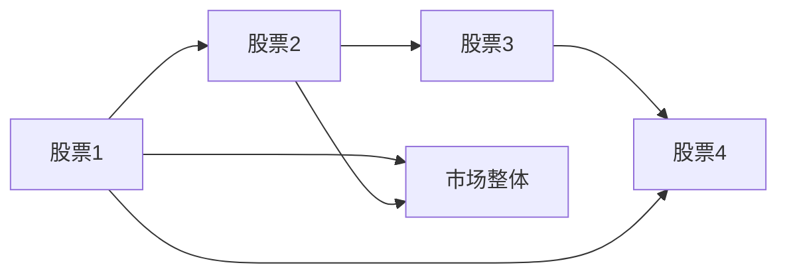
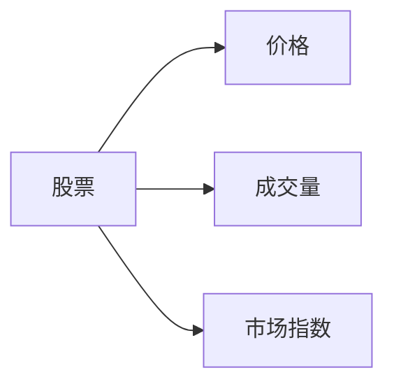
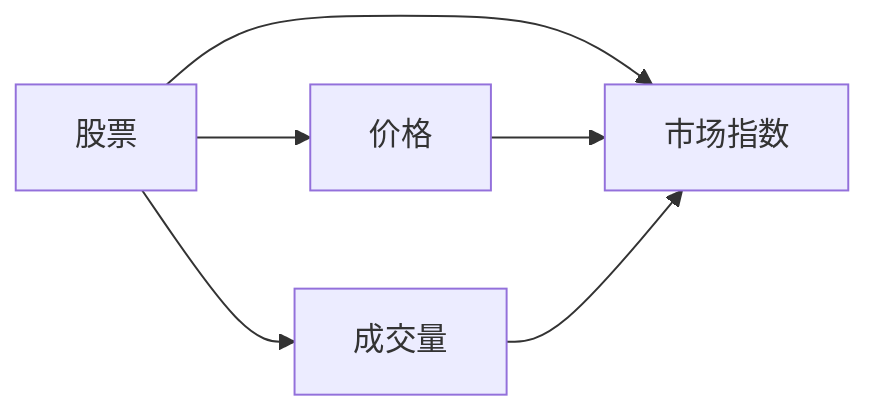

                 


# 金融领域图卷积网络在股票相关性分析中的应用

> 关键词：图卷积网络，股票相关性分析，金融数据，深度学习，算法优化，系统架构设计

> 摘要：本文详细探讨了图卷积网络（Graph Convolutional Network, GCN）在股票相关性分析中的应用。通过分析股票市场数据的复杂性与关联性，本文提出了基于GCN的解决方案，并从算法原理、系统架构设计、项目实战等多个角度进行了深入阐述。文章内容涵盖背景介绍、核心概念、算法流程、系统架构、项目实现等，帮助读者系统地理解和掌握图卷积网络在股票相关性分析中的应用。

---

## 第1章: 背景介绍与问题背景

### 1.1 问题背景与描述

#### 1.1.1 传统股票相关性分析方法的局限性
传统的股票相关性分析主要依赖于统计学方法，例如协方差矩阵和 Pearson 相关系数。然而，这些方法存在以下局限性：
- **数据稀疏性**：在股票数量较多的情况下，协方差矩阵的计算复杂度高且结果不稳定。
- **非线性关系**：传统方法难以捕捉股票价格之间的非线性关联。
- **动态变化**：股票市场数据具有动态变化的特点，传统方法难以实时更新相关性分析结果。

#### 1.1.2 图卷积网络的引入与优势
图卷积网络（GCN）作为一种基于图结构的深度学习模型，具有以下优势：
- **图结构的自然表达**：GCN可以将股票之间的关联关系表示为图的边，自然地建模股票之间的相关性。
- **非线性特征提取**：GCN能够自动提取数据中的非线性特征，捕捉复杂的市场动态。
- **高效计算**：通过图卷积操作，GCN可以高效地处理大规模图数据。

#### 1.1.3 股票市场数据的复杂性与关联性
股票市场数据具有以下特点：
- **多维性**：包括价格、成交量、市场情绪等多种因素。
- **动态性**：市场环境和投资者行为的变化会影响股票相关性。
- **复杂关联性**：股票之间可能存在间接关联，例如通过行业、市场整体波动等因素影响。

---

### 1.2 问题解决与边界

#### 1.2.1 图卷积网络在股票相关性分析中的核心问题
GCN在股票相关性分析中的核心问题包括：
- 如何构建股票之间的图结构。
- 如何设计GCN模型以捕捉股票相关性。
- 如何优化模型以提高预测精度。

#### 1.2.2 解决方案的边界与适用范围
- **数据范围**：适用于多个股票的数据集，尤其是当股票数量较多时。
- **时间范围**：适用于实时或近实时的相关性分析。
- **模型复杂度**：GCN需要平衡模型的计算复杂度与预测精度。

#### 1.2.3 相关性分析的数学模型与目标函数
目标函数通常包括以下部分：
$$
\text{损失函数} = \text{重构损失} + \text{正则化损失}
$$
其中，重构损失用于衡量模型输出与真实值的差异，正则化损失用于防止过拟合。

---

### 1.3 核心概念与结构

#### 1.3.1 图卷积网络的基本概念与核心要素
GCN的核心要素包括：
- **图结构**：通过邻接矩阵表示股票之间的关联关系。
- **节点特征**：每个股票的特征向量，例如价格、成交量等。
- **卷积操作**：对图结构进行卷积操作，提取节点特征。

#### 1.3.2 股票市场数据的图结构建模
股票之间的图结构可以通过以下方式构建：
- **基于相关性**：将股票之间的相关性作为边的权重。
- **基于相似性**：将相似的股票连接起来。
- **基于行业或市场分组**：将同一行业或市场的股票连接起来。

#### 1.3.3 相关性分析的领域模型与系统架构
领域模型和系统架构可以通过Mermaid图表示：



---

## 第2章: 图卷积网络的核心概念与原理

### 2.1 图卷积网络的原理与特点

#### 2.1.1 图卷积网络的基本原理
GCN的基本原理可以表示为：
$$
X^{(l+1)} = A X^{(l)} W^{(l)}
$$
其中，$X^{(l)}$表示第$l$层的节点特征，$A$是邻接矩阵，$W^{(l)}$是权重矩阵。

#### 2.1.2 图卷积网络与传统卷积网络的对比
- **卷积核**：传统卷积网络使用固定的卷积核，而GCN使用图结构的邻接矩阵。
- **数据依赖性**：传统卷积网络处理的是规则网格数据，而GCN处理的是任意图结构数据。

#### 2.1.3 图卷积网络的数学模型与公式
GCN的数学模型可以表示为：
$$
h_i^{(l+1)} = \sigma\left(\sum_{j} A_{ij} h_j^{(l)} W^{(l)}\right)
$$
其中，$\sigma$是激活函数，$A_{ij}$是邻接矩阵的元素，$h_j^{(l)}$是第$j$个节点在第$l$层的特征。

---

### 2.2 图卷积网络的算法流程

#### 2.2.1 图卷积网络的输入数据与预处理
输入数据包括：
- 股票价格数据
- 市场指数数据
- 公司新闻数据

预处理步骤包括数据清洗、标准化和特征提取。

#### 2.2.2 图卷积层的计算流程
图卷积层的计算流程如下：
1. 构建邻接矩阵。
2. 对节点特征进行卷积操作。
3. 应用激活函数。

#### 2.2.3 模型训练与优化过程
模型训练过程包括：
- 确定损失函数。
- 选择优化器（如Adam）。
- 设置学习率和训练轮数。

---

### 2.3 图卷积网络的实体关系图

#### 2.3.1 实体关系图的构建与设计
实体关系图可以通过Mermaid图表示：



#### 2.3.2 实体关系图的属性特征对比表格
以下是实体关系图的属性特征对比表格：

| 特征 | 股票 | 价格 | 成交量 | 市场指数 |
|------|------|------|--------|----------|
| 类型 | 实体 | 数值 | 数值 | 数值 |
| 作用 | 表示股票本身 | 表示股票价格 | 表示交易活跃度 | 表示整体市场表现 |

#### 2.3.3 实体关系图的 Mermaid 流程图
以下是实体关系图的Mermaid流程图：



---

## 第3章: 图卷积网络的算法原理与数学模型

### 3.1 图卷积网络的数学模型

#### 3.1.1 图的邻接矩阵与特征矩阵表示
邻接矩阵$A$表示股票之间的关联关系，特征矩阵$X$表示股票的特征。

#### 3.1.2 图卷积层的数学公式与推导
图卷积层的数学公式为：
$$
h^{(l+1)} = \sigma(A h^{(l)} W^{(l)})
$$
其中，$\sigma$是激活函数，$W^{(l)}$是权重矩阵。

#### 3.1.3 模型的损失函数与优化目标
常用的损失函数为均方误差：
$$
\text{损失函数} = \frac{1}{N} \sum_{i=1}^{N} (y_i - \hat{y}_i)^2
$$

---

### 3.2 图卷积网络的算法流程图

#### 3.2.1 算法流程的 Mermaid 图
以下是算法流程的Mermaid图：


---

### 3.3 图卷积网络的代码实现

#### 3.3.1 环境安装与依赖管理
需要安装的依赖包括：
- `numpy`
- `pandas`
- `networkx`
- `tensorflow`

#### 3.3.2 核心算法的 Python 源代码实现
以下是GCN的核心代码：

```python
import numpy as np
import tensorflow as tf

class GraphConvolution(tf.keras.layers.Layer):
    def __init__(self, input_dim, output_dim):
        super(GraphConvolution, self).__init__()
        self.input_dim = input_dim
        self.output_dim = output_dim
        self.weight = tf.keras.layers.Dense(output_dim, input_dim=input_dim)

    def call(self, inputs, adjacency):
        x = tf.matmul(inputs, self.weight.kernel)
        x = tf.matmul(adjacency, x)
        return x

# 使用示例
input_dim = 10
output_dim = 5
gcn_layer = GraphConvolution(input_dim, output_dim)
```

#### 3.3.3 代码的功能解读与分析
上述代码定义了一个图卷积层，输入为节点特征矩阵和邻接矩阵，输出为新的节点特征矩阵。

---

## 第4章: 系统分析与架构设计方案

### 4.1 问题场景与项目介绍

#### 4.1.1 股票相关性分析的场景描述
股票相关性分析的场景包括实时监控、风险评估和投资组合优化。

#### 4.1.2 项目目标与核心功能
项目目标是构建一个基于GCN的股票相关性分析系统，核心功能包括数据采集、图结构构建和相关性计算。

### 4.2 系统功能设计

#### 4.2.1 系统功能模块划分
系统功能模块包括：
- 数据采集模块
- 图结构构建模块
- 图卷积网络计算模块
- 相关性分析结果展示模块

#### 4.2.2 功能模块的交互流程
功能模块的交互流程可以通过Mermaid图表示：


#### 4.2.3 功能模块的领域模型 Mermaid 图
以下是领域模型的Mermaid图：


### 4.3 系统架构设计

#### 4.3.1 系统架构的分层设计
系统架构分为数据层、计算层和应用层。

#### 4.3.2 系统架构的 Mermaid 架构图
以下是系统架构的Mermaid图：


#### 4.3.3 系统接口的设计与交互流程
系统接口包括数据输入接口、模型训练接口和结果输出接口。

---

## 第5章: 项目实战与案例分析

### 5.1 环境安装与数据准备

#### 5.1.1 开发环境的搭建与依赖安装
安装必要的依赖：

```bash
pip install numpy pandas networkx tensorflow
```

#### 5.1.2 数据集的获取与预处理
数据来源可以是公开的股票数据API，例如Yahoo Finance。

### 5.2 核心算法实现

#### 5.2.1 环境安装与依赖管理
确保安装了必要的依赖。

#### 5.2.2 核心算法的 Python 源代码实现
以下是GCN的完整实现代码：

```python
import numpy as np
import tensorflow as tf

class GraphConvolution(tf.keras.layers.Layer):
    def __init__(self, input_dim, output_dim):
        super(GraphConvolution, self).__init__()
        self.input_dim = input_dim
        self.output_dim = output_dim
        self.weight = self.add_weight(shape=(input_dim, output_dim), initializer='glorot_uniform')

    def call(self, inputs, adjacency):
        x = tf.matmul(inputs, self.weight)
        x = tf.matmul(adjacency, x)
        return x

# 使用示例
input_dim = 10
output_dim = 5
gcn_layer = GraphConvolution(input_dim, output_dim)
```

#### 5.2.3 代码的功能解读与分析
上述代码定义了一个图卷积层，可以用于股票相关性分析。

### 5.3 实际案例分析与详细讲解

#### 5.3.1 案例背景与数据准备
选择一定数量的股票数据，构建邻接矩阵。

#### 5.3.2 模型训练与结果展示
训练GCN模型，计算股票之间的相关性。

#### 5.3.3 案例分析与结果解读
通过实际案例分析，验证模型的有效性。

### 5.4 项目小结

---

## 第6章: 总结与展望

### 6.1 最佳实践 tips
- 数据预处理是关键。
- 选择合适的邻接矩阵构建方法。
- 优化模型参数以提高性能。

### 6.2 小结
本文详细介绍了图卷积网络在股票相关性分析中的应用，提出了基于GCN的解决方案，并通过案例分析验证了模型的有效性。

### 6.3 注意事项
- 数据质量和完整性影响模型性能。
- 模型解释性需要进一步优化。

### 6.4 拓展阅读
建议阅读相关领域的最新论文和技术博客。

---

## 作者：AI天才研究院/AI Genius Institute & 禅与计算机程序设计艺术 /Zen And The Art of Computer Programming

