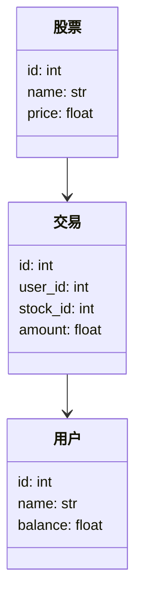
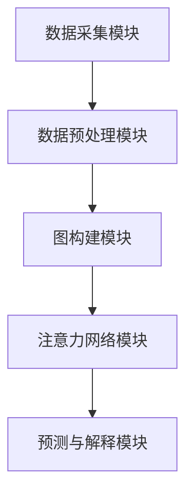

                 


# 金融领域图注意力网络的创新应用

## 关键词：金融领域，图注意力网络，创新应用，深度学习，图结构，注意力机制

## 摘要：  
本文详细探讨了图注意力网络在金融领域的创新应用，从理论基础到实际案例，系统性地分析了其在金融数据处理中的优势与价值。文章首先介绍了图注意力网络的核心概念与原理，随后结合金融场景，深入讲解了其在风险评估、欺诈检测、股价预测等领域的应用，并通过具体案例展示了其实际效果。文章还提供了算法实现的详细步骤与代码示例，帮助读者更好地理解和应用这一技术。

---

## 第1章 图注意力网络与金融领域的背景介绍

### 1.1 问题背景与问题描述  
在金融领域，数据的复杂性和关联性使得传统的数据分析方法难以应对日益复杂的金融问题。金融数据通常具有高度的非线性关系，例如股票价格的波动、风险传播的路径等。传统的基于统计的方法或简单的深度学习模型难以充分捕捉这些复杂关系。  

此外，金融领域的数据通常具有图结构特征，例如：  
- 股票之间的相互影响关系可以表示为图中的边。  
- 企业的供应链关系可以表示为图中的节点与边。  
- 用户与交易行为之间的关联也可以通过图结构进行建模。  

然而，传统的图模型（如随机图、规则图）难以捕捉节点之间的注意力权重，这导致了模型在实际应用中表现不佳。  

### 1.2 图注意力网络的定义与特点  
图注意力网络（Graph Attention Network, GAT）是一种结合了图结构和注意力机制的深度学习模型。它通过在图结构中引入注意力机制，能够自动学习节点之间的关系权重，从而更好地捕捉节点之间的依赖关系。  

其核心特点包括：  
- **全局注意力**：模型能够关注到与目标节点相关的所有节点，而不仅仅是局部邻居。  
- **自适应权重**：注意力权重是根据节点特征动态计算的，而非固定的预定义权重。  
- **端到端学习**：可以通过端到端的训练方式优化模型参数，适应不同金融场景的需求。  

### 1.3 金融领域的数据特点与挑战  
金融数据具有以下特点：  
- **异构性**：数据来源多样，包括文本、数值、时间序列等多种类型。  
- **复杂性**：金融市场的波动性高，受多种因素影响，例如宏观经济指标、政策变化、市场情绪等。  
- **实时性**：金融分析通常需要实时或准实时的处理能力。  

这些特点使得传统的数据分析方法在金融领域面临以下挑战：  
- **数据稀疏性**：某些金融数据可能缺失或不完整。  
- **数据噪声**：金融数据中可能存在大量的噪声，例如异常交易、错误数据等。  
- **模型解释性**：复杂的模型通常缺乏可解释性，难以满足金融领域的监管要求。  

---

## 第2章 图注意力网络的核心概念与联系

### 2.1 图注意力网络的原理分析  
图注意力网络的核心原理在于将图结构与注意力机制相结合。具体来说，注意力机制用于计算节点之间的关系权重，而图结构则用于建模节点之间的连接关系。  

#### 2.1.1 图结构的表示方法  
图结构通常由节点（Node）和边（Edge）组成，可以表示为图论中的邻接矩阵或邻接表。在金融领域，节点可以表示为公司、股票、用户等，边可以表示为交易关系、影响关系等。  

#### 2.1.2 注意力机制的数学模型  
注意力机制的核心思想是通过计算查询（Query）、键（Key）和值（Value）的相似性，确定节点之间的注意力权重。其数学公式可以表示为：  
$$  
\alpha_{ij} = \frac{e^{score(i,j)}}{\sum_{k} e^{score(i,k)}}  
$$  
其中，$score(i,j)$ 表示节点 $i$ 和节点 $j$ 之间的相似性得分。  

#### 2.1.3 图注意力网络的构建流程  
1. 数据预处理：将金融数据转换为图结构。  
2. 计算注意力权重：基于节点特征计算注意力权重。  
3. 更新节点表示：通过注意力权重更新节点的表示向量。  
4. 模型训练：基于标签数据训练模型，优化模型参数。  

### 2.2 核心概念对比与ER实体关系图  
#### 2.2.1 图注意力网络与传统图模型的对比分析  
| 模型类型       | 参数化程度 | 是否需要预定义权重 | 是否支持动态权重 |  
|----------------|------------|--------------------|------------------|  
| 传统图模型     | 低          | 是                 | 否               |  
| 图注意力网络   | 高          | 否                 | 是               |  

从上表可以看出，图注意力网络在参数化程度和动态权重计算方面具有明显优势。  

#### 2.2.2 金融领域中的实体关系图  
在金融领域，实体关系图可以表示为：  


#### 2.2.3 ER实体关系图的构建与应用  
实体关系图的构建可以基于金融数据的特征，例如：  
- 用户与交易的关系。  
- 交易与股票的关系。  
- 股票与公司的关系。  

通过构建实体关系图，可以更好地理解金融数据的复杂关系，并为图注意力网络提供输入数据。  

---

## 第3章 图注意力网络的算法原理与数学模型

### 3.1 图注意力机制的数学推导  
图注意力机制的核心在于计算节点之间的注意力权重。以下是详细的数学推导过程：  

#### 3.1.1 注意力权重的计算公式  
$$  
\alpha_{ij} = \frac{e^{score(i,j)}}{\sum_{k} e^{score(i,k)}}  
$$  
其中，$score(i,j) = q_i^T k_j$，$q_i$ 和 $k_j$ 分别表示查询和键的向量。  

#### 3.1.2 图注意力网络的损失函数  
图注意力网络的损失函数可以表示为：  
$$  
L = -\sum_{i} \sum_{j} y_{ij} \log p(y_{ij})  
$$  
其中，$y_{ij}$ 表示节点 $i$ 和节点 $j$ 之间的标签，$p(y_{ij})$ 表示模型预测的概率。  

### 3.2 图注意力网络的算法流程  
#### 3.2.1 数据预处理与图构建  
1. 数据清洗：去除无效数据，填充缺失值。  
2. 图构建：将金融数据转换为图结构，例如构建股票-交易-用户的图。  

#### 3.2.2 注意力权重的计算  
1. 计算节点的查询和键向量。  
2. 计算注意力权重。  

#### 3.2.3 节点表示的更新与传播  
1. 基于注意力权重更新节点的表示向量。  
2. 通过传播方式将注意力权重传递到整个图中。  

### 3.3 图注意力网络的Python实现示例  
以下是图注意力网络的Python实现示例：  

```python
import tensorflow as tf

def attention_score(x, y):
    # 计算注意力得分
    score = tf.matmul(x, y, transpose_b=True)
    return score

def attentionPooling(x, y):
    # 计算注意力权重
    score = attention_score(x, y)
    weights = tf.nn.softmax(score, axis=-1)
    # 计算加权和
    output = tf.matmul(x, weights)
    return output
```

---

## 第4章 图注意力网络的系统分析与架构设计

### 4.1 系统功能设计  
#### 4.1.1 问题场景介绍  
以股票价格预测为例，系统需要实现以下功能：  
- 数据采集：采集股票的历史价格、交易量等数据。  
- 图构建：构建股票-交易-用户的图结构。  
- 模型训练：训练图注意力网络模型。  
- 预测与解释：输出股票价格预测结果，并提供可解释性分析。  

#### 4.1.2 领域模型设计  
以下是领域模型的类图：  



#### 4.1.3 系统架构设计  
以下是系统架构图：  



---

## 第5章 项目实战

### 5.1 环境安装与配置  
以下是环境安装步骤：  
1. 安装Python和TensorFlow：  
   ```bash
   pip install python==3.8
   pip install tensorflow==2.4
   ```
2. 安装其他依赖库：  
   ```bash
   pip install numpy
   pip install pandas
   pip install matplotlib
   ```

### 5.2 核心代码实现  
以下是注意力网络的核心代码：  

```python
import tensorflow as tf
import numpy as np

class GraphAttentionLayer(tf.keras.layers.Layer):
    def __init__(self, units, **kwargs):
        super(GraphAttentionLayer, self).__init__(**kwargs)
        self.units = units
        self.Wq = tf.keras.layers.Dense(units)
        self.Wk = tf.keras.layers.Dense(units)
        self.softmax = tf.nn.softmax

    def call(self, inputs):
        q = self.Wq(inputs)
        k = self.Wk(inputs)
        score = tf.matmul(q, k, transpose_b=True)
        attention = self.softmax(score)
        output = tf.matmul(q, attention)
        return output
```

### 5.3 实际案例分析  
以股票价格预测为例，以下是具体步骤：  
1. 数据采集：获取股票的历史价格数据。  
2. 数据预处理：将数据转换为图结构。  
3. 模型训练：训练图注意力网络模型。  
4. 模型预测：输出股票价格预测结果。  

### 5.4 案例分析与详细解读  
通过实际案例分析，可以发现图注意力网络在股票价格预测中的优势：  
- 能够捕捉股票之间的相互影响关系。  
- 能够动态调整注意力权重，适应市场变化。  

---

## 第6章 最佳实践与小结

### 6.1 最佳实践  
1. 数据预处理：确保数据的完整性和准确性。  
2. 模型调参：根据具体场景调整模型参数。  
3. 可视化分析：通过可视化工具分析注意力权重分布。  

### 6.2 小结  
本文详细探讨了图注意力网络在金融领域的创新应用，从理论基础到实际案例，系统性地分析了其在金融数据处理中的优势与价值。通过本文的学习，读者可以更好地理解和应用图注意力网络技术。  

### 6.3 注意事项  
- 注意力网络模型的复杂性较高，需要较高的计算资源。  
- 模型的可解释性较低，需要结合其他方法提高可解释性。  

### 6.4 拓展阅读  
1. 《Graph Attention Networks》（论文）  
2. 《Deep Learning on Graph》（书籍）  
3. 《Attention Is All You Need》（论文）  

---

## 作者：AI天才研究院/AI Genius Institute & 禅与计算机程序设计艺术 /Zen And The Art of Computer Programming

