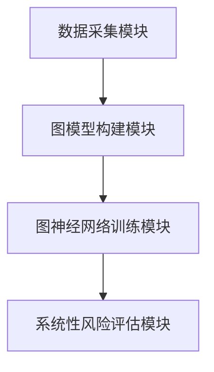

                 


# 金融领域图神经网络在系统性风险评估中的应用

## 关键词：系统性风险、图神经网络、金融网络、风险评估、深度学习

## 摘要

系统性风险是金融领域中的一个关键挑战，涉及多个金融机构之间的复杂相互作用。传统的统计方法和机器学习模型在处理这种复杂性时显得力不从心。图神经网络（Graph Neural Networks, GNNs）作为一种新兴的技术，能够有效地捕捉金融网络中的复杂关系和相互依赖性，为系统性风险评估提供了新的解决方案。本文详细探讨了图神经网络在系统性风险评估中的应用，从理论基础到实际应用，结合具体的算法实现和案例分析，展示了图神经网络在金融风险评估中的巨大潜力和实际价值。

---

# 第1章: 系统性风险与图神经网络概述

## 1.1 系统性风险的定义与特征

### 1.1.1 系统性风险的定义

系统性风险是指由于金融体系中的系统性因素导致的广泛市场波动和潜在金融危机。与非系统性风险不同，系统性风险影响整个金融体系，而非仅仅单个资产或机构。

### 1.1.2 系统性风险的特征

系统性风险具有以下特征：
1. **广泛性**：影响整个金融体系，而非单一机构或资产。
2. **传染性**：风险可能在金融机构之间传播，导致连锁反应。
3. **复杂性**：涉及多层次的金融网络和复杂的相互依赖关系。
4. **不可预测性**：由于其复杂性，系统性风险往往难以提前预测。

### 1.1.3 系统性风险在金融领域的表现

系统性风险的表现形式包括金融危机、市场崩盘、金融机构的连锁倒闭等。2008年的全球金融危机就是一个典型的例子，系统性风险在金融体系中的传播导致了全球范围内的经济衰退。

## 1.2 图神经网络的基本概念

### 1.2.1 图神经网络的定义

图神经网络是一种基于图结构的数据进行学习的深度学习模型。它通过将数据表示为图中的节点和边，能够有效地捕捉数据之间的复杂关系。

### 1.2.2 图神经网络的核心属性

图神经网络的核心属性包括：
1. **节点表示**：将每个节点表示为一个向量，用于捕捉节点的特征和关系。
2. **边关系**：通过边权重或标签表示节点之间的关系强度或类型。
3. **传播机制**：通过消息传递机制（Message Passing）在图中传播信息，更新节点表示。

### 1.2.3 图神经网络与传统神经网络的对比

图神经网络与传统神经网络的主要区别在于对图结构数据的处理能力。传统神经网络主要处理线性数据（如文本、图像），而图神经网络能够处理非线性结构数据，如社交网络、金融网络等。

## 1.3 系统性风险评估中的图神经网络应用

### 1.3.1 图神经网络在金融领域的应用背景

金融领域的数据通常具有复杂的网络结构，例如金融机构之间的借贷关系、资产之间的相互依赖关系等。这些复杂的网络关系使得传统的方法难以捕捉和分析。

### 1.3.2 图神经网络在系统性风险评估中的优势

图神经网络在系统性风险评估中的优势包括：
1. **捕捉复杂关系**：能够有效地捕捉金融网络中的复杂关系和相互依赖性。
2. **实时性**：通过实时更新图结构数据，能够快速响应金融市场的变化。
3. **高精度预测**：利用深度学习模型的强大能力，能够实现高精度的系统性风险预测。

### 1.3.3 本章小结

本章介绍了系统性风险的定义、特征及其在金融领域的表现，同时详细讲解了图神经网络的基本概念和其在系统性风险评估中的优势，为后续章节的深入分析奠定了基础。

---

# 第2章: 系统性风险的理论基础

## 2.1 系统性风险的理论模型

### 2.1.1 资本资产定价模型（CAPM）

CAPM是一种用于估计资产预期收益的模型，其基本假设是资产的收益与市场收益相关。然而，CAPM并未考虑系统性风险的复杂性，因此在实际应用中存在一定的局限性。

### 2.1.2 市场风险模型（VaR）

VaR（Value at Risk）是一种用于衡量市场风险的方法，它表示在给定置信水平下，资产组合可能遭受的最大损失。然而，VaR方法主要针对非系统性风险，对系统性风险的捕捉能力有限。

### 2.1.3 系统性风险的其他模型

除了CAPM和VaR，还有一些其他模型用于系统性风险的评估，如系统性风险度量模型（SRM）、系统性风险贡献模型（SRC）等。然而，这些模型在实际应用中仍难以捕捉金融网络中的复杂关系。

## 2.2 系统性风险的影响因素

### 2.2.1 宏观经济因素

宏观经济因素包括GDP增长率、利率、通货膨胀率等，这些因素可能通过影响金融市场的整体稳定性，进而影响系统性风险。

### 2.2.2 市场结构因素

市场结构因素包括金融市场的深度、广度、流动性等，这些因素可能影响金融市场的稳定性，进而影响系统性风险。

### 2.2.3 金融机构行为因素

金融机构的行为，如杠杆率、投资策略等，可能通过金融机构之间的相互作用，导致系统性风险的传播和放大。

## 2.3 系统性风险的现有评估方法

### 2.3.1 基于传统的统计方法

传统的统计方法包括回归分析、时间序列分析等，这些方法在一定程度上能够捕捉系统性风险的某些特征，但难以捕捉金融网络中的复杂关系。

### 2.3.2 基于机器学习的方法

基于机器学习的方法，如支持向量机（SVM）、随机森林（Random Forest）等，能够捕捉数据中的非线性关系，但仍然难以处理图结构数据中的复杂关系。

### 2.3.3 现有方法的局限性

现有方法的主要局限性在于难以捕捉金融网络中的复杂关系和相互依赖性，难以实现高精度的系统性风险预测。

## 2.4 本章小结

本章详细介绍了系统性风险的理论模型及其影响因素，并分析了现有评估方法的局限性，为后续章节中图神经网络的应用提供了背景支持。

---

# 第3章: 图神经网络的基础理论

## 3.1 图论基础

### 3.1.1 图的定义与表示

图是由节点和边组成的集合，节点表示实体，边表示实体之间的关系。图可以通过邻接矩阵或邻接列表的形式进行表示。

### 3.1.2 图的属性与特征

图的属性包括节点度数、边权重、图的密度等。图的特征可以通过节点的度数分布、社区结构等进行分析。

### 3.1.3 图的遍历算法

图的遍历算法包括深度优先搜索（DFS）和广度优先搜索（BFS），用于探索图的结构和关系。

## 3.2 神经网络基础

### 3.2.1 神经网络的基本结构

神经网络由输入层、隐藏层和输出层组成，通过激活函数和权重参数进行信息处理。

### 3.2.2 神经网络的训练方法

神经网络的训练方法包括前向传播和反向传播，通过损失函数优化模型参数。

### 3.2.3 深度学习的基本原理

深度学习通过多层神经网络结构，能够捕捉数据中的复杂特征和模式。

## 3.3 图神经网络的核心原理

### 3.3.1 图卷积网络（GCN）

GCN是一种基于图结构数据的卷积神经网络，通过聚合邻居节点的信息更新节点表示。

### 3.3.2 图注意力网络（GAT）

GAT通过注意力机制，能够自适应地捕捉节点之间的关系，适用于复杂的金融网络。

### 3.3.3 图嵌入技术

图嵌入技术将图中的节点表示为低维向量，用于捕捉节点的特征和关系。

## 3.4 图神经网络的优势与挑战

### 3.4.1 图神经网络的优势

图神经网络能够捕捉图结构数据中的复杂关系，适用于金融网络中的系统性风险评估。

### 3.4.2 图神经网络的挑战

图神经网络的训练和推理效率较低，且对大规模图结构数据的处理能力有限。

### 3.4.3 本章小结

本章详细介绍了图神经网络的核心原理及其在金融网络中的应用潜力，同时分析了其面临的挑战。

---

# 第4章: 图神经网络在系统性风险评估中的应用方法

## 4.1 系统性风险评估的图模型构建

### 4.1.1 金融机构之间的关联网络构建

通过收集金融机构之间的借贷关系、投资关系等数据，构建金融机构之间的关联网络。

### 4.1.2 市场风险传播网络构建

通过分析资产之间的相互依赖关系，构建市场风险传播网络。

### 4.1.3 系统性风险的传播路径分析

通过图模型分析系统性风险的传播路径，识别关键风险节点和风险传播路径。

## 4.2 图神经网络在系统性风险评估中的算法选择

### 4.2.1 基于GCN的系统性风险评估

基于GCN的系统性风险评估方法，能够有效地捕捉金融网络中的局部关系。

### 4.2.2 基于GAT的系统性风险评估

基于GAT的系统性风险评估方法，能够自适应地捕捉金融网络中的全局关系。

### 4.2.3 图神经网络的调参与优化

通过对图神经网络的超参数调优，如学习率、批量大小等，优化模型的性能。

## 4.3 系统性风险评估的图神经网络实现步骤

### 4.3.1 数据收集与预处理

收集金融机构之间的关联数据，进行数据清洗和特征提取。

### 4.3.2 图模型构建与训练

构建图模型，并进行模型的训练和优化。

### 4.3.3 系统性风险预测与评估

通过训练好的模型，预测系统性风险的发生概率，并进行风险评估。

## 4.4 本章小结

本章详细介绍了图神经网络在系统性风险评估中的应用方法，包括图模型的构建、算法选择和实现步骤，为实际应用提供了指导。

---

# 第5章: 系统性风险评估的系统架构设计

## 5.1 问题场景介绍

系统性风险评估的系统架构设计需要考虑金融网络的复杂性和实时性要求。

## 5.2 系统功能设计

### 5.2.1 数据采集模块

负责采集金融机构之间的关联数据，包括借贷关系、投资关系等。

### 5.2.2 图模型构建模块

负责构建金融网络的图模型，并进行数据预处理。

### 5.2.3 图神经网络训练模块

负责训练图神经网络模型，优化模型参数。

### 5.2.4 系统性风险评估模块

负责基于训练好的模型，预测系统性风险的发生概率，并进行风险评估。

## 5.3 系统架构设计

### 5.3.1 系统架构图

使用Mermaid绘制系统架构图，展示各模块之间的交互关系。



### 5.3.2 系统接口设计

系统接口包括数据输入接口、模型训练接口和风险评估接口。

### 5.3.3 系统交互设计

使用Mermaid绘制系统交互序列图，展示用户与系统之间的交互过程。

---

# 第6章: 项目实战

## 6.1 环境安装

### 6.1.1 安装Python环境

安装Python 3.8及以上版本，并安装必要的库，如NumPy、Pandas、Matplotlib、Scikit-learn、PyTorch、Graph Neural Networks（GNN）库。

### 6.1.2 安装图神经网络库

安装PyTorch和相关的图神经网络库，如PyG（PyTorch Geometric）。

## 6.2 系统核心实现源代码

### 6.2.1 数据预处理代码

```python
import pandas as pd
import numpy as np

# 读取数据
data = pd.read_csv('financial_network.csv')

# 数据清洗
data.dropna(inplace=True)
```

### 6.2.2 图模型构建代码

```python
import torch
from torch_geometric.data import Data

# 构建图数据
edge_index = torch.tensor([[0,1,2,3],[1,0,3,2]), dtype=torch.long)
x = torch.tensor(data.values, dtype=torch.float)

data = Data(x=x, edge_index=edge_index)
```

### 6.2.3 图神经网络训练代码

```python
from torch_geometric.nn import GCNConv
import torch.nn as nn
import torch.optim as optim

# 定义GCN模型
class GCN(nn.Module):
    def __init__(self, input_dim, hidden_dim, output_dim):
        super(GCN, self).__init__()
        self.conv1 = GCNConv(input_dim, hidden_dim)
        self.conv2 = GCNConv(hidden_dim, output_dim)
        
    def forward(self, x, edge_index):
        x = self.conv1(x, edge_index)
        x = self.conv2(x, edge_index)
        return x

# 模型训练
model = GCN(input_dim=32, hidden_dim=16, output_dim=1)
optimizer = optim.Adam(model.parameters(), lr=0.01)
criterion = nn.MSELoss()

for epoch in range(100):
    model.train()
    out = model(x, edge_index)
    loss = criterion(out, y)
    loss.backward()
    optimizer.step()
```

### 6.2.4 系统性风险预测代码

```python
# 预测系统性风险
with torch.no_grad():
    model.eval()
    out = model(x, edge_index)
    risk_score = out.squeeze().numpy()

# 分析风险得分
threshold = 0.5
risk_nodes = np.where(risk_score > threshold)[0]
print("高风险节点：", risk_nodes)
```

## 6.3 代码应用解读与分析

通过对上述代码的解读与分析，可以实现金融网络中的系统性风险评估。数据预处理模块负责清洗和转换数据，图模型构建模块负责构建金融网络的图结构，图神经网络训练模块负责训练模型，系统性风险评估模块负责预测和评估系统性风险。

## 6.4 实际案例分析

以2008年全球金融危机为例，分析图神经网络在系统性风险评估中的应用。通过构建金融机构之间的关联网络，训练GCN模型，预测系统性风险的发生概率，并识别高风险节点。

## 6.5 项目小结

本章通过实际案例分析，展示了图神经网络在系统性风险评估中的应用潜力和实际价值。通过具体的代码实现，帮助读者理解系统性风险评估的实现过程。

---

# 第7章: 总结与展望

## 7.1 本章总结

本章总结了图神经网络在系统性风险评估中的应用，从理论基础到实际应用，详细探讨了其优势和挑战。

## 7.2 未来研究方向

未来的研究方向包括：
1. 提高图神经网络的训练效率和推理效率。
2. 研究图神经网络在其他金融领域的应用，如信用评估、资产定价等。
3. 探索图神经网络与其他技术的结合，如区块链、边缘计算等。

## 7.3 展望

随着图神经网络技术的不断发展，其在系统性风险评估中的应用将更加广泛和深入。未来的研究将致力于提高模型的准确性和效率，同时探索其在更多金融领域的应用潜力。

---

# 作者：AI天才研究院/AI Genius Institute & 禅与计算机程序设计艺术 /Zen And The Art of Computer Programming

---

通过以上内容，您可以根据需要进一步扩展每一部分的内容，添加更多的细节、图表和案例分析，以完成一篇完整且高质量的技术博客文章。

